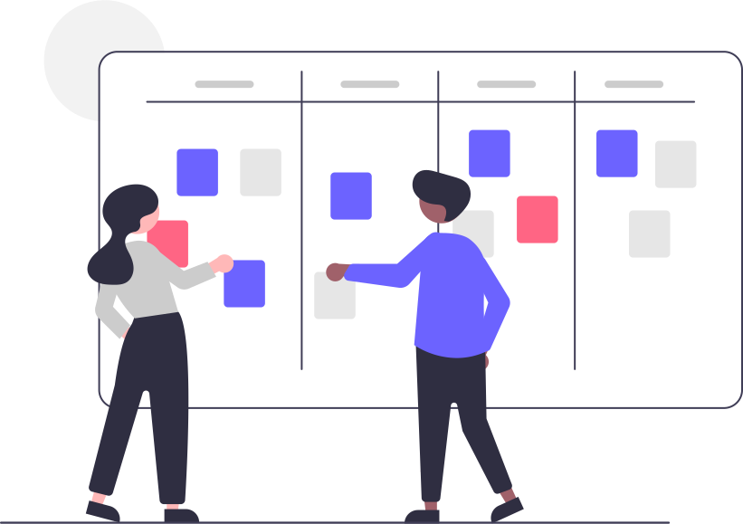

## Introduction à la gestion de projet

- [La checklist - Création de Projet](/cours/gestion-projet/checklist-creation-projet)
- [🤓 Cours - Introduction à la gestion de projet](/cours/gestion-projet/intro-gestion-projet)
- [🤓 Cours - Diagrammes de cas d'utilisation et diagrammes de séquence](/cours/uml/use-case)
- [🤓 Diagramme de Kano](/cours/gestion-projet/cours-kano)
- [🤓 Modèles et cycles de développement (cours)](/cours/gestion-projet/modeles_dev)
- [🤓 Le pilotage de projet (cours)](/cours/gestion-projet/pilotage_projet-cours)
- [📝 Exercice Pur Beurre : définir le contexte](/cours/gestion-projet/exos/exo-pur-beurre)
- [📝 Exercices décrire le besoin : diagramme de cas d'utilisation et diagramme de séquence](/cours/gestion-projet/exos/exos-cas-utilisation-cas-sequence)
- [📝 Exercice Osiris](/cours/gestion-projet/exos/exo-contexte-osiris)
- [📝 Exercice : plannification par diagramme de Gantt](/cours/gestion-projet/exos/exo-gantt)
- [📌 Projet fil rouge](/cours/gestion-projet/exos/projet_fil_rouge) : un projet fil rouge servant d'introduction globale à la Gestion de Projet : définition du contexte, des besoins, cahier des charges, choix du cycles de développement, réalisation technique, ...
- 🔗 Liens : <https://github.com/ProductivityDirectory/awesome-productivity-tools>

## Cahier des charges

- [🤓 Cours - le cahier des charges](/cours/gestion-projet/cahier-charges/cahier_charges-cours)
- Exemples de cahier des charges :
  - Devis vers facture, CDC fonctionnel : [pdf](/cours/gestion-projet/cahier-charges/dvf_fonctionnel.pdf)
  - Devis vers facture, CDC technique  : [pdf](/cours/gestion-projet/cahier-charges/dvf_technique.pdf)
  - Cahier des charges technique : [pdf](/cours/gestion-projet/cahier-charges/ex_t1.pdf)
  - Cahier des charges : [Hotel Paradis](https://docs.google.com/document/d/1k1kHGk7QgoY3-hMCi0CURhRDo0zMawqyDluuXvYmq5E)
- [📌 Projet - écrire un cahier des charges](/cours/gestion-projet/cahier-charges/projet-cdc)

## Agilité

- 🤓 Scrum et les méthodes agiles (cours)
  - [pdf (1,3M)](/cours/gestion-projet/agile/scrum.pdf)
  - [pptx (1,9M)](/cours/gestion-projet/agile/scrum.pptx)
- [🤓 Comparaison des méthodes agiles classiques (cours)](/cours/gestion-projet/agile/comparaisons-agile)
- [💻 Projet Scrum dans Jira - écriture de scénario itératif](/cours/gestion-projet/agile/projet_jira)

## 🏷️ UML® 

- [🤓 Cours - Diagrammes de cas d'utilisation et diagrammes de séquence](/cours/gestion-projet/uml/use-case)
- [📌 Projet gestion d'une bibliothèque](/cours/gestion-projet/uml/tp-uml) : réaliser le développement métier d'une application informatique à partir de diagrammes de classes et de diagrammes de composants.
- 🔗 Liens :
  - [Online PlantUML Server](https://www.plantuml.com/plantuml/uml/SyfFKj2rKt3CoKnELR1Io4ZDoSa70000)
  - [Exemples UML](https://www.uml-diagrams.org/index-examples.html)
