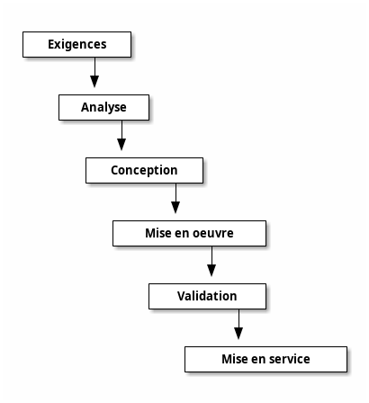
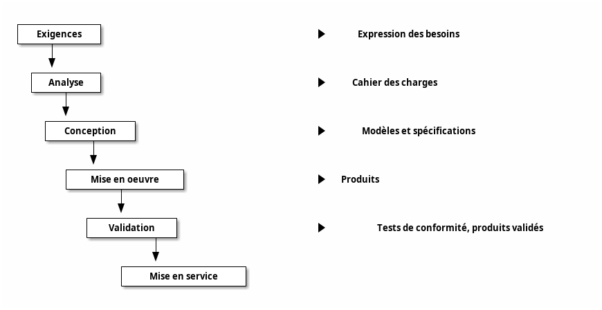
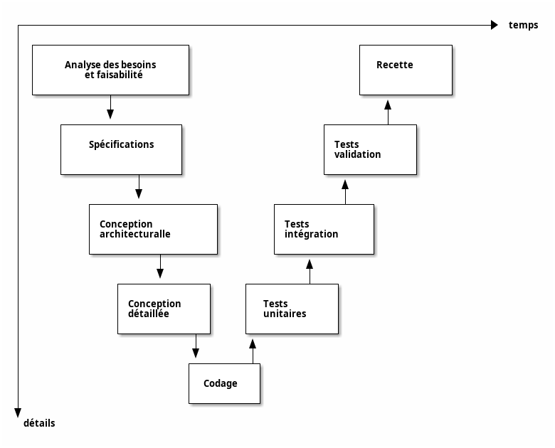
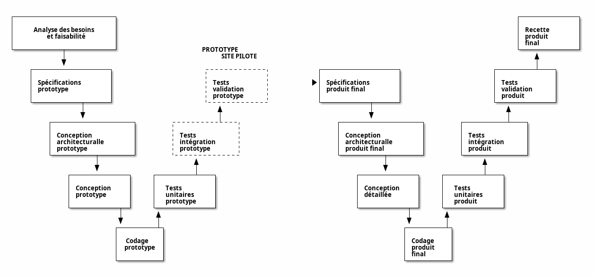
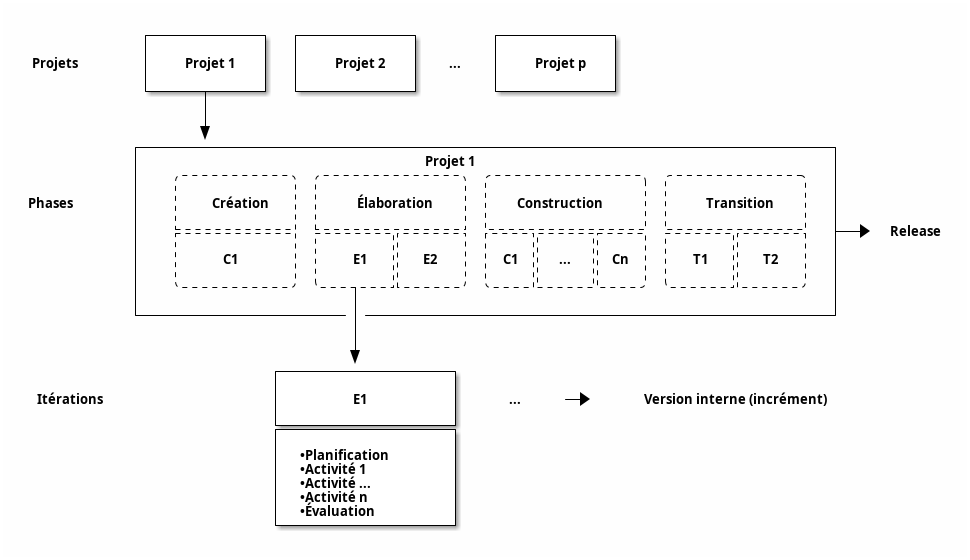
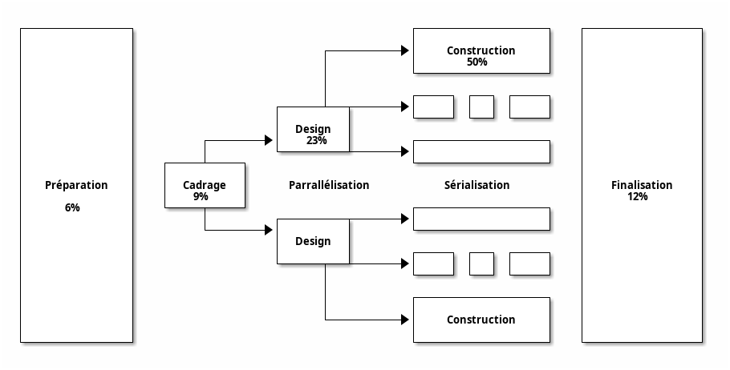

# Modèle en cascade (waterfall)

---

# Modèle en cascade (waterfall)

Le modèle en cascade est une organisation des activités d'un projet sous forme de phases **linéaires** et **séquentielles** où :
- chaque phase correspond à une **spécialisation** des tâches
- et dépend des résultats de la phase **précédente**.

---

## Origine

Le modèle en cascade est hérité de l'industrie du BTP. Ce modèle repose sur les hypothèses suivantes :

- on ne peut pas construire la toiture avant les fondations
- les conséquences d'une modification en amont du cycle ont un impact majeur sur les coûts en aval (on peut imaginer la fabrication d'un moule dans l'industrie du plastique)

---



---

## Phases et livrables

- Exigences : les exigences font l'objet d'une expression des besoins
- Analyse : les exigences sont analysées pour établir un cahier des charges fonctionnel
- Conception : le produit est conçu et spécifié de sorte à pouvoir être réalisé
- Mise en œuvre : le produit est réalisé sur la base des spécifications
- Validation : le produit est testé et vérifié et sa conformité aux exigences est validée
- Mise en service : le produit est installé, les préparatifs pour sa mise en service sont organisés, puis le produit est utilisé

---



---

## En pratique

Ce modèle n'est plus très utilisé en pratique car peu réaliste mais il est à la base des modèles que nous allons aborder.

---
layout: section
---

# Cycle en V

---

Basé sur le modèle en cascade, le cycle en V est :

- un flux d'activité descendant qui détaille le produit jusqu'à sa réalisation
- et un flux ascendant, qui assemble le produit en vérifiant sa qualité

---



---

## Origine

Issu de l'industrie, c'est une alternative plus réaliste au modèle en cascade. Il en reprend une approche **séquentielle et linéaire** des phases mais l'enrichit avec :

- des étapes d'**intégration** du système à partir de briques simples
- chaque phase de production est associée à sa phase de **validation** correspondante (d'où la forme de V)

---

## Flux descendant

Une première série d'étapes, le flux descendant, vise à détailler le produit jusqu'à sa réalisation. Il comprend l'expression des besoins, l'analyse, la conception, puis la mise en œuvre.

_Pour un logiciel, la mise en œuvre correspond essentiellement à la programmation. Pour le matériel c'est la réalisation d'un équipement. Pour des mesures organisationnelles, la mise en œuvre correspond à la rédaction de manuels de procédure._

---

## Flux ascendant

Une deuxième série d'étapes, le flux ascendant, vise à valider le produit jusqu'à sa recette, c'est-à-dire son acceptation par le client. Il comprend principalement une série de tests jusqu'à pouvoir valider que le produit répond au besoin et aux exigences.

---

## Les étapes du modèle :

- Exigences : les exigences font l'objet d'une expression des besoins. Le cas échéant, une étude de faisabilité peut être conduite avant d'engager les travaux.
- Analyse : il s'agit à partir de l'expression de besoin d'établir le cahier des charges fonctionnel ou les spécification fonctionnelle
- Conception générale (ou conception architecturale ou préliminaire) : il s'agit de concevoir le système qui doit répondre aux exigences et de définir son architecture, et en particulier les différents composants nécessaires
- Conception détaillée: il s'agit de concevoir chaque composant, et la manière dont ils contribuent à la réponse aux besoins

---

- Mise en œuvre: il s'agit de réaliser chaque composant nécessaire. _Pour les composants et systèmes logiciels, l'activité est essentiellement le codage_
- Test unitaire: il s'agit de vérifier le bon fonctionnement et la conformité de chaque composant à sa conception détaillée
- Intégration et test d'intégration: il s'agit d'assembler le système à partir de tous ses composants, et de vérifier que le système dans son ensemble fonctionne conformément à sa conception générale
- Test système (ou tests fonctionnels) : vérification que le système est conforme aux exigences
- Test d'acceptation (ou recette) : validation du système par rapport à sa conformité aux besoins exprimés.

---

## En pratique

L'idée est donc de découper la validation pour distinguer les tests unitaires, les tests d'intégration et les tests systèmes qui correspondent aux différents niveaux d'intégration (assemblage) du système, ce qui s'avère plus adaptés aux systèmes complexes faits de plusieurs composants.

Le cycle en V est un des standards de l'industrie du logiciel et certainement le modèle de développement le plus connu.

---

## Risques

Ce modèle est bien adapté pour des projet aux besoins et spécifications stables, claires et bien comprises.

Mais en cas de changement dans les premières étapes du modèle (changement de besoin, incompréhension des spécifications, risque technique mal évalué) l'entièreté du modèle est impacté. 

Une solution consiste à travailler en versions (itérations) successives du cycle en V (voir les méthodologies suivantes).

---
layout: section
---

# Cycle en W

---

# Cycle en W

Le cycle en W est un double cycle en V.
Il reprend totalement le principe de ce dernier en ajoutant la création d'un **prototype** (1er V) avant la réalisation réelle du produit (2e V).

L'intérêt du prototypage est de s'accorder sur les besoins du produit, mieux comprendre les spécifications et les impacts techniques (limite l'effet "tunnel" du cycle en V).

La réalisation du prototype induit cependant un coût et une durée de réalisation plus importants.

---



---
layout: section
---

# Cycle en spirale

---

# Cycle en spirale


_Le cycle en spirale. Source : [wikipedia][img-spirale]_

Le développement reprend les différentes étapes du cycle en V. Par l'implémentation de **versions** successives, le cycle recommence en proposant un produit de plus en plus complet et robuste.

---

## Description

Le cycle en spirale se déroule en quatre phases :

- détermination des objectifs, des alternatives et des contraintes
- analyse des risques, évaluation des alternatives
- développement et vérification de la solution retenue
- revue des résultats et vérification du cycle suivant

---

## En pratique

Le cycle en spirale met plus l'accent sur la **gestion des risques** que le cycle en V. En effet, le début de chaque itération comprend une phase d'analyse des risques. Celle-ci est rendue nécessaire par le fait que, lors d'un développement cyclique, il y a plus de risques de défaire, au cours de l'itération, ce qui a été fait au cours de l'itération précédente.

---
layout: section
---

# Cycle en Y

---

# Cycle en Y (Two Tracks Unified Process)

Le 2TUP propose un cycle de développement en Y, qui **dissocie les aspects techniques des aspects fonctionnels**.

---

```
           +--------+                          +--------+
            \        \                        /        /
             \ Capture\                      /Capture /
              \ Besoins\                    / Besoins/
               \ Foncionnels               / Techniques
                \        \                /        /
 BRANCHE         \        \              /        /       BRANCHE
 FONCTIONNELLE  Spécifications         Architecture     TECHNIQUE
                  fonctionnelles       /logicielle
                    \        \       et applicative
                     \        \      /        /
                      \Analyse \    /Frameworks
                       \        \  / techniques
                        \        \/        /
                         |                |
                         |                |
                         |   Conception   |
                         |                |
      PHASE DE           |     Codage     |
      RÉALISATION        |                |
                         |     Tests      |
                         |                |
                         |     Recette    |
                         |                |
                         |   Déploiement  |
                         |                |
                         +----------------+
```

---

## Processus UP

Comme tous les processus UP (Unified Process), celui-ci est _itératif_ et _incrémental_, centré sur l’_architecture_, conduit par les exigences des _utilisateurs_, piloté par les _risques_ et orienté _composants_.

---

## Découpage

Le terme _2 Tracks_ est explicite : le processus suit deux branches d'**étude** *technique* et *fonctionnelle* qui correspondent à 2 axes de changements imposés au projet.
Ces deux branches fusionnent pour la **conception** du système, créant la forme d'un Y.

---

## La branche fonctionnelle comporte :

- La capture des **besoins fonctionnels** focalisés sur le métier des utilisateurs. La maîtrise d’œuvre consolide les spécifications et en vérifie la cohérence et l’exhaustivité
- L’**analyse** utilisant la spécification fonctionnelle pour dégager une idée du système en termes de métier sans dépendre d’aucune technologie particulière.

---

## La branche d'architecture technique comporte :

- La capture des **besoins techniques** : contraintes, choix, outils, matériels sélectionnés, contraintes d'intégration avec l'existant
- La **conception générique** : composants nécessaires à l’architecture technique, complètement indépendante des aspects fonctionnels. Elle a pour objectif **d’uniformiser et de réutiliser** les mêmes mécanismes pour tout un système.

L’architecture technique construit le squelette du système informatique et écarte la plupart des risques de niveau technique. _L’importance de sa réussite est telle qu’il est conseillé de réaliser un prototype pour assurer sa validité._

---

## La branche de conception comporte :

- La conception préliminaire, délicate car intègre le modèle d’analyse dans l’architecture technique
- La conception détaillée : comment réaliser chaque composant
- L’étape de codage : production et test des composants et unités de code
- L’étape de recette : valide les fonctions du système développé

---
layout: section
---

# Développement rapide d'applications : RUP

---

# Développement rapide d'applications : RUP (classique)

## Origine

Rational Unified Process (RUP) est à l'origine du processus unifié et est à ce titre l'implémentation la plus connue.

Il s'agit d'une méthode livrée clés en main et elle est accompagnée d'outils pour guider les équipes dans l'adaptation et exécution du processus.

---

## Principes

Le cadre au développement logiciel proposé par RUP répond aux caractéristiques du processus unifié :
- une méthode de développement guidée par les **besoins des utilisateurs**
- centrée sur l’**architecture logicielle**
- **itérative et incrémentale**
- mettant en œuvre **UML** pour la modélisation

Le processus unifié prône une approche pilotée par les risques, en cherchant au travers des différentes itérations, à lever en priorités les plus grandes incertitudes.

---

## Utilisation

Le processus unifié est cyclique : il vise par une succession de projets à fournir d'abord une version viable d'un produit puis des versions publiables successives ("release").

Chaque projet a un cycle de vie en quatre phases, chacune subdivisée en plusieurs itérations:

- création ou cadrage ("inception") : définit le produit et les objectifs du projet
- élaboration  : clarification des exigences, architecture du produit, faisabilité. Création d'un prototype.
- construction : construit et mett en œuvre le produit et les livrables 
- transition : livre, diffuse ou déploie le produit prêt à être utilisé. Formation des utilisateurs si nécessaire.

---



---

## Enchaînement d'activités

Le processus unifié propose les enchainements d'activités suivants, qui peuvent être configurés selon les besoins du projet:

- Exigences : recherche des acteurs et des cas d'utilisation, priorisation, description des cas d'utilisation, prototypage de l'interface utilisateur, et structuration du modèle des cas d'utilisation
- Analyse : analyse de l'architecture, analyse d'un cas d'utilisation, analyse d'une classe, et analyse d'un package
- Conception : conception de l'architecture, conception d'un cas d'utilisation, conception d'une classe, et conception d'un sous-système

---

- Mise en œuvre (implémentation) : implémentation de l'architecture, intégration du système, implémentation d'un sous-système, implémentation d'une classe, et exécution de tests unitaires
- Test : planification des tests, conception des tests, mise en œuvre des tests, exécution des tests d'intégration, exécution de tests systèmes, et évaluation des tests.
- Modélisation métier ou modélisation d'affaires : différencie au niveau des exigences les impératifs organisationnels propre à l'environnement métier des utilisateurs d'une part, et les exigences propre au système d'autre part. Cette modélisation des activités d'entreprise est également basée sur UML.
- Gestion de projets : prend en compte les particularités du développement logiciel tout en assurant une conformité avec les normes existantes dans ce domaine

---

## Comparaison

Le processus unifié (PU) utilise des phases séquentielles comme les projets en cascade. Tout comme le cycle en V, il est centré sur l'intégration de systèmes faits de composants.

Cependant les phases ne sont pas découpées artificiellement par niveau d'intégration et par disciplines techniques mais en fonction des risques étape par étape. Chaque phase intègre donc l'ensemble des disciplines (ex : développement, test) dans une logique de **maturation itérative**.

---

La planification est donc **itérative** et **adaptative** plutôt que rigide et détaillée en amont.

A la différence des méthodes agiles, la définition des exigences et l'architecture sont réalisées principalement dans les premières itérations ("le plan précède l'action").

---

## Critiques

Les méthodes PU (et particulièrement RUP) sont des méthodes puissantes, combinant des aspects itératifs et adaptatifs proches des méthodes agiles et la rigueur de méthodes plus traditionnelles (conception poussée et rigoureuse basée sur UML). Le projet est structuré en phases mais laisse beaucoup de flexibilité sur les itérations.

Ces méthodes imposent cependant une certaine lourdeur à l'exécution et demandent une équipe très qualifiée : maitrise des approches itératives, connaissance approfondie d'UML, connaissance des enchainements d'activités et de leurs interdépendances.

---
layout: section
---

# Développement rapide d'applications : RAD

---

## Origine

Pensée pour des projets simples, la méthode RAD est la première méthode de développement où le cycle de développement n'est pas inspiré de la cascade.

C'est un cycle _itératif_, _incrémental_ et _adaptatif_ qui se retrouve dans toutes les méthodes agiles.

---

## Principe

La méthode RAD formalise techniquement le 1er postulat agile : _pour qu'une planification de projet puisse être raisonnablement prédictive, il faut que certains aspects du pilotage soient fixes et que d'autres soient variables_.

L'idée est d'utiliser des techniques de priorisation pour gérer les principales variables d'un projet (durée, coût, périmètre, ...) qui restaient fixes dans un cycle en cascade.

Pour cela, on fixe au moins une des variables, en fonction du besoin immédiat de l'utilisateur.

---

## Stratégies

- Délais : la plus stratégique (_time boxing_)
- Ressources : la moins risquée (_SWAT_)
- Visibilité, qualité : la plus fiable (_focus_)
- Budget : la moins coûteuse (_target costing_)

---

## Utilisation

La méthode RAD, après deux courtes phases de formalisation structurée de l'expression des besoins (CADRAGE) et de définition globale de l'architecture technique (DESIGN), inclut dans sa phase principale (CONSTRUCTION) la réalisation, la validation immédiate et les tests d'une application en mode itératif-incrémental-adaptatif.

L'objectif de la méthode, qui implique activement l'utilisateur final dans un principe de « validation permanente », est d'obtenir un applicatif en adéquation avec les réels besoins.

---

## En pratique

Le RAD utilise une équipe de développement particulière : le SWAT.

Cette équipe est _autonome_, spécialement _formée_, _concrètement motivée_ et _outillée_.

Elle se compose essentiellement d'un profil unique de concepteurs-développeurs formés à des spécialités techniques complémentaires. Le rôle de chef de projet n'est ni prohibé ni obligatoire mais les décisions concernant l'organisation du projet sont **consensuelles**. L'équipe travaille **avec les utilisateurs** et, généralement avec un animateur, dans une salle dédiée, isolée, spécialement équipée dans le style _war room_, où les murs sont utilisés pour afficher un _radiateur d'information_ (une forme de cockpit de gestion de projet).

---

## Réalisation

Pour une mise en opération, le RAD impose :

- Un cycle de développement semi-itératif de durée court et fixe (90 jours optimum, 120 jours maximum) en 3 phases simples : Cadrage, Design, Construction
- Des groupes de travail variables suivant les phases qui communiquent selon un mode opération : pré-session / session / post-session
- Des méthodes, techniques et outils pour faire des choix sur quatre objectifs potentiellement contradictoires : budget / délais / qualité technique / qualité fonctionnelle et visibilité
- Une architecture qui encourage des normes minimales, des revues de projet, des jalons zéro-défaut le prototypage actif et les focus de visibilité

---



---


_Développement RAD semi-itératif. Source : [wikipedia](https://commons.wikimedia.org/wiki/File:SemiIteratif.jpg?uselang=fr)_

[img-spirale]: https://en.wikipedia.org/wiki/File:Spiral_model_(Boehm,_1988).svg

