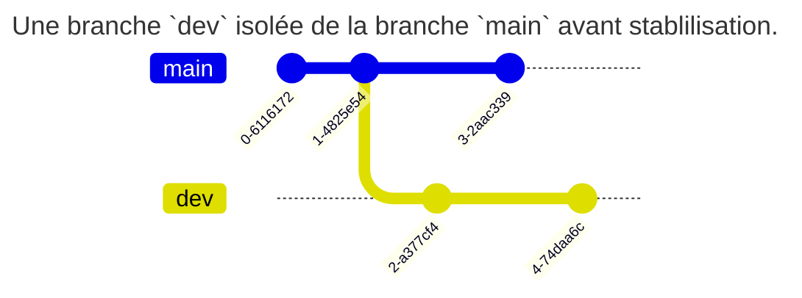
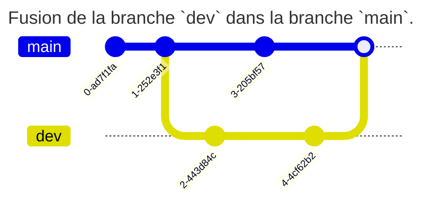
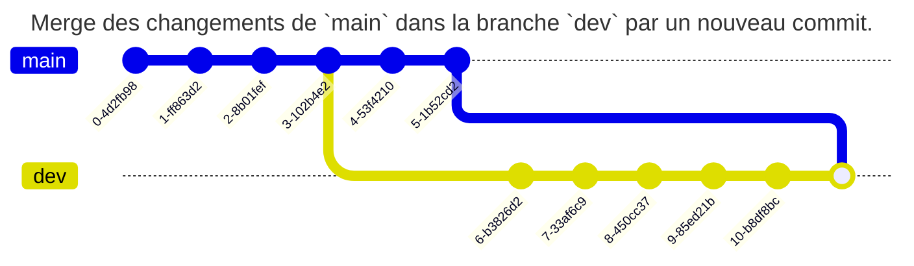

# Introduction

---

# Introduction

- `git` : gestionnaire de versions (_Linus Torvalds, 2005_)
- Gère tout type de **fichier** mais surtout du code source

- Autres gestionnaires de versions : `mercurial`, `cvs`, ... (`git` largement majoritaire aujourd'hui)

---

# Versionner son code source

Versionner son code source permet :

- D'identifier, isoler et documenter les changements apportés dans le code
- De visualiser l'historique des changements et opérer un retour arrière
- D'intégrer des changements, y compris de manière concurrente et non linéaire

---

# Infrastructure-as-Code (IaC)

- Fichiers texte de configuration : idéal pour environnements `GNU/Linux` ;
- Scripts de déploiement et de configuration : `Python`, ... ;
- Outils d'IaC type `Ansible` ou `Puppet` : stock les fichiers de déploiements (`playbook`, ...)

---

# Versioning de documentation

- `Git` est orienté _texte brut_ ;
- Parfaitement adapté aux documentations type `Markdown` ;
- Permet de gérer un wiki très simplement !

---

# Stocker et échanger des données

- Permet de stocker et échanger facilement de la donnée texte : `CSV`, ...
- À combiner avec un outil de visualisation de données : `Grafana`, ...

---

- Le versioning de code source est **indispensable** à tout projet, y compris pour un travail individuel !
- De plus en plus utilisé en administration système : _DevOps_, _CI/CD_, ...
- A titre personnel, je gère même mes fichiers de configuration système (dotfiles) sous git

---

# Exemple : Windows

- 3.5M files
- 300GB repository
- 4,000 active developers
- 8,421 pushes per day (on average)
- 4,352 active topic branches

Tout en Git ! <https://devblogs.microsoft.com/bharry/the-largest-git-repo-on-the-planet>

---
layout: section
---

# Présentation de Git

---

# Principe de fonctionnement

`git` est un gestionnaire de versions **décentralisé** (ou distribué) :

- 1 copie = 1 nouveau dépôt complet avec l'historique des changements
- En général, un serveur distant héberge la version la plus à jour des intégrations
- Possibilité d'infrastructures très complexes, par exemple plusieurs références distantes (`upstream`) non cohérentes

---

- Les versions des fichiers sont stockées dans un dépôt (`repository`) local et/ou distant (similaire à une base de données).
- Le projet est disponible dans le répertoire de travail (`working directory`).
- Pour intégrer un changement, il faut le placer en zone d'attente (`staging area`) par une opération d'ajout `add`.
- Les fichiers en `staging` sont ajoutés à la prochaine version par une opération de `commit`

---


---


---

# Le commit

- Instantané créé depuis le `staging` à un moment donné.
- Notion fondamentale pour le versioning des fichiers.
- **Immuable** : la version identifiée sera récupérable à n'importe quel moment et sera toujours la même.

Le dépôt est surtout un ensemble de commit.

---

Un commit est constitué :

- d'un `hash` (son identifiant)
- d'une date
- d'un auteur (nom, mail)
- d'un message entré par son auteur
- (d'une signature par clé)

```
commit 520ace1a3e6c33a4c2e06213340ed194e51d2cc8
Author: Tom Avenel <tom@avenel.pro>
Date:   Mon Nov 27 12:47:48 2023 +0100

    [git] TP IDE
```

---
layout: section
---

# Comment utiliser Git ?

---

# Pourquoi Git et Github ?

`Git` et `GitHub` sont deux technologies différentes parfois confondues

- `git` est un gestionnaire de versions : il sert à créer un dépôt local et à gérer des versions de fichiers.
- `GitHub` est un service en ligne qui va héberger ce dépôt à distance : c'est donc un service de type Cloud SaaS de `git` (et d'autres services utiles sur ce dépôt : revue de code, intégration continue, ...).

---

Il existe d'autres services de Cloud `git` : `Bitbucket`, et des versions open-source : `GitLab`, `Sourcehut`, ...

---

# Pourquoi utiliser un dépôt public ?

- Le dépôt public permet d'utiliser un dépôt comme référence commune à tous les développeurs.
- Permet un travail collaboratif : les développeurs intègrent leurs modifications et récupèrent celles des autres
- Pour un travail individuel : le dépôt distant permet d'indexer, de sauver et d'archiver ses différents projets

---

# Que mettre dans un dépôt git ?

Un dépôt git sert à centraliser des données (majoritairement du code source) entre plusieurs développeurs : il ne doit donc contenir que des données **universelles** :

- pas de binaires compilés
- pas de fichiers temporaires
- pas de configuration spécifique à un développeur

---

# Bonnes pratiques de commit

- Commit simples et fréquents
- Texte du commit clair et précis (pas uniquement "correction", "bug", ...)
- Format commun de messages de commit (par exemple [BUG], [FEATURE], ... ) : <https://www.conventionalcommits.org/fr/>

---
layout: section
---

# Les branches

---

# Notion de branches

Dans `git`, une branche n'est qu'un pointeur vers une liste chaînée d'identifiants de commit. C'est ainsi que sont gérés les historiques de commit.

Créer une nouvelle branche, c'est donc créer une nouvelle histoire dans l'historique depuis le commit courant, qui sera indépendante de l'histoire de l'ancienne branche.

La `HEAD` est un pointeur spécial qui référence le commit courant dans la branche courante.

---

```
               dev <- HEAD
              /
c1 <- c2 <- c3
```

_La branche courante `dev` comporte 3 commit_

---

```
                     dev <- HEAD
                    /
c1 <- c2 <- c3 <- c4
```

_Un nouveau commit `c4` vient d'être ajouté à la branche `dev`_

---

# Isolation par branches

L'intérêt des branches est donc de pouvoir isoler du code pendant un temps avant de le fusionner si nécessaire.


_Un projet avec deux branches : `stable-v1` pour les hotfix dans la version stable v1, `dev-v2` pour la version 2 en développement._

---

# Fusion de branches

Ce comportement permet par exemple d'isoler une branche de développement avant de l'intégrer dans la branche principale :

---





---

# Merge vs rebase

## Le merge

L'opération la plus simple pour fusionner une branche `dev` avec une branche `main` consiste à réaliser une fusion (`merge`) des changements de `dev` dans `main` pour les intégrer.

Techniquement, il s'agit de réaliser un nouveau commit dans la branche `dev` qui va intégrer les différences réalisées dans `main` depuis la dernière fusion.

---

Cette opération est non-destructive et permet de repérer quand les changements ont été fusionnés.



---

## Le rebase

L'opération de `merge` a un inconvénient, elle pollue l'historique avec des commit de merge.

Une autre solution consiste à effectuer un `rebase` afin de déplacer la chaîne de commit d'une branche à la suite d'une autre.

Cette solution permet de garder l'historique de `dev` et une unique histoire linéaire. Elle supprime cependant la vision de la fusion et est potentiellement à risque (réécriture d'historique).

---


**Pas de rebase d'une branche publique comme `main` : risque de désynchronisation avec les autres développeurs**

---
layout: section
---

# Travailler en équipe

---

# Workflows

- Workflow Git : processus cohérent d'utilisation de Git pour réaliser une tâche, généralement Devops
- Rationalise l'utilisation du ou des dépôt(s) distant(s)
- Permet de se comprendre entre développeurs, process à formaliser en équipe

---

# Workflow centralisé


---

- Workflow simple : un seul dépôt distant - une branche unique
- `pull` à la demande du développeur
- `rebase` conseillé pour éviter de polluer l'historique du `main`
- `push` lorsque les changements sont matures
- Adapté aux petite équipes

---


---

# Workflow branche de fonctionnalité

- Un dépôt centralisé de référence
- Tout nouveau développement (fonctionnalité, bug, ...) dans une nouvelle branche dédiée depuis `main`
- Branche de dev instable appartenant au(x) développeur(s) de la fonctionnalité
- Fusionnée au `main` du dépôt central lorsque le code est stable

---

- Possibilité de test et revue de code : `pull-request` avant fusion
- La branche `main` constitue la version `stable` du projet à chaque instant
- Workflow de référence intégré à tous les workflows modernes

---


---


---

# Pull-request

- Popularisé par GitHub, la `pull-request` ou `merge-request` est aujourd'hui largement répandue en gestion de projet.
- En théorie, simple demande de relecture de code avant l'intégration (`merge`) d'une branche dans une autre.
- En pratique : permet de prévenir l'équipe de la fin d'une partie du produit et engage le processus d'intégration d'une branche spécialisée dans une branche commune, par exemple un pipeline d'intégration continue

---

# Process de pull-request

Étape optionnelle avant d'intégrer la branche de fonctionnalité au `main` du dépôt central :

1. `push` de la branche de dev dans le dépôt central
2. Validation des changements avant fusion : `pull-request`
3. Fusion dans `main` dans le dépôt central

---


---

# Workflow Gitflow

- Branches de fonctionnalité mais plusieurs branches stables d'intégration :
  - `main` pour les versions principales (livrables)
  - `develop` pour l'intégration courante : référence pour création / fusion branches de fontionnalité
- Fusion seulement si fonctionnalité terminée
- Avant livraison d'une version : branche intermédiaire `release` entre `develop` et `main`
- Branches `hotfix` depuis les commit de `main`

---

- Workflow très complexe : permet de gérer tout le cycle de vie du projet
- Généralement abandonné car difficile à gérer en intégration continue / pratiques DevOps.
- Adapté aux livraisons planifiées : intégration au bon moment
- Outil `git-flow` disponible (wrapper `git` avec sémantique Gitflow)

---


---

# Workflow développement basé sur le tronc (trunk)

- Successeur très simplifié de Gitflow
- Développement par branches de fonctionnalité
- Intégrations fréquentes dans un tronc unique `main` dès que le code est stable
- Compatible intégration continue
- Réduit la _feedback loop_

---

# Workflow de duplication (fork)

- Workflow orienté dépôts
  - Un dépôt _officiel_ suivant un process Gitflow
  - Chaque développeur copie (`fork`) le dépôt officiel pour créer un nouveau dépôt distant
- Avantage : intégration de changements sans altérer le dépôt officiel
- Très utilisé en open-source

---


---
layout: section
---

# Alternatives à la ligne de commandes

---

# Interface graphiques

Il existe de nombreuses interfaces graphiques pour `git` permettant de réaliser les opérations visuellement.

La présence d'un graphe des branches est souvent bien plus intuitive lors d'intégrations complexes.

Des interfaces graphiques en ligne de commandes existent également : `tig`, `lazygit`, ...

---

# Sourcetree®

![L'interface graphique Sourcetree®][sourcetree-ui]

<div class="caption">L'interface graphique Sourcetree®.</div>

---

# GitKraken®

![L'interface graphique GitKraken®.][gitkraken-ui]

<div class="caption">L'interface graphique GitKraken®.</div>

---

# Intégration dans un IDE

Il est également possible d'intégrer `git` directement dans un IDE.

La plupart des IDE sont capables de détecter automatiquement un dépôt `git`. Bien penser à ouvrir le répertoire principal du dépôt, celui contenant le répertoire `.git`.

---

Intégrer `git` dans un IDE permet :

- d'afficher en temps réel les changements apportés au code source
- de trouver des informations (commit log, développeur, numéro de bug, ...) sur un changement déjà apporté dans le code

---

# Gitignore

Le fichier spécial `.gitignore` (à placer directement dans le répertoire de travail de Git, sans sous-dossier) permet de lister des chemins de fichiers à ignorer lors d'un `git checkout` : ces fichiers deviennent invisibles pour git.

Voir le TP correspondant.

---

# Hooks

- Permettent d'exécuter des scripts _avant_ (`pre-*`) ou _après_ (`post-*`) des commandes ;
  - côté _client_ : `pre-commit`, ...
  - côté _serveur_ : `pre-receive`, ...

---

- À mettre dans le répertoire `.git/hooks`
  - fichiers d'exemples `.git/hooks/*.sample`
  - en cas d'erreur (code de retour != 0), la commande n'est pas exécutée

---

## Exemple

`pre-commit` pour refuser un commit si un fichier `WIP` est trouvé :

```bash
!/bin/bash

[ -f WIP ] && echo "WIP found : commit refused" > /dev/stderr && exit 1
```

---

# Multi-repo vs mono-repo

- Multi-répo:
  - Adapté aux équipes fonctionnelles séparées
	- Livrables qui ont leur cycle de vie propre
- Mono-répo:
  - Adapté à un livrable conséquent
	- Inclue plusieurs briques distinctes

---

# Gist

- Service GitHub pour partager simplement des extraits de code, de notes, de listes de tâches, ...
- Besoin seulement d'une URL secrète : facilite l'automatisation.
- Techniquement : vrai dépôt Git mais utilisation limitée par l'interface Web.

---

# Submodules

- Permettent d'inclure un autre dépôt Git dans un dépôt principal (ex: dépendance).
- fichier `.gitmodules`
- `git submodule add <URL_du_dépôt_sous_module> <chemin/dossier>`
- `git clone --recurse-submodules <URL_du_dépôt_principal>` : clone le dépôt principal et tous les sous-modules.
- `git submodule update --remote`

---

# Worktree

- `git worktree` crée plusieurs répertoires de travail pour un même dépôt Git
- Permet de travailler simultanément sur plusieurs branches.
- Utile avec `git --bare` pour configurer un dépôt central (nu) à partir duquel on peut créer et gérer ces répertoires de travail.
- `git worktree add ../mon-projet-feature feature-branch`
- Chaque worktree est indépendant des autres : vous pouvez donc y effectuer des commits, … sans affecter les autres répertoires de travail.

---


<div class="caption">Résumé des commandes Git</div>

---

# Quelques commandes avancées

- `git checkout <other-branch-name> -- path/to/your/folder/or/file`
- `git log --oneline --decorate --graph` => log minimal
- `git config --global alias.lola "log --graph --decorate --pretty=oneline --abbrev-commit --all"` => crée l'alias `git lola` pour afficher un graphe des commit
- `git log -p` => log avec diff
- `git commit -S` et `git config --global user.signingkey <gpg_key_id>` => utilisation de commit signés
- `git clone --depth=1` : clone seulement le dernier commit
- `git clone --filter=blob:none` : ne pas cloner les blobs (seulement l'historique)

---

- `git gc --aggressive` => réduire la taille d'un dépôt par un garbage collector aggressif
- `git -c gc.reflogExpire=0 -c gc.reflogExpireUnreachable=0 -c gc.rerereresolved=0 -c gc.rerereunresolved=0 -c gc.pruneExpire=now gc` : garbage collector très aggressif
- `git sparse-checkout set [dir1] [dir2] …` pour faire du lazy-checkout de fichiers (utile en monorépos).
- `git bisect` : crée un arbre binaire de recherche pour trouver un commit en particulier (utile pour trouver la cause d'un bug)
- `git restore` et `git switch` (2019) : sépare `git checkout` en 2 commandes pour séparer les responsabilités
  - `git switch feature/A` : change de branche
  - `git restore --source feature/B -- utils.js` : restaure le working tree
- `git merge --ff-only -` : `--ff-only` (fast-forward) : ne pas créer de commit pour le merge, `-` : dernière branche de checkout

---

- `git commit --fixup=[sha]` : crée un commit qui corrige un autre commit (en référence)
  - `git rebase --autosquash` : rebase en écrasant (`squash`) automatiquement les commits de `fixup`.
  - `git commit --fixup=reword:[sha]` change aussi le message du commit d'origine.
  - `git commit --fixup=amend:[sha]` change aussi le contenu du commit d'origine.
- `git push --force` : MAJ forcée de la branche - écrase les contributions sur la branche distante non récupérées !
- `git push --force-with-lease` : vérification contre les écrasements accidentels (pas de nouveaux commits ajoutés à distance depuis le dernier `fetch` / `pull`).

---

- Retrouver des commits perdus : `git reflog` && `git checkout` && `git cherry-pick <commit-id>`
- Blame et log sur certaines lignes seulement : `git blame -L 20,40 my_file` et `git log -L20,40:my_file`
- Blame sur un block en suivant un `PATTERN` : `git blame -L :'PATTERN' my_file` et `git blame -L :'class MyClass' MyClass.java`
- Blame en ignorant les espaces et sauts de ligne : `git blame -w`
-  Scheduler une optimisation du dépôt : `git maintenance` et `git maintenance run`

---

- Suivre les fichier(s) / block(s) à travers : 
  - Le commit courrant : `git blame -C …`
  - Le commit courrant vs le commit ayant créé le fichier : `git blame -C …`
  - Tous les commits (très utile) : `git blame -C -C -C …`
- Code churn : `git log --pretty='' --date=short --numstat`
- Nuage de mots extraits des messages de commits : `git log --pretty=format:'%s' | tr ' ' '\n' | sed 's/.*/\L&/' | sort | uniq -c | sort -rg | head -n 100`

---

# Résumé


---

## Commandes utiles

1. `git rev-parse --show-toplevel` : Vérifier le répertoire parent contenant le dossier `.git`
2. `git add -p` : Ajoutez des modifications partie par partie. Idéal pour des commits propres et ciblés.
3. `git commit mon_fichier` : Ignore les changements en staging et crée un commit contenant la version actuelle d'un fichier déjà connu
4. `git commit -a` : Ajoute au staging les états actuels de tous les fichiers déjà connus par Git et en crée un commit.
5. `git commit --amend` : Modifiez votre dernier commit : corriger un message, ajouter un fichier oublié.

---

6. `git reset --soft HEAD~1` : Annulez le dernier commit en conservant vos modifications. ⚠️  Attention avec l'option `--hard` qui supprime définitivement les modifications
7. `git stash / git stash pop` : Mettez de côté vos modifications temporairement. Idéal pour switcher rapidement de branche.
8. `git cherry-pick <commit-hash>` : Appliquez un commit spécifique d'une autre branche.
9. `git branch -d <branch-name>` : Nettoyez vos branches locales inutilisées.
10. `git log -- <file>` : Visualisez l'historique d'un fichier spécifique (attention à l'espace après `--`).

---

11. `git blame <filename>` : Identifiez qui a modifié chaque ligne de code.
12. `git bisect` : Trouvez le commit qui a introduit un bug grâce à une recherche dichotomique.
13. `git merge --abort` : Annulez une fusion problématique.
14. `git log --grep="xxx"` : Recherchez dans les messages de commit.
15. `git tag -a v1.0 -m "Version 1.0"` : Marquez les moments importants de votre projet avec des tags.

---

16. `git clean -fd` : Nettoyez votre espace de travail. ⚠️utilisez d'abord `git clean -n` pour prévisualiser les suppressions
17. `git reflog` : Visualisez l'historique de toutes les opérations Git.
18. `git rebase -i HEAD~<n>` : Réorganisez vos commits. ⚠️ À éviter sur des branches partagées.
19. `git revert <commit-hash>` : Annulez proprement un commit sans réécrire l'historique.
20. `git fetch --all --prune` : Synchronisez et nettoyez votre repo en une commande.

---

21. `git log --graph --oneline --all` : Visualisez graphiquement l'historique de toutes vos branches.
22. `git log --name-status` : Affiche le nom des fichiers modifiés (et leur status, sinon `--name-only`)
23. `git log --source --all` : Ajoute l'information de branche pour chaque commit
24. `git diff --staged` : Examinez les modifications qui sont dans la staging area avant de commiter.
25. `git show <commit-hash>` : Affichez les détails complets d'un commit spécifique.
26. `git archive` : crée une archive contenant les fichiers d'un commit ou d'une branche sans inclure l'historique Git

---

<!-- class: liens -->

# Liens

- [Livre officiel et gratuit][git-book]
- [Exercices interactifs en ligne][learn-git-branch]
- [Documentation et pages de manuel officiels][git-scm]
- [Git Cheatsheet de GitHub Education][github-cheatsheet]
- [Git Cheatsheet interactive de NDP Software][ndp-cheatsheet]
- [Cours en ligne OpenClassrooms - 1][openclassrooms1]
- [Cours en ligne OpenClassrooms - 2][openclassrooms2]
- [Tutoriels en ligne Git et workflows tous niveaux][atlassian-tutos]
- [Comparaisons des principaux workflows Git][atlassian-workflows]
- [Comparaison des workflows Github et Gitlab et proposition de nouveau workflow (lafor.ge)][laforge-workflows]
- [Explication poussée des opérations merge vs rebase][atlassian-merge-rebase]
- [Exemple de réécriture d'historique][zds-refaire-histoire]
- [Exemple de création d'un nouveau dépôt depuis un dépôt existant][zds-nouveau-depot-existant]
- [Documentation sur les hooks][git-hooks] et [exemples pour les Ops](https://blog.wescale.fr/vers-linfrastructure-craftsmanship-avec-les-git-hooks)

---

- [Sylvain Bouveret, Grégory Mounié, Matthieu Moy : Git Workflows (cours Ensimag)][ensimag-git-workflows]
- [Sylvain Bouveret, Grégory Mounié : Git Comprendre le modèle de données (Exercices)][ensimag-git-modele-donnees-tp]
- [Pierre-Antoine Champin : Introduction à Git][pa-champin]
- <https://blog.gitbutler.com/git-tips-and-tricks/>
- <https://semver.org/> : Versioning Sémantique
- <https://www.conventionalcommits.org/en/v1.0.0/> : Convention commune d'écriture de commits
- <https://thevaluable.dev/complexity-metrics-environment/> : data mining dans les métadatas git
- <https://bearstech.com/blog/les-bonnes-pratiques-du-gitflow-avec-gitlab>
- [Pourquoi écrire des commits atomiques](https://dev.to/samuelfaure/how-atomic-git-commits-dramatically-increased-my-productivity-and-will-increase-yours-too-4a84)
- [Utiliser git pour gérer ses dotfiles (atlassian)](https://www.atlassian.com/fr/git/tutorials/dotfiles) et [Armand Philippot](https://www.armandphilippot.com/article/dotfiles-git-fichiers-configuration)
- [Inside .git : structure interne de Git](https://jvns.ca/blog/2024/01/26/inside-git/)
- [Advanced Git rebase techniques (youtube, Andrew Courter)](https://www.youtube.com/watch?v=OdFW1embsHw)
- [Git Merge vs Git Rebase (youtube, Andrew Courter)](https://www.youtube.com/watch?v=YMBhhje-Sgs)
- Exemple de repo avec un conflit de merge à gérer : <https://github.com/redguardtoo/test-git-mergetool>

[git-book]: https://git-scm.com/book/
[learn-git-branch]: https://learngitbranching.js.org/?locale=fr_FR
[git-scm]: https://git-scm.com/doc
[github-cheatsheet]: https://training.github.com/downloads/fr/github-git-cheat-sheet/
[ndp-cheatsheet]: https://ndpsoftware.com/git-cheatsheet.html
[openclassrooms1]: https://openclassrooms.com/fr/courses/7162856-gerez-du-code-avec-git-et-github
[openclassrooms2]: https://openclassrooms.com/fr/courses/5641721-utilisez-git-et-github-pour-vos-projets-de-developpement
[atlassian-tutos]: https://www.atlassian.com/fr/git/tutorials
[atlassian-workflows]: https://www.atlassian.com/fr/git/tutorials/comparing-workflows
[atlassian-merge-rebase]: https://www.atlassian.com/fr/git/tutorials/merging-vs-rebasing
[zds-refaire-histoire]: https://zestedesavoir.com/tutoriels/379/refaire-lhistoire-avec-git/
[zds-nouveau-depot-existant]: https://zestedesavoir.com/tutoriels/415/git-creer-un-nouveau-depot-a-partir-dun-dossier-dun-autre-depot/
[git-hooks]: https://git-scm.com/book/en/v2/Customizing-Git-Git-Hooks
[ensimag-git-workflows]: https://git.pages.ensimag.fr/formation-git/slides/git-workflow-slides.pdf
[ensimag-git-modele-donnees-tp]: https://mounieg.gricad-pages.univ-grenoble-alpes.fr/formation-git/tp/tp2-modele-git.pdf
[laforge-workflows]: https://lafor.ge/gitworkflow/
[pa-champin]: https://perso.liris.cnrs.fr/pierre-antoine.champin/enseignement/intro-git/

[git-logo]: https://git-scm.com/images/logos/downloads/Git-Logo-1788C.svg "The Git logo"
[sourcetree-ui]: https://wac-cdn.atlassian.com/dam/jcr:580c367b-c240-453d-aa18-c7ced44324f9/hero-mac-screenshot.png?cdnVersion=542 "Sourcetree UI"
[gitkraken-ui]: https://www.gitkraken.com/wp-content/uploads/2022/10/1-visual-commit-graph-1600x900-1-1024x576.png.webp "Gitkraken UI"

---

# Legal

- [Git Logo](https://git-scm.com/images/logos/downloads/Git-Logo-2Color.svg) by [Jason Long](https://twitter.com/jasonlong) is licensed under the [Creative Commons Attribution 3.0 Unported License](https://creativecommons.org/licenses/by/3.0/).
- Git and the Git logo are either registered trademarks or trademarks of Software Freedom Conservancy, Inc., corporate home of the Git Project, in the United States and/or other countries
- Other names may be trademarks of their respective owners

