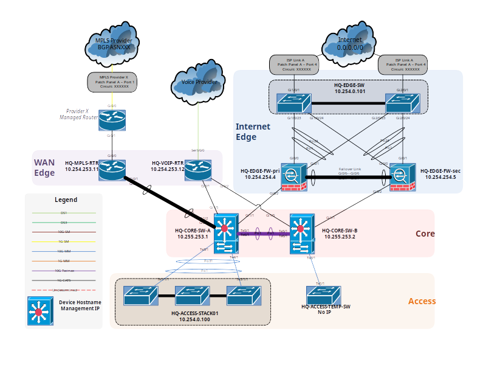

# La fourniture d'un service : Assistance aux utilisateurs

_Tom Avenel_

<https://www.avenel.pro/>

---

# Objectifs du module

- Assister les utilisateurs en mettant à leur disposition des outils et des documentations.
- Assister les utilisateurs en les informant des changements d'infrastructure les impactant.

---

# Compétences à acquérir

- Réaliser une documentation d'exploitation
- Documenter les modes opératoires d'un service
- Réaliser un support de formation au service

---

# Partie I : Documentation d'exploitation et modes opératoires

---

# Le Documentation d'exploitation

- Qu'est-ce qu'un document d'exploitation ?
- Quel est son but ?
- Quel est son contenu ?
- Pour qui ?

---

# Qu'est-ce qu'un manuel d'exploitation ?

Un manuel d'exploitation est un document décrivant l'ensemble des informations nécessaires à la gestion opérationnelle d'un système (administration, procédures d'urgence, opérations de backup, suivi d'exploitation, ...)

Il est réalisé à partir du manuel utilisateur, cependant contrairement à celui-ci il est sous la responsabilité des exploitants du système.

---

Un manuel d'exploitation décrit  principalement l'ensemble des modes opératoires d'un service en utilisant un ensemble de procédures.

Ces procédures sont définies par :

- La gestion des données en entrée de la procédure
- L'exécution de la procédure (chronogramme d'exécution)
- La gestion des données produites par la procédure

---

Le manuel d’exploitation décrit également comment mettre en œuvre les outils (notamment ceux décrits dans le manuel utilisateur) pour réaliser les différentes procédures.

Ce sont l'ensemble des outils qui permettent de réaliser la gestion du système, même s'ils ne sont pas directement accessibles au client final. Par exemple, l’installation et la configuration d’un outil de monitoring de base de données.

---

Le manuel d'exploitation contient toujours, et uniquement, une description quantitative des informations traitées.

Quelques exemples de données à quantifier :

- Le volume des informations en entrée à traiter par jour/semaine/mois
- Le volume des informations à diffuser à l'extérieur par jour/semaine/mois
- Le volume et la nature des informations à archiver par jour/semaine/mois
- Les besoins en CPU, mémoire, supports externes en jour/semaine/mois
- Le nombre d'utilisateurs attendus, la concurrence supportée

---

# Manuel d'exploitation : pour qui ?

Le manuel d'exploitation contient la liste des opérateurs intervenants sur le système, avec :

- Le contact de l'intervenant (nom, email, ...)
- Ses attributions (rôles, responsabilités, ...)

Dans la plupart des cas, on réalise un manuel d'exploitation (ou un chapitre de ce manuel) par profil opérateur.

---

Exemples de profils :

- Responsable d'exploitation
- Administrateur base de données (DBA)
- Administrateur systèmes
- Exploitant de routine

Un profil n'est pas lié directement à un intervenant ! Un même intervenant peut avoir plusieurs "casquettes" (DBA et administration système, ...), et un même profil peut être partagé par plusieurs intervenants (backups, ...)

---

# Manuel d'exploitation : quel contenu ?

Le manuel d'exploitation est un regroupement de toutes les informations nécessaires à l'exploitation du système.

Il doit notamment contenir :

- Le schéma d'infrastructure physique et logique du système
- La  ou les  procédures des session(s) nominale(s) d'exploitation (fonctionnement "normal")
- Les  procédures à suivre en cas de dysfonctionnements et celles permettant de les résoudre
- Les  procédures de suivi de l'intégrité

Le contenu de ces sections sera détaillé dans la suite du cours.

Les procédures des sessions nominales et des dysfonctionnements peuvent être décrits sous forme de modes opératoires.

---

Une procédure d'exploitation comporte généralement 3 activités :

- Le contrôle :
  + Volume et nature des données en entrée et/ou en sortie
  + Vérification de labels et volumes pour supports externes
  + Résultats attendus pour un traitement (Compte rendu dans un journal de bord, mises à jour attendus, fichiers produits, ...)
- Le suivi :
  + Suivi des activités, des anomalies, des actions associées, ...
- L'archivage :
  + Archivage des résultats du contrôle
  + Archivage des données, ...

---

# Le diagramme d'infrastructure physique

C'est un schéma de la couche L1 (modèle OSI) :

- Il décrit l'architecture physique de l'infrastructure en incluant les racks, les interfaces réseau, les switchs, ...
- Les câbles réseau sont représentés (en respectant la redondance, etc...)
- Toute la stack de virtualisation est représentée

---

_Exemple de diagramme d'infrastructure physique. Source et crédits : packetpushers.net_

---

# Le diagramme d'infrastructure logique

C'est un schéma de la couche L3 (modèle OSI) :

- Il décrit l'architecture logique de l'infrastructure
- Les différents réseaux sont identifiés
- Les usages et dépendances entre les différents composants sont représentés
- Les liens réseau sont des liens logiques entre deux systèmes d'exploitation ou deux équipements du réseau

---

_Exemple de diagramme d'infrastructure logique. Source et crédits : https://www.lucidchart.com_

---

# La session nominale d'exploitation

Une session nominale d'exploitation est un chronogramme décrivant le fonctionnement attendu du système.

Ce fonctionnement nominal découle du manuel utilisateur.

Le chronogramme (qu'il soit schématique ou décrit par une liste d'étapes) doit décrire de manière précise et quantitative :

- Le fonctionnement attendu du système
- Les entrées / sorties valides et invalides

---

# Les dysfonctionnements

Cette section décrit la ou les procédures à suivre en cas de dysfonctionnement dans le système, qu'il soit :

- Un problème d'ordre logiciel (applicatif) : crash de l'application, problème de cache, ...
- Un problème matériel : disque dur défectueux, ...
- Un problème système : mémoire saturée, ...
- Tout autre type de problème pouvant dégrader ou interrompre le bon fonctionnement du service, y compris les problèmes non-techniques : tremblement de terre, ...

---

# Le suivi de l'intégrité

Cette section décrit la ou les procédures permettant de réaliser le suivi de l'intégrité du système et de ses données.

Il s'agit donc non seulement de décrire les opérations mises en place (sauvegarde, archivage, ...) mais aussi la surveillance de cette intégrité.

Cette section mentionne également les procédures à suivre pour réagir en cas de problème spécifique lié à cette intégrité de données.

---

Les procédures d'exploitation ne contiennent pas uniquement des opérations techniques !

Dans le cas du suivi de l'intégrité notamment, on prendra soin de préciser le processus administratif à suivre (personne à prévenir, ...) en cas de fuite des données.

---

# Remarques générales

Quelques remarques générales sur la documentation :

- Un document n'a de sens que lorsqu'il est valide :
  + son contenu doit être crédible (auteur et responsabilité, intégrité du document, archivage, ...)
  + son contenu doit être à jour (document daté, versionné, contenu régulièrement vérifié et amendé si nécessaire)

Utiliser de la documentation dont la validité n'est pas assurée est du temps perdu !

---

# Sous quelle forme / support ?

La forme du document d'exploitation est très variable. Elle est souvent liée à la culture de l'entreprise et à ses habitudes de travail.

Si l'on peut choisir le format, on préférera un support permettant l'évolution du contenu et la communication entre rédacteurs (wiki, ...) plutôt qu'un enregistrement de contenu rigide (fichier texte)

Le document d'exploitation est souvent dense et très technique : penser à travailler la forme, aérer le contenu et rendre facilement accessible les procédures nécessaires à chacun.

---

# Quel niveau de détail ?

Un court document de qualité vaut toujours mieux qu'un long document rébarbatif.
Le niveau de détail doit cependant être adapté au public cible : les opérations décrites sont souvent très techniques et recquièrent un bon niveau de détail (en complément d'informations quantifiées).

Un schéma ou un dessin vaut un long discours

L'ajout d'une FAQ (Foire Aux Questions) est très utile pour rediriger l'opérateur vers la bonne procédure.

---

# Modes opératoires d'un service

- Qu'est-ce qu'un mode opératoire ?
- Comment les intégrer dans le document d'exploitation ?

---

# Modes opératoires

Un mode opératoire est l’ensemble des chronogrammes d’exécution de procédures à réaliser pour mettre en œuvre l’un des services du système.

En d'autres termes, un mode opératoire est donc un ensemble de procédures d'exploitation amenant à un état connu et bien identifié du système. Son usage simplifie l'écriture de procédures complexes et interdépendantes par un regroupement logique.
Par exemple : le passage en mode "batterie faible" d'un smartphone ou son démarrage en "recovery mode"

Les Linux runlevels (single user, multi user, reboot, ...) sont des exemples classiques de modes opératoires.

---

Le mode opératoire est décrit par un chronogramme d'exécution contenant :

- Les enchaînements des opérations
- Les temps d'exécution probables en fonction de la charge machine prévisible et des volumes d'informations traités
- La date/heure de début
- La date/heure de fin prévisible de la session

---

Lors de la rédaction des procédures :

- Privilégier les phrases courtes
- Il est impératif de détailler les activités tout en évitant de les rendre trop complexes
- Le suivi de la procédure doit être une source de motivation pour l'opérateur

---

L'ajout d'un diagramme d'activité est recommandé :

![]http://www.thedoghousediaries.com/dhdcomics/2011-03-28-e1660dc.png

_Source et crédits : http://www.thedoghousediaries.com/_

---

<!-- class: legal -->

# Legal

|  | CC BY-SA 4.0 |
| ---------------------------------------------------------------- | ------------------------------------------ |
|  | Attribution : vous devez créditer l'auteur |
|  | Partage dans les mêmes conditions          |

- Ce fichier est mis à disposition selon les termes de la Licence Creative Commons Attribution - Partage dans les Mêmes Conditions 4.0 International. Pour plus d'informations : <http://creativecommons.org/licenses/by-sa/4.0/>
- Le code source au format `Markdown` de ce document est disponible sur le [site web][site-perso]

[site-perso]: https://www.avenel.pro/
