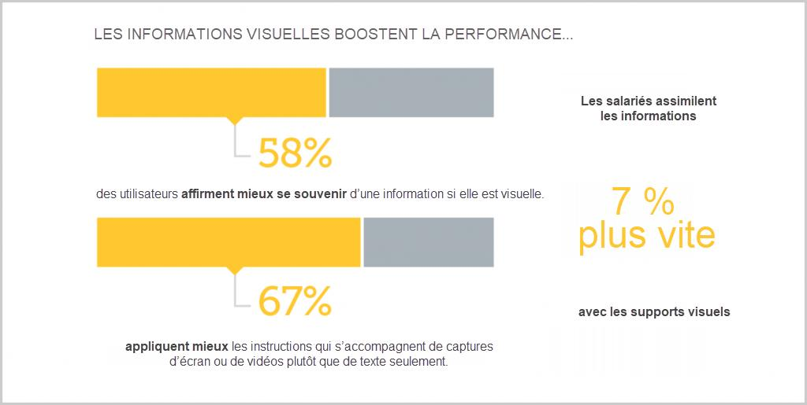
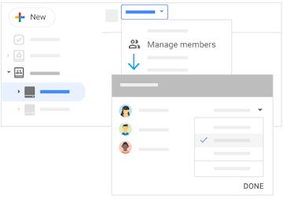
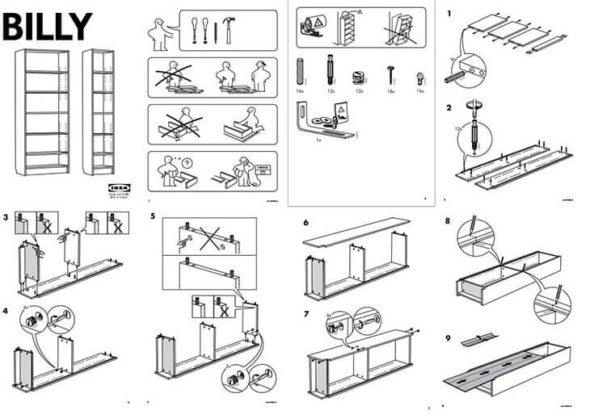

# Le manuel utilisateur

_Tom Avenel_

<https://www.avenel.pro/>

---

# Manuel utilisateur

Le guide d’utilisation est le support qui accompagne un produit afin de montrer aux clients comment s’en servir et/ou comment l’assembler. C'est un support marketing que l'on partage pour arriver à la meilleure expérience client possible.

---

Une notice d’utilisation peut prendre de nombreuses formes : les manuels d’utilisation des logiciels présentent les fonctionnalités des outils et leur application, les guides d’utilisation de tondeuses à gazon indiquent comment démarrer le moteur ou faire le plein de carburant, même les formulaires de déclarations d’impôts sont accompagnés d’instructions permettant d’éviter les erreurs.

---

Un guide d’utilisation ne s’adresse pas exclusivement aux nouveaux utilisateurs : il peut servir d'aide-mémoire aux utilisateurs existants, ou leur décrire les fonctionnalités de la nouvelle version.
Il sert aussi de référence au service client pour trouver facilement l'information.

---

Un manuel utilisateur suit un ensemble de concepts :

- Langage compréhensible
- Fond et forme simples
- Éléments visuels
- Solution au problème
- Structure logique
- Sommaire
- Fonctionnalité de recherche
- Contenu accessible
- Présentation soignée
- Témoignages utilisateur
- Ressources supplémentaires

---

Ajouter des informations visuelles :

---

Les images simplifiées sont un bon moyen de focaliser l'attention de l'utilisateur uniquement sur l'information utile.

---

Un excellent exemple de document utilisateur Ikea. Avec un minimum de texte, ce support marketing contient des schémas clairs et faciles à suivre, accompagnés d’instructions visuelles pour assembler le produit. ©Ikea

---

# Lien avec le document d'exploitation

Le manuel utilisateur est une des sources à réutiliser lors de l'écriture du document d'exploitation (et réciproquement). Cependant, leur destination est très différente : le manuel utilisateur est un document marketing à destination des utilisateurs finaux et doit abstraire la complexité de l'implémentation. Au contraire, le document d'exploitation est un document technique à destination des opérateurs du système.

---

Par exemple, le manuel utilisateur décrit les outils pour réaliser l'administration du système.

On doit trouver en plus dans le manuel d'exploitation :

- La nature de la sauvegarde (incrémentale journalier, total hebdomadaire, ...)
- L’heure de la sauvegarde incrémentale (tous les jours à 3h00)
- La date/heure du backup hebdomadaire (samedi à 3h00)
- Le label des supports utilisés pour la sauvegarde journalière, hebdomadaire
- La péridocité de recyclage des supports utilisés pour les sauvegardes
- L’armoire de rangement des supports de sauvegarde

---

<!-- class: liens -->

# Liens

- Créer le guide d'utilisateur parfait : <https://www.techsmith.fr/blog/creer-le-guide-d-utilisation-parfait/>

---

<!-- class: legal -->

# Legal

|  | CC BY-SA 4.0 |
| ---------------------------------------------------------------- | ------------------------------------------ |
|  | Attribution : vous devez créditer l'auteur |
|  | Partage dans les mêmes conditions          |

- Ce fichier est mis à disposition selon les termes de la Licence Creative Commons Attribution - Partage dans les Mêmes Conditions 4.0 International. Pour plus d'informations : <http://creativecommons.org/licenses/by-sa/4.0/>
- Le code source au format `Markdown` de ce document est disponible sur le [site web][site-perso]

[site-perso]: https://www.avenel.pro/
