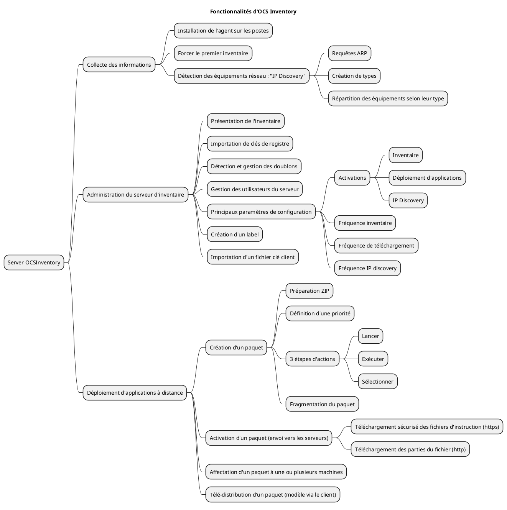
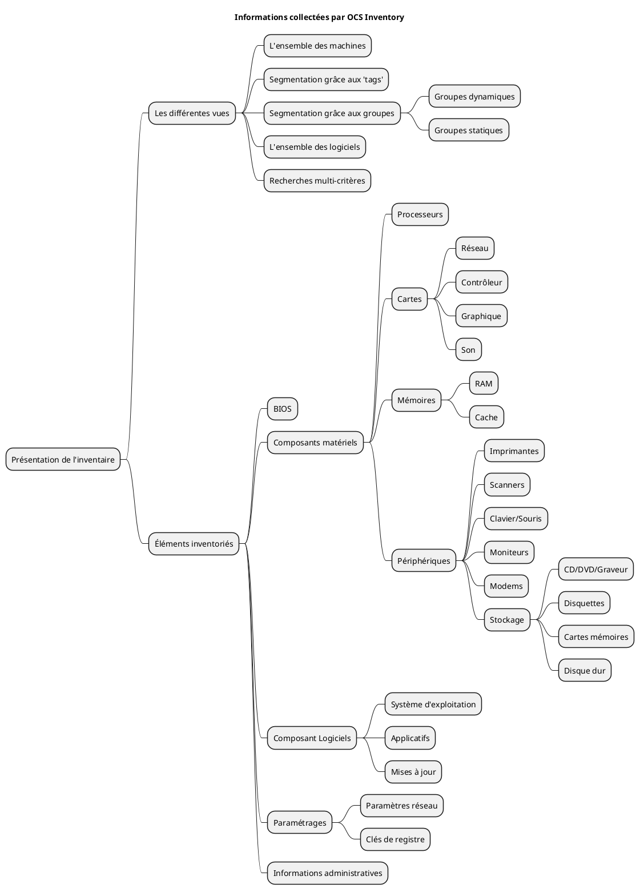

# Présentation du produit

OCSInventory est un outil de collecte automatisée d'éléments d'un parc informatique. Il permet notamment :

- d'automatiser les inventaires des PC connectés sur le réseau ainsi que leurs composants matériels et logiciels ;
- de connaître l'ensemble des équipements du parc informatique (matériels et logiciels) avec mise à jour automatique des éléments inventoriés ;
- de procéder à une gestion minimale du parc ;
- de télé-distribuer des fichiers et des applications.

## Fonctionnalités

Voici une vue synthétique des principales fonctionnalités d'OCS Inventory :



## Architecture

L’application est composée de deux parties :

- un agent installé sur les machines clientes qui réalise l’inventaire matériel et logiciel ;
- un serveur (management server) qui centralise les résultats d'inventaire et propose leur affichage ainsi que la création des paquets de déploiement.

Les communications entre agents et serveurs de gestion utilisent les protocoles HTTP/HTTPS. Les données sont formatées en XML et compressées avec Zlib pour réduire l'utilisation de la bande passante du réseau.

## Schéma d'articulation des applications


<div class="caption">Schema des applications OCS Inventory</div>

Le serveur de gestion (Management server) comprend trois composants principaux :

- **le serveur de base de données (Database server)**, lieu de stockage des informations d'inventaire ;
- **le serveur de communication (Communication server)** gère les échanges entre les agents et le serveur de base de données ;
- **la console d'administration (Administration console)**, accessible depuis une interface WEB très intuitive, permet d'interroger la base de données.

Ces éléments peuvent être installés sur un seul ordinateur ou sur plusieurs afin d'équilibrer la charge ; le site officiel préconise l'utilisation de deux ordinateurs à partir de 10000 ordinateurs inventoriés.

*Grâce à la fonctionnalité de découverte IP, OCS peut découvrir tous les matériels connectés au réseau, même ceux pour lesquels aucun agent n'est installé (imprimantes réseaux, commutateurs, routeurs, etc.).*

# Installation et configuration du service OCSInventory

OCSInventory travaille dans un environnement web qui fait appel à des scripts php, perl et au SGBD MySQL pour le stockage des informations d'inventaire ; Il est donc nécessaire de disposer d'un serveur Apache2 et du SGBD MySQL.

*Attention, l'installation du serveur MySQL (mysql-server) est obligatoire avant (ou pendant) l'installation d'ocsinventory car aucune dépendance n'a été prévue !* 

Les paquets à installer sont les suivants : 

- ocsinventory-reports - Hardware and software inventory tool (Administration Console) 
- ocsinventory-server - Hardware and software inventory tool (Communication Server)
- libxml-parser-perl : ce paquet n’a pas été pris en compte dans les dépendances, il est pourtant indispensable à la remontée d’inventaire (il y a sinon un "internal error" à ce moment-là)

Il est nécessaire de finaliser l'installation via l'interface Web : <http://localhost/ocsreports/>

Cliquez sur « send » et vous devez voir apparaître l'écran page suivante (ne pas faire attention aux warning).

- Les fichiers de configuration de chacune des applications se trouvent dans `/etc/ocsinventory`
- Un répertoire "ocsinventory-server" est créé dans `/usr/share/`
- Un répertoire "ocsinventory-reports" est créé dans `/usr/share/` et dans `/var/lib/`
- La documentation de chacune des applications se trouve dans `/usr/share/doc/`

Les logs seront stockés dans le répertoire : `/var/log/ocsinventory-server/` mais il faut au préalable les activer en positionnant à "on" la variable "LOGLEVEL" sur le serveur.

La configuration pour le serveur WEB se trouve dans les fichiers : 

- `/etc/apache2/conf-available//ocsinventory-server.conf`
- `/etc/apache2/conf-available//ocsinventory-reports.conf`

*La base de données "ocsweb" avec 94 tables sera créée.*

Un utilisateur mysql « ocs » qui a un certain nombre de droits sur cette base de données est créé par défaut avec comme mot de passe « ocs » ; les fichiers :

- `/usr/share/ocsinventory-reports/dbconfig.inc.php`
- `/etc/apache2/conf-available/ocsinventory-server.conf`

accueillent les variables de configuration ==> Il est donc nécessaire de modifier ces deux fichiers si on modifie (comme il est évidemment conseillé de le faire) le mot de passe.

*Ne pas oublier de redémarrer Apache2 après la modification de ces fichiers sinon vous risquez d'avoir une erreur 500 correspondante à une « Internal error ».*

## Fréquence des inventaires

Le but étant de ne pas trop charger le réseau, il faut éviter :

- de faire des remontées constamment ; 
- de faire des remontées systématiques lors de chaque lancement du client ;
- de faire les remontées de tous les clients en même temps

Ce sont les paramètres `PROLOG_FREQ` (onglet serveur) et `FREQUENCY` (onglet Inventaire) qui gèrent le rythme des inventaires.

`PROLOG_FREQ` définit en nombre d’heure la période max entre 2 lancements d'un agent. Cette notion de “période max” permet d'éviter les surcharges si tous les postes remontaient leur inventaire simultanément ; l’agent choisit un temps de manière aléatoire pouvant aller jusqu'à cette période max pour demander au serveur quoi faire – pas nécessairement remonter l’inventaire.*

C'est la valeur de la variable `FREQUENCY` qui va réellement permettre le lancement de l'inventaire :

- Toujours inventorié (`always`) : la remontée sera réalisée sans condition dès que l'agent sollicite le serveur (c'est la valeur par défaut)
- Jamais inventorié (`never`) : aucune remontée ne sera réalisée.
- Personnalisé (`custom`) : définit une fréquence de remontée d'inventaire en nombre de jours : la remontée sera réalisée lors de la sollicitation du client si l'inventaire est plus vieux que le nombre de jours spécifiés dans `FREQUENCY`.

### Exemples

- `FREQUENCY=always` et `PROLOG_FREQ=24` : toutes les 24 heures au max, je force une remontée qui sera faite à chaque fois.
- `FREQUENCY` = 1 et `PROLOG_FREQ = 12` : toutes les 12 heures au max, l'agent demande au serveur s'il n'est pas temps de réaliser un inventaire. Celui-ci acceptera si l’inventaire actuel a plus d'un jour.*

# La collecte d’informations

La collecte automatisée d'informations passe par l'installation sur les postes clients de l'agent ocs ; Il existe un (ou plusieurs) agent(s) pour chaque système d'exploitation.

Nous ne développerons pas la problématique de l'installation automatique de l'agent mais il est évident qu'en production lorsque l'agent doit être installé sur des centaines de postes, la question se pose.

## Agent Linux :

Ce type d’agent permet :

- La méthode locale permet la récupération des informations dans un fichier XML (intéressant si le poste ne peut pas se connecter au réseau) puis l'incorporation manuelle dans OCS.
- La méthode HTTP permet d’envoyer les informations du client au serveur OCS via le réseau.

Un répertoire `/var/log/ocsinventory-client` contient le fichier de log du client.

3 autres fichiers sont créés :

- Un fichier de configuration `/etc/ocsinventory/ocsinventory-agent.cfg` dans lequel sont présents notamment le nom d'hôte (ou l'adresse IP) précisé précédemment.

Exemple de fichier ocsinventory-agent.cfg :

```
server=adresse_ip

tag=Linux_Serveur
```

- Le fichier de rotation des logs : `/etc/logrotate.d/ocsinventory-agent` qui configure la rotation quotidienne des logs de l'agent OCS Inventory NG.
- Un script pour l'agent (une tâche cron) : `/etc/cron.daily/ocsinventory-agent` ; ce script s'exécutera chaque jour à l'heure précisée dans `/etc/crontab` (0 heures 26 dans l'exemple ci-dessous) :

```
38 6 * * * root test -x /usr/sbin/anacron || ( cd / && run-parts --report /etc/cron.daily )
```

Pour forcer la remontée d'inventaire du client sans attendre le déclenchement du cron, il est également possible d'exécuter la commande ocsinventory-agent.

## Agent Windows :

Sous Windows, deux agents OCSinventory sont disponibles :

- `OcsLogon.exe` : cet agent peut être utilisé uniquement sur un domaine Active Directory ou sur Linux via Samba. Il peut être déployé à travers le contrôleur de domaine et par des scripts d'ouverture de session.

- `OCS-NG-Windows-Agent-Setup.exe` : cet agent s'installe sur chaque poste et permet la transmission d'inventaire et également le déploiement d'applications à distance. Une fois installé, le service OCSinventory se lance à chaque démarrage du poste. 


NB : il est aussi possible de créer un fichier `ocspackage.exe` en utilisant le packager OCS Inventory NG, pour déployer la version de l'agent de service Windows, même si l'utilisateur connecté n'a pas les droits d'administrateur.

Un fichier de log (OcsAgentSetup) rendant compte de l'installation est créé dans le répertoire où se trouve l'exécutable `OcsAgentSetup.exe` que l'on vient de lancer.

Les répertoires d'installation sont, par défaut 

- `C:\Program Files (x86)\OCS Inventory Agent\` pour les exécutables et dll ;

- `C:\ProgramData\OCS Inventory NG\Agent\` pour les fichiers de configurations et les fichiers d'activité (log).

Une fois l'agent installé sur le client, le service OCSinventory est configuré pour être lancé automatiquement en tant que service au démarrage.
Les paramètres de configuration se trouvent dans le fichier `C:\ProgramData\OCS Inventory NG\Agent\ocsinventory.ini`.

## Agent Mac :

L'agent Mac OS X est disponible sous forme de package à installer.

Un certificat est obligatoire pour le télé-déploiement ou pour basculer en HTTPS et avoir une remontée d'inventaire sécurisée.

À l’installation de l’agent :

- les répertoires suivants sont créés :
  - `/etc/ocsinventory-agent` : contenant notamment le fichier de configuration `ocsinventory-agent.cfg`
  - `/var/lib/ocsinventory-agent` : dans lequel seront stockés les fichiers XML générés lors de l’exécution de l’agent.
- un ensemble de librairies sont installées dans `/Library/Receipts` et `/Library/LaunchDeamons`
- l’application `OCSNG` est ajoutée dans `/Applications`.

Après la première exécution de l’agent, sont créés :

- le fichier de log `/var/log/ocsng.log`
- le répertoire `/var/lib/ocsinventory-agent/http:__XXXX\_ocsinventory` (avec XXXX correspondant à l’adresse IP ou au nom du serveur OCS à contacter) contenant les fichiers XML suivants :
  + `last_state` qui décrit le dernier inventaire réalisé.
  + `ocsinv.conf` contenant les paramètres de configuration générale comme la valeur de la variable `PROLOG_FREQ` (ce qui veut dire que si cette variable est modifiée sur le serveur OCS, elle ne sera prise en compte par le client qu'après le prochain inventaire). Il est toujours possible de la modifier directement dans le fichier.
  + `ocsinv.adm` qui enregistre les valeurs `TAG` et autres valeurs administrative

# Gestion des informations collectées

Une fois les inventaires transmis au serveur par les agents et intégrés à la base de données, l'ensemble des machines peut être visionné. 

Des requêtes de restrictions pourront également être effectuées permettant ainsi d'avoir une vue précise et ciblée des éléments informatiques présents dans l'entreprise.


## Récupération des clés de registre

*Une des fonctionnalités intéressantes de la gestion d'un parc est de permettre la gestion des licences logicielles ; pour cela certaines clés de registres (sur les systèmes Windows uniquement) doivent être récupérées.*

Par défaut, aucune clef de registre n'est récupérée par les agents OCSinventory. C'est donc à l'administrateur du service d'inventaire de définir celles qui doivent l'être.

# Communication sécurisée

OCSInventory permet de récolter de nombreuses informations sensibles (et d’exécuter des opérations critiques comme nous le verrons dans la prochaine section). Pour sécuriser les communications, un tunnel HTTPS est utilisé.

## Configuration du serveur :

Un nouveau certificat `server.crt` doit être créé et configuré sur le serveur Web hébergeant OCS Inventory (par exemple : Apache).

## Configuration des agents :

L'agent doit avoir un certificat pour valider l'authentification au serveur de déploiement. Il s'agit du fichier `server.crt`. Ce certificat doit être enregistré dans un fichier `cacert.pem` dans le répertoire de l'agent OCS Inventory NG sous Windows et dans `/var/lib/ocsinventory-agent/http:__@IPserveurOCS_ocsinventory/` sous Linux.

# Déploiement automatisé d’application

L'installation, la mise à jour et la suppression d'applications font partie du travail quotidien d'un administrateur réseau. Lorsqu'il faut installer, mettre à jour ou supprimer un logiciel sur un grand nombre de machines d'un parc, il devient nécessaire d'automatiser cette tâche.

OCSInventory inclut la fonctionnalité de déploiement de paquets (logiciels, scripts, etc.) sur les stations inventoriées.

## Le principe de base est le suivant :

- L’agent se connecte au serveur de communication par le protocole HTTP pour lui demander ce qu'il doit faire. En fonction de sa configuration, le serveur peut répondre :
  - d'envoyer un inventaire ;
  - de découvrir le réseau avec le service IpDiscovery ;
  - de déployer un ou plusieurs paquets ;
  - de ne rien faire.
- Lorsque l'agent a l'ordre de déployer un paquet, il contacte via le protocole HTTPS le serveur de déploiement afin d'y récupérer un fichier d'informations (IDA : "Instruction Déploiement d'Applications") associé qui est un fichier XML décrivant le paquet et l'action que l'agent devra exécuter. C'est un fichier qui dispose d'un champ d'action important d'où la nécessité de sécuriser et d'authentifier le serveur sur lequel il se trouve.
- L'agent devra éventuellement télécharger, via le protocole HTTP, un fichier ou des fragments de fichiers (ce dernier point est optionnel si les instructions ne consistent qu'à exécuter une ou plusieurs commandes).

## L'administrateur devra au préalable : 

- préparer une archive compressée (en .ZIP pour Windows et en .tar.gz pour Linux) des fichiers nécessaires,
- créer le paquet grâce à la console d'administration, 
- activer le paquet,
- affecter le paquet aux machines sur lesquelles le déploiement doit s'effectuer.

## Fichiers de logs

Sur le client, les logs enregistrent le déploiement des applications dans le fichier `OCSInventory.log` :

```
INVENTORY => Writing new inventory state*
AGENT => Communication Server ask for Package Download*
DOWNLOAD => Package history file successfully cleaned for duplicate IDs*
DOWNLOAD => Metadata file <info> for package <1469789473> is located at <https://192.168.0.150/download/1469789473/info>*
COM SERVER => Initializing cURL library for getFile*
COM SERVER => Using cURL without server authentication*
COM SERVER => Disabling cURL proxy support*
COM SERVER => Enabling cURL SSL server validation support using CA Bundle <cacert.pem>*
COM SERVER => Sending fileGet request to URL <https://192.168.0.150/download/1469789473/info>*
COM SERVER => fileGet response received <HTTP Status Code #200>*
COM SERVER => Cleaning cURL library*
DOWNLOAD => Unloading communication provider*
DOWNLOAD => Retrieve info file...OK (pack 1469789473)*
DOWNLOAD => Package <1469789473> added to download queue*
DOWNLOAD => Download and setup tool successfully started*
AGENT => Unloading communication provider*
AGENT => Unloading plug-in(s)*
AGENT => Execution duration: 00:00:12.*
```

# Configuration des tags des postes

Le TAG des postes inventoriés peut être modifié manuellement dans OCSInventory. Pour obtenir un inventaire cohérent et efficace, il faudrait effectuer cette manipulation pour chaque poste inventorié, ce qui est ingérable selon l'ampleur dudit parc.

## Automatisation du tagging

Pour faciliter la maintenance des tags, un script SQL est déployé sur le serveur pour modifier la base de données d’OCSInventory.

Avant l’exécution de ce script, une sauvegarde de la base de données est réalisée.

