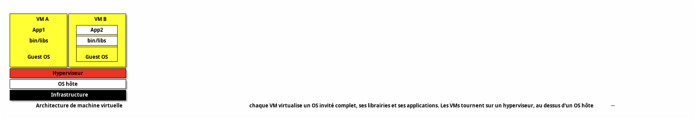
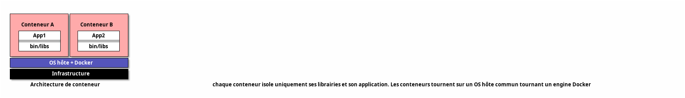

# Linux orienté développeurs

---

# Objectifs

- Avoir des connaissances de base des systèmes Linux : installation d'une distribution, gestion des packages, système de fichiers, environnement graphique
- Savoir utiliser les commandes courantes Unix et GNU : gestion des fichiers, traitement de flux de texte, gestion des processus
- Bien utiliser la ligne de commande Linux
- Écrire des scripts Bash

---

# Ressources utiles

- [Livre Bash beginner's guide](https://ftp.traduc.org/doc-vf/guides/Bash-Beginners-Guide/)
- Aide simple sur les commandes : <https://cheat.sh/>
- Explication graphique de commandes Shell complexes : <https://explainshell.com/>
- [Créer une distribution "Live" (qui reste en mémoire) - tuto complet, reprend les principes de base, du boot à un système minimal](https://zestedesavoir.com/tutoriels/268/creer-son-premier-rim-linux/)

---

# Conventions de notation

- Les commandes et noms de fichiers apparaissent dans le texte avec `cette syntaxe`.
- Les descriptions de commandes suivent le formalisme des _man pages_ :
  - Les symboles `<>` indiquent un argument obligatoire.
  - Les symboles `[]` indiquent un argument optionnel.  

---

# Interfaces et bureaux utilisateur

[TODO]

---

# Linux en tant que système virtuel hébergé

---

## Technologies de Virtualisation : Hyperviseurs

- Hyperviseur de Type 1 : Exécuté directement sur le matériel, ex. `Xen`, `KVM`
- Hyperviseur de Type 2 : Exécuté au-dessus d'un système d'exploitation, ex. `KVM`, `Oracle VirtualBox`.
- Conteneurs : Isole des ressources grâce aux `cgroups`, ex. `Docker`, `LXC`, ...

---

## Architecture d'une machine virtuelle (fully-virtualized)



---

## Architecture d'un conteneur



---

## Principaux types de disques virtuels

- `RAW` : la taille totale du disque virtuel est réquisitionnée à la création
- `COW` : quota de taille maximale, espace réquisitionné à l'usage

---

## UUID

- Besoin d'identifiants uniques de machines virtuelles : _d-bus machine id_
- `dbus-uuidgen --ensure`, `dbus-uuidgen --get`
- stocké dans `/var/lib/dbus/machine-id` (symlink `/etc/machine-id`)

---

## Cloud-init

- Génère des machines virtuelles ou conteneurs dans un environnement de Cloud
- Fichier de configuration `YAML`

---

# Utilisation des gestionnaires de paquetage

---

## Gestionnaires de Paquets

Outils essentiels pour gérer l'installation, la mise à jour et la suppression de logiciels depuis une plateforme centrale vérifiée.

---

## Avantages

- Installation facile : Un simple commande installe le logiciel et ses dépendances.
- Mises à jour centralisées : Facilité de maintenir les logiciels à jour.
- Gestion des dépendances : Installation automatique des composants requis.
- Désinstallation propre : Suppression sans laisser de résidus.
- Sécurité :
  - Les paquets proviennent de sources fiables et vérifiées.
  - Mises à jour régulières pour corriger les vulnérabilités.

---

## Principaux gestionnaires de paquets

- APT (Advanced Package Tool) : Utilisé par Debian et dérivés (Ubuntu).
- RPM (Red Hat Package Manager) : Utilisé par Red Hat, Fedora, CentOS.
- Voir le TP dédié [tp-rpm-apt][tp-rpm-apt].

---

# Gestion des bibliothèques partagées

---

## Bibliothèque partagée

- `Shared Objects`
- _Ensemble de fonctions que les programmes peuvent réutiliser pour implémenter leurs fonctionnalités_.
- Liées au programme exécutable de manière :
  - **statique** : l'exécutable final contient les fonctions de la bibliothèque dans ses propres fichiers (`NOM_LIBRAIRIE.a` : `libpthread.a`)
  - **dynamique** (ou **partagée**) : bibliothèque chargée en mémoire RAM quand le programme aura besoin d'exécuter les fonctions qu'elle contient. (`NOM_LIBRAIRIE.so.VERSION` : `glibc.so.6`)
    + Windows : `DLL`

---

## Répertoires standards

- `/lib`
- `/lib32`
- `/lib64`
- `/usr/lib`
- `/usr/local/lib`

---

## Répertoires additionnels et cache

- `/etc/ld.so.conf` (ou `/etc/ld.so.conf.d/`) : indique les autres librairies à utiliser, puis...
- `ldconfig` : crée les liens symboliques vers les librairies et met à jour le cache...
- `/etc/ld.so.cache` : fichier de cache
- `LD_LIBRARY_PATH` : variable d'environnement supplémentaire pour scanner des répertoires de librairies (similaire à `$PATH`)

---

## Afficher les dépendances

- `ldd <executable>` : affiche les librairies dépendantes
- `ldd -u <executable>` : affiche les librairies dépendantes _unused_

---

- Voir aussi la [wikiversité][wiki-shared-lib]
- Voir le TP dédié [tp-shared-lib][tp-shared-lib].

---

# Partitionnement

---

## Partitions standard

- Bonne pratique : **séparer le système en plusieurs partitions**
- `/` : partition `root`, obligatoire, système principal
- `/boot` : contient les données de boot : `kernel`, `bootloader`, ...
- `/boot/efi` : montage de la partition `ESP`.
- `/home` : fichiers personnels et configurations des utilisateurs
- `/var` : données variables (`/var/logs`, `/var/tmp`, `/var/cache`) ou fichiers changeant pendant l'exécution (`/var/www/html`, `/var/lib/mysql`, `/var/lib/docker`)
- `swap` pour augmenter la RAM en utilisant un disque (non monté)

### Démo

---

# Travail en ligne de commande

- Échapper les caractères spéciaux avec `"` et `'`
- Wildcards `*`, `?`, `[a-zA-Z]`, `{toto,titi}`
- Voir la page (FR) [wikiversité][wiki-filtres] pour un rappel des filtres.
- Voir le TP dédié [tp-ligne-commande][tp-ligne-commande].

---

# Création, contrôle et interruption des processus

---

## Modification des priorités des processus

- priorité demandée par l'utilisateur : `nice` (-20 à 20)
  - champ `NI` de `ps`
- transformé par le scheduler en priorité effective (0 à 100)
  - champ `PRI` de `ps`

---

## Commandes utiles

- `ps` (`ps aux`), `top`, `pgrep`, `watch`
- `kill`, `pkill`, `killall`
- `nice`, `renice`
- fichiers `/proc/<PID>`

### Démo

---

## Jobs

- Processus démarré interactivement dont l'exécution continue en arrière-plan
- `jobs`, `fg`, `bg`, `&`, `nohup`

### Démo

---

Voir le TP dédié [tp-process][tp-process].

---

## Multiplexers de terminal

- `tmux` (le plus utilisé)
- `screen`  
- d'autres existent (bien moins utilisés)
- gèrent des _sessions_ de terminal en mode client/serveur :
  - écran découpé pour tourner des commandes en parallèle
  - déconnexion et reconnexion sans perdre l'exécution des commandes
  - très utiles pour gérer un serveur

---

# Gestion élémentaire des fichiers

---

- Voir la page (FR) [wikiversité][wiki-fichiers] pour un rappel sur la gestion des fichiers.

---

## Types de fichiers

- Fichier standard : majorité des fichiers : données, configurations, binaires, ...
- Répertoires : fichier spécial contenant d'autres fichiers
- Autres fichiers spéciaux (par exemple pour les entrées/sorties)

---

## Commandes utiles

- `touch`, `ls`
- `mkdir`, `rmdir`
- `cp`, `mv`, `rm`
- `find`, `file`
- `dd`, `tar`, `cpio`, `gzip`, `gunzip`, `bzip2`, `bunzip2`
- Voir le TP dédié [tp-fichiers][tp-fichiers].

### Démo

---

# Traitement de flux de type texte

Voir le TP dédié [tp-texte][tp-texte].

### Démo

---

# Utilisation des flux, des pipes et des redirections

---

Concepts fondamentaux dans les systèmes Unix/Linux, permettant de gérer efficacement les entrées/sorties des commandes et de manipuler les données dans le terminal.

- Voir aussi la [wikiversité][wiki-redirections].

---

## Les Trois Flux Standard

Les commandes reçoivent et envoient des données via trois flux standard :

- Entrée standard (`stdin`) : Flux de données d'entrée provenant du clavier ou d'un fichier.
- Sortie standard (`stdout`) : Flux de données de sortie affichées à l'écran.
- Erreur standard (`stderr`) : Flux de messages d'erreur affichés à l'écran.

---

## Redirections

Les redirections permettent de gérer les flux standard :

- `>` : Redirige la sortie standard vers un fichier (`commande > fichier`).
- `2>` : Redirige la sortie d'erreur vers un fichier (`commande 2> fichier`).
- `>>` : Ajoute la sortie standard à la fin d'un fichier (`commande >> fichier`).
- `2>>` : Ajoute la sortie d'erreur à la fin d'un fichier (`commande 2>> fichier`).
- `<` : Redirige l'entrée standard depuis un fichier (`commande < fichier`).

### Démo

---

## Pipes

- Permettent de connecter la sortie d'une commande à l'entrée d'une autre :

```sh
commande1 | commande2
```

---

## Exemples

- `ls | grep keyword` : Recherche un mot clé dans la liste des fichiers.
- `cat fichier.txt | grep pattern` : Recherche un motif dans le contenu d'un fichier. (équivalent `grep pattern fichier.txt`)
- `ps aux | sort -nrk 3,3 | head` : Trie et affiche les processus avec la plus grande utilisation de CPU.
- `commande 2>&1` : Redirige la sortie d'erreur vers la sortie standard.
- Voir le TP dédié [tp-redirections][tp-redirections].

---

# Recherche dans des fichiers texte avec les expressions rationnelles

---

## Quelques caractères spéciaux

- `.` : n'importe quel caractère
- `^` : début de ligne
- `$` : fin de ligne
- `[ati]` : un caractère `a` ou `t` ou `i` 
- `[^ati]` : un caractère **sauf** `a`, `t`, `i`
- `[0-9]`, `[a-z]` : un chiffre entre `0` et `9`, un caractère entre `a` et `z`
- `?`, `*`, `+` : un caractère, 0 ou plusieurs caractères, au moins un caractère
- `\` : caractère d'échappement pour `.^$*[](){}|\` (ex: `\*` : caractère `*`)

---

- Voir la partie sur les expressions régulières du TP sur les flux de texte [tp-texte][tp-texte].
- Voir la [wikiversité][wiki-regex].

---

## Commandes utiles

- `grep`, `egrep`, `fgrep` : recherche avec regex simples, avec regex étendues (idem `grep -E`), sans regex
- `sed` : modifications de flux de texte

### Démo

---

# Édition de fichier simple (vi)

---

## vi

- `vi` : éditeur de texte en mode console
- plusieurs _modes_ : `normal`, `insertion`, `command`
- édition de texte très efficace 
- POSIX
- successeurs : `vim`, `neovim`
- **Pour une introduction à `vi`, utiliser l'excellent tutoriel intégré : taper `vimtutor` dans un terminal.**

### Démo + grep

---

# Gestion des permissions et de la propriété sur les fichiers

[TODO]


- Voir le TP dédié [tp-fichiers-avance][tp-fichiers-avance].

---

# Création et modification des liens physiques et symboliques sur les fichiers 

[TODO]

---

# Recherche de fichiers et placement des fichiers aux endroits adéquats

---

## find

- Recherche récursive dans un répertoire des **chemins** de fichiers
- critères de recherche nom, type, date, taille utilisateur, ...
- pas de cache

---

## locate

- Interroge une BD des noms de fichiers (cache)
- `updatedb` met à jour le cache

---

## which

- Inverse du `$PATH` : retourne le chemin vers la commande
- `which <commande>` ou `which -a <commande>`

---

## type

- Similaire à `which`
- Ajoute le type de fichier
- `type [-a] [-t] <commande>`

---

## whereis

- Similaire à `which` mais ajoute les _man page_ et le code source
- `whereis [-b|m|s] <commande>` pour limiter la sortie au binaire / man page / source code

---

## Fichiers temporaires (FHS v3)

- `/tmp` : volatile
  + peut être effacé à l'arrêt du programme
  + (normalement) nettoyé au redémarrage
- `/var/tmp` : persistant
  + (normalement) conservé au redémarrage
- `/run` : données runtime (`pid`, ...)
  + précédemment `/var/run`

---

- Voir le TP dédié [tp-fichiers-avance][tp-fichiers-avance].

---


<div class="caption">Les différents répertoires de la Filesystem Hierarchy Standard (FHS)</div>

---

# Shells et scripts Shell

---

## Personnalisation et utilisation de l’environnement du shell

---

### Le shell

- Programme qui exécute les commandes dans le terminal
- `sh` : Bourn Shell, historique, standard, "portable"
- `bash` : Bourn Again Shell Linux, le plus utilisé
- Interactif / Non-interactif
- Shell de Login
- Voir [ces rappels sur la ligne de commande](https://linux.goffinet.org/administration/le-shell/la-ligne-de-commande/)

---

### Fonctions et variables

- Possibilité d'utiliser / ajouter des fonctions (voir TP)
- `ma_var=2` : `ma_var` vaut `2` (pas de type)
- `$ma_var` : contenu de `ma_var`
- Variable `PATH` : lien entre nom de commande et chemin du programme
- Variable `HOME` : chemin du _home_ de l'utilisateur (`/root` ou `/home/…`)

---

## Personnalisation ou écriture de scripts simples

- `for`, `while`, `if`, `&&,` `||`
- `read`, `seq`
- `exec`
- `$?` : code de retour (`exit …`) - `0` si OK
- `|` (pipe) : redirige stdout vers stdin prochaine commande
- `#!/usr/bin/env bash` : shebang
- `chmod +x` : rend le script exécutable

---
 
# Journaux systèmes

---

## systemd

- Commandes dédiées : `systemctl`, `journalctl`
- Voir le TP [tp-sysv-systemd][tp-sysv-systemd].
- `/etc/systemd/journald.conf`

---

## Syslog

- Protocole client/serveur de journaux d'événements :
  - client : envoi d'informations (UDP 514 ou TCP)
  - serveur : collecte centralisée et création des journaux
  - solution de journalisation standard sur Unix, périphériques réseau (commutateurs, routeurs), disponible sous Windows
- fichiers par défaut : `/var/log/syslog`
- implémentations : `syslog`, `rsyslog`, `syslog-ng`

---

Voir le [TP sur les journaux][tp-syslog].

---

# Notions élémentaires sur les protocoles Internet

[TODO]

---

# Sécurité

[TODO]

---

<!-- Annexe : liste des TPs -->

[tp-ligne-commande]: tp-ligne-commande.md
[tp-systeme]: tp-systeme.md
[tp-grub]: tp-grub.md
[tp-shared-lib]: tp-shared-lib.md
[tp-sysv-systemd]: tp-sysv-systemd.md
[tp-rpm-apt]: tp-rpm-apt.md
[tp-texte]: tp-texte.md
[tp-fichiers]: tp-fichiers.md
[tp-redirections]: tp-redirections.md
[tp-process]: tp-process.md
[tp-fichiers-avance]: tp-fichiers-avance.md
[tp-partitions]: tp-partitions.md
[tp-cron]: tp-cron.md
[tp-lang]: tp-lang.md
[tp-smtp]: /cours/cloud/exo-smtp.md
[tp-syslog]: tp-syslog.md
[tp-network]: tp-network.md
[tp-security]: tp-security.md
[tp-ssh-gpg]: tp-ssh-gpg.md

<!-- Annexe: liste des liens utiles -->
[wiki-shared-lib]: https://fr.wikiversity.org/wiki/Certification_Linux_LPI/Administrateur_syst%C3%A8me_d%C3%A9butant/Examen_101/Installation_de_Linux_et_gestion_des_packages/G%C3%A9rer_les_biblioth%C3%A8ques_partag%C3%A9es
[wiki-partitions]: https://fr.wikiversity.org/wiki/Certification_Linux_LPI/Administrateur_syst%C3%A8me_d%C3%A9butant/Examen_101/P%C3%A9riph%C3%A9riques_et_syst%C3%A8mes_de_fichiers_Linux/Cr%C3%A9er_des_partitions_et_des_syst%C3%A8mes_de_fichiers
[wiki-filtres]: https://fr.wikiversity.org/wiki/Certification_Linux_LPI/Administrateur_syst%C3%A8me_d%C3%A9butant/Examen_101/GNU_et_commandes_Unix/Ex%C3%A9cution_de_flux_de_textes_en_utilisant_des_filtres
[wiki-fichiers]: https://fr.wikiversity.org/wiki/Certification_Linux_LPI/Administrateur_syst%C3%A8me_d%C3%A9butant/Examen_101/GNU_et_commandes_Unix/Gestion_de_base_des_fichiers
[wiki-redirections]: https://fr.wikiversity.org/wiki/Certification_Linux_LPI/Administrateur_syst%C3%A8me_d%C3%A9butant/Examen_101/GNU_et_commandes_Unix/Utiliser_les_streams,_pipes,_et_redirections
[wiki-regex]: https://fr.wikiversity.org/wiki/Certification_Linux_LPI/Administrateur_syst%C3%A8me_d%C3%A9butant/Examen_101/GNU_et_commandes_Unix/Expressions_r%C3%A9guli%C3%A8res

