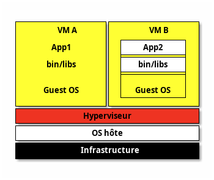
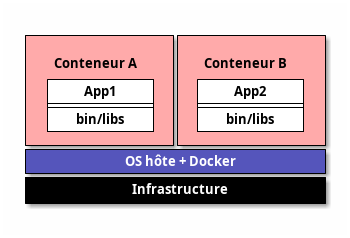
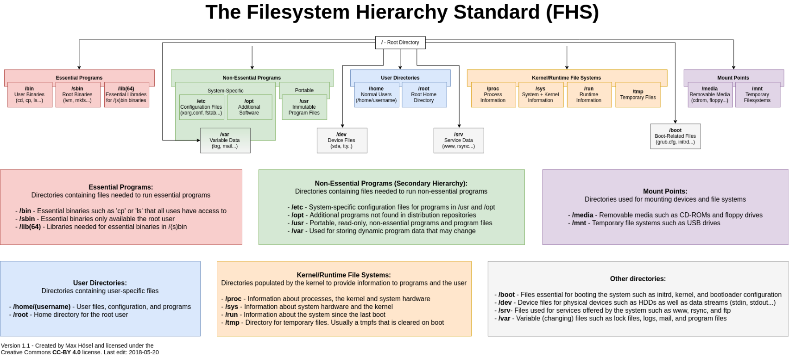

## Chapitres

---

# Objectifs

- Reconnaître le matériel : ports PCI / USB, paramétrage du BIOS / UEFI
- Savoir installer et configurer un système GNU/Linux sur un poste de type PC
- Savoir utiliser les niveaux d’exécution et cibles systemd du système
- Savoir installer et désinstaller les programmes sur les distributions des familles RedHat ou Debian, et gérer les bibliothèques partagées.
- Connaître les spécificités de Linux en tant que système virtualisé.
- Bien utiliser la ligne de commande Linux (Bash, vi)
- Gérer les disques, partitions et systèmes de fichiers courants
- Gestion des fichiers : permissions et propriétés, recherche et liens

---

# Ressources utiles

- [Support de cours](https://learning.lpi.org/fr/learning-materials/101-500/)
- [Support de cours (PDF)](https://learning.lpi.org/pdfstore/LPI-Learning-Material-101-500-en.pdf)
- [Objectifs détaillés de la certification LPIC-101](https://www.lpi.org/fr/our-certifications/exam-102-objectives)
- [Livre Bash beginner's guide](https://ftp.traduc.org/doc-vf/guides/Bash-Beginners-Guide/)
- Aide simple sur les commandes : <https://cheat.sh/>
- Explication graphique de commandes Shell complexes : <https://explainshell.com/>
- [Créer une distribution "Live" (qui reste en mémoire) - tuto complet, reprend les principes de base, du boot à un système minimal](https://zestedesavoir.com/tutoriels/268/creer-son-premier-rim-linux/)

---

## Conventions de notation

- Les commandes et noms de fichiers apparaissent dans le texte avec `cette syntaxe`.
- Les descriptions de commandes suivent le formalisme des _man pages_ :
  - Les symboles `<>` indiquent un argument obligatoire.
  - Les symboles `[]` indiquent un argument optionnel.  

---

# Plan de cours

## 1.1 - Sujet 101 : Architecture système [8]

- 101.1 Détermination et configuration des paramètres du matériel [2]
  - TP : affichage de la configuration du système et des périphériques
  - TP : gestion des modules noyau
- 101.2 Démarrage du système [3]
  - TP : Grub
  - TP : SysV init et systemd init
- 101.3 Changement de niveaux d'exécution / des cibles de démarrage de systemd et arrêt ou redémarrage du système. [3]

---

## 1.2 - Sujet 102 : Installation de Linux et gestion de paquetages [12]

- 102.1 Conception du schéma de partitionnement [2]
- 102.2 Installation d'un gestionnaire d'amorçage [2]
- 102.3 Gestion des bibliothèques partagées [1]
  - TP : librairies partagées
- 102.4 Utilisation du gestionnaire de paquetage Debian [3]
- 102.5 Utilisation des gestionnaires de paquetage RPM et YUM [3]
  - TP : Gestion de paquetages : rpm, yum et dnf vs dpkg et apt
- 102.6 Linux en tant que système virtuel hébergé [1]

---

## 1.3 - Sujet 103 : Commandes GNU et Unix [26]

- 103.1 Travail en ligne de commande [4]
  - TP : Utilisation de la ligne de commande
- 103.2 Traitement de flux de type texte avec des filtres [2]
  - TP : Traitement de flux de type texte avec filtres et expressions rationnelles
- 103.3 Gestion élémentaire des fichiers [4]
  - TP : Gestion des fichiers
- 103.4 Utilisation des flux, des pipes et des redirections [4]
  - TP : Utilisation des flux, des pipes et des redirections 

---

- 103.5 Création, contrôle et interruption des processus [4]
- 103.6 Modification des priorités des processus [2]
  - TP : Gestion des processus et de leur priorité
- 103.7 Recherche dans des fichiers texte avec les expressions rationnelles [3]
- 103.8 Édition de fichier simple [3]
  - TP : Introduction à vi

---

## 1.4 - Sujet 104 : Disques, systèmes de fichiers Linux, arborescence de fichiers standard (FHS) [14]

- 104.1 Création des partitions et des systèmes de fichiers [2]
- 104.2 Maintenance de l'intégrité des systèmes de fichiers [2]
- 104.3 Montage et démontage des systèmes de fichiers [3]
  - TP : Gestion des partitions et des systèmes de fichiers
- 104.4 Supprimé
- 104.5 Gestion des permissions et de la propriété sur les fichiers [3]
- 104.6 Création et modification des liens physiques et symboliques sur les fichiers [2]
- 104.7 Recherche de fichiers et placement des fichiers aux endroits adéquats [2]
  - TP : Gestion avancée de fichiers - permissions, liens, recherche

---
layout: section
---

# Chapitre 1. Architecture matérielle et gestion des périphériques

---

# 101.1 Détermination et configuration des paramètres du matériel

---

# Architecture PC de base

_Quels sont les composants principaux d'une architecture PC ?_

---

# Architecture PC de base

- Central Processing Unit (CPU)
- Random Access Memory (RAM) and Read-Only Memory (ROM)
- Basic Input/Output System (BIOS), ou UEFI (chap.2)
- Les bus
- Les disques

---


<!-- _class: legende -->
[_Linux kernel diagram : architecture haut niveau_](https://commons.wikimedia.org/wiki/File:Linux_kernel_diagram.svg)

---


<!-- _class: legende -->
[_Linux kernel map (pour info)_](https://commons.wikimedia.org/wiki/File:Linux_kernel_map.png)

---

# Gestion des périphériques

---

## Les bus

- [ISA (obsolète)](https://www.materiel-informatique.be/isa.php)
- [PIC (obsolète)](https://www.materiel-informatique.be/pci.php)
- [AGP (carte graphique)](https://www.materiel-informatique.be/agp.php)
- [PCI Express](https://www.materiel-informatique.be/pci-express.php)

---

## Allocation de ressources

- Communication par CPU : _Interrupt Request Number (IRQ 0-15)_ `/proc/interrupts`
- Transfert direct de données par RAM : _Direct Memory Access (DMA)_ `/proc/dma`
- Adresses Entrées/Sorties (I/O ports) pour lecture / écriture `/proc/ioports`

### Démo

---

## /proc et /sysfs

- `/proc` : système de fichiers virtuel en mémoire, gère l'état du système et les processus
  + `/proc/cpuinfo`, `/proc/<PID>/status`, ...
- `/sys` (ou `sysfs`) : gestion des périphériques & config du noyau

### Démo

---

## Userspace Dev (udev)

- Gère les fichiers de `/dev` pouvant être gérés sans droits d'administration (clé USB, ...)
- Gère les événements _userspace_ en cas d'ajout/suppression d'un périphérique matériel (clé USB, ...)
- `udevd`, `D-Bus`

---

## Commandes utiles

- `dmesg` : kernel ring buffer (messages du noyau)
- `lspci` (fichier `/proc/bus/pci`)
- `lsusb`
- `udevadm info`
  - `udevinfo -p /sys/class/net/eth0/ -a`
- `uname -a` : informations sur le système
- fichiers de logs : `/var/log/`
- Voir le TP dédié [tp-systeme][tp-systeme].

### Démo

---

# Modules Noyau (Kernel Modules)

Composants logiciels chargés et déchargés dynamiquement dans le noyau Linux

---

## Avantages

- Flexibilité : Possibilité d'ajouter/supprimer des fonctionnalités au noyau sans redémarrage.
- Sécurité : Permet de maintenir la taille du noyau initial plus petite.
- Maintenance : Facilite les mises à jour et la maintenance du noyau en isolant les changements.
- Gestion de dépendances

---

## Commandes utiles

- Chargement d'un module : `modprobe <nom_du_module>`
- Déchargement d'un module : `modprobe -r <nom_du_module>`
- Liste des modules chargés : `lsmod`
- Informations sur un module : `modinfo <nom_du_module>`
- Chargement au démarrage : `modprobe.conf` (ou `/etc/modprobe.d/`)
- Voir la partie sur les modules du TP [tp-systeme][tp-systeme].

---

# `/dev`

- Fichiers spéciaux (_fichiers de périphérique_) représentant les périphériques matériels et les ressources système.
- Facilite la communication avec les périphériques matériels et virtuels.
- Les programmes accèdent aux périphériques en lisant/écrivant dans les fichiers correspondants dans `/dev` :
  - **Périphériques de Caractères** : claviers, souris, terminaux
  - **Périphériques de Blocs** : disques durs, partitions

---

## Nomenclature

- Périphériques numérotés et nommés conventionnellement :
  - Disques IDE : `/dev/hda`, `/dev/hdb`, ...
  - SCSI et récents : `/dev/sda`, `/dev/sdb`, ...
  - `/dev/hda`, `/dev/hdb` : 1er disque dur, 2e disque dur.
  - `/dev/sdb1`, `/dev/hda3` : 1e partition du 2e disque, 3e partition du 1er disque.

### Démo

---

# 101.2 Démarrage du système

---

# `BIOS` (Basic Input/Output System) vs `UEFI` (Unified Extensible Firmware Interface)

Différents types de _firmwares_ (dans mémoire de la carte mère).

---

# BIOS (ancien)

1. `POST` (Power-on Self Test)
2. Le BIOS charge les composants principaux : clavier, disques, écran, ...
3. Le BIOS charge le `bootloader` (first stage) depuis le `Master Boot Record (MBR)` (partitionnement `DOS`)
4. Le `bootloader` charge le reste du programme (second stage)
5. Le `bootloader` charge le noyau (`kernel`)

---

# UEFI (récent)

1. `POST` (Power-on Self Test)
2. L'UEFI charge les composants principaux : clavier, disques, écran, ...
3. L'UEFI charge applications `EFI` (`bootloaders`, programmes de sélection d'OS, outils de diagnostic) depuis une partition `ESP` (EFI System Partition) dédiée (format `FAT12`, `FAT16`, `FAT32` ou `ISO-9660`).
  - UEFI comprend le partitionnement `GPT` (GUID Partition Table) (et `MBR` mais découragé)
4. Le `bootloader` charge le noyau (`kernel`)

---

# Secure Boot

`UEFI` supporte le `Secure Boot` pour charger uniquement des applications `EFI` autorisées par le constructeur.

---

# GRUB

- Grand Unified Bootloader (`GRUB`) est (de loin) le bootloader principal pour un PC Linux.
- Un bootloader charge le noyau en lui fournissant des paramètres : _init_, _runlevel_, partition _root_, ...
- Le noyau prend la main
- `/proc/cmdline` : paramètres fournis au noyau
- Voir le TP dédié [tp-grub][tp-grub].

---

# Démarrage

- Beaucoup de possibilités différentes : scripts, ...
- En principe :
  - `initramfs` : partition `root` temporaire en RAM
  - Montage des partitions décrites dans `/etc/fstab`
  - Démarrage du programme `init`
  - Démontage de l'`initramfs`

### Démo fstab

---

# Init

- Différents programmes `init` : `/bin/bash`, script dédié, ...
  + Presque toujours `SysV`, `systemd` (très majoritaire) ou `upstart`
  + D'autres existent : `OpenRC`, ...
- Une des différences majeures entre distributions !

---

## SysV

- Service init historique et très majoritaire avant `systemd`
- Démarre des daemons par `runlevel`

---

## systemd

- Manager de services modernes (2010) : parallélisme, démarrage par dépendances, ...
- Compatible `SysV` et `runlevels`
- Ultra majoritaire dans les serveurs
- Commandes dédiées : `systemctl`, `journalctl`
- Voir le TP dédié [tp-sysv-systemd][tp-sysv-systemd].

---

## Upstart (obsolète)

- Autre modernisation de `SysV` pour accélérer le démarrage (parallélisme).
- Popularisé par `Ubuntu` avant son abandon pour `systemd`.
- Voir le cours "101.3 Lesson 1" p.43 pour plus de détails, `Upstart` ne sera pas abordé en TP.

---

# 101.3 Changement de runlevels, arrêt et redémarrage.

---

# Runlevel (SysV init)

- Runlevel **0** : System shutdown.
- Runlevel **1**, **s** ou **single** : Single user mode, without network and other non-essential capabilities (maintenance mode).
- Runlevel (2), **3** or (4) : Multi-user mode (console).
- Runlevel **5** : Multi-user mode (graphique mais sinon idem 3).
- Runlevel **6** : System restart.
- Seuls **0, 1 et 6** sont communs à toute distribution.

---

# init

Le programme `/sbin/init` gère le `runlevel` :

- depuis les paramètres passés au noyau ;
- ou depuis le fichier `/etc/inittab`.

- `/etc/init.d` contient les scripts qui gèrent les runlevels
- `/etc/rc0.d`, `/etc/rc1.d`, … contiennent les scripts des runlevels correspondants

Voir le cours pour le format du fichier `/etc/inittab`, 101.3 Lesson 1 p.37

### Démo

---

# Résumé du boot - traditionnel vs moderne

- POST -> BIOS -> MBR (DOS) -> Grub -> Kernel -> Init -> Runlevel (SysV)
- POST -> UEFI -> EFI (GPT) -> direct ou Grub -> Kernel -> Init -> Runlevel (systemd) 

---
layout: section
---

# Chapitre 2. Installation de Linux et gestion de paquetages

---

# 102.1 Conception du schéma de partitionnement

---

# Architecture des disques

- Disque -> Partition -> Filesystem -> Mount point
- Montage dans n'importe quel répertoire vide mais par convention :
  - `/mnt` pour montages "classiques"
  - `/media` pour périphériques temporaires : clé USB, ...
    + distribution récente : `/media/USER_NAME/DISK_LABEL`

---


_GParted est un outil graphique permettant de voir les partitions d'un disque (source: Wikipedia)_

---

# LVM : Logical Volume Manager

- `Physical Volume PV` : disque physique (gère `RAID`, ...)
- `Volume Group VG` : pool de `PV`
- `Logical Volumes LVs` : découpage de `VG`
- Données gérées par unités (`extents`) : `PE` (`PV`) et `LE` (`LV`)
- les `LVs` peuvent être distribués sur plusieurs disques, gèrent chiffrement, ...
- `LV` accessible comme disque classique : `dev/VGNAME/LVNAME`

---

# Partitionnement

- Bonne pratique : **séparer le système en plusieurs partitions**
- `/` : partition `root`, obligatoire, système principal
- `/boot` : contient les données de boot : `kernel`, `bootloader`, ...
- `/boot/efi` : montage de la partition `ESP`.
- `/home` : fichiers personnels et configurations des utilisateurs
- `/var` : données variables (`/var/logs`, `/var/tmp`, `/var/cache`) ou fichiers changeant pendant l'exécution (`/var/www/html`, `/var/lib/mysql`, `/var/lib/docker`)
- `swap` pour augmenter la RAM en utilisant un disque (non monté)

### Démo

---

# 102.2 Installation d'un gestionnaire d'amorçage

Voir le TP [tp-grub][tp-grub] déjà réalisé.

---

# 102.3 Gestion des bibliothèques partagées

---

## Bibliothèque partagée

- `Shared Objects`
- _Ensemble de fonctions que les programmes peuvent réutiliser pour implémenter leurs fonctionnalités_.
- Liées au programme exécutable de manière :
  - **statique** : l'exécutable final contient les fonctions de la bibliothèque dans ses propres fichiers (`NOM_LIBRAIRIE.a` : `libpthread.a`)
  - **dynamique** (ou **partagée**) : bibliothèque chargée en mémoire RAM quand le programme aura besoin d'exécuter les fonctions qu'elle contient. (`NOM_LIBRAIRIE.so.VERSION` : `glibc.so.6`)
    + Windows : `DLL`

---

## Répertoires standards

- `/lib`
- `/lib32`
- `/lib64`
- `/usr/lib`
- `/usr/local/lib`

---

## Répertoires additionnels et cache

- `/etc/ld.so.conf` (ou `/etc/ld.so.conf.d/`) : indique les autres librairies à utiliser, puis...
- `ldconfig` : crée les liens symboliques vers les librairies et met à jour le cache...
- `/etc/ld.so.cache` : fichier de cache
- `LD_LIBRARY_PATH` : variable d'environnement supplémentaire pour scanner des répertoires de librairies (similaire à `$PATH`)

---

## Afficher les dépendances

- `ldd <executable>` : affiche les librairies dépendantes
- `ldd -u <executable>` : affiche les librairies dépendantes _unused_

---

- Voir le cours _102.3 Manage shared libraries_ p.87
- Voir aussi la [wikiversité][wiki-shared-lib]
- Voir le TP dédié [tp-shared-lib][tp-shared-lib].

---

# 102.4 Utilisation du gestionnaire de paquetage Debian
# 102.5 Utilisation des gestionnaires de paquetage RPM et YUM

---

# Gestionnaires de Paquets

Outils essentiels pour gérer l'installation, la mise à jour et la suppression de logiciels depuis une plateforme centrale vérifiée.

---

## Avantages

- Installation facile : Un simple commande installe le logiciel et ses dépendances.
- Mises à jour centralisées : Facilité de maintenir les logiciels à jour.
- Gestion des dépendances : Installation automatique des composants requis.
- Désinstallation propre : Suppression sans laisser de résidus.
- Sécurité :
  - Les paquets proviennent de sources fiables et vérifiées.
  - Mises à jour régulières pour corriger les vulnérabilités.

---

## Principaux gestionnaires de paquets

- APT (Advanced Package Tool) : Utilisé par Debian et dérivés (Ubuntu).
- RPM (Red Hat Package Manager) : Utilisé par Red Hat, Fedora, CentOS.
- Voir le TP dédié [tp-rpm-apt][tp-rpm-apt].

---

# 102.6 Linux en tant que système virtuel hébergé

---

## Technologies de Virtualisation : Hyperviseurs

- Hyperviseur de Type 1 : Exécuté directement sur le matériel, ex. `Xen`, `KVM`
- Hyperviseur de Type 2 : Exécuté au-dessus d'un système d'exploitation, ex. `KVM`, `Oracle VirtualBox`.
- Conteneurs : Isole des ressources grâce aux `cgroups`, ex. `Docker`, `LXC`, ...

---

## Architecture d'une machine virtuelle (fully-virtualized)



---

## Architecture d'un conteneur



---

## Commandes

- `virt-host-validate` : informations sur le support de la virtualisation par l'hyperviseur
- `virsh` : créer et gérer des machines virtuelles (KVM, …)

---

## Principaux types de disques virtuels

- `RAW` : la taille totale du disque virtuel est réquisitionnée à la création
- `COW` : quota de taille maximale, espace réquisitionné à l'usage

---

## UUID

- Besoin d'identifiants uniques de machines virtuelles : _d-bus machine id_
- `dbus-uuidgen --ensure`, `dbus-uuidgen --get`
- stocké dans `/var/lib/dbus/machine-id` (symlink `/etc/machine-id`)

---

## SSH [TCP 22]

- `ssh` (Secure SHell) : protocole de communication sécurisé :
  - Utilisé majoritairement pour ouvrir un shell sur un ordinateur distant Unix.
  - Indispensable pour les machines virtuelles

---

- Impose un échange de clés de chiffrement en début de connexion : tous les segments TCP sont authentifiés et chiffrés
- Compatible cryptographie asymétrique (RSA/DSA) avec clef privée/publique
- sshv2 fournit `scp` et `sftp` avec la même configuration

---

- `ssh-keygen` crée les clés SSH (public + privée) dans `~/.ssh`
- `ssh-copy-id -i <public_key> user@cloud_server` : copie la clé publique sur le serveur (dans `~user/.ssh/authorized_keys`)
- Les permissions des fichiers de clés doivent être :
  + `0600` pour la clé privée
  + `0644` pour la clé publique

---

## Cloud-init

- Génère des machines virtuelles ou conteneurs dans un environnement de Cloud
- Fichier de configuration `YAML`

---
layout: section
---

# Chapitre 3. Commandes GNU et Unix

---

Voir les rappels de cours sur les commandes de base d'un système Linux.

---

# 103.1 Travail en ligne de commande

- Échapper les caractères spéciaux avec `"` et `'`
- Wildcards `*`, `?`, `[a-zA-Z]`, `{toto,titi}`
- Voir le cours _Quoting to Escape Special Characters_, 103.1 Lesson 2 p.185
- Voir le cours _Types of Wildcards_, 103.3 Lesson 1 p.238
- Voir la page (FR) [wikiversité][wiki-filtres] pour un rappel des filtres.
- Voir le TP dédié [tp-ligne-commande][tp-ligne-commande].

---

# 103.2 Traitement de flux de type texte avec des filtres

Voir le TP dédié [tp-texte][tp-texte].

### Démo

---

# 103.3 Gestion élémentaire des fichiers

---

- Voir les rappels de cours sur les fichiers dans un système Linux.
- Voir la page (FR) [wikiversité][wiki-fichiers] pour un rappel sur la gestion des fichiers.

---

# Types de fichiers

- Fichier standard : majorité des fichiers : données, configurations, binaires, ...
- Répertoires : fichier spécial contenant d'autres fichiers
- Autres fichiers spéciaux (par exemple pour les entrées/sorties)

---

# Commandes utiles

- `touch`, `ls`
- `mkdir`, `rmdir`
- `cp`, `mv`, `rm`
- `find`, `file`
- `dd`, `tar`, `cpio`, `gzip`, `gunzip`, `bzip2`, `bunzip2`
- Voir le TP dédié [tp-fichiers][tp-fichiers].

### Démo

---

# 103.4 Utilisation des flux, des pipes et des redirections

---

Concepts fondamentaux dans les systèmes Unix/Linux, permettant de gérer efficacement les entrées/sorties des commandes et de manipuler les données dans le terminal.

- Voir rappels de cours sur les flux, les pipes et les redirections.
- Voir aussi la [wikiversité][wiki-redirections].

---

## Les Trois Flux Standard

Les commandes reçoivent et envoient des données via trois flux standard :

- Entrée standard (`stdin`) : Flux de données d'entrée provenant du clavier ou d'un fichier.
- Sortie standard (`stdout`) : Flux de données de sortie affichées à l'écran.
- Erreur standard (`stderr`) : Flux de messages d'erreur affichés à l'écran.

---

## Redirections

Les redirections permettent de gérer les flux standard :

- `>` : Redirige la sortie standard vers un fichier (`commande > fichier`).
- `2>` : Redirige la sortie d'erreur vers un fichier (`commande 2> fichier`).
- `>>` : Ajoute la sortie standard à la fin d'un fichier (`commande >> fichier`).
- `2>>` : Ajoute la sortie d'erreur à la fin d'un fichier (`commande 2>> fichier`).
- `<` : Redirige l'entrée standard depuis un fichier (`commande < fichier`).

### Démo

---

## Pipes

- Permettent de connecter la sortie d'une commande à l'entrée d'une autre :

```
commande1 | commande2
```

---

## Exemples

- `ls | grep keyword` : Recherche un mot clé dans la liste des fichiers.
- `cat fichier.txt | grep pattern` : Recherche un motif dans le contenu d'un fichier. (équivalent `grep pattern fichier.txt`)
- `ps aux | sort -nrk 3,3 | head` : Trie et affiche les processus avec la plus grande utilisation de CPU.
- `commande 2>&1` : Redirige la sortie d'erreur vers la sortie standard.
- Voir le TP dédié [tp-redirections][tp-redirections].

---

# 103.5 Création, contrôle et interruption des processus

---

Voir rappels de cours sur les processus.

---

# 103.6 Modification des priorités des processus

- priorité demandée par l'utilisateur : `nice` (-20 à 20)
  - champ `NI` de `ps`
- transformé par le scheduler en priorité effective (0 à 100)
  - champ `PRI` de `ps`

---

# Commandes utiles

- `ps` (`ps aux`), `top`, `pgrep`, `watch`
- `kill`, `pkill`, `killall`
- `nice`, `renice`
- fichiers `/proc/<PID>`

Voir cours _Process Monitoring_, 103.5 Lesson 1 p.295

### Démo

---

# Jobs

- Processus démarré interactivement dont l'exécution continue en arrière-plan
- `jobs`, `fg`, `bg`, `&`, `nohup`

Voir cours _Job Control_, 103.5 Lesson 1 p.290

### Démo

---

Voir le TP dédié [tp-process][tp-process].

---

# Multiplexers de terminal

- `tmux` (le plus utilisé)
- `screen`  
- d'autres existent (bien moins utilisés)
- gèrent des _sessions_ de terminal en mode client/serveur :
  - écran découpé pour tourner des commandes en parallèle
  - déconnexion et reconnexion sans perdre l'exécution des commandes
  - très utiles pour gérer un serveur

Voir cours _Features of Terminal Multiplexers_, 103.5 Lesson 2 p.318

---

# 103.7 Recherche dans des fichiers texte avec les expressions rationnelles

---

# Quelques caractères spéciaux

- `.` : n'importe quel caractère
- `^` : début de ligne
- `$` : fin de ligne
- `[ati]` : un caractère `a` ou `t` ou `i` 
- `[^ati]` : un caractère **sauf** `a`, `t`, `i`
- `[0-9]`, `[a-z]` : un chiffre entre `0` et `9`, un caractère entre `a` et `z`
- `?`, `*`, `+` : un caractère, 0 ou plusieurs caractères, au moins un caractère
- `\` : caractère d'échappement pour `.^$*[](){}|\` (ex: `\*` : caractère `*`)

---

- Voir cours "103.7 Lesson 1" sur les expressions régulières, p.361
- Voir la partie sur les expressions régulières du TP sur les flux de texte [tp-texte][tp-texte].
- Voir la [wikiversité][wiki-regex].

---

# Commandes utiles

- `grep`, `egrep`, `fgrep` : recherche avec regex simples, avec regex étendues (idem `grep -E`), sans regex
- `sed` : modifications de flux de texte

Voir cours "103.7 Lesson 2" sur `grep` et `sed` p.372

### Démo

---

# 103.8 Édition de fichier simple (vi)

---

# vi

- `vi` : éditeur de texte en mode console
- plusieurs _modes_ : `normal`, `insertion`, `command`
- édition de texte très efficace 
- POSIX
- successeurs : `vim`, `neovim`
- Voir cours 103.8 _Basic file editing_ p.390
- **Pour une introduction à `vi`, utiliser l'excellent tutoriel intégré : taper `vimtutor` dans un terminal.**

### Démo + grep

---
layout: section
---

# Chapitre 4. Disques, systèmes de fichiers Linux, arborescence de fichiers standard (FHS)

---

# 104.1 Création des partitions et des systèmes de fichiers

- Partition : morceau de disque physique
  - vu comme "disque" virtuel dans un OS.
  - Windows : `C:`, `D:`, ...
  - Linux : `/dev/hda1`, `/dev/sdb2`, ...
- Table de partition : stocke le schéma de partitionnement du disque

---

## Commandes

- `fdisk`, `gdisk` : gère le partitionnement
- `mkfs` : crée un filesystem (formatte une partition)
- Voir cours 104.1 _Create partitions and filesystems_ section _mkfs_ p.414
- Voir cours 104.1 _Create partitions and filesystems_ section _fdisk_ p.407 et _gdisk_ p.411
- Voir aussi la [wikiversité][wiki-partitions].
- Voir le TP dédié [tp-partitions][tp-partitions].

---

## MBR vs GPT

- `MBR` (_Master Boot Record_, _DOS_) : table de partition au début du disque.
  - disque < 2TB
  - <= 4 partitions primaires
- `GPT` (_GUID Partition Table_) : nouveau standard
  - en principe couplé à `UEFI`
  - beaucoup plus puissant : pas de limite de taille, de nombre de partitions, backups, ...

---

## ext2, ext3, ext4

- `ext2` est le système de fichiers historique sous Linux
  - `/boot` utilise encore souvent `ext2`
- amélioré avec `ext3` par la **journalisation**
- amélioré avec `ext4` (performance, ...)
- `ext3` et `ext4` sont aussi des filesystem `ext2` (mêmes commandes)

---

## btrfs

- ButterFS (`btrfs`) : alternative à `ext4` (Fedora, ...)
- supporte de nombreuses options similaires à `ZFS` (Oracle Solaris) :
  - `btrfs snapshot`
  - `btrfs subvolumes`
  - ...

---

## XFS

- Filesystem très performant optimisé gros fichiers, grandes partitions et CPU puissants (RedHat, ...)
- `xfs_repair`

---

## FAT / vFAT / exFAT

- `FAT` : Filesystem historique MS-DOS puis Windows
- extension `vFAT` : `FAT32`, ...
  - FAT32 : fichier <= 4GB
- `exFAT`
  - supporté dans presque tout OS.
  - très utilisé dans les supports externes (clé USB, ...)
  - grande taille de fichier possible

---

## swap

- Type de partition spéciale
- Déplace temporairement de la RAM sur disque pour augmenter virtuellement la RAM.

---

# 104.2 Maintenance de l'intégrité des systèmes de fichiers

- Voir cours _104.2 Maintain the integrity of filesystems_ p.439
- `du` : taille de fichiers
- `df` : espace libre partitions
- `fsck` : vérification de filesystem
- `tune2fs` : tuning d'un filesystem ext2
- Voir le TP dédié [tp-partitions][tp-partitions].

---

# 104.3 Montage et démontage des systèmes de fichiers

- Windows : disques `C:`, `D:`, ...
- Unix : une partition se **monte** dans un **répertoire** (vide) quelconque
- `mount` (lit le contenu de `/proc/mounts`), `umount`
- `lsof <point montage ou device>` : programmes ayant des I/O ouverts sur le filesystem
- `/etc/fstab` : filesystem à monter (avec les options)
  + préférer identifier les disques par `UUID`

---

- Voir cours _104.3 Control mounting and unmounting of filesystems_ p.461
- Voir le TP dédié [tp-partitions][tp-partitions].

---

## Monter les disques avec `systemd`

- `systemd` peut gérer les points de montage à l'init
- fichiers `*.mount` dans `/etc/systemd/system/` :
  - `mnt-donnees.mount` pour `/mnt/donnees`
- Voir cours _104.3 Control mounting and unmounting of filesystems_ section _systemd_ p.470

---

# 104.4 Supprimé

---

# 104.5 Gestion des permissions et de la propriété sur les fichiers

- Voir cours _104.5 Manage file permissions and ownership_ p.481

## Les utilisateurs

- Un fichier appartient à un utilisateur et à un groupe
- trois types d'utilisateurs ayant des droits :
  - `u` (pour `user`) : l'utilisateur auquel appartient le fichier/dossier
  - `g` (pour `group`) : le groupe auquel appartient le fichier/dossier
  - `o` (pour `other`) : les autres utilisateurs

---
 
## Les droits

- `r` (`read`) : lire le fichier/dossier
- `w` (`write`) : modifier le fichier/dossier
- `x` (`execute`) : exécuter le fichier / entrer dans le dossier
- `-` : aucun droit

---

## Affichage des droits

```
$ ls -l
drwxr-xrw- [...]
```

- `d` : type de fichier (dossier)
- `rwx` : droits de l'utilisateur (propriétaire)
- `r-x` : droits du groupe
- `rw-` : droits du reste du monde

---

## Modifier les droits

- `chmod u+x mon_fichier`
- `chmod g-r mon_fichier`
- `chmod o+w mon_fichier`
- `chmod a-x mon_fichier` (all)
- `chmod -R u-x mon_dossier` : récursif
- `chmod 660 mon_fichier` : `660` est l'octal correspondant au masque `rw- rw- ---`

---

| Permission                     | `ls -l` | octal |
|--------------------------------|---------|-------|
| aucun droit                    | `- - -` |   0   |
| exécution seulement            | `- - x` |   1   |
| écriture seulement             | `- w -` |   2   |
| écriture et execution          | `- w x` |   3   |
| lecture seulement              | `r - -` |   4   |
| lecture et exécution           | `r - x` |   5   |
| lecture et écriture            | `r w -` |   6   |
| lecture, écriture et exécution | `r w x` |   7   |

---

## Droits spéciaux

---

### SUID et SGID

- `SUID`, `SGID` (_Set User/Group ID_) : lance la commande avec l'`UID` de l'utilisateur / du groupe
  - Droit `+s` ou 1er bit à 1 (user) ou 2e bit à 1 (group)
  - `chmod u+s /bin/cat`, `chmod 4xxx /bin/cat`
  - `chmod g+s /bin/cat`, `chmod 2xxx /bin/cat`
- `SGID` sur répertoire : les fichiers et sous-répertoires créés dans ce répertoire hériteront du groupe propriétaire du répertoire parent (au lieu du groupe de l'utilisateur créant les fichiers).

---

### Sticky bit

- `Sticky bit` (dossier) : seul le propriétaire d'un fichier contenu dans ce dossier pourra le supprimer ou le renommer (`/tmp`, ...).
  - Droit `+t` ou 3e bit à 1
  - `chmod o+t /home/tom/communs` ou `chmod 1xxx /home/tom/communs`

---

## Lister les groupes

- `getent group` : tous les groupes du système
- `groups tom` : groupes de l'utilisateur `tom`
- `groupmems -g video -l` : utilisateurs du groupe `video`
- En local : fichier `/etc/group`

---

## Permissions par défaut

- `umask`, `umask -S`
- masque des permissions retirées par défaut
- 1 seul masque : fichier standard idem dossier mais droit d'exécution retiré

---

## Access Control List (ACL)

- Permissions `rwx` spécifiques par utilisateur / groupe
  - possibles pour tout utilisateur et/ou groupe
  - plus fines que le triplet _user_ / _group_ / _other_

---

```bash
# Lister ACL
getfacl <nom_fichier>
# Ajouter / Modifer (-m) ACL
# setfacl -m u:<utilisateur>:<permission> <fichier>
# setfacl -m g:<groupe>:<permission> <fichier>
setfacl -m g:group1:rw fichier_test.txt
# Supprimer un ACL
setfacl -x u:<utilisateur> <fichier>
# Supprimer tous les ACL
setfacl -b <fichier>
```

---

- Voir le TP dédié [tp-fichiers-avance][tp-fichiers-avance].

---

# 104.6 Création et modification des liens physiques et symboliques sur les fichiers 

---

## inode

- _Index node_ : structure de données qui stocke les attributs d'un fichier
- permissions, propriétaire, bloc disque de stockage, ...

---

## Liens symboliques

- Type spécial de fichier
- _Lien symbolique_ (ou lien faible, _soft link_) : pointe vers le chemin d'un autre fichier (_target_)
  + `ln -s TARGET NOM_DU_LIEN`
  + Si suppression de la target, pointe vers rien
- _Lien réel_ (_hard link_) : 2e référence vers le même fichier
  + toujours 1 seul inode
  + `ln TARGET NOM_DU_LIEN`

---

# 104.7 Recherche de fichiers et placement des fichiers aux endroits adéquats

---

## find

- Recherche récursive dans un répertoire des **chemins** de fichiers
- critères de recherche nom, type, date, taille utilisateur, ...
- pas de cache

---

## locate

- Interroge une BD des noms de fichiers (cache)
- `updatedb` met à jour le cache

---

## which

- Inverse du `$PATH` : retourne le chemin vers la commande
- `which <commande>` ou `which -a <commande>`

---

## type

- Similaire à `which`
- Ajoute le type de fichier
- `type [-a] [-t] <commande>`

---

## whereis

- Similaire à `which` mais ajoute les _man page_ et le code source
- `whereis [-b|m|s] <commande>` pour limiter la sortie au binaire / man page / source code

---

## Fichiers temporaires (FHS v3)

- `/tmp` : volatile
  + peut être effacé à l'arrêt du programme
  + (normalement) nettoyé au redémarrage
- `/var/tmp` : persistant
  + (normalement) conservé au redémarrage
- `/run` : données runtime (`pid`, ...)
  + précédemment `/var/run`

---

- Pour un rappel de la hierarchie standard des fichiers (FHS), voir le cours _104.7 Find system files and place files in the correct location_, p.524
- Voir le TP dédié [tp-fichiers-avance][tp-fichiers-avance].

---



<!-- Annexe : liste des TPs -->

[tp-ligne-commande]: tp-ligne-commande.md
[tp-systeme]: tp-systeme.md
[tp-grub]: tp-grub.md
[tp-shared-lib]: tp-shared-lib.md
[tp-sysv-systemd]: tp-sysv-systemd.md
[tp-rpm-apt]: tp-rpm-apt.md
[tp-texte]: tp-texte.md
[tp-fichiers]: tp-fichiers.md
[tp-redirections]: tp-redirections.md
[tp-process]: tp-process.md
[tp-fichiers-avance]: tp-fichiers-avance.md
[tp-partitions]: tp-partitions.md

<!-- Annexe: liste des liens utiles -->
[wiki-shared-lib]: https://fr.wikiversity.org/wiki/Certification_Linux_LPI/Administrateur_syst%C3%A8me_d%C3%A9butant/Examen_101/Installation_de_Linux_et_gestion_des_packages/G%C3%A9rer_les_biblioth%C3%A8ques_partag%C3%A9es
[wiki-partitions]: https://fr.wikiversity.org/wiki/Certification_Linux_LPI/Administrateur_syst%C3%A8me_d%C3%A9butant/Examen_101/P%C3%A9riph%C3%A9riques_et_syst%C3%A8mes_de_fichiers_Linux/Cr%C3%A9er_des_partitions_et_des_syst%C3%A8mes_de_fichiers
[wiki-filtres]: https://fr.wikiversity.org/wiki/Certification_Linux_LPI/Administrateur_syst%C3%A8me_d%C3%A9butant/Examen_101/GNU_et_commandes_Unix/Ex%C3%A9cution_de_flux_de_textes_en_utilisant_des_filtres
[wiki-fichiers]: https://fr.wikiversity.org/wiki/Certification_Linux_LPI/Administrateur_syst%C3%A8me_d%C3%A9butant/Examen_101/GNU_et_commandes_Unix/Gestion_de_base_des_fichiers
[wiki-redirections]: https://fr.wikiversity.org/wiki/Certification_Linux_LPI/Administrateur_syst%C3%A8me_d%C3%A9butant/Examen_101/GNU_et_commandes_Unix/Utiliser_les_streams,_pipes,_et_redirections
[wiki-regex]: https://fr.wikiversity.org/wiki/Certification_Linux_LPI/Administrateur_syst%C3%A8me_d%C3%A9butant/Examen_101/GNU_et_commandes_Unix/Expressions_r%C3%A9guli%C3%A8res

---

# Legal

- Linux est une marque déposée par Linus Torvalds aux États Unis et dans d'autres pays.
- Red Hat Linux et Red Hat Enterprise Linux sont des marques déposées par RedHat Inc.
- Mandriva® Linux® est une marque déposée par Mandriva Inc.
- SUSE™ (SUSE est une marque de SUSE LINUX Products GmbH, une filiale de Novell)
- UNIX® est une marque déposée de The Open Group. 
- Other names may be trademarks of their respective owners

