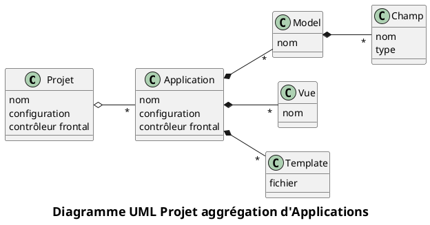
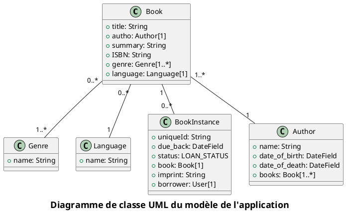
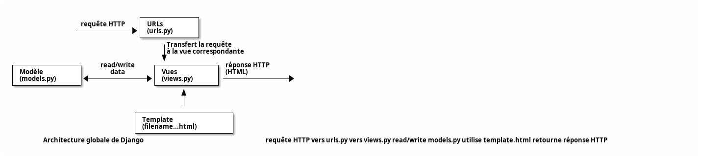
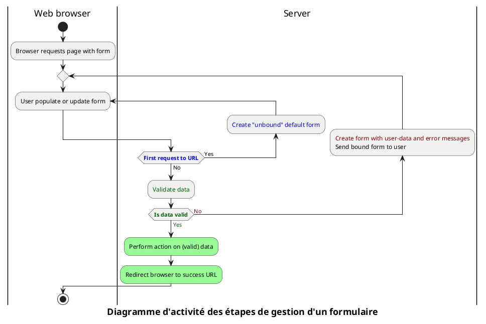

# Disclamer

:::warn
`Django` est un framework qui demande une certaine rigueur car les erreurs peuvent être délicates à tracer.

En cas d'erreur, attention à bien vérifier que le bon fichier a été modifié ou créé au bon endroit, etc...

Plutôt que d'essayer de "bidouiller" le code pour résoudre un problème, il est nécessaire également de prendre du recul et comprendre la manipulation à effectuer.
:::

:::warn
Le début de ce TP est très guidé et peut être réalisé rapidement sans essayer de comprendre ce qui est réalisé.
Or il est nécessaire de parfaitement maîtriser les premières étapes avant de passer à la suite pour bien comprendre les notions fondamentales du framework avant d'en étudier les subtilités.
:::

# Création de l'environnement

## Prérequis : Python

`Django` est un framework Python, il faut donc commencer par installer, si ce n'est déjà fait, Python sur le système.

Une version récente de Python est nécessaire.

## Virtualenv Python

`Django` est un framework Python conséquent, et il est possible d'avoir à installer de nombreuses autres dépendances dans notre projet.

Pour ne pas impacter le reste du système, il est recommandé d'installer Django dans un environnement indépendant du reste du système : c'est le principe des _virtual environments_.

Nous utiliserons donc un [venv](https://docs.python.org/fr/3/library/venv.html) dans ce TP.

Pour créer un environment virtuel sous Linux :

```sh
$ python -m venv chemin\vers\le\nouveau\repertoire\du\venv
```

Ou sous Windows :

```cmd
C:\>python -m venv C:\chemin\vers\le\nouveau\repertoire\du\venv
```

Cette commande crée une installation locale de Python dans le répertoire spécifié.

:::tip
Il faut ensuite, **dans chaque terminal ouvert par la suite pour notre projet**, activer cet environnement en sourçant la configuration (voir le [tableau ici](https://docs.python.org/fr/3/library/venv.html#how-venvs-work)).

Par exemple sous Linux / Mac :

```bash
$ source /path/to/new/virtual/environment/bin/activate
```

Ou sous Windows (`cmd`) :

```cmd
C:\> C:\path\to\myenv\Scripts\activate.bat
```

Ou sous Windows (`powershell`) :

```cmd
C:\> C:\path\to\myenv\Scripts\Activate.ps1
```

:::

:::link
- Il est aussi possible d'utiliser `VSCode` pour générer directement l'environnement virtuel : <https://code.visualstudio.com/docs/python/environments>

- Voir aussi ce lien pour intégrer finement Django à `VSCode` : <https://code.visualstudio.com/docs/python/tutorial-django>
:::

## Installation de Django

`Django` peut maintenant être installé dans l'environnement virtuel activé précédemment :

```sh
$ python -m pip install django
```

L'installation peut être vérifiée par la commande : 

```sh
$ python -m django --version
```

## Génération de l'environnement de développement

Utiliser la commande suivante pour générer le code de base d'un nouveau projet (remplacer `<mon_projet>` par le nom du projet):

```sh
python -m django startproject <mon_projet>
```

Cette commande crée un nouveau répertoire `mon_projet` (le **projet**) avec :

- un sous-répertoire `mon_projet` contenant les fichiers :
  + `settings.py` : paramètres du site web : configurations et variables globales et gestion des **applications** ;
  + `urls.py` : gestion des routes (en principe, redirection vers des applications gérant leurs propres routes) ;
  + `wsgi.py` : interface avec le serveur Web (interne).
- un script `manage.py` qui servira de version locale de `django-admin` pour ce projet. C'est donc ce script qui remplacera de préférence les commandes `django-admin` dans la suite.

:::warn
**Par la suite, toutes les commandes `python manage.py` sont à exécuter dans le répertoire de ce fichier !**
:::

## Démarrage du serveur Web de développement

Pour le développement (uniquement !) Django fournit un mini serveur Web qui embarque notre projet.

Celui-ci peut être lancé avec la commande :

```sh
python manage.py runserver
```

Exécuter cette commande - celle-ci tourne le serveur Web indéfiniment (la commande ne rend pas la main).

Pour vérifier le bon démarrage du serveur, aller sur la page Web indiquée dans les logs :

```
Starting development server at <http://127.0.0.1:8000/>
```

:::link
Il est possible de modifier les paramètres du serveur de développement (port d'écoute, ...) : voir la [page dédiée de la documentation officielle](https://docs.djangoproject.com/fr/4.2/ref/django-admin/#runserver).
:::

## Intégration dans l'IDE

Ouvrir le nouveau projet `Django` dans votre IDE - **attention à bien configurer votre IDE pour utiliser l'environnement virtuel configuré !**

- <https://www.jetbrains.com/help/pycharm/configuring-python-interpreter.html>
- <https://code.visualstudio.com/docs/python/environments>
- …

# Description du projet

Dans la suite du projet, nous allons utiliser `Django` pour développer le site Web d'une petite bibliothèque locale, c-a-d :

- Utiliser les outils de `Django` pour créer le squelette d'un site web et d'applications
- Démarrer et arrêter le serveur de développement.
- Créer les modèles de données utilisés par les applications.
- Utiliser les outils d'administration `Django` du site web pour y enregistrer et y peupler les données.
- Créer des vues pour exploiter en fonction de demandes particulières et restituer à l'aide de modèles les informations dans des documents HTML affichés par votre navigateur.
- Créer les chemins pour associer des URL avec des vues particulières.
- Ajouter et gérer les autorisations et le contrôle d'accès au site des utilisateurs.
- Manipuler les formulaires.
- Écrire des jeux de test pour votre application.
- Utiliser les moyens de sécurité de `Django`.
- Déployer en production vote application.

Pour rappel, un projet `Django` est un aggrégat d'applications réutilisables, elles-mêmes composées de _Modèles_, de _Vues_ et de _Templates_ :



Le projet contiendra une application unique servant la fonctionnalité de catalogue.

Ce sujet de TP est fortement inspiré du [tutoriel de Mozilla](https://developer.mozilla.org/fr/docs/Learn/Server-side/Django/Tutorial_local_library_website) by  [Mozilla Contributors](https://developer.mozilla.org/fr/docs/Learn/Server-side/Django/Tutorial_local_library_website/contributors.txt) sous license CC-BY-SA 2.5

Le modèle de notre application sera le suivant :



_Le diagramme de classes du modèle. Source et crédits : <https://github.com/mdn/django-locallibrary-tutorial>_


# L'application catalog

## Création d'une nouvelle application

Commençons par créer une nouvelle application dans notre projet pour la gestion du catalogue :

```sh
python manage.py startapp catalog
```

Cette commande crée un nouveau répertoire `catalog` contenant tous les fichiers et configurations spécifiques à notre application, par exemple :

- `apps.py` : configuration de l'application ;
- `urls.py` : gestion des routes spécifiques à l'application (non créé par défaut, sera utilisé par la suite) ;
- `models.py` : gestion du `data model` spécifique à l'application ;
- `views.py` : gestion des vues (frontend) spécifiques à l'application ;
- `templates` : répertoire contenant les template `HTML` des vues (non créé par défaut, sera utilisé par la suite) ;
- `admin.py` : crée une interface d'administration pour le `data model` de l'application ;
- `tests.py` : tests dédiés à l'application ;
- `migrations` : répertoire gérant les modifications de schémas pour la persistance des données (mise à jour de la base de données, ...).

## Enregistrement de l'application dans le projet

Une fois créée, l'application doit être enregistrée dans le projet du site Web (une application est un élément indépendant du projet et redistribuable).

Pour cela, on importe la classe définie dans le fichier `apps.py` (module `apps`) de notre application (module `catalog`) : `catalog.apps.CatalogConfig`.

Cette classe est à ajouter dans la liste `INSTALLED_APPS` du fichier `settings.py` du projet :

```python
INSTALLED_APPS = [
    'django.contrib.admin',
    'django.contrib.auth',
    'django.contrib.contenttypes',
    'django.contrib.sessions',
    'django.contrib.messages',
    'django.contrib.staticfiles',
    'catalog.apps.CatalogConfig',
]
```

# Branchement à la base de données

`Django` inclut un _Object-Relational Mapping_ (`ORM`) qui permet d'abstraire la base de données utilisée : le framework va gérer automatiquement pour nous la persistance des données.

Il est cependant recommandé de définir dès maintenant la base de données à utiliser et d'utiliser la même en développement et en production.

Pour les besoins de ce TP, la base de données `SQLite` configurée par défaut est suffisante, mais celle-ci peut être changée au besoin.

Cette configuration correspond à la ligne `DATABASES` du fichier `settings.py` :

```python
DATABASES = {
    'default': {
        'ENGINE': 'django.db.backends.sqlite3',
        'NAME': os.path.join(BASE_DIR, 'db.sqlite3'),
    }
}
```

:::link
Pour une liste des bases de données supportées et leur configuration, voir la [page dédiée de la documentation officielle](https://docs.djangoproject.com/fr/4.2/ref/databases/).
:::

# Routage des URLs

## Délégation à l'application

`Django` propose un mécanisme poussé et propre de gestion des URL de notre site Web :

- Le fichier `urls.py` du projet est le point d'entrée et permet de gérer toutes les URL du site…
- …mais on utilisera au maximum une délégation du routage dans chaque application créée par un fichier `urls.py` local à notre application.
- Le fichier principal `urls.py` du projet contient une documentation sur la manière de réaliser ces imports dans la variable `urlpatterns`.
- Pour l'instant, le fichier `urls.py` du projet contient une unique URL vers le module d'administration `admin.py`.

Dans le fichier `urls.py` du projet, ajouter une nouvelle délégation vers un nouveau fichier `urls.py` local à l'application `catalog` (donc un module `catalog.urls`):

```python
from django.urls import include

urlpatterns = [
    ...
    path('catalog/', include('catalog.urls')),
]
```

Ce routage délègue les URL <http://.../catalog/*> pour un traitement par le fichier `catalog/urls.py`.

Créer le fichier `catalog/urls.py` avec un template vide pour le moment :

```python
from django.urls import path
from . import views

urlpatterns = []
```

:::exo
Tester le démarrage du serveur de développement.
:::

## Redirection

L'application `catalog` étant notre seule application, on souhaite également que l'URL principale de notre site <http://.../> redirige automatiquement vers cette application.

On ajoute alors une redirection dans le fichier `urls.py` du projet pour rediriger l'URL principale `/` vers la sous-URL `/catalog/` :

```python
from django.views.generic import RedirectView
urlpatterns = [
    ...
    path('', RedirectView.as_view(url='/catalog/', permanent=True)),
]
```

## Fichiers statiques en développement

:::tip
Par défaut, `Django` ne gère pas les fichiers statiques : `CSS`, `JavaScript`, images, ...

Pour disposer de ces fichiers dans le serveur **de développement**, on peut utiliser l'instruction `static()` dans le fichier `urls.py` du projet :

```python
# Use static() to add url mapping to serve static files during development (only)
from django.conf import settings
from django.conf.urls.static import static

urlpatterns = [
    ...
] + static(settings.STATIC_URL, document_root=settings.STATIC_ROOT)
```
:::

:::warn
Cette méthode n'est à utiliser que pour le serveur de développement ! En production, on utilisera le serveur Web de déploiement pour charger ces fichiers : `Nginx`, ...
:::

:::exo
Tester le démarrage du serveur de développement et aller sur l'URL principale du site Web : <http://127.0.0.1:8000/>.
:::

Le serveur doit nous rediriger vers l'URL `/catalog/` puis une page d'erreur 404 doit apparaître, ce qui est normal car cette URL n'est pas encore gérée. Si la redirection n'a pas eu lieu ou si une autre erreur qu'un 404 apparaît, vérifier la configuration du routage.


_La redirection s'est bien effectuée vers l'URL `/catalog/` mais aucune route ne sait pour l'instant gérer cette URL._

# Modèle de données et persistence

## Introduction aux migrations

`Django` utilise un `ORM` (object-relational mapping) pour modéliser le schéma d'une base de données relationnelle (SGBD) directement en objets Python.

:::link
Voir le [cours sur la persistence des données Hibernate][site-perso] pour plus d'information sur les `ORM`.
:::

La persistance des données est une fonctionnalité complexe à maintenir, car le schéma de la base de données peut diverger assez rapidement du modèle de classes dans le projet.

Pour pallier à ce souci, `Django` utilise un mécanisme très poussé de synchronisation du schéma du SGBD par rapport aux changements effectués dans le modèle de classes dans le code.

Cette synchronisation s'appuie sur la génération de scripts `SQL` de migration qui seront exécutés contre le SGBD :

```sh
# prépare les scripts de migration (à relire et adapter si besoin)
python manage.py makemigrations

# effectue réellement la migration contre le SGBD
python manage.py migrate
```

:::warn
Chaque fois que vous ferez évoluer le modèle de données, vous devrez exécuter les commandes ci-dessus (elles seront traduites en structure dans la base de données que cela conduise à l'ajout ou au retrait d'objets ou d'attributs).
:::

Nous n'avons pas encore ajouté de modèle métier dans notre projet mais à la création du site `Django` a automatiquement ajouté plusieurs modèles de base pour pouvoir administrer celui-ci.

Pour disposer de ces modèles dans le SGBD, effectuer une première migration à l'aide des commandes décrites ci-dessus.

:::tip
Un avantage non négligeable de ce principe est la possibilité de stocker les scripts de migration dans le gestionnaire de versions (Git).

Cela permet de revoir et de gérer l'historique des changements dans le SGBD, et participe au principe d'_Infrastructure as Code_ très important en DevOps.
:::

:::link
Pour plus d'information sur les migrations `Django`, voir [la page dédiée de la documentation officielle](https://docs.djangoproject.com/fr/4.2/topics/migrations/).
:::

# Data model en Python

`Django` est un `ORM` qui permet de gérer automatiquement la persistance d'objets Python (appelés _modèles_) dans une base de données en utilisant un modèle générique.

Une classe d'objet héritée de `models` définit :

- une structure de données
- le type, la taille et la nature des champs de cette structure de données

En tant que développeur `Django`, il suffit donc de décrire le modèle de données par le biais d'objets appropriés et `Django` prend en charge les communications avec la base de données.

`Django` permet d'établir trois types de relation :

- `OneToOneField` : un seul objet en relation avec un autre ;
- `ForeignKey` : relation un à $n$ ;
- `ManyToManyField` : relation $n$ à $n$.

:::tip
Le champ `BookInstance:status` est une chaîne de caractères codée en dur : `LOAN_STATUS` car on suppose qu'il ne changera jamais.

On utilisera comme valeurs :

```python
 LOAN_STATUS = (
        ('m', 'Maintenance'),
        ('o', 'On loan'),
        ('a', 'Available'),
        ('r', 'Reserved'),
    )
```
:::

:::warn
Les objets à persister sont **toujours** définis dans le fichier `models.py` de chaque application et héritent de `django.db.models.Model`.
:::

## Exemple de data model

```python
from django.db import models

class MyModelName(models.Model):
    """Un exemple de data class héritant de la classe Model."""

    # Champs
    my_field_name = models.CharField(max_length=20, help_text='Entrer une valeur de test')

    # Metadata
    class Meta:
        ordering = ['-my_field_name']

    # Méthodes
    def get_absolute_url(self):
        """Retourne l'url permettant d'accéder à une instance de MyModelName."""
        return reverse('model-detail-view', args=[str(self.id)])

    def __str__(self):
        """Représentation de MyModelName (Admin site etc.)."""
        return self.my_field_name
```
## Types de champs

:::tip
Principaux type de champs :

- `CharField` : chaîne de caractères (argument `max_length` obligatoire) ;
- `TextField` : texte de longueur variable dans la base de données ;
- `IntegerField` : nombre entier ;
  + `AutoField` : clé primaire `IntegerField` qui s'auto-incrémente - créé automatiquement en l'absence de clé primaire (`id`).
- `DateField` et `DateTimeField` : date et heure :
  + `auto_now=True` : créé au moment de la sauvegarde ;
  + `auto_now_add=True` : créé avec la création de l'objet ;
  + `default` : valeur par défaut.
- `EmailField` ;
- `FileField` et `ImageField`.
:::

:::link
- Pour une liste des types de champs disponibles en Django, [voir la page dédiée de la documentation officielle](https://docs.djangoproject.com/fr/4.2/ref/models/fields/#field-types).
- Pour plus d'information sur les types énumérés, [voir la page dédiée de la documentation officielle](https://docs.djangoproject.com/fr/4.2/ref/models/fields/#enumeration-types).
:::

## Arguments des champs

:::tip
Principaux arguments des champs à persister :

- `help_text`: Étiquette du champ pour les formulaires `HTML` ;
- `verbose_name`: nom `UFN` pour l'affichage (sinon déduit du nom de la variable) ;
- `default`: valeur par défaut : valeur alphanumérique en base ou création directe d'un objet Python ;
- `null`: si `True` accepte `NULL` en base de données (ou une chaîne vide pour un `CharField`). Défaut : `False`.
- `blank`: si `True`, peut ne pas être saisi. Défaut : `False`.
- `choices`: liste de choix possible ;
- `primary_key`: si `True` le champ est une clé primaire.
:::

:::link
Pour une liste des arguments des champs, [voir la page dédiée de la documentation officielle](https://docs.djangoproject.com/fr/4.2/ref/models/fields/#field-options).
:::

## Metadata

La classe `Meta` permet d'ajouter des métadonnées au modèle.

:::tip
On utilise cette classe principalement pour :

```python
class Meta:

  # Ordonnancement : alphabétique, chronologique, ...
  # Le signe `-` inverse le classement.
  ordering = ['title', '-pubdate'] 

  verbose_name = 'BetterName' # UFN du modèle
```
:::

:::link
Pour une liste des métadonnées disponibles, [voir la page dédiée de la documentation officielle](https://docs.djangoproject.com/fr/4.2/ref/models/options/)
:::

## Méthodes des modèles

Un modèle peut posséder un ensemble de méthodes, gérées par `Django` ou des méthodes Python indépendantes.

:::warn
Chaque modèle de données devra a minima définir une implémentation de la méthode `__str__()` pour :

- permettre d'afficher un élément compréhensible qui représentera l'instance de la classe ;
- permettre à `Django` de manipuler l'objet en base de données.

En pratique, on utilisera généralement les champs principaux permettant d'identifier l'objet (souvent la/les clé(s) primaire(s)).
:::

## Créer et modifier des enregistrements

```python
# Créer un nouvel enregistrement en utilisant la méthode d'instanciation.
record = MyModelName(my_field_name="Instance #1")

# Accès au valeur des champs par le biais des attributs de classe Python.
print(record.id) # 1
print(record.my_field_name) # 'Instance #1'

# Sauvegarde de l'enregistrement en base de données.
record.save()

# Changer la valeur d'un champ et le sauvegarder en base.
record.my_field_name = "New Instance Name"
record.save()
```

:::link
Cette méthode est très pratique pour créer directement des enregistrements dans les fichiers de migration : voir <https://www.webforefront.com/django/setupinitialdatadjangomodels.html>
:::

## Rechercher des enregistrements

```python
all_books = Book.objects.all() # type QuerySet itérable

wild_books = Book.objects.filter(title__contains='wild')
number_wild_books = wild_books.count()
```

Pour rechercher un enregistrement avec des conditions sur un champ, on utilise la syntaxe : `nom_du_champ__filtre` (i.e. on ajoute `__` après le nom du champ puis le nom du filtre).

:::tip
Principaux filtres :

- `contains`
  + `icontains` : idem mais insensible à la casse
- `exact`
  + `iexact` : idem mais insensible à la casse
- `in` : dans l'ensemble
- `gt` : plus grand que
- `startswith`
:::

:::link
Pour une liste des paramètres de recherche, [voir la page dédiée de la documentation officielle](https://docs.djangoproject.com/fr/4.2/ref/models/querysets/#field-lookups)
:::

:::tip
Le double `__` est aussi utilisé pour parcourir le modèle UML, par exemple pour une relation 1 à 1 `Book` vers `Genre` ayant un champ `name` :

```python
books_containing_genre = Book.objects.filter(genre__name__icontains='fiction')
```
:::

## Data model de la bibliothèque

Utiliser le diagramme de classe UML du modèle pour définir et implémenter les classes d'objets Python à persister.

_On ordonnera les objets `BookInstance` par ordre chronologique des champs `due_back`_.

:::warn
Pour les relations entre data classes, on utilisera en premier paramètre :

- une chaîne de caractères si la classe destination n'a pas encore été définie en Python : `author = models.ForeignKey('Author', ...)` ;
- la référence vers la classe elle-même si celle-ci a déjà été définie : `author = models.ForeignKey(Author, ...)`.
:::

:::tip
Pour la relation `Book` <-> `Author`, on utilisera le paramètre `on_delete=models.SET_NULL` de la relation pour définir la valeur de ce champ en base de données si la destination de la relation est supprimée.
:::

:::tip
Pour la clé primaire de la classe `BookInstance`, on utilisera un `UUID` :

```python
import uuid

id = models.UUIDField(primary_key=True, default=uuid.uuid4, ...
```
:::

## Appliquer les modifications en base

Comme à chaque modification du data model, il faut synchroniser le modèle en base :

```python
python manage.py makemigrations
python manage.py migrate
```

# Site d'administration

`Django` offre nativement un sous-site entièrement automatisé d'administration du data model sous forme de vues `CRUD` (Create, Read, Update, Delete).

Ce site d'administration est très utile pour :

- Manipuler le data model pendant le développement pour tester l'application ;
- Corriger / surveiller le data model en production.

:::warn
Le site d'administration n'a pas vocation à être publié à l'utilisateur final - c'est une vue permettant de manipuler directement les données (et donc la base de données).

On privilégiera toujours une expérience utilisateur orientée métier (et non données...), d'où la nécessité de créer des vues différentes.
:::

## Utilisation dans l'application

Modifier le fichier `admin.py` de l'application `Catalog` pour enregistrer les data classes à gérer dans le site d'administration :

```python
from django.contrib import admin

from catalog.models import Author, Genre, Book, BookInstance

admin.site.register(Book)
admin.site.register(Author)
admin.site.register(Genre)
admin.site.register(BookInstance)
```

## Création du super-user

Pour utiliser le site d'administration, il est nécessaire de créer un super-utilisateur puis de relancer le serveur :

```python
python manage.py createsuperuser
python manage.py runserver
```

## Accès au site d'administration

Le site d'administration est accessible à l'URL `/admin` : <http://127.0.0.1:8000/admin/>

Utiliser le site d'administration pour créer des instances du data model.

## Utilisation de classes d'administration

Pour une configuration plus poussée des vues d'administration, il est possible d'utiliser des classes classes compagnes `..Admin`.

Ces classes permettent aussi d'enregistrer directement le modèle via un décorateur `@admin.register`.

Au lieu de l'instruction

```python
admin.site.register(Book)
```

On peut donc définir dans le fichier `admin.py` une classe compagne :

```python
@admin.register(Book)
class BookAdmin(admin.ModelAdmin):
    # Champs affichés dans la vue d'administration de listing
    list_display = ('title', 'author') 
    # Filtres sur les champs dans la vue d'administration de listing
    list_filter = ('title', 'author') 
    # Champs présents pour les vues création / édition d'administration.
	# 1 ligne par n-uplet (a, b, ...)
    fields = [('title', 'ISBN'), 'author', ... 
```

:::warn
Si l'on veut afficher une relation `ManyToManyField`, on ne peut pas afficher l'ensemble des valeurs directement - cela pourrait être coûteux en base de données et donc `Django` l'interdit par défaut.

Il faut pour cela ajouter une méthode réalisant cette opération, par exemple :

_fichier admin.py_

```python
@admin.register(Book)
class BookAdmin(admin.ModelAdmin):
    list_display = (..., 'display_genre') # Utilisation de la méthode display_genre
```

_fichier models.py_

```python
class Book:
[...]

    def display_genre(self):
        """Create a string for the Genre. This is required to display genre in Admin."""
        return ', '.join(genre.name for genre in self.genre.all()[:3])

    display_genre.short_description = 'Genre'
```
:::

### Utilisation des fieldsets

:::tip
Pour une gestion plus fine des vues d'administration, on peut utiliser les [`fieldsets`](https://docs.djangoproject.com/fr/4.2/ref/contrib/admin/#django.contrib.admin.ModelAdmin.fieldsets).
:::

### Data model associé

Pour utiliser un data model associé en même temps que le modèle courant, on peut utiliser un affichage vertical [`StackedInline`](https://docs.djangoproject.com/fr/4.2/ref/contrib/admin/#django.contrib.admin.StackedInline) ou horizontal [`TabularInline`](https://docs.djangoproject.com/fr/4.2/ref/contrib/admin/#django.contrib.admin.TabularInline).

```python
class BooksInstanceInline(admin.TabularInline):
    model = BookInstance

@admin.register(Book)
class BookAdmin(admin.ModelAdmin):
    list_display = ('title', 'author', 'display_genre')
    inlines = [BooksInstanceInline]
```

## Documentation du site d'administration

:::link
Pour plus de détails sur le site d'administration, [voir la page dédiée de la documentation officielle](https://docs.djangoproject.com/fr/4.2/ref/contrib/admin/).
:::

# Création du site de production - page d'accueil

:::warn
Cette section est importante - elle décrit la base du fonctionnement de `Django`.
:::

## Architecture globale



Le diagramme ci-dessus modélise l'architecture basique de `Django`.
Nous avons travaillé le modèle de données (à gauche du diagramme), nous allons désormais nous atteler à :

- Configurer le routage des URL pour associer les vues adaptées aux requêtes `HTTP` que le site devra traiter (y compris avec des informations encodées dans les URL) ;
- Créer les gabarits qui vont permettre de publier les données dans les vues ;
- Créer les pages `HTML`.

La liste des URL dont nous aurons besoin se résume à :

- `catalog/`
- `catalog/books/`
- `catalog/authors/`
- `catalog/book/<id>`
- `catalog/author/<id>`

:::tip
`Django` n'impose pas de format d'URL particulier : on pourrait aussi utiliser une URL du type `/catalog/book/?id=6`.

Attention à utiliser tout de même une URL lisible [comme recommandé par le W3C](https://www.w3.org/Provider/Style/URI).
:::

## URL

Pour commencer nous allons gérer toutes les URL `/catalog/...` dans notre application `Catalog` :

Fichier `urls.py` **du projet** :

```python
urlpatterns = [
  ...
  path('catalog/', include('catalog.urls')),
]
```

Ensuite, on ajoute une sous-route `/` depuis `/catalog/` vers la page d'accueil `index` de l'application `Catalog` :

Fichier `urls.py` **de l'application Catalog** :

```python
urlpatterns = [
    path('', views.index, name='index'),
]
```

:::tip
Le paramètre `name` permet de nommer une URL pour l'utiliser depuis un lien :

```html
<a href="">Home</a>
```

Ce code est équivalent au code ci-dessous mais est plus robuste en cas de changement d'URL :

```html
<a href="/catalog/">Home</a>
```
:::

## Vue

Une vue est une fonction qui traite une requête `HTTP` et renvoie une réponse `HTTP`.
Les vues sont définies dans le fichier `views.py` de l'application.

Exemple de vue pour la page d'accueil :

```python
from django.shortcuts import render

from catalog.models import Book, Author, BookInstance, Genre

def index(request):
    """View function for home page of site."""

    # Generate counts of some of the main objects
    num_books = Book.objects.all().count()
    num_instances = BookInstance.objects.all().count()

    # Available books (status = 'a')
    num_instances_available = BookInstance.objects.filter(status__exact='a').count()

    # The 'all()' is implied by default.
    num_authors = Author.objects.count()

    context = {
        'num_books': num_books,
        'num_instances': num_instances,
        'num_instances_available': num_instances_available,
        'num_authors': num_authors,
    }

    # Render the HTML template index.html with the data in the context variable
    return render(request, 'index.html', context=context)
```

## Template

Un template est un fichier qui décrit la mise d'une page HTML et qui utilise des emplacements réservés pour y insérer des informations (répertoire `templates` de l'application).

Dans la vue `index`, on a réalisé un appel à `index.html` : il s'agit donc du fichier `catalog/templates/index.html`.

Lorsque l'on définit un template, il faut définir une base de template à utiliser (balise `extends`) puis les sections qui seront modifiées en utilisant les balises `block`/`endblock`.

Créer un nouveau fichier `base_generic.html` dans le dossier `catalog/templates/` et copier le texte ci-dessous pour créer le template de base de notre application :

```html
<!DOCTYPE html>
<html lang="en">
<head>
  <title>Bibliothèque locale</title>
  <meta charset="utf-8">
  <meta name="viewport" content="width=device-width, initial-scale=1">
  <link rel="stylesheet"
        href="https://stackpath.bootstrapcdn.com/bootstrap/4.1.3/css/bootstrap.min.css"
        integrity="sha384-MCw98/SFnGE8fJT3GXwEOngsV7Zt27NXFoaoApmYm81iuXoPkFOJwJ8ERdknLPMO"
        crossorigin="anonymous"
  >
  <!-- Add additional CSS in static file -->
  
  <link rel="stylesheet" href="">
</head>
<body>
  <div class="container-fluid">
    <div class="row">
      <div class="col-sm-2">
          
           <ul class="sidebar-nav">
               <li><a href="">Home</a></li>
               <li><a href="">Tous les livres</a></li>
               <li><a href="">Tous les auteurs</a></li>
           </ul>
          
      </div>
         <div class="col-sm-10 ">
             
             
         </div>
    </div>
  </div>
</body>
</html>
```

Ce template fait appel à une feuille de style (ligne 10) locale pour ajouter ou adapter des styles.

Créer le fichier `styles.css` dans le répertoire `catalog/static/css/` et copier le contenu ci-dessous :

```css
.sidebar-nav {
    margin-top: 20px;
    padding: 0;
    list-style: none;
}
```

### Page d'accueil

Créer le fichier `index.html` dans le dossier `catalog/templates/` et copier le code ci-dessous.
Ce code étend le template de base sur la première ligne et remplace le bloc par défaut `content`.

On remarque que les variables sont déclarées entre doubles accolades : `{{ num_books }}` (voir l'attribut `context` de la méthode `render()` de la vue).

```html



  <h1>Accueil de la bibliothèque locale</h1>
  <h2>Contenu dynamique</h2>
  <p>La bibliothèque dispose des enregistrements suivants:</p>
  <ul>
    <li><strong>Livres:</strong> {{ num_books }}</li>
    <li><strong>Copies:</strong> {{ num_instances }}</li>
    <li><strong>Copies disponibles:</strong> {{ num_instances_available }}</li>
    <li><strong>Auteurs:</strong> {{ num_authors }}</li>
  </ul>

```

:::exo
Tester l'affichage de la page d'accueil du site.
:::

:::tip
La recherche des template est configurée par la variable `TEMPLATES` du fichier `settings.py` du projet.
:::

### Documentation sur les templates

:::link
Pour plus de détails sur les template, [voir la page dédiée de la documentation officielle](https://docs.djangoproject.com/fr/4.2/topics/templates/).
:::

# Vues génériques

Un des nombreux atouts de `Django` est sa capacité à générer du code "standard", par exemple pour créer des vues de listes.

## Liste de livres

Dans `catalog/urls.py`, ajouter une ligne :

```python
urlpatterns = [
    ...
    path('books/', views.BookListView.as_view(), name='books'),
]
```

Dans `catalog/views.py`, ajouter les lignes :

```python
from django.views import generic

class BookListView(generic.ListView):
    model = Book
```

Il est possible d'ajouter /redéfinir beaucoup plus de contexte :

```python
from django.views import generic

class BookListView(generic.ListView):
    model = Book

	''' tout le reste ci-dessous est optionnel '''

    # pagination : /catalog/books/?page=2
    paginate_by = 10

    # nom de la variable dans le template - par défaut book_list
	context_object_name = 'my_book_list'

    # redéfinit la liste à afficher - par défaut tous les objets
    queryset = Book.objects.filter(title__icontains='war')[:5]

    # par défaut catalog/book_list.html
    template_name = 'books/my_arbitrary_template_name_list.html'

    def get_queryset(self): # idem queryset = ...
        return Book.objects.filter(title__icontains='war')[:5] 

    def get_context_data(self, **kwargs): 
        ''' ajoute des variables au template (ici : {{ some_data }}) '''

        # Call the base implementation first to get the context
        context = super(BookListView, self).get_context_data(**kwargs)

        # Create any data and add it to the context
        context['some_data'] = 'This is just some data'

        return context
```

Créer le template de la vue : `catalog/templates/catalog/book_list.html` :

```html



  <h1>Book List</h1>
  
  <ul>
    
      <li>
        <a href="{{ book.get_absolute_url }}">{{ book.title }}</a> ({{book.author}})
      </li>
    
  </ul>
  
    <p>Pas de livre dans la librairie.</p>
  

```

:::warn
Ce chemin étrange vers le lieu du template n'est pas une faute de frappe : les vues génériques cherchent les template dans `/application_name/the_model_name_list.html` (`catalog/book_list.html` dans ce cas) à l'intérieur du répertoire `/application_name/templates/` (`/catalog/templates/`).
:::

:::tip
Le template utilise des branchements conditionnels `if`, ...

Pour une liste des balises et filtres disponibles, [voir la page dédiée de la documentation officielle](https://docs.djangoproject.com/fr/4.2/ref/templates/builtins/).
:::

Mettre à jour le template de base `base_generic.html` avec la nouvelle URL :

```html
<li><a href="">Home</a></li>
<li><a href="">All books</a></li>
<li><a href="">All authors</a></li>
```

## Détails d'un livre

Ajoutons maintenant une URL vers les détails d'un livre :

```python
urlpatterns = [
    # Passe à la vue la variable entière `pk`
    path('book/<int:pk>', views.BookDetailView.as_view(), name='book-detail'),
]
```

:::tip
Il est également possible de définir des URL utilisant des expressions régulières pour un usage avancé - voir par exemple [ce lien](https://developer.mozilla.org/fr/docs/Learn/Server-side/Django/Generic_views#mappage_durl_2).
:::

Créons la vue associée :

```python
class BookDetailView(generic.DetailView):
    model = Book
    # renvoie aussi une vue 404 propre en cas d'erreur
```

Et le template :

```html



  <h1>Title: {{ book.title }}</h1>

  <p><strong>Author:</strong> <a href="">{{ book.author }}</a></p>
  <p><strong>Summary:</strong> {{ book.summary }}</p>
  <p><strong>ISBN:</strong> {{ book.isbn }}</p>
  <p><strong>Language:</strong> {{ book.language }}</p>
  <p><strong>Genre:</strong> {{ book.genre.all|join:", " }}</p>

  <div style="margin-left:20px;margin-top:20px">
    <h4>Copies</h4>

    
      <hr>
      <p class="
      text-success
      text-danger
      text-warning
      
      ">
        {{ copy.get_status_display }}
      </p>
      
        <p><strong>Due to be returned:</strong> {{ copy.due_back }}</p>
      
      <p><strong>Imprint:</strong> {{ copy.imprint }}</p>
      <p class="text-muted"><strong>Id:</strong> {{ copy.id }}</p>
    
  </div>

```

:::tip
Le lien vers l'auteur dans le template ci-dessus est vide, parce que nous n'avons pas encore crée de page détail pour un auteur. Une fois que cette page sera créée, vous pourrez remplacer l'URL par ceci :

```html
<a href="">{{ book.author }}</a>
```
:::

:::exo
Tester l'application !
:::

## Pagination

1. Ajouter la pagination dans la vue des livres.
2. Modifier le template de base `base_generic.html` pour ajouter la pagination dans toutes les pages si besoin :

```html


  
    
        <div class="pagination">
            <span class="page-links">
                
                    <a href="{{ request.path }}?page={{ page_obj.previous_page_number }}">previous</a>
                
                <span class="page-current">
                    Page {{ page_obj.number }} of {{ page_obj.paginator.num_pages }}.
                </span>
                
                    <a href="{{ request.path }}?page={{ page_obj.next_page_number }}">next</a>
                
            </span>
        </div>
    
  
```

:::exo
Tester la pagination
:::

:::link
Pour plus d'information sur la pagination, [voir la page dédiée de la documentation officielle](https://docs.djangoproject.com/fr/4.2/topics/pagination/#paginator-objects).
:::

## Vues manquantes

Créer les vues :

- `catalog/authors/`
- `catalog/author/<id>`

:::exo
Tester l'application - l'application de la bibliothèque est terminée !
:::

## Documentation sur les vues génériques

:::link
Pour plus d'information sur les vues génériques, [voir la page dédiée de la documentation officielle](https://docs.djangoproject.com/fr/4.2/topics/class-based-views/generic-display/).
:::

# Formulaires

## Les étapes de gestion d'un formulaire



_Les étapes de gestion de requêtes de formulaires en `Django`. (Source et crédits : [developer.mozilla.org](https://developer.mozilla.org/en-US/docs/Learn/Server-side/Django/Forms/form_handling_-_standard.png) )_

Nous allons créer un formulaire de renouvellement d'emprunt d'un livre et y ajouter des conditions de validation.

## Classe `Form` et validation des données

En `Django`, les formulaires sont gérés principalement par la classe `Form` à la syntaxe très semblable à celle d'un `Model`.

Il existe [de nombreuses manières](https://docs.djangoproject.com/fr/4.2/ref/forms/validation/) de vérifier les données mais le plus simple est de redéfinir la méthode `clean_<nom_du_champ>` qui permet de nettoyer des données avant de les passer au backend.

Créer le fichier `catalog/forms.py` et ajouter le code suivant :

```python
from django import forms

class RenewBookForm(forms.Form):
  renewal_date = forms.DateField(help_text="Enter a date between now and 4 weeks (default 3).")

  def clean_renewal_date(self):
    
	# Récupération des données du formulaire
    data = self.cleaned_data['renewal_date']

    # Vérifier que la date ne se situe pas dans le passé.
    if data < datetime.date.today():
      raise ValidationError(_('Invalid date - renewal in past'))

    # Vérifier que la date tombe dans le bon intervalle (entre maintenant et dans 4 semaines).
    if data > datetime.date.today() + datetime.timedelta(weeks=4):
      raise ValidationError(_('Invalid date - renewal more than 4 weeks ahead'))

    # N'oubliez pas de toujours renvoyer les données nettoyées.
    return data
```

Ajouter ensuite l'URL :

```python
urlpatterns = [
  ...
  path('book/<uuid:pk>/renew/', views.renew_book_librarian, name='renew-book-librarian'),
]
```

## Classe ModelForm

La classe `Form` permet de définir très finement un formulaire. Si le formulaire est très standard et qu'il y a beaucoup de champs à utiliser, cela peut cependant devenir fastidieux et il est préférable d'utiliser un formulaire générique grâce à la classe `ModelForm` :

```python
from django.forms import ModelForm

from catalog.models import BookInstance

class RenewBookModelForm(ModelForm):
  def clean_due_back(self):
    # idem mais avec `due_back` au lieu de `renewal_date`
	# car on utilise directement le champ de `BookInstance`.
	...

  class Meta:
    model = BookInstance
    fields = ['due_back']

	''' optionel '''
    labels = {'due_back': _('New renewal date')}
    help_texts = {'due_back': _('Enter a date between now and 4 weeks (default 3).')}
```

## Vue

Comme le montre le diagramme de gestion des formulaires, la vue doit retourner le formulaire par défaut s'il est appelé pour la première fois, et ensuite soit le retourner à nouveau avec les messages d'erreur si les données sont invalides, soit gérer les données et rediriger vers une nouvelle page si elles sont valides.
Pour effectuer ces différentes actions, la vue doit être en mesure de savoir si elle est appelée pour la première fois (et retourner le formulaire par défaut) ou pour la deuxième fois ou plus (et valider les données).

```python
import datetime

from django.shortcuts import get_object_or_404
from django.http import HttpResponseRedirect
from django.urls import reverse

from catalog.forms import RenewBookForm

def renew_book_librarian(request, pk):
  """View function for renewing a specific BookInstance by librarian."""
  book_instance = get_object_or_404(BookInstance, pk=pk)

  # S'il s'agit d'une requête POST, traiter les données du formulaire.
  if request.method == 'POST':

    # Créer une instance de formulaire et la peupler
	# avec des données récupérées dans la requête (liaison) :
    form = RenewBookForm(request.POST)

    # Vérifier que le formulaire est valide :
    if form.is_valid():
      # Traiter les données dans form.cleaned_data tel que requis
	  # (ici on les écrit dans le champ de modèle due_back) :
      book_instance.due_back = form.cleaned_data['renewal_date']
      book_instance.save()

      # Rediriger vers une nouvelle URL :
      return HttpResponseRedirect(reverse('all-borrowed'))

  # S'il s'agit d'une requête GET (ou toute autre méthode), créer le formulaire par défaut.
  else:
    proposed_renewal_date = datetime.date.today() + datetime.timedelta(weeks=3)
    form = RenewBookForm(initial={'renewal_date': proposed_renewal_date})
  
  context = {
    'form': form,
    'book_instance': book_instance,
  }

  return render(request, 'catalog/book_renew_librarian.html', context)
```

## Template

Ajouter le template associé :

```html



  <h1>Renew: {{ book_instance.book.title }}</h1>
  <p>Borrower: {{ book_instance.borrower }}</p>
  <p  class="text-danger">
    Due date: {{ book_instance.due_back }}</p>

  <form action="" method="post">
    
    <table>
    {{ form.as_table }}
    </table>
    <input type="submit" value="Submit">
  </form>

```

:::tip
Notons l'ajout d'un token [`CSRF`](https://en.wikipedia.org/wiki/Cross-site_request_forgery) (prononcer "sea-surf") permettant d'éviter le _Cross Site Request Forgery_ afin de protéger notre application.
:::

## CRUD générique

Il est possible de limiter considérablement le code à écrire lorsque les vues CRUD sont génériques :

```python
from django.views.generic.edit import CreateView, UpdateView, DeleteView
from django.urls import reverse_lazy

from catalog.models import Author

class AuthorCreate(CreateView):
  model = Author
  fields = ['first_name', 'last_name', 'date_of_birth', 'date_of_death']
  initial = {'date_of_death': '11/06/2020'}

class AuthorUpdate(UpdateView):
  model = Author
  fields = '__all__' # Non recommandé (pb sécurité si ajout d'autres champs)

class AuthorDelete(DeleteView):
  model = Author
  success_url = reverse_lazy('authors')
```

Les vues `Créer` et `Modifier` utilisent le même template : `model_name_form.html` et la vue `Supprimer` utilise le template `model_name_confirm_delete.html`

Créer le premier template `catalog/templates/catalog/author_form.html` :

```html



  <form action="" method="post">
    
    <table>
    {{ form.as_table }}
    </table>
    <input type="submit" value="Submit">
  </form>

```

Et le second `catalog/templates/catalog/author_confirm_delete.html` :

```html




<h1>Delete Author</h1>

<p>Are you sure you want to delete the author: {{ author }}?</p>

<form action="" method="POST">
  
  <input type="submit" value="Yes, delete.">
</form>


```

Ajouter les URL :

```python
urlpatterns = [
    ...
    path('author/create/', views.AuthorCreate.as_view(), name='author-create'),
    path('author/<int:pk>/update/', views.AuthorUpdate.as_view(), name='author-update'),
    path('author/<int:pk>/delete/', views.AuthorDelete.as_view(), name='author-delete'),
]
```

## Documentation sur les formulaires

:::link
Pour plus d'information sur les champs de formulaires, [voir la page dédiée de la documentation officielle](https://docs.djangoproject.com/fr/4.2/ref/forms/fields/).
:::

# Gestion des sessions

## Qu'est-ce qu'une session ?

Une application Web utilise un modèle client-serveur entre le navigateur du client et le serveur Web au-dessus d'`HTTP(s)`, or `HTTP` est sans état. Les messages sont totalement indépendants, sans notion d'ordre. Pour avoir une vraie expérience utilisateur unique pour chaque client, il faut donc gérer de l'état soi-même.

Les applications Web utilisent généralement un mécanisme de _sessions_ pour cela : l'état spécifique à l'utilisateur est stocké côté serveur et un identifiant de session côté client (dans un `Cookie`) pour pouvoir récupérer le bon état.

## Activation

`Django` permet de gérer les sessions grâce à une application dédiée : `django.contrib.sessions`. Cette application fournit un middleware (normalement déjà activé par défaut) : `django.contrib.sessions.middleware.SessionMiddleware` dans le fichier `settings.py`

## Utilisation dans les vues

`Django` permet très facilement de récupérer un objet `session` dans le paramètre `request` d'une vue. Cet objet fonctionne comme un dictionnaire : il stocke et récupère les données spécifiques à l'utilisateur courant (`Django` se charge de gérer la sauvegarde et mise à jour de la session).

```python
# Récupère la donnée de la clé 'my_car' (KeyError si la clé n'existe pas).
my_car = request.session['my_car']

# Idem mais retourne 'mini' par défaut si la clé n'existe pas.
my_car = request.session.get('my_car', 'mini')

# Associe la valeur 'mini' à la clé 'my_car'.
request.session['my_car'] = 'mini'

# Suppression de la donnée associée à 'my_car'
del request.session['my_car']
```

:::tip
`Django` notifie automatiquement d'un changement d'assignation dans la session : `request.session['my_car'] = ...`.
Cependant il ne peut détecter un changement à l'intérieur de la donnée stockée elle-même, par exemple : `request.session['my_car']['roues'] = 'aluminium'`.

Cela vient du fait que ces 2 codes sont équivalents : on voit bien que `mes_roues` n'a plus de lien direct avec `request.session` lorsqu'il est modifié.

```python
request.session['my_car']['roues'] = 'aluminium'
mes_roues = request.session['my_car']['roues']
mes_roues = 'aluminium'
```

Il faut dans ce cas forcer la mise à jour de la session :

```python
request.session['my_car']['roues'] = 'aluminium'
request.session.modified = True
```
:::

## Documentation

:::link
Pour plus d'information sur les sessions, [voir la page dédiée de la documentation officielle](https://docs.djangoproject.com/fr/4.2/topics/http/sessions/)

Voir aussi la [page de tutoriel dédiée](https://developer.mozilla.org/en-US/docs/Learn/Server-side/Django/Sessions#simple_example_%E2%80%94_getting_visit_counts)
:::

# Gestion des comptes utilisateurs

Pour gérer les comptes utilisateurs on pourra se référer au tutoriel suivant :

- <https://developer.mozilla.org/en-US/docs/Learn/Server-side/Django/Authentication>

# Tests

:::link
Pour apprendre à tester une application `Django`, [suivre le tutoriel developer.mozilla.org](https://developer.mozilla.org/fr/docs/Learn/Server-side/Django/Testing).
:::

# Aspects opérationnels (bonus)

## Déploiement en production

:::link
- Pour apprendre à configurer une application `Django` pour la production et comment la déployer, [suivre le tutoriel developer.mozilla.org](https://developer.mozilla.org/en-US/docs/Learn/Server-side/Django/Deployment).
- Voir aussi le tutoriel : <https://zestedesavoir.com/tutoriels/2213/deployer-une-application-django-en-production/>
:::

## Gestion du cache

:::link
- Pour apprendre à gérer le cache, voir le tutoriel : <https://zestedesavoir.com/tutoriels/1295/mise-en-cache-intelligente-avec-django/>
:::

# Legal

- © 2025 Tom Avenel under CC  BY-SA 4.0
- Git and the Git logo are either registered trademarks or trademarks of Software Freedom Conservancy, Inc., corporate home of the Git Project, in the United States and/or other countries
- Oracle and MySQL are registered trademarks of Oracle and/or its affiliates.
- "Python" is a registered trademark of the PSF. The Python logos (in several variants) are use trademarks of the PSF as well. ®
- Django is a registered trademark of the Django Software Foundation. 
- PyCharm is a trademark or registered trademark of JetBrains, s.r.o.
- SQLite is in the [Public Domain](https://www.sqlite.org/copyright.html)
- Ce sujet de TP est fortement inspiré du [tutoriel de Mozilla](https://developer.mozilla.org/fr/docs/Learn/Server-side/Django/Tutorial_local_library_website) by  [Mozilla Contributors](https://developer.mozilla.org/fr/docs/Learn/Server-side/Django/Tutorial_local_library_website/contributors.txt) sous license CC-BY-SA 2.5

[site-perso]:https://www.avenel.pro/cours.html/
