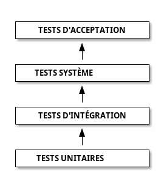
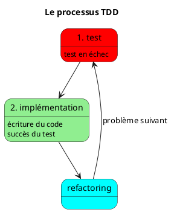
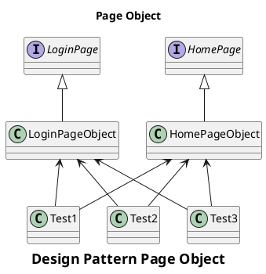
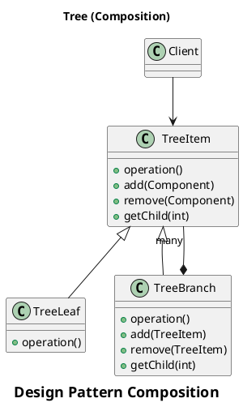
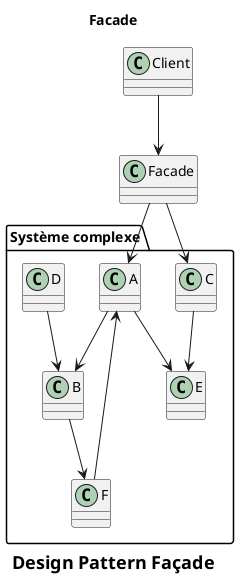
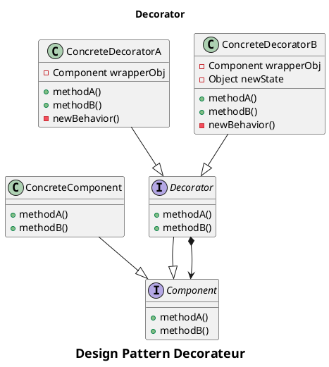
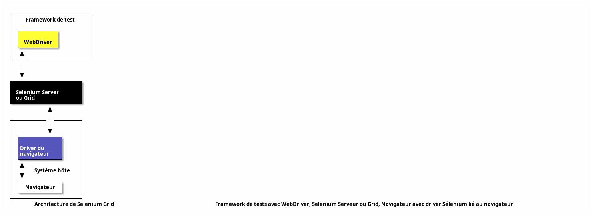

## Chapitres

---

<!-- TODO: intro -->

<!-- _class: chapter -->
# Introduction aux tests logiciels

---

# Pourquoi tester le logiciel ?

- Les sondes perdues (Mars Climate Orbiter, Mars Pathfinder)
- Les missiles Patriotes
- 1er vol d’Ariane 5
- Therac-25
- Steam sur Linux
- OpenSSL sur Debian (génération aléatoire suite warning Valgrind)
- Pensions alimentaires britanniques : 1 milliard dollars

---

> En essayant continuellement on finit par réussir. Donc : plus ça rate, plus on a de chance que ça marche. (Devise Shadok)

Voir aussi : [Fireship - The horrors of software bugs](https://www.youtube.com/watch?v=Iq_r7IcNmUk)

---

# Pourquoi tester le logiciel ?

## Les projets logiciels :

- Ne livrent pas le produit dans les temps ;
- Coûtent beaucoup plus chers que prévu ;
- Délivrent un produit de qualité très faible ;
- Échouent dans la majorité des cas !!!

---

> En Europe, grâce aux logiciels de tests nous pourrions économiser plus de 100 milliards d'euros par an. _Klaus Lambertz, Verifysoft Technology GmbH_

---

# Spécificités du logiciel

- Échecs très nombreux ;
- Crash système considéré comme habituel ;
- Cause du bug pas directement identifiable ;
- Dommages (souvent) mineurs ;

---

- A part dans les systèmes critiques, on considère que le logiciel ne peut anticiper toutes les situations ;
- Les systèmes informatiques se complexifient trop vite ;
- Les logiciels passent par des états discrets, dont certains ne sont pas prévus ;
- Ajouts, changements de fonctionnalités, de plate- formes...

---


---

<!-- _class: titre -->
# Enquête 2017-2018 ISTQB (International Software Testing Qualifications Board)

---

Main improvement areas in software testing are :

- Test automation
- Knowledge about test processes
- Communication between development and testing

---

Top five test design techniques utilized by software testing teams are :

- Use case testing
- Exploratory testing
- Boundary value analysis
- Checklist based
- Error guessing

---

New technologies or subjects that are expected to affect software testing in near future are :

- Security
- Artificial intelligence
- Big data

---

Trending topics for software testing profession in near future will be :

- Test automation
- Agile testing
- Security testing

---

Non-testing skills expected from a typical tester are :

- Soft skills
- Business/domain knowledge
- Business analysis skills

---

<!-- _class: titre lead -->
# Les métiers du test logiciel

---

# Test Manager

_Responsable du processus et de la bonne conduite des tests._

---

Des activités techniques de test :

- Planifier les activités de test : objectifs, risques, estimation temps/effort/coût, types et niveaux de tests, gestion des défauts, ...
- Rédiger les plans de test ;
- Concevoir, implémenter, exécuter les tests ;
- Suivre et publier les résultats des tests ;
- Contrôler le niveau de qualité du produit (+métriques) ;

---

Des activités opérationnelles et de gestion :

- Développer une politique et une stratégie de test, gérer les testeurs ;
- Coordonner avec les parties prenantes (chef de projet, PO, ...) ;
- Coordonner avec l'intégration ;
- Gérer les environnements de test et de gestion des défauts (+outils).

---

# Testeur logiciel

Exemples d'activités :

- Analyser et challenger les User Stories ,les spécifications, les modèles pour les rendre testables ;
- Documenter les conditions de test ;
- Concevoir les environnements de test ;

---

- Contribuer aux plans de test ;
- Implémenter les cas de test ;
- Préparer les données de test ;
- Créer le planning détaillé d'exécution des tests ;
- Exécuter les tests et documenter les résultats ;
- Automatiser des tests si nécessaire ;
- Évaluer les caractéristiques non-fonctionnelles : performance, sécurité, ...

---
layout: section
---

<!-- TODO: methodo -->
# Définitions

- _Qu'est-ce qu'un test ?_
- _Quels types de tests ?_
- _Quelles techniques pour tester ?_

---

# Qu'est-ce qu'un test ?

Un test est un ensemble de trois éléments :

- **Un système à tester** : Peut inclure des composants externes (OS, disques durs, VM, etc.)
- **Des entrées** : Statiques ou générées à l'exécution
- **Un scénario de test** : Décrit étape par étape

---

Le test permet de vérifier :

- Les **sorties** générées par le système
- Le **comportement interne** du système
- Les deux à la fois

---

# 1 test == 1 erreur

- **Attention** : Un test est toujours lié à **une seule vérification** !
- Ne jamais mélanger ~~différent types de vérifications~~ dans le même test (performance & sécurité, …).
- Un problème devrait faire échouer **un seul et unique test**

---
layout: section
---

# Les 7 principes de test

---

# 1. Tester montre l'absence de problème

- But d'un test : casser le logiciel pour trouver des problèmes
- Tester montre l'absence de problème mais **~~ne prouve pas l'absence d'erreur~~**


---

# 2. Le test exhaustif est impossible

- Pas assez de ressources (matérielles et/ou humaines), entrées aléatoires, …
- Importance de **prioriser** les tests à écrire et exécuter par :
  - criticité du métier
	- risque technique (peu de confiance)

---

# 3. Tester dès le début

- Réduit les coûts : peu de code & dépendances à analyser & changer
- Les tests doivent suivre le développement et l'intégration du système **dès les spécifications**

---

# 4. Les erreurs se regroupent

- Principe de Pareto : 80% des effets proviennent de 20% des causes
- Les bugs se produisent souvent dans un ensemble restreint de composants
- **Ne pas appliquer de couverture de test homogène !**

---

# 5. Paradoxe du pesticide

- Répéter les mêmes scénarios de test ne détecte pas de nouveau problème
- Il faut régulièrement mettre à jour les tests

---

# 6. Le test dépend du contexte

- **Adapter** les tests au contexte et ne ~~pas réutiliser~~ des tests sans réflexion.

---

# 7. L'illusion de l'absence d'erreur

- Un système peut avoir des problèmes sans que les tests échouent
- Il peut même parfaitement se comporter sans faire ce qui est attendu par le client.

---
layout: section
---

# Les types de tests

---

# Black-box vs White-box

- **Boîte noire** : Tests orientés utilisateur, ignorent le comportement interne
  - on vérifie **uniquement les sorties** contre les spécifications fonctionnelles
- **Boîte blanche** : Tests orientés développeur, vérifient les chemins d'exécution internes (spécifications techniques autorisées)
  - optimisés contre les parties critiques de l'implémentation du système

---
layout: section
---

# Niveaux de tests

---

# Tests unitaires ou de composant

- Vérifient des unités **isolées** du système sans dépendance : fonction, composant, …
- simples à coder, rapides, automatisés.
- proches de l'implémentation => sensibles au changement de code
- documentent le fonctionnement de chaque unité en isolation
- ex : retour d'une fonction, contenu d'un fichier de configuration généré

---

# Tests d'intégration

- Testent l'**assemblage** des modules testés unitairement
- focus sur les interfaces aux limites (intégration)
- documentent les interactions entre composants
- _bottom-up_ : modules testés unitairement puis on vérifie uniquement leur **interfaçage** (plus efficace)
- _top-down_ : fonction testée sur produit assemblé, puis on descend valider le comportement de chaque composant
- ex : intégration d'un SSO (login centralisé) dans un composant

---

# Tests système

- Vérifient le fonctionnement d'un système entièrement intégré
- Proches de la production
- Documentent les API et fonctionnalités totales (y compris techniques) du système 
- ex : tester l'intégration d'une base de données dans l'ensemble du système
- souvent nommés également tests d'intégration

---

# Tests d'acceptation (acceptance, end-to-end)

- Tests système qui vérifient la conformité aux besoins métier.
- Exécutés d'un point de vue utilisateur final : boîte blanche interdite.
- Documentent les cas d'utilisation du produit.
- ex : tester l'ajout d'un objet dans le panier de l'utilisateur.

---



- **Tests unitaires** : proches de l'implémentation, facile à automatiser, bugs faciles à corriger, vite obsolètes
- **Tests d'acceptation** : éloignés de l'implémentation : difficiles à impémenter ou manuels, bugs difficiles à corriger, stables
- **Ordre : tests unitaires > intégration > systèmes > acceptation**.

---

# Pyramide de tests

- Modèle populaire de plan de tests proposé par Kent Beck
- Beaucoup de tests unitaires, moins de tests d'intégration, encore moins de tests end-to-end
- Utile dans certains cas (web, …) mais **attention à la spécificité du projet** !
- Peu adapté aux projets fortement orientés data ou intégration

---

# Fonctionnel vs non-fonctionnel

- tests **fonctionnels** : tester _ce que fait_ le produit (algorithme)
  - _alpha_ (en interne avant la livraison), _beta_ (idem en externe), _sanity checks_ (problème résolu ?), _non régression_ (qualité non dégradée par les changements ?), _smoke tests_ (démarrage du produit OK ?), …
- tests **non-fonctionnels** : tester si _le produit est utilisable_ (fonctionne _bien_)
  - exécutés après les tests fonctionnels
  - _performance_, _fiabilité_, _capacité évolutive_, _sécurité_, _stress_ (mémoire/CPU/espace disque limités, hors ligne)

---

# Les 3 dimensions de tests

<svg xmlns="http://www.w3.org/2000/svg" style="background: transparent; background-color: transparent; color-scheme: light dark;" xmlns:xlink="http://www.w3.org/1999/xlink" version="1.1" width="1037px" height="673px" viewBox="-0.5 -0.5 1037 673"><defs/><g><g data-cell-id="0"><g data-cell-id="1"><g data-cell-id="gn27o6R9QP5MaPNMH9Aa-11"><g><ellipse cx="174.17" cy="606" rx="110" ry="55" fill="#bac8d3" style="fill: light-dark(rgb(186, 200, 211), rgb(57, 69, 78)); stroke: light-dark(rgb(35, 68, 93), rgb(160, 188, 210));" stroke="#23445d" pointer-events="all"/></g><g><g transform="translate(-0.5 -0.5)"><switch><foreignObject style="overflow: visible; text-align: left;" pointer-events="none" width="100%" height="100%" requiredFeatures="http://www.w3.org/TR/SVG11/feature#Extensibility"><div xmlns="http://www.w3.org/1999/xhtml" style="display: flex; align-items: unsafe center; justify-content: unsafe center; width: 218px; height: 1px; padding-top: 606px; margin-left: 65px;"><div style="box-sizing: border-box; font-size: 0; text-align: center; color: #000000; "><div style="display: inline-block; font-size: 18px; font-family: &quot;Courier New&quot;; color: light-dark(#000000, #ffffff); line-height: 1.2; pointer-events: all; font-weight: bold; white-space: normal; word-wrap: normal; "><span style="color: light-dark(rgb(0, 0, 0), rgb(237, 237, 237)); font-size: 18px;">Types de tests :</span><br style="color: light-dark(rgb(0, 0, 0), rgb(237, 237, 237)); font-size: 18px;" /><span style="color: light-dark(rgb(0, 0, 0), rgb(237, 237, 237)); font-size: 18px;">boîte noire vs boîte blanche</span></div></div></div></foreignObject><text x="174" y="611" fill="light-dark(#000000, #ffffff)" font-family="&quot;Courier New&quot;" font-size="18px" text-anchor="middle" font-weight="bold">Types de tests :...</text></switch></g></g></g><g data-cell-id="gn27o6R9QP5MaPNMH9Aa-4"><g><rect x="696" y="366.67" width="340" height="64.33" fill="#ffe6cc" style="fill: light-dark(rgb(255, 230, 204), rgb(54, 33, 10)); stroke: light-dark(rgb(215, 155, 0), rgb(153, 101, 0));" stroke="#d79b00" pointer-events="all"/></g><g><g transform="translate(-0.5 -0.5)"><switch><foreignObject style="overflow: visible; text-align: left;" pointer-events="none" width="100%" height="100%" requiredFeatures="http://www.w3.org/TR/SVG11/feature#Extensibility"><div xmlns="http://www.w3.org/1999/xhtml" style="display: flex; align-items: unsafe center; justify-content: unsafe center; width: 338px; height: 1px; padding-top: 399px; margin-left: 697px;"><div style="box-sizing: border-box; font-size: 0; text-align: center; color: #000000; "><div style="display: inline-block; font-size: 18px; font-family: &quot;Courier New&quot;; color: light-dark(#000000, #ffffff); line-height: 1.2; pointer-events: all; font-weight: bold; white-space: normal; word-wrap: normal; ">Techniques de test :<br style="font-size: 18px;" />fonctionnel vs non-fonctionnel</div></div></div></foreignObject><text x="866" y="404" fill="light-dark(#000000, #ffffff)" font-family="&quot;Courier New&quot;" font-size="18px" text-anchor="middle" font-weight="bold">Techniques de test :...</text></switch></g></g></g><g data-cell-id="gn27o6R9QP5MaPNMH9Aa-12"><g><path d="M 316 1 L 396 71 L 316 141 L 236 71 Z" fill="#008a00" style="fill: light-dark(rgb(0, 138, 0), rgb(67, 186, 67)); stroke: light-dark(rgb(0, 87, 0), rgb(130, 205, 130));" stroke="#005700" stroke-miterlimit="10" pointer-events="all"/></g><g><g transform="translate(-0.5 -0.5)"><switch><foreignObject style="overflow: visible; text-align: left;" pointer-events="none" width="100%" height="100%" requiredFeatures="http://www.w3.org/TR/SVG11/feature#Extensibility"><div xmlns="http://www.w3.org/1999/xhtml" style="display: flex; align-items: unsafe center; justify-content: unsafe center; width: 158px; height: 1px; padding-top: 71px; margin-left: 237px;"><div style="box-sizing: border-box; font-size: 0; text-align: center; color: #ffffff; "><div style="display: inline-block; font-size: 18px; font-family: &quot;Courier New&quot;; color: light-dark(#ffffff, #121212); line-height: 1.2; pointer-events: all; font-weight: bold; white-space: normal; word-wrap: normal; "><span style="font-size: 18px;">Niveaux de tests</span></div></div></div></foreignObject><text x="316" y="76" fill="#ffffff" font-family="&quot;Courier New&quot;" font-size="18px" text-anchor="middle" font-weight="bold">Niveaux de tests</text></switch></g></g></g><g data-cell-id="gn27o6R9QP5MaPNMH9Aa-1"><g><path d="M 316 441 L 1009.63 441" fill="none" stroke="#000000" style="stroke: light-dark(rgb(0, 0, 0), rgb(255, 255, 255));" stroke-miterlimit="10" pointer-events="stroke"/><path d="M 1014.88 441 L 1007.88 444.5 L 1009.63 441 L 1007.88 437.5 Z" fill="#000000" style="fill: light-dark(rgb(0, 0, 0), rgb(255, 255, 255)); stroke: light-dark(rgb(0, 0, 0), rgb(255, 255, 255));" stroke="#000000" stroke-miterlimit="10" pointer-events="all"/></g></g><g data-cell-id="gn27o6R9QP5MaPNMH9Aa-2"><g><path d="M 316 441 L 61.61 577.98" fill="none" stroke="#000000" style="stroke: light-dark(rgb(0, 0, 0), rgb(255, 255, 255));" stroke-miterlimit="10" pointer-events="stroke"/><path d="M 56.98 580.47 L 61.49 574.07 L 61.61 577.98 L 64.81 580.23 Z" fill="#000000" style="fill: light-dark(rgb(0, 0, 0), rgb(255, 255, 255)); stroke: light-dark(rgb(0, 0, 0), rgb(255, 255, 255));" stroke="#000000" stroke-miterlimit="10" pointer-events="all"/></g></g><g data-cell-id="gn27o6R9QP5MaPNMH9Aa-3"><g><path d="M 316 441 L 316 117.37" fill="none" stroke="#000000" style="stroke: light-dark(rgb(0, 0, 0), rgb(255, 255, 255));" stroke-miterlimit="10" pointer-events="stroke"/><path d="M 316 112.12 L 319.5 119.12 L 316 117.37 L 312.5 119.12 Z" fill="#000000" style="fill: light-dark(rgb(0, 0, 0), rgb(255, 255, 255)); stroke: light-dark(rgb(0, 0, 0), rgb(255, 255, 255));" stroke="#000000" stroke-miterlimit="10" pointer-events="all"/></g></g><g data-cell-id="gn27o6R9QP5MaPNMH9Aa-8"><g><ellipse cx="79.17" cy="509.17" rx="65" ry="45" fill="#ffffff" style="fill: light-dark(#ffffff, var(--ge-dark-color, #121212)); stroke: light-dark(rgb(0, 0, 0), rgb(255, 255, 255));" stroke="#000000" transform="rotate(-30,79.17,509.17)" pointer-events="all"/></g><g><g transform="translate(-0.5 -0.5)rotate(-30 79.17000000000007 509.1700000000001)"><switch><foreignObject style="overflow: visible; text-align: left;" pointer-events="none" width="100%" height="100%" requiredFeatures="http://www.w3.org/TR/SVG11/feature#Extensibility"><div xmlns="http://www.w3.org/1999/xhtml" style="display: flex; align-items: unsafe center; justify-content: unsafe center; width: 128px; height: 1px; padding-top: 509px; margin-left: 15px;"><div style="box-sizing: border-box; font-size: 0; text-align: center; color: #000000; "><div style="display: inline-block; font-size: 12px; font-family: &quot;Verdana&quot;; color: light-dark(#000000, #ffffff); line-height: 1.2; pointer-events: all; white-space: normal; word-wrap: normal; "><i>Boîte blanche</i></div></div></div></foreignObject><text x="79" y="513" fill="light-dark(#000000, #ffffff)" font-family="&quot;Verdana&quot;" font-size="12px" text-anchor="middle">Boîte blanche</text></switch></g></g></g><g data-cell-id="gn27o6R9QP5MaPNMH9Aa-9"><g><ellipse cx="214.17" cy="431.67" rx="70" ry="45" fill="#000000" style="fill: light-dark(rgb(0, 0, 0), rgb(237, 237, 237)); stroke: light-dark(rgb(0, 0, 0), rgb(255, 255, 255));" stroke="#000000" transform="rotate(-30,214.17,431.67)" pointer-events="all"/></g><g><g transform="translate(-0.5 -0.5)rotate(-30 214.17000000000007 431.6700000000001)"><switch><foreignObject style="overflow: visible; text-align: left;" pointer-events="none" width="100%" height="100%" requiredFeatures="http://www.w3.org/TR/SVG11/feature#Extensibility"><div xmlns="http://www.w3.org/1999/xhtml" style="display: flex; align-items: unsafe center; justify-content: unsafe center; width: 138px; height: 1px; padding-top: 432px; margin-left: 145px;"><div style="box-sizing: border-box; font-size: 0; text-align: center; color: #FFFFFF; "><div style="display: inline-block; font-size: 12px; font-family: &quot;Verdana&quot;; color: light-dark(#FFFFFF, #121212); line-height: 1.2; pointer-events: all; white-space: normal; word-wrap: normal; "><i>Boîte noire</i></div></div></div></foreignObject><text x="214" y="435" fill="#FFFFFF" font-family="&quot;Verdana&quot;" font-size="12px" text-anchor="middle">Boîte noire</text></switch></g></g></g><g data-cell-id="gn27o6R9QP5MaPNMH9Aa-13"><g><path d="M 386 331 L 446 381 L 386 431 L 326 381 Z" fill="#d80073" style="fill: light-dark(rgb(216, 0, 115), rgb(255, 144, 243)); stroke: light-dark(rgb(165, 0, 64), rgb(255, 169, 224));" stroke="#a50040" stroke-miterlimit="10" pointer-events="all"/></g><g><g transform="translate(-0.5 -0.5)"><switch><foreignObject style="overflow: visible; text-align: left;" pointer-events="none" width="100%" height="100%" requiredFeatures="http://www.w3.org/TR/SVG11/feature#Extensibility"><div xmlns="http://www.w3.org/1999/xhtml" style="display: flex; align-items: unsafe center; justify-content: unsafe center; width: 118px; height: 1px; padding-top: 381px; margin-left: 327px;"><div style="box-sizing: border-box; font-size: 0; text-align: center; color: #ffffff; "><div style="display: inline-block; font-size: 12px; font-family: &quot;Verdana&quot;; color: light-dark(#ffffff, #121212); line-height: 1.2; pointer-events: all; font-style: italic; white-space: normal; word-wrap: normal; "><span style="">unitaire</span></div></div></div></foreignObject><text x="386" y="385" fill="#ffffff" font-family="&quot;Verdana&quot;" font-size="12px" text-anchor="middle" font-style="italic">unitaire</text></switch></g></g></g><g data-cell-id="gn27o6R9QP5MaPNMH9Aa-14"><g><path d="M 491 241 L 551 291 L 491 341 L 431 291 Z" fill="#a20025" style="fill: light-dark(rgb(162, 0, 37), rgb(255, 173, 205)); stroke: light-dark(rgb(111, 0, 0), rgb(255, 197, 197));" stroke="#6f0000" stroke-miterlimit="10" pointer-events="all"/></g><g><g transform="translate(-0.5 -0.5)"><switch><foreignObject style="overflow: visible; text-align: left;" pointer-events="none" width="100%" height="100%" requiredFeatures="http://www.w3.org/TR/SVG11/feature#Extensibility"><div xmlns="http://www.w3.org/1999/xhtml" style="display: flex; align-items: unsafe center; justify-content: unsafe center; width: 118px; height: 1px; padding-top: 291px; margin-left: 432px;"><div style="box-sizing: border-box; font-size: 0; text-align: center; color: #ffffff; "><div style="display: inline-block; font-size: 12px; font-family: &quot;Verdana&quot;; color: light-dark(#ffffff, #121212); line-height: 1.2; pointer-events: all; font-style: italic; white-space: normal; word-wrap: normal; "><span style="">intégration</span></div></div></div></foreignObject><text x="491" y="295" fill="#ffffff" font-family="&quot;Verdana&quot;" font-size="12px" text-anchor="middle" font-style="italic">intégration</text></switch></g></g></g><g data-cell-id="gn27o6R9QP5MaPNMH9Aa-16"><g><path d="M 526 91 L 586 141 L 526 191 L 466 141 Z" fill="#6a00ff" style="fill: light-dark(rgb(106, 0, 255), rgb(255, 167, 255)); stroke: light-dark(rgb(55, 0, 204), rgb(239, 192, 255));" stroke="#3700cc" stroke-miterlimit="10" pointer-events="all"/></g><g><g transform="translate(-0.5 -0.5)"><switch><foreignObject style="overflow: visible; text-align: left;" pointer-events="none" width="100%" height="100%" requiredFeatures="http://www.w3.org/TR/SVG11/feature#Extensibility"><div xmlns="http://www.w3.org/1999/xhtml" style="display: flex; align-items: unsafe center; justify-content: unsafe center; width: 118px; height: 1px; padding-top: 141px; margin-left: 467px;"><div style="box-sizing: border-box; font-size: 0; text-align: center; color: #ffffff; "><div style="display: inline-block; font-size: 12px; font-family: &quot;Verdana&quot;; color: light-dark(#ffffff, #121212); line-height: 1.2; pointer-events: all; font-style: italic; white-space: normal; word-wrap: normal; "><span style="">acceptance</span></div></div></div></foreignObject><text x="526" y="145" fill="#ffffff" font-family="&quot;Verdana&quot;" font-size="12px" text-anchor="middle" font-style="italic">acceptance</text></switch></g></g></g><g data-cell-id="gn27o6R9QP5MaPNMH9Aa-17"><g><rect x="306" y="461" width="90" height="30" fill="#ffff88" style="fill: light-dark(rgb(255, 255, 136), rgb(33, 33, 0)); stroke: light-dark(rgb(54, 57, 61), rgb(186, 189, 192));" stroke="#36393d" pointer-events="all"/></g><g><g transform="translate(-0.5 -0.5)"><switch><foreignObject style="overflow: visible; text-align: left;" pointer-events="none" width="100%" height="100%" requiredFeatures="http://www.w3.org/TR/SVG11/feature#Extensibility"><div xmlns="http://www.w3.org/1999/xhtml" style="display: flex; align-items: unsafe center; justify-content: unsafe center; width: 88px; height: 1px; padding-top: 476px; margin-left: 307px;"><div style="box-sizing: border-box; font-size: 0; text-align: center; color: #000000; "><div style="display: inline-block; font-size: 12px; font-family: &quot;Verdana&quot;; color: light-dark(#000000, #ffffff); line-height: 1.2; pointer-events: all; font-style: italic; white-space: normal; word-wrap: normal; ">smoke test</div></div></div></foreignObject><text x="351" y="480" fill="light-dark(#000000, #ffffff)" font-family="&quot;Verdana&quot;" font-size="12px" text-anchor="middle" font-style="italic">smoke test</text></switch></g></g></g><g data-cell-id="gn27o6R9QP5MaPNMH9Aa-18"><g/></g><g data-cell-id="gn27o6R9QP5MaPNMH9Aa-19"><g><rect x="486" y="511" width="90" height="30" fill="#60a917" style="fill: light-dark(rgb(96, 169, 23), rgb(74, 137, 12)); stroke: light-dark(rgb(45, 118, 0), rgb(115, 177, 76));" stroke="#2d7600" pointer-events="all"/></g><g><g transform="translate(-0.5 -0.5)"><switch><foreignObject style="overflow: visible; text-align: left;" pointer-events="none" width="100%" height="100%" requiredFeatures="http://www.w3.org/TR/SVG11/feature#Extensibility"><div xmlns="http://www.w3.org/1999/xhtml" style="display: flex; align-items: unsafe center; justify-content: unsafe center; width: 88px; height: 1px; padding-top: 526px; margin-left: 487px;"><div style="box-sizing: border-box; font-size: 0; text-align: center; color: #ffffff; "><div style="display: inline-block; font-size: 12px; font-family: &quot;Verdana&quot;; color: light-dark(#ffffff, #121212); line-height: 1.2; pointer-events: all; font-style: italic; white-space: normal; word-wrap: normal; ">sanity</div></div></div></foreignObject><text x="531" y="530" fill="#ffffff" font-family="&quot;Verdana&quot;" font-size="12px" text-anchor="middle" font-style="italic">sanity</text></switch></g></g></g><g data-cell-id="gn27o6R9QP5MaPNMH9Aa-20"><g><rect x="370" y="511" width="90" height="30" fill="#cdeb8b" style="fill: light-dark(rgb(205, 235, 139), rgb(32, 58, 0)); stroke: light-dark(rgb(54, 57, 61), rgb(186, 189, 192));" stroke="#36393d" pointer-events="all"/></g><g><g transform="translate(-0.5 -0.5)"><switch><foreignObject style="overflow: visible; text-align: left;" pointer-events="none" width="100%" height="100%" requiredFeatures="http://www.w3.org/TR/SVG11/feature#Extensibility"><div xmlns="http://www.w3.org/1999/xhtml" style="display: flex; align-items: unsafe center; justify-content: unsafe center; width: 88px; height: 1px; padding-top: 526px; margin-left: 371px;"><div style="box-sizing: border-box; font-size: 0; text-align: center; color: #000000; "><div style="display: inline-block; font-size: 12px; font-family: &quot;Verdana&quot;; color: light-dark(#000000, #ffffff); line-height: 1.2; pointer-events: all; font-style: italic; white-space: normal; word-wrap: normal; ">alpha</div></div></div></foreignObject><text x="415" y="530" fill="light-dark(#000000, #ffffff)" font-family="&quot;Verdana&quot;" font-size="12px" text-anchor="middle" font-style="italic">alpha</text></switch></g></g></g><g data-cell-id="gn27o6R9QP5MaPNMH9Aa-21"><g><rect x="426" y="461" width="90" height="30" fill="#fad7ac" style="fill: light-dark(rgb(250, 215, 172), rgb(75, 45, 8)); stroke: light-dark(rgb(180, 101, 4), rgb(201, 133, 49));" stroke="#b46504" pointer-events="all"/></g><g><g transform="translate(-0.5 -0.5)"><switch><foreignObject style="overflow: visible; text-align: left;" pointer-events="none" width="100%" height="100%" requiredFeatures="http://www.w3.org/TR/SVG11/feature#Extensibility"><div xmlns="http://www.w3.org/1999/xhtml" style="display: flex; align-items: unsafe center; justify-content: unsafe center; width: 88px; height: 1px; padding-top: 476px; margin-left: 427px;"><div style="box-sizing: border-box; font-size: 0; text-align: center; color: #000000; "><div style="display: inline-block; font-size: 12px; font-family: &quot;Verdana&quot;; color: light-dark(#000000, #ffffff); line-height: 1.2; pointer-events: all; font-style: italic; white-space: normal; word-wrap: normal; ">beta</div></div></div></foreignObject><text x="471" y="480" fill="light-dark(#000000, #ffffff)" font-family="&quot;Verdana&quot;" font-size="12px" text-anchor="middle" font-style="italic">beta</text></switch></g></g></g><g data-cell-id="gn27o6R9QP5MaPNMH9Aa-22"><g><path d="M 636 671 L 636 1" fill="none" stroke="#000000" style="stroke: light-dark(rgb(0, 0, 0), rgb(255, 255, 255));" stroke-width="2" stroke-miterlimit="10" stroke-dasharray="2 6" pointer-events="stroke"/></g></g><g data-cell-id="gn27o6R9QP5MaPNMH9Aa-15"><g><path d="M 636 191 L 696 241 L 636 291 L 576 241 Z" fill="#1ba1e2" style="fill: light-dark(rgb(27, 161, 226), rgb(25, 140, 196)); stroke: light-dark(rgb(0, 110, 175), rgb(81, 175, 231));" stroke="#006eaf" stroke-miterlimit="10" pointer-events="all"/></g><g><g transform="translate(-0.5 -0.5)"><switch><foreignObject style="overflow: visible; text-align: left;" pointer-events="none" width="100%" height="100%" requiredFeatures="http://www.w3.org/TR/SVG11/feature#Extensibility"><div xmlns="http://www.w3.org/1999/xhtml" style="display: flex; align-items: unsafe center; justify-content: unsafe center; width: 118px; height: 1px; padding-top: 241px; margin-left: 577px;"><div style="box-sizing: border-box; font-size: 0; text-align: center; color: #ffffff; "><div style="display: inline-block; font-size: 12px; font-family: &quot;Verdana&quot;; color: light-dark(#ffffff, #121212); line-height: 1.2; pointer-events: all; font-style: italic; white-space: normal; word-wrap: normal; "><span style="">système</span></div></div></div></foreignObject><text x="636" y="245" fill="#ffffff" font-family="&quot;Verdana&quot;" font-size="12px" text-anchor="middle" font-style="italic">système</text></switch></g></g></g><g data-cell-id="gn27o6R9QP5MaPNMH9Aa-23"><g><rect x="536" y="461" width="90" height="30" fill="#eeeeee" style="fill: light-dark(rgb(238, 238, 238), rgb(32, 32, 32)); stroke: light-dark(rgb(54, 57, 61), rgb(186, 189, 192));" stroke="#36393d" pointer-events="all"/></g><g><g transform="translate(-0.5 -0.5)"><switch><foreignObject style="overflow: visible; text-align: left;" pointer-events="none" width="100%" height="100%" requiredFeatures="http://www.w3.org/TR/SVG11/feature#Extensibility"><div xmlns="http://www.w3.org/1999/xhtml" style="display: flex; align-items: unsafe center; justify-content: unsafe center; width: 88px; height: 1px; padding-top: 476px; margin-left: 537px;"><div style="box-sizing: border-box; font-size: 0; text-align: center; color: #000000; "><div style="display: inline-block; font-size: 12px; font-family: &quot;Verdana&quot;; color: light-dark(#000000, #ffffff); line-height: 1.2; pointer-events: all; font-style: italic; white-space: normal; word-wrap: normal; ">maintenance</div></div></div></foreignObject><text x="581" y="480" fill="light-dark(#000000, #ffffff)" font-family="&quot;Verdana&quot;" font-size="12px" text-anchor="middle" font-style="italic">maintenance</text></switch></g></g></g><g data-cell-id="gn27o6R9QP5MaPNMH9Aa-24"><g><rect x="656" y="461" width="90" height="30" fill="#dae8fc" style="fill: light-dark(rgb(218, 232, 252), rgb(29, 41, 59)); stroke: light-dark(rgb(108, 142, 191), rgb(92, 121, 163));" stroke="#6c8ebf" pointer-events="all"/></g><g><g transform="translate(-0.5 -0.5)"><switch><foreignObject style="overflow: visible; text-align: left;" pointer-events="none" width="100%" height="100%" requiredFeatures="http://www.w3.org/TR/SVG11/feature#Extensibility"><div xmlns="http://www.w3.org/1999/xhtml" style="display: flex; align-items: unsafe center; justify-content: unsafe center; width: 88px; height: 1px; padding-top: 476px; margin-left: 657px;"><div style="box-sizing: border-box; font-size: 0; text-align: center; color: #000000; "><div style="display: inline-block; font-size: 12px; font-family: &quot;Verdana&quot;; color: light-dark(#000000, #ffffff); line-height: 1.2; pointer-events: all; font-style: italic; white-space: normal; word-wrap: normal; ">stress</div></div></div></foreignObject><text x="701" y="480" fill="light-dark(#000000, #ffffff)" font-family="&quot;Verdana&quot;" font-size="12px" text-anchor="middle" font-style="italic">stress</text></switch></g></g></g><g data-cell-id="gn27o6R9QP5MaPNMH9Aa-25"><g><rect x="726" y="511" width="90" height="30" fill="#1ba1e2" style="fill: light-dark(rgb(27, 161, 226), rgb(25, 140, 196)); stroke: light-dark(rgb(0, 110, 175), rgb(81, 175, 231));" stroke="#006eaf" pointer-events="all"/></g><g><g transform="translate(-0.5 -0.5)"><switch><foreignObject style="overflow: visible; text-align: left;" pointer-events="none" width="100%" height="100%" requiredFeatures="http://www.w3.org/TR/SVG11/feature#Extensibility"><div xmlns="http://www.w3.org/1999/xhtml" style="display: flex; align-items: unsafe center; justify-content: unsafe center; width: 88px; height: 1px; padding-top: 526px; margin-left: 727px;"><div style="box-sizing: border-box; font-size: 0; text-align: center; color: #ffffff; "><div style="display: inline-block; font-size: 12px; font-family: &quot;Verdana&quot;; color: light-dark(#ffffff, #121212); line-height: 1.2; pointer-events: all; font-style: italic; white-space: normal; word-wrap: normal; ">performance</div></div></div></foreignObject><text x="771" y="530" fill="#ffffff" font-family="&quot;Verdana&quot;" font-size="12px" text-anchor="middle" font-style="italic">performance</text></switch></g></g></g><g data-cell-id="gn27o6R9QP5MaPNMH9Aa-26"><g><rect x="806" y="461" width="90" height="30" fill="#f8cecc" style="fill: light-dark(rgb(248, 206, 204), rgb(81, 45, 43)); stroke: light-dark(rgb(184, 84, 80), rgb(215, 129, 126));" stroke="#b85450" pointer-events="all"/></g><g><g transform="translate(-0.5 -0.5)"><switch><foreignObject style="overflow: visible; text-align: left;" pointer-events="none" width="100%" height="100%" requiredFeatures="http://www.w3.org/TR/SVG11/feature#Extensibility"><div xmlns="http://www.w3.org/1999/xhtml" style="display: flex; align-items: unsafe center; justify-content: unsafe center; width: 88px; height: 1px; padding-top: 476px; margin-left: 807px;"><div style="box-sizing: border-box; font-size: 0; text-align: center; color: #000000; "><div style="display: inline-block; font-size: 12px; font-family: &quot;Verdana&quot;; color: light-dark(#000000, #ffffff); line-height: 1.2; pointer-events: all; font-style: italic; white-space: normal; word-wrap: normal; ">sécurité</div></div></div></foreignObject><text x="851" y="480" fill="light-dark(#000000, #ffffff)" font-family="&quot;Verdana&quot;" font-size="12px" text-anchor="middle" font-style="italic">sécurité</text></switch></g></g></g><g data-cell-id="gn27o6R9QP5MaPNMH9Aa-27"><g><rect x="856" y="511" width="90" height="30" fill="#e1d5e7" style="fill: light-dark(rgb(225, 213, 231), rgb(57, 47, 63)); stroke: light-dark(rgb(150, 115, 166), rgb(149, 119, 163));" stroke="#9673a6" pointer-events="all"/></g><g><g transform="translate(-0.5 -0.5)"><switch><foreignObject style="overflow: visible; text-align: left;" pointer-events="none" width="100%" height="100%" requiredFeatures="http://www.w3.org/TR/SVG11/feature#Extensibility"><div xmlns="http://www.w3.org/1999/xhtml" style="display: flex; align-items: unsafe center; justify-content: unsafe center; width: 88px; height: 1px; padding-top: 526px; margin-left: 857px;"><div style="box-sizing: border-box; font-size: 0; text-align: center; color: #000000; "><div style="display: inline-block; font-size: 12px; font-family: &quot;Verdana&quot;; color: light-dark(#000000, #ffffff); line-height: 1.2; pointer-events: all; font-style: italic; white-space: normal; word-wrap: normal; ">résilience</div></div></div></foreignObject><text x="901" y="530" fill="light-dark(#000000, #ffffff)" font-family="&quot;Verdana&quot;" font-size="12px" text-anchor="middle" font-style="italic">résilience</text></switch></g></g></g><g data-cell-id="gn27o6R9QP5MaPNMH9Aa-28"><g><path d="M 605.5 596 L 605.5 606 L 335.5 606 L 335.5 616.5 L 316.5 601 L 335.5 585.5 L 335.5 596 Z" fill="#ffff88" style="fill: light-dark(rgb(255, 255, 136), rgb(33, 33, 0)); stroke: light-dark(rgb(54, 57, 61), rgb(186, 189, 192));" stroke="#36393d" stroke-linejoin="round" stroke-miterlimit="10" pointer-events="all"/></g></g><g data-cell-id="gn27o6R9QP5MaPNMH9Aa-29"><g><rect x="446" y="628" width="40" height="20" fill="none" stroke="none" pointer-events="all"/></g><g><g transform="translate(-0.5 -0.5)"><switch><foreignObject style="overflow: visible; text-align: left;" pointer-events="none" width="100%" height="100%" requiredFeatures="http://www.w3.org/TR/SVG11/feature#Extensibility"><div xmlns="http://www.w3.org/1999/xhtml" style="display: flex; align-items: unsafe center; justify-content: unsafe center; width: 38px; height: 1px; padding-top: 638px; margin-left: 447px;"><div style="box-sizing: border-box; font-size: 0; text-align: center; color: #000000; "><div style="display: inline-block; font-size: 20px; font-family: &quot;Courier New&quot;; color: light-dark(#000000, #ffffff); line-height: 1.2; pointer-events: all; font-weight: bold; white-space: normal; word-wrap: normal; ">Fonctionnels</div></div></div></foreignObject><text x="466" y="644" fill="light-dark(#000000, #ffffff)" font-family="&quot;Courier New&quot;" font-size="20px" text-anchor="middle" font-weight="bold">Fonc...</text></switch></g></g></g><g data-cell-id="gn27o6R9QP5MaPNMH9Aa-30"><g><path d="M 956.5 596 L 956.5 585.5 L 975.5 601 L 956.5 616.5 L 956.5 606 L 686.5 606 L 686.5 596 Z" fill="#cce5ff" style="fill: light-dark(rgb(204, 229, 255), rgb(24, 46, 68)); stroke: light-dark(rgb(54, 57, 61), rgb(186, 189, 192));" stroke="#36393d" stroke-linejoin="round" stroke-miterlimit="10" pointer-events="all"/></g></g><g data-cell-id="gn27o6R9QP5MaPNMH9Aa-31"><g><rect x="686" y="627.83" width="260" height="20" fill="none" stroke="none" pointer-events="all"/></g><g><g transform="translate(-0.5 -0.5)"><switch><foreignObject style="overflow: visible; text-align: left;" pointer-events="none" width="100%" height="100%" requiredFeatures="http://www.w3.org/TR/SVG11/feature#Extensibility"><div xmlns="http://www.w3.org/1999/xhtml" style="display: flex; align-items: unsafe center; justify-content: unsafe center; width: 258px; height: 1px; padding-top: 638px; margin-left: 687px;"><div style="box-sizing: border-box; font-size: 0; text-align: center; color: #000000; "><div style="display: inline-block; font-size: 20px; font-family: &quot;Courier New&quot;; color: light-dark(#000000, #ffffff); line-height: 1.2; pointer-events: all; font-weight: bold; white-space: normal; word-wrap: normal; ">Non fonctionnels</div></div></div></foreignObject><text x="816" y="644" fill="light-dark(#000000, #ffffff)" font-family="&quot;Courier New&quot;" font-size="20px" text-anchor="middle" font-weight="bold">Non fonctionnels</text></switch></g></g></g></g></g></g></svg>

---
layout: section
---

# Les Étapes de Test

- _Comment écrire un test ?_
- _Quelles étapes ?_

---

# Processus de test

1. _Décrire le test_ : **Inventorier** les tests obligatoires
2. _Préparer les entrées_ : Définir les **états initiaux** des systèmes
3. _Écrire le script_ : Rédiger le **scénario** de test
4. _Créer des plans de test_ : **Quand** exécuter les tests et quel **déroulement** ? Penser au **parrallélisme** et aux **dépendances**.
5. _Préparer l'environnement_ : Assurer des conditions de test **stables**. Penser à l'**automatisation** (snapshot VM, scripts, …)
6. _Exécuter le test_ : **Suivre** le script et **collecter** les résultats
7. _Consigner les résultats_ : **Documenter** les observations

---

# Entrées de tests

- **Jeux de données** à maintenir (coût)
- Récupérer des **données de production** :
  - réellement adaptées au besoin
	- nombreuses
	- confidentialité : à anonymiser
	- nécessitent une production compatible
- Créer des **données de référence** :
  - créées manuellement ou par script
	- testent les cas limites : caractères spéciaux, …
	- si besoin, utiliser ou ajouter une API du produit

---
layout: section
---

<!-- TODO: tests statiques -->

<!-- _class: chapter -->
# Présentation des tests statiques

---

## Tests statiques vs dynamiques

- **Tests dynamiques** : nécessitent l'exécution du logiciel testé ;
- **Tests statiques** : examen manuel (_revues_) ou évaluation outillée (_analyse statique_) sans exécuter le code.

---

### Exemples

- Systèmes critiques : _aéronautique, médical, ..._
- Très démocratisé : _IDE, CI_
- Tout type de livrable : _spécifications, code, manuel utilisateur, page Web, ..._

---

## Avantages

- **Prévention** des défauts de conception ou de codage ;
  + **Difficulté** à trouver les défauts **dynamiquement** ;
  + Détection et correction **plus efficace** **avant** les tests dynamiques

---

## Avantages

- Meilleure productivité du développement :
  + **Meilleure conception** et **code plus facile à maintenir** ;
  + **Réduction** des coûts et des délais de **développement** ;
  + **Réduction** des coûts et des délais des **tests** ;

---

## Avantages

- Amélioration de la **communication** dans l'équipe : _revues_.

---

<!-- _class: titre -->
# La revue de code

---

# Principe

- Faire relire le code source par une ou plusieurs personnes autres que celles qui l’ont codé ;
- Réalisées par des _développeurs_ ;
- Éventuellement assistés de _testeurs_ des équipes _Qualité_, _Sûreté de Fonctionnement_, ... ;

---

- Fait partie du **contrôle de la qualité**.
- Adaptable à d'**autres livrables** : _spécifications, modèles, ..._

---

# Objectifs

- Vérifier le respect de certains **standards** de codage :
  + Généraux ;
  + Propres à l'équipe / l'entreprise ;
  + Contraintes sur le système, ... ;
- Identifier des pratiques de programmation **suspectes** ;
- Si **connaissance du métier**, peut détecter des **erreurs fonctionnelles**.

---

# Exemples de vérifications

- _Nombre de commentaires_ ;
- _Code structuré_ ;
- _Constantes_ ;
- _Longueur des fonctions_ ;
- _Décision exprimée simplement_ ;

---

- _Boucles lisibles_ : `while i < max` vs `while i != max` ;
- _Variable initialisée_ ;
- _Division par zéro_ ;
- _Indice sortant du tableau_ ;
- _Fichier non fermé_ ;
- _Fuite mémoire_ ;
- _Erreur de précision_ ;
- _Effet de bord : modifier les paramètres dans la fonction_ ;

---

# Conclusion 

- Bonne idée de la qualité du code source ;
  + Bon niveau de **maintenabilité**.
  + Mais NE montre PAS que le code est correct ;
- **Efficaces** mais **coûteuses** en RH ;
- Pas besoin d'outillage particulier ;

---
layout: section
---

<!-- TODO: recette -->
# Recette fonctionnelle

- Opération par laquelle le client reconnaît que le produit livré est conforme à la commande passée.
- 2 phases :
  - Préparation du **cahier de recette** : planification des différentes activités et préparation logistique
  - La **réalisation** des tests : remontée des  bugs et bilan

---

# Cahier de recette

- Décrit les tests à effectuer pour **valider** la conformité du produit
- Rédigé **dès la conception** (_introduction_, _organisation_, _cas de tests_) et complétée tout au long de la **réalisation** (_planning détaillé_, _jeux de tests_, _scénarios complets_).
- Identifie les **coûts** et les **risques** associés
- Décrit le **workflow** de suivi : **rôles** et **responsabilités** de chacun
- Priorise les tests en fonction des **besoins métier** : tests d'acceptation uniquement
- Format variable suivant l'entreprise : wiki, outil interne, Excel

---

# Exécution

- Généralement une recette _usine_ puis une recette _client_
- Processus de validation :
  1. **VABF** : Vérification d'aptitude au bon fonctionnement => déploiement d'un pilote
  2. **VSR** : Vérification de service régulier => mise en exploitation

---
layout: section
---

<!-- TODO: TDD -->
# Problème du test tardif

- Vérification tardive = corrections coûteuses
- Aucune information sur la qualité pendant le développement
- Architecture difficile à tester
- **Le test couvre-t-il réellement le problème ?**

---

# TDD

- Écrire un test **avant l'implémentation**
- Vérifier que le test **échoue d'abord**
  - donc le test couvre bien le problème !
- **Implémenter** la fonctionnalité (ou correction de bug) jusqu'à faire **passer** le test
- **Refactorer** le code si nécessaire
  - facile, les tests évitent les régressions

---

# Conception émergente

- Le TDD est en fait plus une pratique de développement incrémental (issue de l'eXtreme Programming et des méthodes agiles) qu'une méthodologie de test
- Les choix technologiques, d'architecture et d'implémentation sont repoussés au moment de l'implémentation
- Le test en amont impose une architecture facilement testable
- L'architecture est fortement orientée par les tests : ne pas négliger le refactoring.

---



---

# Behavior-driven development (BDD)

- En TDD traditionnel, les tests (unitaires) sont très proches de l'implémentation :
  + Le refactoring peut être compliqué, beaucoup de tests deviennent obsolètes
  + Seul le besoin métier est invariant, le reste dépend de l'implémentation
- En BDD, on préfèrera des tests validant les fonctionnalités du programme plutôt que les détails d'implémentation.

---

- Chaque méthode a ses avantages, il est possible de cumuler les 2 suivant le besoin.
- Ces méthodes améliorent considérablement les temps de développement.


---
layout: section
---

<!-- TODO: BDD -->

<!-- _class: chapter -->
# Behavior-Driven Development

---

## But

- **Conversation** entre _Business_, _Développeurs_ et _Testeurs_ pour décrire les **comportements** du programme à **tester** et à **implémenter**.

---

## Spécification par scénarios (User-Story)

- ⭐ Base : exemples issus de cas d'usages précis ;
- 📜 En découlent les scénarios (exemples) : compréhension commune et précise de ce qui est à faire.
- But :
  - 🧑‍💼 Retranscrire le besoin métier dans le code (idem DDD) : **communication** 💬
  - 👍 La fonctionnalité couvre tous les cas d'usages métiers
  - ✅ Un test valide, implémente et documente le scénario

---

- Given Fred has bought a microwave
- And the microwave costs 100eu
- When we refund the microwave
- Then Fred should be refunded 100eu

---

- **Given (a specific context)**
- **When (some action is carried out)**
- **Then (a particular set of observable consequences _should_ occur)**

---

## Chercher les cas d'erreur ❌

---

Dans quel **contexte** l'événement aboutira à un résultat différent ?

- Given Fred has bought a microwave
- And the microwave costs 100eu
- And the microwave was on 10% discount
- When we refund the microwave
- Then Fred should be refunded 90eu

---

Est-ce vraiment le seul **résultat** à vérifier ?

- Given Fred has bought a microwave
- And the microwave costs 100eu
- When we refund the microwave
- Then the microwave should be added to the stock count.

---

## Du scénario au critère d'acceptation 👍

---

- Given Fred has bought a microwave
- And the microwave costs 100eu
- And the microwave was on 10% discount
- When we refund the microwave
- Then Fred should be refunded 90eu

---

- Given an item was sold with a discount
- When the customer gets a refund
- Then he should only be refunded the discounted price

---

> Items should be refunded at the price at which they were sold.

---

## Comment écrire de bons scénarios ✔️

- 📜 Avoir des noms de tests expressifs : le but de BDD est de documenter le produit depuis les scénarios
- 💡 1 phrase = 1 test
- 💬 Utiliser le langage (ubiquitaire) du métier : voir DDD
  - ⚠️ les experts métier doivent être disponibles !
- ⭐ Le BDD est piloté par la valeur métier (et donc, le développement !)

---

## Atelier 3 Amigos

- 🧑‍💼 _Business_ : **Définit** le problème ou la fonctionnalité attendue, défini la valeur business (Product Owner, Business Analyst, ...) ;
- 🧑‍💻 _Développeurs_ : Suggèrent un **moyen** de corriger ce problème ou de créer la fonctionnalité ;
- 🧑‍🔬 _Utilisateur / Testeur_ : Cherchent les **problèmes** et les failles dans le raisonnement.
- Autre rôles si nécessaire : _UX Designer_, _AdminSys_, …

---

### Communication

- BDD privilégie la **communication** plutôt que l'automatisation et la capture des conversations
  - Les scénarios sont avant tout des exemples d'utilisation plus qu'un engagement contractuel

---


<span class="legende">©www.arolla.fr</span>

---


<span class="legende">©blog.octo.com</span>

---

## Outils

- `Gherkin` : syntaxe des scénarios
- Implémentation :
  - `Cucumber` (`JavaScript`, `Ruby`, …)
  - `Behat` (`PHP`)
  - `Behave` (`Python`)
  - `JBehave`, `Spock` (`Java`)

---

### Exemple Gherkin

```gherkin
# from https://behat.org/en/latest/user_guide/gherkin.html

Feature: Some terse yet descriptive text of what is desired
  In order to realize a named business value
  As an explicit system actor
  I want to gain some beneficial outcome which furthers the goal

  Additional text...

  Scenario: Some determinable business situation
    Given some precondition
    And some other precondition
    When some action by the actor
    And some other action
    And yet another action
    Then some testable outcome is achieved
    And something else we can check happens too

  Scenario: A different situation
    ...
```

---

## TDD vs BDD

> TDD is building the thing right.
> BDD is building the right thing.

---

<!-- class: liens -->
# Liens

- <https://alexsoyes.com/bdd-behavior-driven-development/>
- <https://cucumber.io/docs/bdd/>
- [Livre open-source sur le BDD (FR)](https://github.com/Halleck45/livre-developpement-pilote-comportement)
- [WealCome – BDD, DDD, ATDD et TDD expliqués ! (Youtube)](https://www.youtube.com/watch?v=jxBmKvS7lAo)
- [Livre _Software craft: TDD, Clean Code et autres pratiques essentielles (Cyrille Martraire, Arnaud Thiéfaine, Dorra Bartaguiz, Fabien Hiegel, Houssam Fakih)](https://www.decitre.fr/livres/software-craft-9782100825202.html)
- [Behavior Driven Development (slides, Liz Keogh)][LizKeogh]
- [Cucumber – Discovery: The first practice of Behaviour-Driven Development (Youtube)](https://www.youtube.com/watch?v=JuWEQsE7Hlo)
- [Matt Brunt – Behaviour Driven Development and Behat: Telling Stories Through Code (Youtube)](https://www.youtube.com/watch?v=bCLlBgYQoIk)

[LizKeogh]: https://www.slideshare.net/lunivore/behavior-driven-development-11754474

---
layout: section
---

<!-- TODO: stratégies -->

<!-- _class: chapter -->
# Stratégies de test

---

# Stratégie de test

- Description **générale** du processus de test :
  + Au niveau produit ;
  + Au niveau de l'organisation.

---

<!-- _class: titre -->
# Stratégies courantes

---

## Stratégie Analytique

- Basée sur l'analyse d'**un facteur** : _exigences, risques, ..._
  + ex : _risques_ => tests conçus et priorisés en fonction du niveau de risque.

---

## Stratégie Basée sur des modèles (MBT)

Tests conçus (manuellement ou automatiquement) à partir d'un **modèle abstrait et haut niveau du SUT** :

- ex : fonction, processus métier, structure interne, caractéristique non-fonctionnelle : fiabilité, ...
- Les outils MBT peuvent automatiser le design des tests fonctionnels (boîte noire) :  _MaTeLo, PragmaDev Studio, Time Partition Testing_.

---

Attention : **MBT == modélisation du SUT** (et non modélisation des tests)

---

### Avantages 1/3

- Tests proches du SUT grâce au modèle :
  + Tests **robustes et bien conçus** ;
  + Bonne couverture ;
  + Réduit le coût des tests (modélisation, maintenance).

---

### Avantages 2/3

- Améliore la **qualité de la documentation** des exigences
  + Plateforme commune designers / testeurs

---

### Avantages 3/3

- Améliore la **qualité du processus** de test.

---

### Inconvénients 1/2

- Adhérence forte au modèle :
  + Nécessite un modèle bien fait

---

### Inconvénients 2/2

- Nécessite une adaptation modèle <-> implémentation par le testeur (_concrétisation_) :
 + Prend du temps ;
 + Nécessite compétences : connaissance métier, _UML_

---

## Stratégie Méthodique

Utilisation systématique d'un **ensemble prédéfini** de tests ou conditions de test :

- Défaillances les plus probables ;
- Caractéristiques de qualité importantes ;
- Normes internes à l'entreprise.

---

## Stratégie Conforme à une norme (ou processus)

Analyse, conception et implémentation de tests basés sur des **règles et normes externes** :

- Normes spécifiques à l'industrie ;
- Normes imposées par ou à l'entreprise ;

---

## Stratégie Dirigée (ou consultative)

Test dicté par les **recommandations** des parties prenantes, des **experts** techniques ou du domaine métier.

- Les experts peuvent être extérieurs

---

## Stratégie Anti-régressions

Objectif : **éviter les régressions** :

- Réutilisation des tests existants ;
- Automatisation des tests de régression ;
- Automatisation des cas nominaux.

---

### Avantages

- Si produit en production mais aucune stratégie existante ;
- Effort limité ;
- Pas de détérioration de la qualité.

---

### Inconvénients

- Qualité des intégrations ?
- Pas d'amélioration de la qualité.

---

## Stratégie Réactive

Tests conçus, implémentés et exécutés immédiatement **à partir des résultats de tests antérieurs** :

- Pas de pré-planification ;
- ex : tests exploratoires.

---

### Avantages

- Tests adaptables si spécifications floues ou changeantes ;
- Coût de spécification de test faible.

---

### Inconvénients

- Peu de process :
  + Fort risque d'oublier des tests ;
  + Tests adaptés uniquement au SUT (pas au besoin)
- Non automatisable.

---

<!-- _class: titre -->
# Métriques de tests

---

À recueillir pendant et après les activités de test :

- Avancement par rapport au **calendrier** et au **budget** prévus ;
- **Qualité actuelle** de l'objet de test ;
- **Pertinence** de l'approche de test ;
- **Efficacité** des activités de test par rapport aux objectifs.

---

# Métriques courantes 1/2

- _% temps de travail_ ou _% nombre_ de cas de tests implémentés.
- _% préparation de l'environnement_ de test.
- _Exécution des cas de test_ : exécutés/non exécutés, réussis/échoués, conditions réussies/échouées.

---

# Métriques courantes 2/2

- _Informations sur les défauts_ : densité , corrigés, taux de défaillance, tests de confirmation.
- _Couverture_ : exigences, User Stories, critères d'acceptation, risques, lignes de code.
- _Degré d'achèvement des tâches_, affectation et utilisation des ressources, et temps passé.
- _Rapport Bénéfice / Coût_ de la découverte d'autres défauts ou de l'exécution de tests supplémentaires.

---

<!-- _class: titre -->
# Indépendance des testeurs

---

# Indépendance des testeurs

Principe : avoir une équipe **dédiée** au test **indépendante** des autres équipes (notamment des développeurs).

---

## Avantages

- Détecter des erreurs différentes par rapport aux développeurs ;
- Vérifier et contester les spécifications et l'implémentation du système.

---

## Inconvénients
 
- Manque de collaboration :
  + Manque d'information pour le testeur ;
  + Retards dans les retours d'information et relation conflictuelle avec l'équipe de développement ;
- Problème de gouvernance : _la qualité ne regarde que les testeurs_ ;
- Testeurs vus comme un goulot d'étranglement responsable des retards ;

---

## En pratique

- Petites structures (startups) et/ou projet peu critiques : cercles de travail pluridisciplinaires ;
- Projet critique et/ou organisation très formelle et/ou beaucoup de ressources : équipe(s) dédiée(s) au test.

---

<!-- class: liens -->

# Références

- Model-based testing : _Kramer, A., Legeard, B. (2016): "Model-Based Testing Essentials - Guide to the ISTQB(R) Certified Model-Based Tester - Foundation Level". John Wiley & Sons, 2016, (ISBN 978-1119130017)_
- <https://blog.octo.com/la-pyramide-des-tests-par-la-pratique-1-5>

---
layout: section
---

<!-- TODO: techniques -->

<!-- _class: chapter -->
# Les techniques de tests

---

<!-- _class: titre -->
# Techniques de test boîte-noire

---

# Partitions d'équivalence

- Données **divisées en partitions** supposées être traitées de la même manière (_Kaner 2013_ et _Jorgensen 2014_) ;
- _1 donnée ne peut être dans 2 partition_ ;
- Partition valide vs invalide ;
- **Partitions invalides à tester séparément** (sinon mélange des erreurs).

---

# Analyse des valeurs limites

- Partitions d'équivalence avec **données numériques ou ordonnées**
- On teste seulement les **valeurs limites des partitions** (_Beizer 1990_) ou (variante) les 3 valeurs juste en-dessous, sur et au-dessus (_Jorgensen 2014_)
- Idée : + de risque d'erreur aux limites (normalement, même algo dans la classe).

---

## Exemple

Soit `1<=n<=5` avec `n` un entier positif :

- 3 partitions _invalide A={6..9} (trop grand), valide B={1..5} , invalide C={0} (trop petit)_
- Beizer : `{5,6}` et `{0,1}`
- Jorgensen : `{4,5,6}` et `{0,1,2}`

---

# Test de tables de décision

- Chaque ligne identifie des **conditions** (entrées) (en haut dans le tableau) ou des **sorties** (en bas dans le tableau) du système ;
- Chaque colonne : **combinaison de conditions** ;
- Permet d'identifier les **combinaisons importantes**.
- _Couverture minimale courante : couvrir toutes les combinaisons_

---

# Test des transitions d'état

- Basés sur les événements (ou séquences d'événements) créant un **changement d'état** dans le système ;
- Voir [un exemple de la taverne du testeur][tests-transition-etat]

---

- Si **tableau** : montre toutes les **transitions valides** et les **transitions potentiellement invalides** entre les états d'un système (et les événements, les conditions de garde et les actions résultantes pour les transitions valides).
- Si **diagramme** de transition d'états : montre **uniquement les transitions valides**.

---

- Usage :
  + _Applications basées sur des menus_ ;
  + _Logiciel embarqué_ ;
  + _Métier modélisable par états (aviation, ...)_.

---

# Test des cas d'utilisation

- Tests utilisant des _cas d'utilisation_ : spécifient un **comportement** qu'un système peut accomplir **en collaboration** avec un ou plusieurs acteurs (humains, dépendance externe, autres composants, ...) (_UML 2.5.1 2017_)
- _Les interactions peuvent être représentées graphiquement par des flux de travail, des diagrammes d'activités ou des modèles de processus métier._

---

<!-- _class: titre -->
# Techniques de test boîte-blanche

---

# Test et couverture des instructions

- Exerce les **instructions exécutables** dans le code (lignes de code).
- _Couverture de test : lignes de code exécutées par le test / lignes de code total_.
- Aide à **détecter des zones non testées** par d'autres types de tests.

---

# Test et couverture des décisions

- Exerce les **décisions possibles** dans le code.
  + ex : `if` et `else`
- _Couverture de test : décisions testées / décisions totales_.
- Aide à trouver des **conditions pas totalement testées**.

---

<!-- _class: titre -->
# Techniques de test basées sur l'expérience

---

# Estimation d'erreur

- _Comment l'application a-t-elle fonctionné avant ?_
- _Quels types d'erreurs les développeurs ont-ils tendance à faire ?_
- _Quelles défaillances se sont produites dans d'autres applications ?_

---

- Tests écrits depuis une **liste estimant les erreurs** ;
- Utilise l'**expérience** et les **données recueillies**.

---

# Tests exploratoires

- Tests **informels** réalisés "**en live**" ;
- Utiles si spécifications peu adaptées au test ;
- Rapides à mettre en œuvre.
  + ex : _test de session (temps fixe, objectifs définis, réalisation libre)_.
- Souvent **combinés à d'autres types** de tests.

---

# Tests basés sur des checklists

- Liste d'**éléments à vérifier** ou ensemble de critères pour valider le produit ;
- Souvent **modifiée pendant l'analyse** mais parfois checklist _classique_ réutilisable ;
- _Utile si base de test existante peu formelle_.

---

<!-- _class: titre -->
# Choix des techniques de test

---

# Exemples de facteurs 1/3

- Type de composant ou de système ;
- Complexité du composant ou des systèmes ;
- Normes réglementaires ;
- Exigences client ou contractuelles ;

---

# Exemples de facteurs 2/3

- Niveaux de risque ;
- Types de risques ;
- Objectifs du test ;
- Documentation disponible ;
- Connaissances et compétences des testeurs ;

---

# Exemples de facteurs 3/3

- Outils disponibles ;
- Temps et budget ;
- Modèle de cycle de vie du développement logiciel ;
- Utilisation prévue du logiciel ;
- Expérience des techniques sur le composant ou le système à tester ;
- Types de défauts attendus dans le composant ou le système.

[tests-transition-etat]: https://latavernedutesteur.fr/2018/10/02/techniques-basees-sur-les-specifications-4-7-les-tests-de-transition-detat/

---
layout: section
---

<!-- TODO: indus -->

<!-- _class: titre lead -->

# Automatisation des Tests

---

# POURQUOI AUTOMATISER DES TESTS ?

- Test automatisé : test dont l'exécution ne nécessite pas l'intervention d'un humain.
- Tests fonctionnels manuels nécessaires...
- ...Mais beaucoup de tests basiques exécutés régulièrement : exécution manuelle fastidieuse, retour sur investissement faible.
- Dans certains contextes (projets web, ...) : différentes plateformes, différents navigateurs, différentes versions.

---

- Pour toutes ces raisons, il est souvent intéressant d'automatiser certains tests fonctionnels.
- Les tests non-fonctionnels demandent souvent de grandes ressources pour être exécutés manuellement (par exemple : simuler 1000 utilisateurs concurrents). Pour cette raison, ils sont presque toujours automatisés.

---

# AVANTAGES DE L'AUTOMATISATION

Automatiser un test a plusieurs avantages :

- Libère des ressources humaines (le testeur)
- La reproductibilité du test est simplifiée : le test automatisé vérifie toujours la même chose

---

# INCONVÉNIENTS DE L'AUTOMATISATION

- Coût du développement d'automatisation (principal frein) :  mettre en place l'environnement, les vérifications, ...
- Responsabilité du testeur : il est parfois préférable de tester des interfaces à destination d'autres humains par un humain.

---

# CHOISIR LES TESTS À AUTOMATISER

- Quels sont les tests les plus exécutés ?
- Quel est le coût de leur automatisation ? 

---

- Les tests unitaires sont les tests les plus exécutés et les plus faciles à automatiser.
  + Presque toujours automatisés : frameworks `*Unit` et dérivés.

---

- Les tests d'API sont relativement aisés à automatiser et fastidieux à tester manuellement
  + Souvent automatisés : `Swagger`, frameworks `*Unit`

---

- Les tests d'interface graphique sont compliqués et fragiles
  + Souvent les derniers à être automatisés : `Selenium`

---

Quels sont les tests critiques ?

- Dans le pratique, souvent au moins un test manuel d'interface utilisateur.
  + Permet de valider d'un point de vue utilisateur des éléments difficiles à automatiser : aspect `CSS`, ...
- Les parties les plus critiques du produit sont souvent testées manuellement, parfois en supplément de tests automatisés.

---

# Structure d'un test automatisé

---

## Framework de tests

- On utilise généralement un _framework de tests unitaires_ (`*unit`) comme **ordonnanceur de tests** (exécution, méthodes de vérification, …)
  - y compris pour d'autres contextes : _end-to-end_, _performance_, … en ajoutant des librairies externes

---

## Classes de test

- Tests regroupés dans des _classes de test_ :
  + Regroupe les tests sur le même _SUT_ ou avec le même but.
  + Doit souvent hériter d'une classe de test fournie par le framework : `unittest.TestCase`, …
  + 1 test = 1 méthode dont le nom commence par `test` ou une annotation `@test`, …

---

## Code avant/après chaque test

- Les frameworks unitaires fournissent des méthodes :
  - `setUp()` et `tearDown()` exécutées avant / après **chaque** test
  - `beforeAll()` et `afterAll()` exécutées **1 fois** au début / à la fin de toute la classe de tests
  - Les noms peuvent varier suivant le framework

---

# Exemples

```java
// arrange
var repository = Substitute.For<IClientRepository>();
var client = new Client(repository);

// act
client.Save();

// assert
mock.Received.SomeMethod();
```

---

```js
// Mocha framework

it('should validate a form with all of the possible validation types', function () {

    const name = form.querySelector('input[name="first-name"]');
    const age = form.querySelector('input[name="age"]');

    name.value = 'Bob';
    age.value = '42';

    const result = validateForm(form);
    expect(result.isValid).to.be.true;
    expect(result.errors.length).to.equal(0);
});
```

---

<!-- class: liens -->

# Références

Des références pour automatiser les tests dans différents langages :

- [Junit pour Java][zds-junit]
- [Phpsec pour PHP][zds-phpsec]

[zds-junit]: https://zestedesavoir.com/tutoriels/274/les-tests-unitaires-en-java/
[zds-phpsec]: https://zestedesavoir.com/tutoriels/411/les-tests-automatises-avec-phpspec/

---

- [Outils de test open-source](https://www.guru99.com/best-open-source-testing-tools.html)
- [Outil d'automatisation de tests d'acceptance FitNesse et intégratoin avec Junit](http://fitnesse.org/FitNesse.UserGuide.WritingAcceptanceTests.RunningFromJunit)
- [Tutoriel sur les tests en Java](https://openclassrooms.com/fr/courses/6100311-testez-votre-code-java-pour-realiser-des-applications-de-qualite)
- [Vidéo tests sur Android](https://openclassrooms.com/fr/courses/6100311-testez-votre-code-java-pour-realiser-des-applications-de-qualite)

---
layout: section
---

<!-- TODO: patterns -->

# AAA

Un test suit un pattern **AAA** pour **Arrange**, **Act**, **Assert** :

- **Arrange** : Mise en place de l’environnement (_SUT_) : création et initialisation des objets nécessaires à l’exécution du test.
- **Act** : scénario (automatisé) déroulant les étapes du test.
- **Assert** : Vérification des résultats

---

```python
def test_addition():
    # Arrange (Préparation)
    a, b = 3, 5

    # Act (Exécution)
    result = add_numbers(a, b)

    # Assert (Vérification)
    assert result == 8
```

---

## BDD

En _BDD_, on utilise le pattern **Given**, **When**, **Then** qui suit le même formalisme :

- Étant donné un solde positif de mon compte, et aucun retrait cette semaine,
- Lorsque je retire un montant inférieur à la limite de retrait,
- Alors mon retrait doit se dérouler sans erreur ou avertissement

---

# Page Object



---

Le design pattern `Page Object` permet d'éviter les problèmes de maintenabilité en ajoutant une abstraction métier au-dessus de l'implémentation de l'interface utilisateur.

Les méthodes d'une classe `Page Object` correspondent à des actions possibles sur une page.
Une `Page Object` doit également fournir des mécanismes pour manipuler, observer et rechercher des éléments d'une page.

---

Les principaux avantages de ce modèle sont :

* la réduction de la quantité de code dupliqué
* la réutilisabilité des classes `Page Object` pour différents tests (et parfois le code de production)
* une maintenance plus facile en cas de modification de l'interface utilisateur
* un code plus lisible et plus compréhensible

---

```java
public class LoginTest extends BaseTest {

    @Test
    public void testLogin() {

        LoginPage loginPage = new LoginPage(this.getWebDriver());
        HomePage homePage = new HomePage(this.getWebDriver());

        loginPage.setUsername("administrator");
        loginPage.setPassword("password");
        loginPage.submit();

        if(homePage.isDisplayed()){
          this.setPassed();
        }

        this.setFailed();
   }
}
```

---

# Tree

Le design pattern d'arbre (Tree) est un pattern composite dont le but est de représenter et d'utiliser de la même manière un élément unique ou une collection d'éléments. En test automatique, la feuille est soit une simple méthode de test, soit un objet de type `PageObject`.

En automatisation de tests, ce design pattern sert surtout à tester facilement des menus complexes (menu avec des sous-menus, sous-sous-menus, etc...), surtout lorsque ceux-ci n'ont pas de profondeur uniforme.

---



---

# Facade

La façade est un design pattern permettant de limiter les interactions avec un système complexe à une interface offrant des actions limitées.

En automatisation de tests, sont but est principalement de regrouper des `PageObject` pour créer une logique métier (dans le code de production et/ou le code de test).

---



---

```python
class MyAPI:
  # [...]
  # Beaucoup de code et de fonctions

class Achat: # Facade
  def login(self, login):
  def ajouter_achat(self, achat):
  def payer(self):
```

---

```java
public class LoginFacade {
    private TestDriver driver;
    private LoginPO loginPO;
    private DashboardPO dashboardPO;

    public void loginAndLogout(String username, String password) {
        loginPO.setUsernameTextField(username);
        loginPO.setPasswordTextField(password);
        loginPO.tapOnLoginButton();
        dashboardPO.tapOnLogoutTextView();
    }
}
```

---

# Decorateur

Le décorateur permet d'ajouter dynamiquement un nouveau comportement à certains objets en les encapsulant dans une classe abstraite ou une interface délégant ses appels au décorateur.

En automatisation de tests, on utilise principalement les décorateurs pour :
- modifier le comportement du framework de tests
- ajouter un comportement global au code de production (par exemple : logger un appel)

---



---

```java
public class MyTestDriverWithLog implements TestDriver {
  private Logger logger;
  private TestDriver driver;

  @Override
  public TestObject click(button) {
      logger.log("Button {} clicked", button);
      return driver.click(button);
  }
}
```

---

# Factory/Builder

La `Factory` ou les créateurs (`Builder`) permettent de créer des objets en injectant leurs dépendances par rapport au contexte courant.

Ces patterns permettent d'utiliser des objets avec des instances de dépendances relatives au contexte courant.

Lorsqu'ils sont utilisés dans du code de production, ces patterns permettent en association avec des constructeurs simples de changer les dépendances d'un objet lors de tests (ou dans d'autres environnements : Windows/Linux, Android/iOS, ...).

---

```java
/* Production */
public class Persistence {

    private final PersistenceDriver driver;

    public Persistence(PersistenceDriver driver) {
        this.driver = driver;
    }

    public void persist() {
        this.driver.persist();
    }

    public static Persistence MySqlPersistence() {
        return new Persistence(new MySQLDriver());
    }
}

/* Tests */
[...]
test = new Persistence(new FakeDriver());
test.persist() // calls FakeDriver instance
```

---

# Fluent PageObject

Un pattern très apprécié en écriture de tests est l'association d'un `PageObject` avec le pattern `Fluent` qui retourne le `PageObject` à utiliser après l'action (instance courante de l'objet ou nouvel objet).

Ceci permet de chaîner les appels de méthodes pour décrire le comportement métier

---

```java
public class LoginPO extends BasePO {

    public LoginPO setUsernameTextField(String username) {
        usernameTextField.sendKeys(username);
        return this;
    }

    public DashboardPO tapOnLoginButton() {
        loginButton.click();
        return new DashboardPO(driver);
    }
}

/* Test */
/* Sans Fluent */
loginPO.setUsernameTextField(username);
dashboardPO = new DashboardPO(driver);
dashboardPO.tapOnLogoutTextView();

/* Avec Fluent */
loginPO
    .setUsernameTextField(username)
    .tapOnLoginButton();
```

---
layout: section
---

<!-- TODO: code-testable -->
<!-- _class: titre lead -->

# Comment écrire du code testable ?

---

# Bonnes pratiques générales

- Nous écrivons tous du code buggué, acceptez-le et faites avec. 
- Écrivez votre code avec le test et le débuggage à l'esprit. 
- Quelle est la chose la plus simple qui pourrait fonctionner ? 
- Ne vous répétez pas. 

---

- Chaque bout de connaissance doit avoir une seule représentation autorisée et non ambiguë dans un système. 
- Constantes, algorithmes, etc. 
- Essayez de limiter l'interdépendance de votre code. (Loose Coupling) 
- Donnez à vos variables, fonctions et modules des noms explicites (pas des noms mathématiques). 

---

<!-- _class: subtitle lead -->

# Qualité de la conception objet

---

# Abstraction et responsabilité

- Programmation Objet = responsabilité unique : une et une seule raison de modifier une classe/un module.
  + bon indicateur : nom simple de classe (sinon : trop de responsabilités)
  + Augmente la cohésion de la classe

---

- Encapsule toutes (et uniquement) les variables internes nécessaires au bon fonctionnement de cette responsabilité
  + Raison d'être d'un objet qui abstrait une responsabilité à un endroit unique du code.

---

- Principe simple mais souvent transgressé
  + Souvent respecté à la création
  + Cassé lors de modifications ultérieures (souvent par négligence de refactoring).
- Test unitaire de responsabilité pour limiter les transgressions :
  + Ne doit valider qu'une seule et unique classe du code.
  + Les autres classes instanciées ne servent qu'à créer la classe principale (dépendances).

---

# Classes abstraites

- Permet de factoriser un comportement commun à plusieurs classes...
- ...En laissant des spécificités dans chaque héritage.
- Écriture difficile :
  + Principe de responsabilité unique
  + Principe de Liskov : l'héritage ne doit pas changer le comportement du parent.
  + On pourra privilégier le pattern de délégation.

---

- On pourra architecturer les classes en suivant le principe `Stable Abstractions Principle` :
  + Les packages les plus stables doivent être les plus abstraits.
  + Les packages instables doivent être concrets.
  + Le degré d'abstraction d'un package doit correspondre à son degré de stabilité.

---

# KISS : Kit it simple stupid

- Ligne directrice : toute complexité non indispensable doit être évitée.
- Complexité = coûts de conception et de maintenance et source potentielle d'erreurs.
- Ne pas optimiser avant de maîtriser totalement une version simple.

---

- KISS ne proscrit pas la complexité lorsqu'elle est nécessaire !
  + Paradoxalement, tenter d'utiliser des moyens simples pour résoudre un problème complexe peut conduire à une complexité encore plus grande.

---

# Interfaces

- Une des fonctionnalités les plus intéressantes des langages objets.
- Programmation par contrat : l'objet qui en hérite s'engage à suivre le comportement qu'elle décrit.
- En test boîte noire (y compris tests unitaires), on utilisera uniquement des interfaces :
  + Permet de vérifier uniquement le contrat, sans se soucier de l'implémentation.
  + Test plus robuste au changement d'implémentation.

---

<!-- _class: subtitle lead -->

# Les Mocks

---

# Les mocks

- Une bonne conception objet permet de séparer la logique métier des dépendances techniques.
  + par exemple par usage massif de délégation
- Comment tester cette logique métier si le code possède toujours des dépendances à intégrer (base de données, valeurs non déterministes comme la date d'exécution, ...) ?

---

- Mocks : simulacres d'objets créés et contrôlés par nos soins (ou le framework de test).
  + Permettent de simuler le comportement des dépendances en respectant le même contrat.
  + La dépendance technique est éliminée => on peut se focaliser sur le code métier.
  + Le contrat objet est bien respecté => le code métier est testable.

---

# Mocks vs stubs

On sépare parfois les objets de type Mock en deux types distincts :

- Stubs : objets sans logique.
  + Permettent uniquement de vérifier que la classe ou la méthode a bien été appelée.
  + Exemple : Stub simulant une insertion en base de données pour vérifier qu'un appel à ce composant a bien été réalisé depuis l'API, mais ne fera aucun changement d'état dans le programme. En cas de listing des données, celles-ci ne seront pas mises à jour.

---

- Mocks : regroupent uniquement les simulacres possédant également une logique métier.
  + Exemple : Mock simulant une base de données pour stocker en mémoire les données ajoutées pour retourner une liste à jour en cas de listing.

---

<!-- _class: subtitle lead -->

# Exceptions et gestion des erreurs

---

# Utilisation des exceptions

- Coupe-circuit permettant de gérer des erreurs… exceptionnelles.
- Permettent d'obtenir un type d'erreur spécifique au problème et d'ajouter du contexte à l'erreur
  + donc des informations métier lors d'un problème technique : nom d'utilisateur, nom de fichier, … ce qui est un gain énorme pour le débuggage du code !

---

Comme le reste du code, les exceptions doivent être testées : elles font partie des branches d'exécution du code.

On sera particulièrement attentif au code métier remonté, pour faciliter le débuggage et l'écriture de logs en production.

---

<!-- class: liens -->

# Références

- Pour aller plus loin : <https://java.developpez.com/tutoriels/programmation-orientee-objet/principes-avances/>

---
layout: section
---

<!-- TODO: unittest -->


# Tests unitaires Python avec unittest

---

# Unittest

- Framework de test intégré dans la bibliothèque standard Python.

---

## Structure d'une classe de test

- Tests regroupés dans des _classes de test_ :
  + Regroupe les tests sur le même SUT ou avec le même but.
  + Doit hériter de `unittest.TestCase`
  + 1 test = 1 méthode dont le nom commence par `test`

---

## Exemple d'une classe de test

```python
import unittest

class UneClasseDeTest(unittest.TestCase):

    def test_simple(self):
        self.assertTrue(True)
```

---

# Exécution

---

## Exécution de la classe de test

```python
if __name__ == '__main__':
    unittest.main()
```

---

## Code avant/après chaque test

`setUp()` et `tearDown()` sont exécutés avant / après chaque test

---

```python
import unittest

class UneClasseDeTest(unittest.TestCase):

    def setUp(self):
        print("Avant le test")

    def tearDown(self):
        print("Après le test")

    def test_simple(self):
        self.assertTrue(True)

if __name__ == '__main__':
    unittest.main()
```

---

# Vérifications

- Vérifications par _assertions_ héritées de `unittest.TestCase`
- Acceptent toutes le paramètre optionnel `msg` (message si échec).

---

## Principales assertions

- `assertEqual(a, b)` et `assertNotEqual(a, b)`
- `assertTrue(x)` et `assertFalse(x)`
- `assertIs(a, b)` et `assertIsNot(a, b)`
- `assertIsNone(x)` et `assertIsNotNone(x)`
- `assertIn(a, b)` et `assertNotIn(a, b)`
- `assertIsInstance(a, b)` et `assertNotIsInstance(a, b)`

---

# Exécution des tests

```python
import unittest

class ChaineDeCaractereTest(unittest.TestCase):

    def test_reversed(self):
        resultat = reversed("abcd")
        self.assertEqual("dcba", "".join(resultat))

    def test_sorted(self):
        resultat = sorted("dbca")
        self.assertEqual(['a', 'b', 'c', 'd'], resultat)

    def test_upper(self):
        resultat = "hello".upper()
        self.assertEqual("HELLO", resultat)

if __name__ == '__main__':
    unittest.main()
```

---

## Exécution du fichier de test

```
$ python3 test_str.py

...
----------------------------------------------------------------------
Ran 3 tests in 0.000s

OK
```

---

## Exécution comme module

```
$ python3 -m unittest test_str

...
----------------------------------------------------------------------
Ran 3 tests in 0.000s

OK
```

---

# Tester des exceptions : `assertRaises`

```python
import unittest

class AbsTest(unittest.TestCase):

    def test_abs_n_accepte_pas_une_chaine_de_caracteres(self):
        with self.assertRaises(TypeError):
            abs("a")

if __name__ == '__main__':
    unittest.main()
```

---

```sh
$ python3 test_abs.py
.
----------------------------------------------------------------------
Ran 1 test in 0.000s

OK
```

---

# Utilisation de doublure

- Substituent des objets réels par de _faux_ objets de test ;
- Permet de contrôler l'environnement du SUT à tester (non changé) en isolation en remplaçant des dépendances d'intégration inutiles par des doublures.

---

## Simulateur

- Implémentation alternative d’un sous-système non disponible pour l'environnement de test.
- ex : BDD en mémoire (`H2`)

---

## Stub

- Remplace une dépendance problématique par une doublure de test au comportement déterministe.
- ex : objet simulant une dépendance à une API Web par une réponse codée en dur et utilisée dans le SUT dans la suite du test.

---

## Mock

- Remplace une dépendance par une doublure de test vérifiant les appels faits à cette dépendance.
- ex : objet simulant une dépendance à une API Web en vérifiant la bonne requête demandée par le SUT à la dépendance.

---

### Utilisation d’un mock

SUT à tester - `is_sourcefile()` utilise la dépendance `path` gérant le chemin d'un fichier sur le système.

```python
from pathlib import Path

def is_sourcefile(path):
    """Retourne True si le fichier est un fichier source Python"""
    if not path.is_file():
        raise Exception("Fichier indisponible")
    return path.suffix == ".py"
```

---

```python
import unittest
from unittest.mock import MagicMock

class FonctionTest(unittest.TestCase):

    def test_is_sourcefile_when_sourcefile(self):
        path = MagicMock()
        path.is_file.return_value = True
        path.suffix = ".py"

        resultat = is_sourcefile(path)

        self.assertTrue(resultat)
        path.is_file.assert_called()

    def test_is_sourcefile_when_file_does_not_exist(self):
        path = MagicMock()
        path.is_file.return_value = False

        with self.assertRaises(Exception):
            is_sourcefile(path)

        path.is_file.assert_called()

    def test_is_sourcefile_when_not_expected_suffix(self):
        path = MagicMock()
        path.is_file.return_value = True
        path.suffix = ".txt"

        resultat = is_sourcefile(path)

        self.assertFalse(resultat)
        path.is_file.assert_called()

if __name__ == '__main__':
    unittest.main()
```

---

### Assertions et méthodes utiles

```python
mon_mock.ma_methode...
...assert_called()
...assert_called_once()
...assert_called_with(param1, param2, ...)
...assert_called_once_with(param1, param2, ...)
...call_count
...call_args # dernier appel
...call_args_list # tous les appels
...method_calls
...return_value = ...
```

Voir aussi les [side effects](https://docs.python.org/3/library/unittest.mock.html#unittest.mock.Mock.side_effect).

---

### Mock en utilisant des annotations (patch)

Soit le SUT dans le fichier `my_calendar.py` :

```python
import requests
from datetime import datetime

def is_weekday():
    today = datetime.today()
    # Python's datetime library treats Monday as 0 and Sunday as 6
    return (0 <= today.weekday() < 5)

def get_holidays():
    r = requests.get('http://localhost/api/holidays')
    if r.status_code == 200:
        return r.json()
    return None
```

---

```python
import datetime
import unittest
from requests.exceptions import Timeout
from unittest.mock import patch
import my_calendar

class TestCalendar(unittest.TestCase):

    @patch('my_calendar.datetime')
    def test_monday_is_weekday(self, my_datetime):
        my_datetime.today.return_value = datetime.datetime(2023, 1, 2, 12, 00, 00, 00)

        self.assertTrue(my_calendar.is_weekday())

    @patch('my_calendar.datetime')
    def test_sunday_is_not_weekday(self, my_datetime):
        my_datetime.today.return_value = datetime.datetime(2023, 1, 1, 12, 00, 00, 00)

        self.assertFalse(my_calendar.is_weekday())
```

---

```python
import datetime
import unittest
from requests.exceptions import Timeout
from unittest.mock import patch
import my_calendar

class TestCalendar(unittest.TestCase):

    @patch('my_calendar.requests')
    def test_get_holidays_timeout(self, mock_requests):

            mock_requests.get.side_effect = Timeout

            with self.assertRaises(Timeout):
                my_calendar.get_holidays()
                mock_requests.get.assert_called_once()
```

---

<!-- class: liens -->

# Liens

- [Vidéo Python Mock Testing](https://www.youtube.com/watch?v=-F6wVOlsEAM)

---
layout: section
---

<!-- TODO: selenium -->

<!-- class: titre lead -->

# Sélénium

---

# Sélénium

- Outil d'automatisation des actions utilisateur dans un navigateur web et de récupérer les résultats de ces actions :
  + visiter une page
  + cliquer sur un lien
  + remplir un formulaire, etc.

---

<!-- class: titre lead -->

# Présentation des composants

---

<!-- class: subtitle lead -->

# Selenium IDE

---

# Selenium IDE 

## Enregistrer, éditer et débugger les tests

- Manière la plus simple de créer des scripts `Selenium`.
- Enregistre via un plugin pour `Firefox` / `Chrome` les actions de l'utilisateur pendant la navigation sur le site et les affiche dans une interface.
- Permet de réaliser rapidement des scripts en mode enregistrement/rejeu.

---

- Les scripts sont ensuite exportables en langages de plus haut niveau : `Java`, `Python`, ... mais demanderont d’être retravaillés pour assurer une maintenabilité dans le temps.
- Peu d’intérêt pour construire un framework d’automatisation mais pratique pour démarrer sur `Selenium` ou faire des scripts rapides pour reproduction des bug.

---


_Le plugin Selenium IDE._

---

<!-- class: subtitle lead -->

# Selenium RC et WebDriver

---

# SELENIUM RC ET WEBDRIVER 

## Écriture des tests automatisés

- Les API de `Selenium` : permettent en écrivant du code de test d'automatiser le navigateur et les vérifications associées.
- `Selenium WebDriver` est la nouvelle implémentation de `Selenium` et est souvent choisi pour les nouveaux projets.
- Disponible dans les langages `Ruby`, `Java`, `Python`, `C#,` `C# NuGet` et `EcmaScript` et supporte tous les navigateurs classiques.

---

```python
class TestSearch(unittest.TestCase):

    def setUp(self):
        self.driver = webdriver.Firefox()

    def test_results_page_shows(self):
        self.driver.get("https://en.wikipedia.org/wiki/Main_Page")
        input = self.driver.find_element(By.ID, "searchInput")
        input.send_keys("Selenium")
        input.send_keys(Keys.RETURN)

        page_url = self.driver.current_url

        self.assertEqual(page_url, "https://en.wikipedia.org/wiki/Main_Page")

    def tearDown(self):
        self.driver.close()
```

---

<!-- class: subtitle lead -->

# Selenium Grid

---

# SELENIUM  GRID

## Accélération des tests fonctionnels

- Exécute des scripts `WebDriver` sur des machines distantes physiques ou virtuelles.
- Permettre l'exécution de tests en parrallèle sur des machines dédiées ayant la puissance nécessaire à l'exécution de tests d'interface graphique
- Peut utiliser des matrices d'environnements hétérogènes pour les tests : Windows / Linux, Firefox / Chrome

---



---

# Quelques bonnes pratiques

- L'identification des éléments d'une page se fait en utilisant des sélecteurs `CSS`. De nombreux frameworks frontend génèrent du code (et donc des attributs `CSS`) à chaque exécution du code, il est donc très risqué d'utiliser des attributs internes au framework !
- On essaiera donc d'utiliser au maximum des attributs `CSS` ajoutés manuellement dans le code. De même, pour éviter tout soucis de duplication, on utilisera plutôt des `classes` `CSS` que des `ID`.

---

- Un code de test `Sélénium` est très proche de l'implémentation de la page Web, ce qui rend sa lecture très compliquée. Le pattern architectural `PageObject`, `PageElement` (parfois aussi appelé `HTMLWrapper`) permet de grandement améliorer l'architecture des tests :
- On décrit dans une classe dédiée les éléments de la page à tester et on abstrait les interactions de l'utilisateur dans des méthodes dédiées.
- Puis on utilise cette abstraction pour décrire le test.

---

Exemple de test utilisant les `PageObject` `LoginPage` et `HomePage` encapsulant les données et comportements des pages `/home` et `/login` :

```java
 public void testLogin() {

        LoginPage loginPage = new LoginPage(this.getWebDriver());
        HomePage homePage = new HomePage(this.getWebDriver());

        loginPage.setUsername("administrator");
        loginPage.setPassword("password");
        loginPage.submit();

        if(homePage.isDisplayed()){
          this.setPassed();
        }

        this.setFailed();
   }
```

---

<!-- class: liens -->

# Références

- [Extraits de code pour la manipulation des navigateurs](https://www.selenium.dev/documentation/en/webdriver/browser_manipulation/)
- [Localisation d'éléments (sélecteurs `CSS`)](https://www.selenium.dev/documentation/en/webdriver/locating_elements/)
- [Pattern PageObject](https://www.ingenieurtest.fr/2019/11/selenium-le-design-pattern-page-object.html)
- [Testing Library avec Selenium](https://github.com/anze3db/selenium-testing-library)
- Lien sélecteurs CSS :
  - <https://www.guru99.com/locators-in-selenium-ide.html>
  - <https://saucelabs.com/resources/blog/selenium-tips-css-selectors>
- [Guildelines Selenium](https://www.selenium.dev/documentation/test_practices/)
- Voir aussi :
  - [Playright, une alternative à Selenium avec support de Mocks et tracing des tests](https://playwright.dev/)
  - [Cypress](https://www.cypress.io/)

