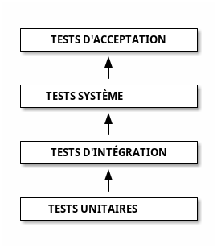

# Définitions

- _Qu'est-ce qu'un test ?_
- _Quels types de tests ?_
- _Quelles techniques pour tester ?_

---

# Qu'est-ce qu'un test ?

Un test est un ensemble de trois éléments :

- **Un système à tester** : Peut inclure des composants externes (OS, disques durs, VM, etc.)
- **Des entrées** : Statiques ou générées à l'exécution
- **Un scénario de test** : Décrit étape par étape

---

Le test permet de vérifier :

- Les **sorties** générées par le système
- Le **comportement interne** du système
- Les deux à la fois

---

# 1 test == 1 erreur

- **Attention** : Un test est toujours lié à **une seule vérification** !
- Ne jamais mélanger ~~différent types de vérifications~~ dans le même test (performance & sécurité, …).
- Un problème devrait faire échouer **un seul et unique test**

---
layout: section
---

# Les 7 principes de test

---

# 1. Tester montre l'absence de problème

- But d'un test : casser le logiciel pour trouver des problèmes
- Tester montre l'absence de problème mais **~~ne prouve pas l'absence d'erreur~~**

> Non, je n'ai pas de preuve de cette grenouille qui parle mais cela ne veut pas dire qu'elle n'existe pas

---

# 2. Le test exhaustif est impossible

- Pas assez de ressources (matérielles et/ou humaines), entrées aléatoires, …
- Importance de **prioriser** les tests à écrire et exécuter par :
  - criticité du métier
	- risque technique (peu de confiance)

---

# 3. Tester dès le début

- Réduit les coûts : peu de code & dépendances à analyser & changer
- Les tests doivent suivre le développement et l'intégration du système **dès les spécifications**

---

# 4. Les erreurs se regroupent

- Principe de Pareto : 80% des effets proviennent de 20% des causes
- Les bugs se produisent souvent dans un ensemble restreint de composants
- **Ne pas appliquer de couverture de test homogène !**

---

# 5. Paradoxe du pesticide

- Répéter les mêmes scénarios de test ne détecte pas de nouveau problème
- Il faut régulièrement mettre à jour les tests

---

# 6. Le test dépend du contexte

- **Adapter** les tests au contexte et ne ~~pas réutiliser~~ des tests sans réflexion.

---

# 7. L'illusion de l'absence d'erreur

- Un système peut avoir des problèmes sans que les tests échouent
- Il peut même parfaitement se comporter sans faire ce qui est attendu par le client.

---
layout: section
---

# Les types de tests

---

# Black-box vs White-box

- **Boîte noire** : Tests orientés utilisateur, ignorent le comportement interne
  - on vérifie **uniquement les sorties** contre les spécifications fonctionnelles
- **Boîte blanche** : Tests orientés développeur, vérifient les chemins d'exécution internes (spécifications techniques autorisées)
  - optimisés contre les parties critiques de l'implémentation du système

---
layout: section
---

# Niveaux de tests

---

# Tests unitaires ou de composant

- Vérifient des unités **isolées** du système sans dépendance : fonction, composant, …
- simples à coder, rapides, automatisés.
- proches de l'implémentation => sensibles au changement de code
- documentent le fonctionnement de chaque unité en isolation
- ex : retour d'une fonction, contenu d'un fichier de configuration généré

---

# Tests d'intégration

- Testent l'**assemblage** des modules testés unitairement
- focus sur les interfaces aux limites (intégration)
- documentent les interactions entre composants
- _bottom-up_ : modules testés unitairement puis on vérifie uniquement leur **interfaçage** (plus efficace)
- _top-down_ : fonction testée sur produit assemblé, puis on descend valider le comportement de chaque composant
- ex : intégration d'un SSO (login centralisé) dans un composant

---

# Tests système

- Vérifient le fonctionnement d'un système entièrement intégré
- Proches de la production
- Documentent les API et fonctionnalités totales (y compris techniques) du système 
- ex : tester l'intégration d'une base de données dans l'ensemble du système
- souvent nommés également tests d'intégration

---

# Tests d'acceptation (acceptance, end-to-end)

- Tests système qui vérifient la conformité aux besoins métier.
- Exécutés d'un point de vue utilisateur final : boîte blanche interdite.
- Documentent les cas d'utilisation du produit.
- ex : tester l'ajout d'un objet dans le panier de l'utilisateur.

---

- **Tests unitaires** : proches de l'implémentation, facile à automatiser, bugs faciles à corriger, vite obsolètes
- **Tests d'acceptation** : éloignés de l'implémentation : difficiles à impémenter ou manuels, bugs difficiles à corriger, stables
- **Ordre : tests unitaires > intégration > systèmes > acceptation**.

---

# Pyramide de tests

- Modèle populaire de plan de tests proposé par Kent Beck
- Beaucoup de tests unitaires, moins de tests d'intégration, encore moins de tests end-to-end
- Utile dans certains cas (web, …) mais **attention à la spécificité du projet** !
- Peu adapté aux projets fortement orientés data ou intégration

---

# Fonctionnel vs non-fonctionnel

- tests **fonctionnels** : tester _ce que fait_ le produit (algorithme)
  - _alpha_ (en interne avant la livraison), _beta_ (idem en externe), _sanity checks_ (problème résolu ?), _non régression_ (qualité non dégradée par les changements ?), _smoke tests_ (démarrage du produit OK ?), …
- tests **non-fonctionnels** : tester si _le produit est utilisable_ (fonctionne _bien_)
  - exécutés après les tests fonctionnels
  - _performance_, _fiabilité_, _capacité évolutive_, _sécurité_, _stress_ (mémoire/CPU/espace disque limités, hors ligne)

---

# Les 3 dimensions de tests

<svg xmlns="http://www.w3.org/2000/svg" style="background: transparent; background-color: transparent; color-scheme: light dark;" xmlns:xlink="http://www.w3.org/1999/xlink" version="1.1" width="1037px" height="673px" viewBox="-0.5 -0.5 1037 673"><defs/><g><g data-cell-id="0"><g data-cell-id="1"><g data-cell-id="gn27o6R9QP5MaPNMH9Aa-11"><g><ellipse cx="174.17" cy="606" rx="110" ry="55" fill="#bac8d3" style="fill: light-dark(rgb(186, 200, 211), rgb(57, 69, 78)); stroke: light-dark(rgb(35, 68, 93), rgb(160, 188, 210));" stroke="#23445d" pointer-events="all"/></g><g><g transform="translate(-0.5 -0.5)"><switch><foreignObject style="overflow: visible; text-align: left;" pointer-events="none" width="100%" height="100%" requiredFeatures="http://www.w3.org/TR/SVG11/feature#Extensibility">

Types de tests : boîte noire vs boîte blanche

</foreignObject><text x="174" y="611" fill="light-dark(#000000, #ffffff)" font-family="&quot;Courier New&quot;" font-size="18px" text-anchor="middle" font-weight="bold">Types de tests :...</text></switch></g></g></g><g data-cell-id="gn27o6R9QP5MaPNMH9Aa-4"><g><rect x="696" y="366.67" width="340" height="64.33" fill="#ffe6cc" style="fill: light-dark(rgb(255, 230, 204), rgb(54, 33, 10)); stroke: light-dark(rgb(215, 155, 0), rgb(153, 101, 0));" stroke="#d79b00" pointer-events="all"/></g><g><g transform="translate(-0.5 -0.5)"><switch><foreignObject style="overflow: visible; text-align: left;" pointer-events="none" width="100%" height="100%" requiredFeatures="http://www.w3.org/TR/SVG11/feature#Extensibility">

Techniques de test : fonctionnel vs non-fonctionnel

</foreignObject><text x="866" y="404" fill="light-dark(#000000, #ffffff)" font-family="&quot;Courier New&quot;" font-size="18px" text-anchor="middle" font-weight="bold">Techniques de test :...</text></switch></g></g></g><g data-cell-id="gn27o6R9QP5MaPNMH9Aa-12"><g><path d="M 316 1 L 396 71 L 316 141 L 236 71 Z" fill="#008a00" style="fill: light-dark(rgb(0, 138, 0), rgb(67, 186, 67)); stroke: light-dark(rgb(0, 87, 0), rgb(130, 205, 130));" stroke="#005700" stroke-miterlimit="10" pointer-events="all"/></g><g><g transform="translate(-0.5 -0.5)"><switch><foreignObject style="overflow: visible; text-align: left;" pointer-events="none" width="100%" height="100%" requiredFeatures="http://www.w3.org/TR/SVG11/feature#Extensibility">

Niveaux de tests

</foreignObject><text x="316" y="76" fill="#ffffff" font-family="&quot;Courier New&quot;" font-size="18px" text-anchor="middle" font-weight="bold">Niveaux de tests</text></switch></g></g></g><g data-cell-id="gn27o6R9QP5MaPNMH9Aa-1"><g><path d="M 316 441 L 1009.63 441" fill="none" stroke="#000000" style="stroke: light-dark(rgb(0, 0, 0), rgb(255, 255, 255));" stroke-miterlimit="10" pointer-events="stroke"/><path d="M 1014.88 441 L 1007.88 444.5 L 1009.63 441 L 1007.88 437.5 Z" fill="#000000" style="fill: light-dark(rgb(0, 0, 0), rgb(255, 255, 255)); stroke: light-dark(rgb(0, 0, 0), rgb(255, 255, 255));" stroke="#000000" stroke-miterlimit="10" pointer-events="all"/></g></g><g data-cell-id="gn27o6R9QP5MaPNMH9Aa-2"><g><path d="M 316 441 L 61.61 577.98" fill="none" stroke="#000000" style="stroke: light-dark(rgb(0, 0, 0), rgb(255, 255, 255));" stroke-miterlimit="10" pointer-events="stroke"/><path d="M 56.98 580.47 L 61.49 574.07 L 61.61 577.98 L 64.81 580.23 Z" fill="#000000" style="fill: light-dark(rgb(0, 0, 0), rgb(255, 255, 255)); stroke: light-dark(rgb(0, 0, 0), rgb(255, 255, 255));" stroke="#000000" stroke-miterlimit="10" pointer-events="all"/></g></g><g data-cell-id="gn27o6R9QP5MaPNMH9Aa-3"><g><path d="M 316 441 L 316 117.37" fill="none" stroke="#000000" style="stroke: light-dark(rgb(0, 0, 0), rgb(255, 255, 255));" stroke-miterlimit="10" pointer-events="stroke"/><path d="M 316 112.12 L 319.5 119.12 L 316 117.37 L 312.5 119.12 Z" fill="#000000" style="fill: light-dark(rgb(0, 0, 0), rgb(255, 255, 255)); stroke: light-dark(rgb(0, 0, 0), rgb(255, 255, 255));" stroke="#000000" stroke-miterlimit="10" pointer-events="all"/></g></g><g data-cell-id="gn27o6R9QP5MaPNMH9Aa-8"><g><ellipse cx="79.17" cy="509.17" rx="65" ry="45" fill="#ffffff" style="fill: light-dark(#ffffff, var(--ge-dark-color, #121212)); stroke: light-dark(rgb(0, 0, 0), rgb(255, 255, 255));" stroke="#000000" transform="rotate(-30,79.17,509.17)" pointer-events="all"/></g><g><g transform="translate(-0.5 -0.5)rotate(-30 79.17000000000007 509.1700000000001)"><switch><foreignObject style="overflow: visible; text-align: left;" pointer-events="none" width="100%" height="100%" requiredFeatures="http://www.w3.org/TR/SVG11/feature#Extensibility">

<i>Boîte blanche</i>

</foreignObject><text x="79" y="513" fill="light-dark(#000000, #ffffff)" font-family="&quot;Verdana&quot;" font-size="12px" text-anchor="middle">Boîte blanche</text></switch></g></g></g><g data-cell-id="gn27o6R9QP5MaPNMH9Aa-9"><g><ellipse cx="214.17" cy="431.67" rx="70" ry="45" fill="#000000" style="fill: light-dark(rgb(0, 0, 0), rgb(237, 237, 237)); stroke: light-dark(rgb(0, 0, 0), rgb(255, 255, 255));" stroke="#000000" transform="rotate(-30,214.17,431.67)" pointer-events="all"/></g><g><g transform="translate(-0.5 -0.5)rotate(-30 214.17000000000007 431.6700000000001)"><switch><foreignObject style="overflow: visible; text-align: left;" pointer-events="none" width="100%" height="100%" requiredFeatures="http://www.w3.org/TR/SVG11/feature#Extensibility">

<i>Boîte noire</i>

</foreignObject><text x="214" y="435" fill="#FFFFFF" font-family="&quot;Verdana&quot;" font-size="12px" text-anchor="middle">Boîte noire</text></switch></g></g></g><g data-cell-id="gn27o6R9QP5MaPNMH9Aa-13"><g><path d="M 386 331 L 446 381 L 386 431 L 326 381 Z" fill="#d80073" style="fill: light-dark(rgb(216, 0, 115), rgb(255, 144, 243)); stroke: light-dark(rgb(165, 0, 64), rgb(255, 169, 224));" stroke="#a50040" stroke-miterlimit="10" pointer-events="all"/></g><g><g transform="translate(-0.5 -0.5)"><switch><foreignObject style="overflow: visible; text-align: left;" pointer-events="none" width="100%" height="100%" requiredFeatures="http://www.w3.org/TR/SVG11/feature#Extensibility">

unitaire

</foreignObject><text x="386" y="385" fill="#ffffff" font-family="&quot;Verdana&quot;" font-size="12px" text-anchor="middle" font-style="italic">unitaire</text></switch></g></g></g><g data-cell-id="gn27o6R9QP5MaPNMH9Aa-14"><g><path d="M 491 241 L 551 291 L 491 341 L 431 291 Z" fill="#a20025" style="fill: light-dark(rgb(162, 0, 37), rgb(255, 173, 205)); stroke: light-dark(rgb(111, 0, 0), rgb(255, 197, 197));" stroke="#6f0000" stroke-miterlimit="10" pointer-events="all"/></g><g><g transform="translate(-0.5 -0.5)"><switch><foreignObject style="overflow: visible; text-align: left;" pointer-events="none" width="100%" height="100%" requiredFeatures="http://www.w3.org/TR/SVG11/feature#Extensibility">

intégration

</foreignObject><text x="491" y="295" fill="#ffffff" font-family="&quot;Verdana&quot;" font-size="12px" text-anchor="middle" font-style="italic">intégration</text></switch></g></g></g><g data-cell-id="gn27o6R9QP5MaPNMH9Aa-16"><g><path d="M 526 91 L 586 141 L 526 191 L 466 141 Z" fill="#6a00ff" style="fill: light-dark(rgb(106, 0, 255), rgb(255, 167, 255)); stroke: light-dark(rgb(55, 0, 204), rgb(239, 192, 255));" stroke="#3700cc" stroke-miterlimit="10" pointer-events="all"/></g><g><g transform="translate(-0.5 -0.5)"><switch><foreignObject style="overflow: visible; text-align: left;" pointer-events="none" width="100%" height="100%" requiredFeatures="http://www.w3.org/TR/SVG11/feature#Extensibility">

acceptance

</foreignObject><text x="526" y="145" fill="#ffffff" font-family="&quot;Verdana&quot;" font-size="12px" text-anchor="middle" font-style="italic">acceptance</text></switch></g></g></g><g data-cell-id="gn27o6R9QP5MaPNMH9Aa-17"><g><rect x="306" y="461" width="90" height="30" fill="#ffff88" style="fill: light-dark(rgb(255, 255, 136), rgb(33, 33, 0)); stroke: light-dark(rgb(54, 57, 61), rgb(186, 189, 192));" stroke="#36393d" pointer-events="all"/></g><g><g transform="translate(-0.5 -0.5)"><switch><foreignObject style="overflow: visible; text-align: left;" pointer-events="none" width="100%" height="100%" requiredFeatures="http://www.w3.org/TR/SVG11/feature#Extensibility">

smoke test

</foreignObject><text x="351" y="480" fill="light-dark(#000000, #ffffff)" font-family="&quot;Verdana&quot;" font-size="12px" text-anchor="middle" font-style="italic">smoke test</text></switch></g></g></g><g data-cell-id="gn27o6R9QP5MaPNMH9Aa-18"><g/></g><g data-cell-id="gn27o6R9QP5MaPNMH9Aa-19"><g><rect x="486" y="511" width="90" height="30" fill="#60a917" style="fill: light-dark(rgb(96, 169, 23), rgb(74, 137, 12)); stroke: light-dark(rgb(45, 118, 0), rgb(115, 177, 76));" stroke="#2d7600" pointer-events="all"/></g><g><g transform="translate(-0.5 -0.5)"><switch><foreignObject style="overflow: visible; text-align: left;" pointer-events="none" width="100%" height="100%" requiredFeatures="http://www.w3.org/TR/SVG11/feature#Extensibility">

sanity

</foreignObject><text x="531" y="530" fill="#ffffff" font-family="&quot;Verdana&quot;" font-size="12px" text-anchor="middle" font-style="italic">sanity</text></switch></g></g></g><g data-cell-id="gn27o6R9QP5MaPNMH9Aa-20"><g><rect x="370" y="511" width="90" height="30" fill="#cdeb8b" style="fill: light-dark(rgb(205, 235, 139), rgb(32, 58, 0)); stroke: light-dark(rgb(54, 57, 61), rgb(186, 189, 192));" stroke="#36393d" pointer-events="all"/></g><g><g transform="translate(-0.5 -0.5)"><switch><foreignObject style="overflow: visible; text-align: left;" pointer-events="none" width="100%" height="100%" requiredFeatures="http://www.w3.org/TR/SVG11/feature#Extensibility">

alpha

</foreignObject><text x="415" y="530" fill="light-dark(#000000, #ffffff)" font-family="&quot;Verdana&quot;" font-size="12px" text-anchor="middle" font-style="italic">alpha</text></switch></g></g></g><g data-cell-id="gn27o6R9QP5MaPNMH9Aa-21"><g><rect x="426" y="461" width="90" height="30" fill="#fad7ac" style="fill: light-dark(rgb(250, 215, 172), rgb(75, 45, 8)); stroke: light-dark(rgb(180, 101, 4), rgb(201, 133, 49));" stroke="#b46504" pointer-events="all"/></g><g><g transform="translate(-0.5 -0.5)"><switch><foreignObject style="overflow: visible; text-align: left;" pointer-events="none" width="100%" height="100%" requiredFeatures="http://www.w3.org/TR/SVG11/feature#Extensibility">

beta

</foreignObject><text x="471" y="480" fill="light-dark(#000000, #ffffff)" font-family="&quot;Verdana&quot;" font-size="12px" text-anchor="middle" font-style="italic">beta</text></switch></g></g></g><g data-cell-id="gn27o6R9QP5MaPNMH9Aa-22"><g><path d="M 636 671 L 636 1" fill="none" stroke="#000000" style="stroke: light-dark(rgb(0, 0, 0), rgb(255, 255, 255));" stroke-width="2" stroke-miterlimit="10" stroke-dasharray="2 6" pointer-events="stroke"/></g></g><g data-cell-id="gn27o6R9QP5MaPNMH9Aa-15"><g><path d="M 636 191 L 696 241 L 636 291 L 576 241 Z" fill="#1ba1e2" style="fill: light-dark(rgb(27, 161, 226), rgb(25, 140, 196)); stroke: light-dark(rgb(0, 110, 175), rgb(81, 175, 231));" stroke="#006eaf" stroke-miterlimit="10" pointer-events="all"/></g><g><g transform="translate(-0.5 -0.5)"><switch><foreignObject style="overflow: visible; text-align: left;" pointer-events="none" width="100%" height="100%" requiredFeatures="http://www.w3.org/TR/SVG11/feature#Extensibility">

système

</foreignObject><text x="636" y="245" fill="#ffffff" font-family="&quot;Verdana&quot;" font-size="12px" text-anchor="middle" font-style="italic">système</text></switch></g></g></g><g data-cell-id="gn27o6R9QP5MaPNMH9Aa-23"><g><rect x="536" y="461" width="90" height="30" fill="#eeeeee" style="fill: light-dark(rgb(238, 238, 238), rgb(32, 32, 32)); stroke: light-dark(rgb(54, 57, 61), rgb(186, 189, 192));" stroke="#36393d" pointer-events="all"/></g><g><g transform="translate(-0.5 -0.5)"><switch><foreignObject style="overflow: visible; text-align: left;" pointer-events="none" width="100%" height="100%" requiredFeatures="http://www.w3.org/TR/SVG11/feature#Extensibility">

maintenance

</foreignObject><text x="581" y="480" fill="light-dark(#000000, #ffffff)" font-family="&quot;Verdana&quot;" font-size="12px" text-anchor="middle" font-style="italic">maintenance</text></switch></g></g></g><g data-cell-id="gn27o6R9QP5MaPNMH9Aa-24"><g><rect x="656" y="461" width="90" height="30" fill="#dae8fc" style="fill: light-dark(rgb(218, 232, 252), rgb(29, 41, 59)); stroke: light-dark(rgb(108, 142, 191), rgb(92, 121, 163));" stroke="#6c8ebf" pointer-events="all"/></g><g><g transform="translate(-0.5 -0.5)"><switch><foreignObject style="overflow: visible; text-align: left;" pointer-events="none" width="100%" height="100%" requiredFeatures="http://www.w3.org/TR/SVG11/feature#Extensibility">

stress

</foreignObject><text x="701" y="480" fill="light-dark(#000000, #ffffff)" font-family="&quot;Verdana&quot;" font-size="12px" text-anchor="middle" font-style="italic">stress</text></switch></g></g></g><g data-cell-id="gn27o6R9QP5MaPNMH9Aa-25"><g><rect x="726" y="511" width="90" height="30" fill="#1ba1e2" style="fill: light-dark(rgb(27, 161, 226), rgb(25, 140, 196)); stroke: light-dark(rgb(0, 110, 175), rgb(81, 175, 231));" stroke="#006eaf" pointer-events="all"/></g><g><g transform="translate(-0.5 -0.5)"><switch><foreignObject style="overflow: visible; text-align: left;" pointer-events="none" width="100%" height="100%" requiredFeatures="http://www.w3.org/TR/SVG11/feature#Extensibility">

performance

</foreignObject><text x="771" y="530" fill="#ffffff" font-family="&quot;Verdana&quot;" font-size="12px" text-anchor="middle" font-style="italic">performance</text></switch></g></g></g><g data-cell-id="gn27o6R9QP5MaPNMH9Aa-26"><g><rect x="806" y="461" width="90" height="30" fill="#f8cecc" style="fill: light-dark(rgb(248, 206, 204), rgb(81, 45, 43)); stroke: light-dark(rgb(184, 84, 80), rgb(215, 129, 126));" stroke="#b85450" pointer-events="all"/></g><g><g transform="translate(-0.5 -0.5)"><switch><foreignObject style="overflow: visible; text-align: left;" pointer-events="none" width="100%" height="100%" requiredFeatures="http://www.w3.org/TR/SVG11/feature#Extensibility">

sécurité

</foreignObject><text x="851" y="480" fill="light-dark(#000000, #ffffff)" font-family="&quot;Verdana&quot;" font-size="12px" text-anchor="middle" font-style="italic">sécurité</text></switch></g></g></g><g data-cell-id="gn27o6R9QP5MaPNMH9Aa-27"><g><rect x="856" y="511" width="90" height="30" fill="#e1d5e7" style="fill: light-dark(rgb(225, 213, 231), rgb(57, 47, 63)); stroke: light-dark(rgb(150, 115, 166), rgb(149, 119, 163));" stroke="#9673a6" pointer-events="all"/></g><g><g transform="translate(-0.5 -0.5)"><switch><foreignObject style="overflow: visible; text-align: left;" pointer-events="none" width="100%" height="100%" requiredFeatures="http://www.w3.org/TR/SVG11/feature#Extensibility">

résilience

</foreignObject><text x="901" y="530" fill="light-dark(#000000, #ffffff)" font-family="&quot;Verdana&quot;" font-size="12px" text-anchor="middle" font-style="italic">résilience</text></switch></g></g></g><g data-cell-id="gn27o6R9QP5MaPNMH9Aa-28"><g><path d="M 605.5 596 L 605.5 606 L 335.5 606 L 335.5 616.5 L 316.5 601 L 335.5 585.5 L 335.5 596 Z" fill="#ffff88" style="fill: light-dark(rgb(255, 255, 136), rgb(33, 33, 0)); stroke: light-dark(rgb(54, 57, 61), rgb(186, 189, 192));" stroke="#36393d" stroke-linejoin="round" stroke-miterlimit="10" pointer-events="all"/></g></g><g data-cell-id="gn27o6R9QP5MaPNMH9Aa-29"><g><rect x="446" y="628" width="40" height="20" fill="none" stroke="none" pointer-events="all"/></g><g><g transform="translate(-0.5 -0.5)"><switch><foreignObject style="overflow: visible; text-align: left;" pointer-events="none" width="100%" height="100%" requiredFeatures="http://www.w3.org/TR/SVG11/feature#Extensibility">

Fonctionnels

</foreignObject><text x="466" y="644" fill="light-dark(#000000, #ffffff)" font-family="&quot;Courier New&quot;" font-size="20px" text-anchor="middle" font-weight="bold">Fonc...</text></switch></g></g></g><g data-cell-id="gn27o6R9QP5MaPNMH9Aa-30"><g><path d="M 956.5 596 L 956.5 585.5 L 975.5 601 L 956.5 616.5 L 956.5 606 L 686.5 606 L 686.5 596 Z" fill="#cce5ff" style="fill: light-dark(rgb(204, 229, 255), rgb(24, 46, 68)); stroke: light-dark(rgb(54, 57, 61), rgb(186, 189, 192));" stroke="#36393d" stroke-linejoin="round" stroke-miterlimit="10" pointer-events="all"/></g></g><g data-cell-id="gn27o6R9QP5MaPNMH9Aa-31"><g><rect x="686" y="627.83" width="260" height="20" fill="none" stroke="none" pointer-events="all"/></g><g><g transform="translate(-0.5 -0.5)"><switch><foreignObject style="overflow: visible; text-align: left;" pointer-events="none" width="100%" height="100%" requiredFeatures="http://www.w3.org/TR/SVG11/feature#Extensibility">

Non fonctionnels

</foreignObject><text x="816" y="644" fill="light-dark(#000000, #ffffff)" font-family="&quot;Courier New&quot;" font-size="20px" text-anchor="middle" font-weight="bold">Non fonctionnels</text></switch></g></g></g></g></g></g></svg>

---
layout: section
---

# Les Étapes de Test

- _Comment écrire un test ?_
- _Quelles étapes ?_

---

# Processus de test

1. _Décrire le test_ : **Inventorier** les tests obligatoires
2. _Préparer les entrées_ : Définir les **états initiaux** des systèmes
3. _Écrire le script_ : Rédiger le **scénario** de test
4. _Créer des plans de test_ : **Quand** exécuter les tests et quel **déroulement** ? Penser au **parrallélisme** et aux **dépendances**.
5. _Préparer l'environnement_ : Assurer des conditions de test **stables**. Penser à l'**automatisation** (snapshot VM, scripts, …)
6. _Exécuter le test_ : **Suivre** le script et **collecter** les résultats
7. _Consigner les résultats_ : **Documenter** les observations

---

# Entrées de tests

- **Jeux de données** à maintenir (coût)
- Récupérer des **données de production** :
  - réellement adaptées au besoin
	- nombreuses
	- confidentialité : à anonymiser
	- nécessitent une production compatible
- Créer des **données de référence** :
  - créées manuellement ou par script
	- testent les cas limites : caractères spéciaux, …
	- si besoin, utiliser ou ajouter une API du produit

