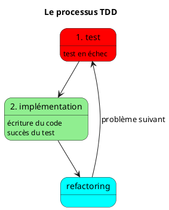

# Problème du test tardif

- Vérification tardive = corrections coûteuses
- Aucune information sur la qualité pendant le développement
- Architecture difficile à tester
- **Le test couvre-t-il réellement le problème ?**

---

# TDD

- Écrire un test **avant l'implémentation**
- Vérifier que le test **échoue d'abord**
  - donc le test couvre bien le problème !
- **Implémenter** la fonctionnalité (ou correction de bug) jusqu'à faire **passer** le test
- **Refactorer** le code si nécessaire
  - facile, les tests évitent les régressions

---

# Conception émergente

- Le TDD est en fait plus une pratique de développement incrémental (issue de l'eXtreme Programming et des méthodes agiles) qu'une méthodologie de test
- Les choix technologiques, d'architecture et d'implémentation sont repoussés au moment de l'implémentation
- Le test en amont impose une architecture facilement testable
- L'architecture est fortement orientée par les tests : ne pas négliger le refactoring.

---

---

# Behavior-driven development (BDD)

- En TDD traditionnel, les tests (unitaires) sont très proches de l'implémentation :
  + Le refactoring peut être compliqué, beaucoup de tests deviennent obsolètes
  + Seul le besoin métier est invariant, le reste dépend de l'implémentation
- En BDD, on préfèrera des tests validant les fonctionnalités du programme plutôt que les détails d'implémentation.

---

- Chaque méthode a ses avantages, il est possible de cumuler les 2 suivant le besoin.
- Ces méthodes améliorent considérablement les temps de développement.

