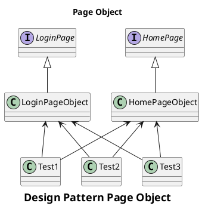
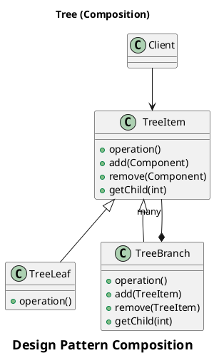
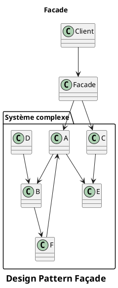
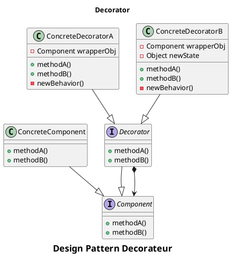

# AAA

Un test suit un pattern **AAA** pour **Arrange**, **Act**, **Assert** :

- **Arrange** : Mise en place de l’environnement (_SUT_) : création et initialisation des objets nécessaires à l’exécution du test.
- **Act** : scénario (automatisé) déroulant les étapes du test.
- **Assert** : Vérification des résultats

---

```python
def test_addition():
    # Arrange (Préparation)
    a, b = 3, 5

    # Act (Exécution)
    result = add_numbers(a, b)

    # Assert (Vérification)
    assert result == 8
```

---

## BDD

En _BDD_, on utilise le pattern **Given**, **When**, **Then** qui suit le même formalisme :

- Étant donné un solde positif de mon compte, et aucun retrait cette semaine,
- Lorsque je retire un montant inférieur à la limite de retrait,
- Alors mon retrait doit se dérouler sans erreur ou avertissement

---

# Page Object



---

Le design pattern `Page Object` permet d'éviter les problèmes de maintenabilité en ajoutant une abstraction métier au-dessus de l'implémentation de l'interface utilisateur.

Les méthodes d'une classe `Page Object` correspondent à des actions possibles sur une page.
Une `Page Object` doit également fournir des mécanismes pour manipuler, observer et rechercher des éléments d'une page.

---

Les principaux avantages de ce modèle sont :

* la réduction de la quantité de code dupliqué
* la réutilisabilité des classes `Page Object` pour différents tests (et parfois le code de production)
* une maintenance plus facile en cas de modification de l'interface utilisateur
* un code plus lisible et plus compréhensible

---

```java
public class LoginTest extends BaseTest {

    @Test
    public void testLogin() {

        LoginPage loginPage = new LoginPage(this.getWebDriver());
        HomePage homePage = new HomePage(this.getWebDriver());

        loginPage.setUsername("administrator");
        loginPage.setPassword("password");
        loginPage.submit();

        if(homePage.isDisplayed()){
          this.setPassed();
        }

        this.setFailed();
   }
}
```

---

# Tree

Le design pattern d'arbre (Tree) est un pattern composite dont le but est de représenter et d'utiliser de la même manière un élément unique ou une collection d'éléments. En test automatique, la feuille est soit une simple méthode de test, soit un objet de type `PageObject`.

En automatisation de tests, ce design pattern sert surtout à tester facilement des menus complexes (menu avec des sous-menus, sous-sous-menus, etc...), surtout lorsque ceux-ci n'ont pas de profondeur uniforme.

---



---

# Facade

La façade est un design pattern permettant de limiter les interactions avec un système complexe à une interface offrant des actions limitées.

En automatisation de tests, sont but est principalement de regrouper des `PageObject` pour créer une logique métier (dans le code de production et/ou le code de test).

---



---

```python
class MyAPI:
  # [...]
  # Beaucoup de code et de fonctions

class Achat: # Facade
  def login(self, login):
  def ajouter_achat(self, achat):
  def payer(self):
```

---

```java
public class LoginFacade {
    private TestDriver driver;
    private LoginPO loginPO;
    private DashboardPO dashboardPO;

    public void loginAndLogout(String username, String password) {
        loginPO.setUsernameTextField(username);
        loginPO.setPasswordTextField(password);
        loginPO.tapOnLoginButton();
        dashboardPO.tapOnLogoutTextView();
    }
}
```

---

# Decorateur

Le décorateur permet d'ajouter dynamiquement un nouveau comportement à certains objets en les encapsulant dans une classe abstraite ou une interface délégant ses appels au décorateur.

En automatisation de tests, on utilise principalement les décorateurs pour :
- modifier le comportement du framework de tests
- ajouter un comportement global au code de production (par exemple : logger un appel)

---



---

```java
public class MyTestDriverWithLog implements TestDriver {
  private Logger logger;
  private TestDriver driver;

  @Override
  public TestObject click(button) {
      logger.log("Button {} clicked", button);
      return driver.click(button);
  }
}
```

---

# Factory/Builder

La `Factory` ou les créateurs (`Builder`) permettent de créer des objets en injectant leurs dépendances par rapport au contexte courant.

Ces patterns permettent d'utiliser des objets avec des instances de dépendances relatives au contexte courant.

Lorsqu'ils sont utilisés dans du code de production, ces patterns permettent en association avec des constructeurs simples de changer les dépendances d'un objet lors de tests (ou dans d'autres environnements : Windows/Linux, Android/iOS, ...).

---

```java
/* Production */
public class Persistence {

    private final PersistenceDriver driver;

    public Persistence(PersistenceDriver driver) {
        this.driver = driver;
    }

    public void persist() {
        this.driver.persist();
    }

    public static Persistence MySqlPersistence() {
        return new Persistence(new MySQLDriver());
    }
}

/* Tests */
[...]
test = new Persistence(new FakeDriver());
test.persist() // calls FakeDriver instance
```

---

# Fluent PageObject

Un pattern très apprécié en écriture de tests est l'association d'un `PageObject` avec le pattern `Fluent` qui retourne le `PageObject` à utiliser après l'action (instance courante de l'objet ou nouvel objet).

Ceci permet de chaîner les appels de méthodes pour décrire le comportement métier

---

```java
public class LoginPO extends BasePO {

    public LoginPO setUsernameTextField(String username) {
        usernameTextField.sendKeys(username);
        return this;
    }

    public DashboardPO tapOnLoginButton() {
        loginButton.click();
        return new DashboardPO(driver);
    }
}

/* Test */
/* Sans Fluent */
loginPO.setUsernameTextField(username);
dashboardPO = new DashboardPO(driver);
dashboardPO.tapOnLogoutTextView();

/* Avec Fluent */
loginPO
    .setUsernameTextField(username)
    .tapOnLoginButton();
```

