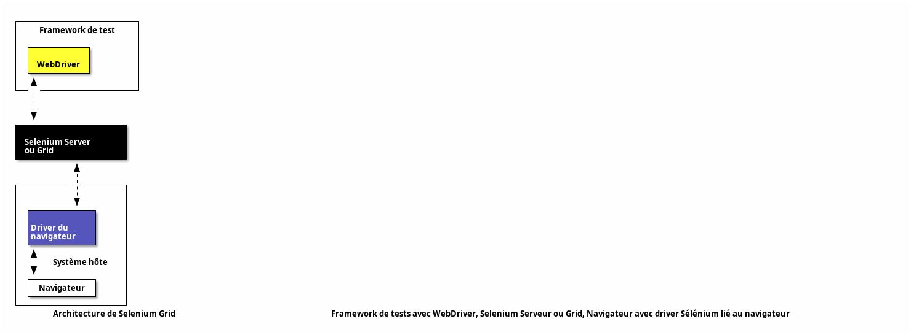

<!-- class: titre lead -->

# Sélénium

---

# Sélénium

- Outil d'automatisation des actions utilisateur dans un navigateur web et de récupérer les résultats de ces actions :
  + visiter une page
  + cliquer sur un lien
  + remplir un formulaire, etc.

---

<!-- class: titre lead -->

# Présentation des composants

---

<!-- class: subtitle lead -->

# Selenium IDE

---

# Selenium IDE 

## Enregistrer, éditer et débugger les tests

- Manière la plus simple de créer des scripts `Selenium`.
- Enregistre via un plugin pour `Firefox` / `Chrome` les actions de l'utilisateur pendant la navigation sur le site et les affiche dans une interface.
- Permet de réaliser rapidement des scripts en mode enregistrement/rejeu.

---

- Les scripts sont ensuite exportables en langages de plus haut niveau : `Java`, `Python`, ... mais demanderont d’être retravaillés pour assurer une maintenabilité dans le temps.
- Peu d’intérêt pour construire un framework d’automatisation mais pratique pour démarrer sur `Selenium` ou faire des scripts rapides pour reproduction des bug.

---


---

<!-- class: subtitle lead -->

# Selenium RC et WebDriver

---

# SELENIUM RC ET WEBDRIVER 

## Écriture des tests automatisés

- Les API de `Selenium` : permettent en écrivant du code de test d'automatiser le navigateur et les vérifications associées.
- `Selenium WebDriver` est la nouvelle implémentation de `Selenium` et est souvent choisi pour les nouveaux projets.
- Disponible dans les langages `Ruby`, `Java`, `Python`, `C#,` `C# NuGet` et `EcmaScript` et supporte tous les navigateurs classiques.

---

```python
class TestSearch(unittest.TestCase):

    def setUp(self):
        self.driver = webdriver.Firefox()

    def test_results_page_shows(self):
        self.driver.get("https://en.wikipedia.org/wiki/Main_Page")
        input = self.driver.find_element(By.ID, "searchInput")
        input.send_keys("Selenium")
        input.send_keys(Keys.RETURN)

        page_url = self.driver.current_url

        self.assertEqual(page_url, "https://en.wikipedia.org/wiki/Main_Page")

    def tearDown(self):
        self.driver.close()
```

---

<!-- class: subtitle lead -->

# Selenium Grid

---

# SELENIUM  GRID

## Accélération des tests fonctionnels

- Exécute des scripts `WebDriver` sur des machines distantes physiques ou virtuelles.
- Permettre l'exécution de tests en parrallèle sur des machines dédiées ayant la puissance nécessaire à l'exécution de tests d'interface graphique
- Peut utiliser des matrices d'environnements hétérogènes pour les tests : Windows / Linux, Firefox / Chrome

---



---

# Quelques bonnes pratiques

- L'identification des éléments d'une page se fait en utilisant des sélecteurs `CSS`. De nombreux frameworks frontend génèrent du code (et donc des attributs `CSS`) à chaque exécution du code, il est donc très risqué d'utiliser des attributs internes au framework !
- On essaiera donc d'utiliser au maximum des attributs `CSS` ajoutés manuellement dans le code. De même, pour éviter tout soucis de duplication, on utilisera plutôt des `classes` `CSS` que des `ID`.

---

- Un code de test `Sélénium` est très proche de l'implémentation de la page Web, ce qui rend sa lecture très compliquée. Le pattern architectural `PageObject`, `PageElement` (parfois aussi appelé `HTMLWrapper`) permet de grandement améliorer l'architecture des tests :
- On décrit dans une classe dédiée les éléments de la page à tester et on abstrait les interactions de l'utilisateur dans des méthodes dédiées.
- Puis on utilise cette abstraction pour décrire le test.

---

Exemple de test utilisant les `PageObject` `LoginPage` et `HomePage` encapsulant les données et comportements des pages `/home` et `/login` :

```java
 public void testLogin() {

        LoginPage loginPage = new LoginPage(this.getWebDriver());
        HomePage homePage = new HomePage(this.getWebDriver());

        loginPage.setUsername("administrator");
        loginPage.setPassword("password");
        loginPage.submit();

        if(homePage.isDisplayed()){
          this.setPassed();
        }

        this.setFailed();
   }
```

---

<!-- class: liens -->

# Références

- [Extraits de code pour la manipulation des navigateurs](https://www.selenium.dev/documentation/en/webdriver/browser_manipulation/)
- [Localisation d'éléments (sélecteurs `CSS`)](https://www.selenium.dev/documentation/en/webdriver/locating_elements/)
- [Pattern PageObject](https://www.ingenieurtest.fr/2019/11/selenium-le-design-pattern-page-object.html)
- [Testing Library avec Selenium](https://github.com/anze3db/selenium-testing-library)
- Lien sélecteurs CSS :
  - <https://www.guru99.com/locators-in-selenium-ide.html>
  - <https://saucelabs.com/resources/blog/selenium-tips-css-selectors>
- [Guildelines Selenium](https://www.selenium.dev/documentation/test_practices/)
- Voir aussi :
  - [Playright, une alternative à Selenium avec support de Mocks et tracing des tests](https://playwright.dev/)
  - [Cypress](https://www.cypress.io/)


---

# Legal

- Oracle and Java are registered trademarks of Oracle and/or its affiliates.
- Linux is a registered trademark of Linus Torvalds.
- "Python" is a registered trademark of the PSF. The Python logos (in several variants) are use trademarks of the PSF as well. ®
- Windows is a registered trademark of Microsoft Corporation in the United States and other countries.
- Other names may be trademarks of their respective owners

