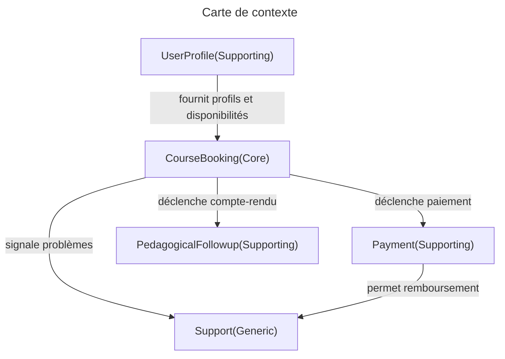

## 📝 Spécification fonctionnelle

### **Contexte métier - Plateforme de cours particuliers en ligne**

La société **LearnMate** propose un service de mise en relation entre enseignants et apprenants pour des cours particuliers en visioconférence.

Voici les principales fonctionnalités décrites par le service produit :

#### Gestion des utilisateurs

* Chaque utilisateur a un **profil** : nom, email, rôle (apprenant ou enseignant), photo, biographie.
* Les utilisateurs peuvent **mettre à jour leur profil** et choisir leurs **disponibilités horaires** (enseignants).

#### Recherche et réservation de cours

* Un apprenant peut **rechercher un enseignant** par matière, niveau, prix ou langue parlée.
* Il peut **envoyer une demande de cours** pour un créneau horaire donné.
* L’enseignant peut **accepter ou refuser** la demande.
* Une fois acceptée, le cours est **réservé et planifié**.

#### Paiement

* Les cours sont payés **à la réservation**.
* L’apprenant peut payer par carte ou portefeuille préchargé.
* L’enseignant est **rémunéré** chaque semaine selon ses cours validés.

#### Cours et suivi pédagogique

* Les cours sont tenus en **visioconférence intégrée**.
* À la fin du cours, l’enseignant **rédige un compte-rendu** visible par l’apprenant.
* Un **historique des cours** est conservé pour chaque utilisateur.

#### Support client

* Les utilisateurs peuvent **signaler un problème** sur une réservation.
* L’équipe support peut **émettre un remboursement** ou trancher un litige.

### 🎯 Travail demandé

1. **Identifiez les Bounded Context** présents dans cette application.
2. Donnez un **nom** et un **rôle métier** pour chaque Bounded Context.
3. Proposez un **diagramme simplifié** des interactions entre Bounded Context (carte de contexte).
4. Pour un des contextes, proposez un **langage ubiquitaire** (5 termes clés).

:::correction
## ✅ Correction

### **Bounded Context identifiés**

| Nom                       | Rôle                                                      |
| ------------------------- | --------------------------------------------------------- |
| **User Profile**          | Gestion des utilisateurs et de leurs disponibilités       |
| **Course Booking**        | Orchestration de la réservation et planification de cours |
| **Payment**               | Paiement en ligne, transferts enseignants, remboursements |
| **Pedagogical Follow-up** | Suivi des cours, rédaction des comptes-rendus, historique |
| **Support**               | Gestion des litiges et problèmes utilisateurs             |

### **Carte de contexte (exemple)**

* `CourseBooking` est central : coordonne avec tous les autres contextes.
* `UserProfile` est **Customer/Supplier** de `CourseBooking` (fournit les disponibilités).
* `Payment` est **Customer/Supplier** avec `CourseBooking` (paiement des réservations).
* `Support` est **Separate Ways** avec `CourseBooking` et `Payment` : aucune connaissance du domaine, l'utilisateur doit entrer les informations dans le ticket.

### **Langage ubiquitaire (CourseBooking)**

| Terme                | Définition                                                  |
| -------------------- | ----------------------------------------------------------- |
| **Demande de cours** | Un _Apprenant_ **envoie** une _Demande_ à un _Enseignant_            |
| **Créneau**          | Une _Plage Horaire_ est **proposée** pour un _Cours_                        |
| **Réservation**      | Un _Apprenant_ et un _Enseignant_ **s'accordent** sur un _Créneau_  |
| **Acceptation**      | L'_Enseignant_ **valide** une _Demande_ |
| **Statut**           | Une _Demande_ **possède** un _État_ : `en attente`, `acceptée`, `refusée`, `annulée` |

:::
