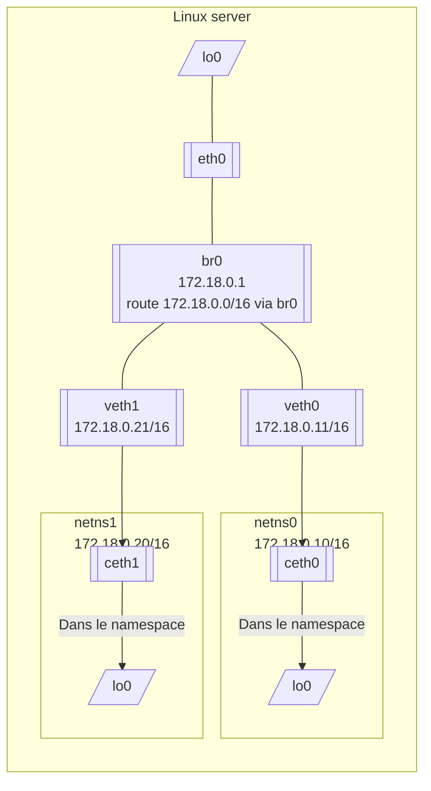

## Schéma réseau des namespace



## Resource Isolation components in Docker

### Namespaces

- `PID` namespace for process isolation.
- `NET` namespace for managing network interfaces.
- `IPC` namespace for managing access to IPC resources.
- `MNT` namespace for managing filesystem mount points.
- `UTS` namespace for isolating kernel and version identifiers.

### Control groups

- **Memory** cgroup that oversees accounting as well as restrictions and alerts
- **HugeTBL** is a cgroup that keeps track of each process group's use of huge pages.
- **CPU** group is responsible for regulating the time users and the system spend using CPU.
- **CPUSet** cgroup lets you associate a group with a certain CPU. Utilized for real-time workloads and NUMA systems with localised memory for each CPU.
- **BlkIO** cgroup for measuring and limiting the amount of blkIO each group produces.
- **net cls** and **net prio** cgroups are utilised for traffic control tagging.
- **Devices** cgroup for accessing devices that can both read and write data.
- Cgroup for the freezing of a group referred to as the **freezer**. It is useful for scheduling cluster batches, relocating processes, and troubleshooting.

- Docker does not require `cgroupfs` (Docker's own control group manager) as the control group driver.
- The cgroup can be changed to `systemd`.
- For Kubernetes, it is recommended to use `systemd`, as utilising `cgroupfs` in conjunction with `systemd` appears to be suboptimal.

### Union Filesystem

- Docker images are composed of layered filesystems, allowing them to be extremely lightweight and speedy. **Union file systems** are layering-based file systems.
- Docker Engine has the ability to use several different versions of UnionFS, such as AUFS, btrfs, vfs, and devicemapper.

### Commandes pour Namespaces

- `unshare` : new namespace
- `lsns -T` : list namespaces
- `nsenter -a -t <pid_of_container>` : enter a namespace
- Inside a namespace :
  - `ls -l /proc/$$/ns`
  ```sh
	cat /proc/$$/uid_map
        0       1000       1
	```
  This file represents the following mapping of user UIDs :
  ```
	ID-inside-ns      ID-outside-ns      range (number of users to map)
  ```
- On host :
  - `ls -l /proc/$PID/ns/`

## Script

Ce script permet de simuler manuellement la création de conteneurs en utilisant nativement les namespace du noyau Linux.

```sh
#!/usr/bin/env bash

set -e # stop on error

# Création du filesystem (optionnel, pour ressembler à un conteneur)
wget -O alpine-minirootfs.tgz https://dl-cdn.alpinelinux.org/alpine/v3.21/releases/x86_64/alpine-minirootfs-3.21.3-x86_64.tar.gz
mkdir c1 && cd c1 && tar xf ../alpine-minirootfs.tgz && cd ..
mkdir c2 && cd c2 && tar xf ../alpine-minirootfs.tgz && cd ..
# Création des namespaces `c1` et `c2`
unshare --user --uts --net --ipc --pid --cgroup --mount --fork --mount-proc=proc --root=c1 --wd=c1 --map-root-user ash -c 'sleep infinity' &
unshare --user --uts --net --ipc --pid --cgroup --mount --fork --mount-proc=proc --root=c2 --wd=c2 --map-root-user ash -c 'sleep infinity' &

# Utilisation des namespace Network pour la connectivité
# -------------------------------------------------------

# Creation des Namespaces
# ip netns add c1
# ip netns add c2

# OU :
# Attache des namespace `network` au PID des namespaces créés précédemment
C1_PID=$(lsns --json -t user -o PID,COMMAND | jq '.namespaces[] | select(.command | contains("c1")) | .pid')
C2_PID=$(lsns --json -t user -o PID,COMMAND | jq '.namespaces[] | select(.command | contains("c2")) | .pid')
ip netns attach c1 "$C1_PID"
ip netns attach c2 "$C2_PID"

# veth (cables) et interfaces
ip link add ceth1 type veth peer name cpeer1
ip link add ceth2 type veth peer name cpeer2

# interfaces -> namespaces
ip link set cpeer1 netns c1
ip link set cpeer2 netns c2

# Activation interfaces
ip link set ceth1 up
ip link set ceth2 up
ip netns exec c1 ip link set lo up
ip netns exec c2 ip link set lo up
ip netns exec c1 ip link set cpeer1 up
ip netns exec c2 ip link set cpeer2 up

# Ajout IPs
ip netns exec c1 ip addr add 10.0.11.10/16 dev cpeer1
ip netns exec c2 ip addr add 10.0.11.20/16 dev cpeer2

# ---
# Debug
ip -n c1 a
ip -n c2 a

# Bridge
ip link add cbridge type bridge
ip link set cbridge up
ip addr add 10.0.11.1/16 dev cbridge

# Ajout veth au bridge
ip link set ceth1 master cbridge
ip link set ceth2 master cbridge

# Routage
ip netns exec c1 ip route add default via 10.0.11.1
ip netns exec c2 ip route add default via 10.0.11.1
# Debug
ip netns exec c1 ping -c 1 10.0.11.1
ip netns exec c1 ping -c 1 10.0.11.10
ip netns exec c1 ping -c 1 10.0.11.20
ip netns exec c2 ping -c 1 10.0.11.1
ip netns exec c2 ping -c 1 10.0.11.10
ip netns exec c2 ping -c 1 10.0.11.20

## Accès externe
echo 1 >/proc/sys/net/ipv4/ip_forward
iptables -t nat -A POSTROUTING -s 10.0.11.1/16 ! -o cbridge -j MASQUERADE
# Debug
ip netns exec c1 ping -c 1 8.8.8.8
ip netns exec c2 ping -c 1 8.8.8.8

echo "Pour se connecter au conteneur c1 : "
echo "nsenter -a --root=c1 --wd=c1 -t $C1_PID"
echo "Pour se connecter au conteneur c2 : "
echo "nsenter -a --root=c2 --wd=c2 -t $C2_PID"
```

:::tip
Pour ajouter une réelle connectivité avec l'extérieure, on ajouterait un _sNAT_ (_source NAT_) depuis `iptables`, i.e. remplacer l'adresse source (inconnue publiquement) du conteneur vers l'adresse publique de la machine pour pouvoir obtenir une réponse.
:::

:::tip
Pour effectuer une _publication_ de port, on utiliserait le _DNAT_ (_Destination NAT_). D'autres solutions existent : eBPF, … (Kernel-space), `socat`, `nc`, … (user-space).
:::

## Accéder au namespace réseau d'un conteneur

Démarrage d'un conteneur Nginx. Rappel : chaque conteneur a son propre namespace.

```sh
docker run --rm nginx
```

Connexion au namespace réseau du conteneur. Dans ce namespace, le conteneur a 2 interfaces : `localhost` et une IP publique connectée au _bridge_ (visible depuis `docker inspect`).

```console
$ sudo lsns
[…]
4026532622 mnt         5 23128 root nginx: master process nginx -g daemon off;
4026532623 uts         5 23128 root nginx: master process nginx -g daemon off;
4026532624 ipc         5 23128 root nginx: master process nginx -g daemon off;
4026532625 pid         5 23128 root nginx: master process nginx -g daemon off;
4026532626 cgroup      5 23128 root nginx: master process nginx -g daemon off;
4026532627 net         5 23128 root nginx: master process nginx -g daemon off;

$ sudo nsenter --target 23128 --net

$ ip address
1: lo: <LOOPBACK,UP,LOWER_UP> mtu 65536 qdisc noqueue state UNKNOWN group default qlen 1000
    link/loopback 00:00:00:00:00:00 brd 00:00:00:00:00:00
    inet 127.0.0.1/8 scope host lo
       valid_lft forever preferred_lft forever
    inet6 ::1/128 scope host proto kernel_lo
       valid_lft forever preferred_lft forever
2: eth0@if6: <BROADCAST,MULTICAST,UP,LOWER_UP> mtu 1500 qdisc noqueue state UP group default
    link/ether ee:c6:22:d5:35:53 brd ff:ff:ff:ff:ff:ff link-netnsid 0
    inet 172.17.0.2/16 brd 172.17.255.255 scope global eth0
       valid_lft forever preferred_lft forever

$ curl localhost:80
[…]
<h1>Welcome to nginx!</h1>
```

