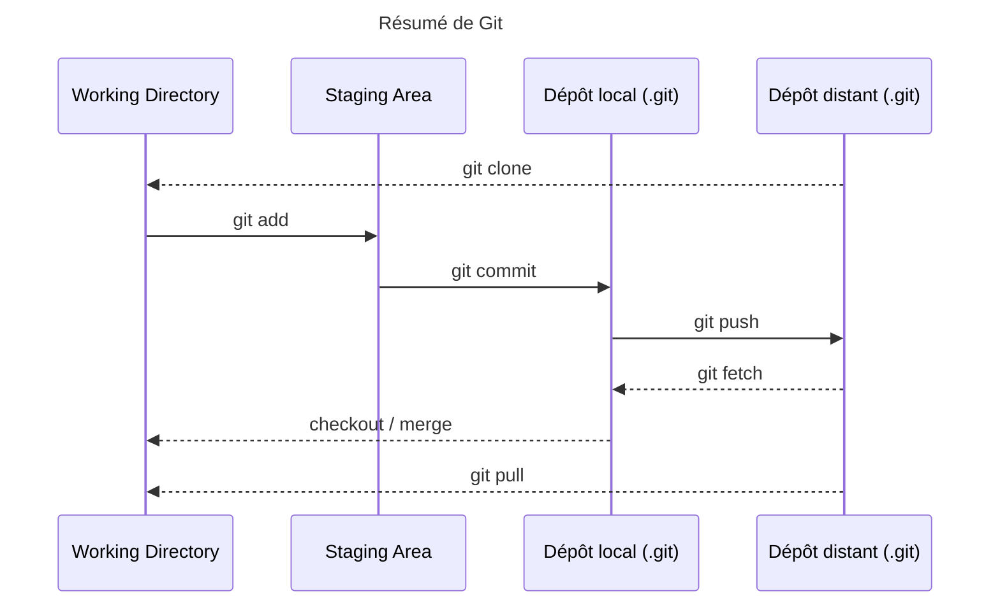

#   Git™

## 💡 Résumé des bases

1. `git rev-parse --show-toplevel` : Vérifier le répertoire parent contenant le dossier `.git`
2. `git add -p` : Ajoutez des modifications partie par partie. Idéal pour des commits propres et ciblés.
3. `git commit mon_fichier` : Ignore les changements en staging et crée un commit contenant la version actuelle d'un fichier déjà connu
4. `git commit -a` : Ajoute au staging les états actuels de tous les fichiers déjà connus par Git et en crée un commit.
5. `git commit --amend` : Modifiez votre dernier commit : corriger un message, ajouter un fichier oublié.
6. `git reset --soft HEAD~1` : Annulez le dernier commit en conservant vos modifications. ⚠️  Attention avec l'option `--hard` qui supprime définitivement les modifications
7. `git stash / git stash pop` : Mettez de côté vos modifications temporairement. Idéal pour switcher rapidement de branche.
8. `git cherry-pick <commit-hash>` : Appliquez un commit spécifique d'une autre branche.
9. `git branch -d <branch-name>` : Nettoyez vos branches locales inutilisées.
10. `git log -- <file>` : Visualisez l'historique d'un fichier spécifique (attention à l'espace après `--`).
11. `git blame <filename>` : Identifiez qui a modifié chaque ligne de code.
12. `git bisect` : Trouvez le commit qui a introduit un bug grâce à une recherche dichotomique.
13. `git merge --abort` : Annulez une fusion problématique.
14. `git log --grep="xxx"` : Recherchez dans les messages de commit.
15. `git tag -a v1.0 -m "Version 1.0"` : Marquez les moments importants de votre projet avec des tags.
16. `git clean -fd` : Nettoyez votre espace de travail. ⚠️utilisez d'abord `git clean -n` pour prévisualiser les suppressions
17. `git reflog` : Visualisez l'historique de toutes les opérations Git.
18. `git rebase -i HEAD~<n>` : Réorganisez vos commits. ⚠️ À éviter sur des branches partagées.
19. `git revert <commit-hash>` : Annulez proprement un commit sans réécrire l'historique.
20. `git fetch --all --prune` : Synchronisez et nettoyez votre repo en une commande.
21. `git log --graph --oneline --all` : Visualisez graphiquement l'historique de toutes vos branches.
22. `git log --name-status` : Affiche le nom des fichiers modifiés (et leur status, sinon `--name-only`)
23. `git log --source --all` : Ajoute l'information de branche pour chaque commit
24. `git diff --staged` : Examinez les modifications qui sont dans la staging area avant de commiter.
25. `git show <commit-hash>` : Affichez les détails complets d'un commit spécifique.
26. `git archive` : crée une archive contenant les fichiers d'un commit ou d'une branche sans inclure l'historique Git

## 📑 Documents

- [🤓 Cours](/git/cours)
- [💻 TP - Premiers pas : installer & configurer git et les concepts de base](/git/tp-commit)
- [💻 TP - gitignore : utiliser le fichier spécial `.gitignore` pour masquer des fichiers à Git](/git/tp-gitignore)
- [💻 TP - Utiliser l'historique de Git™](/git/tp-historique)
- [💻 TP - Github® et dépôts distants](/git/tp-github)
- [💻 TP - Les branches Git™](/git/tp-branches)
- [💻 TP - Recherche dans un dépôt Git™](/git/tp-grep)
- [💻 TP - Les tags](/git/tp-tags)
- [💻 TP - Workflows Git™ et Pull Request](/git/tp-workflows-pr) : _à réaliser en binôme._
- [💻 TP - Fork : découvrir le principe du fork pour partager des changements sur un logiciel sans impacter le dépôt officiel](/git/tp-fork)
- [💻 TP - Git™ Bisect pour trouver un commit par dichotomie](/git/tp-bisect)
- [💻 TP Github - Utiliser les Gist](/git/tp-github-gist)
- [💻 TP Github - Les actions (introduction à la CI)](/git/tp-github-actions)
- [💻 TP - Git pour un Projet XAMPP](/git/tp-xampp) : Configurer un environnement de développement local avec XAMPP et utiliser Git pour versionner une application web stockée dans le dossier `htdocs`.
- [💻 TP utiliser Ansible et Git pour réaliser de l'Infrastructure-as-Code](/git/tp-ansible)
- [💻 TP - Intégrer Git dans un IDE](/git/tp-ide)
- [💻 TP - Manipulations avancées de la HEAD](/git/tp-deplacer-head-avance)
- [💻 TP Neovim - gérer ses configurations avec Git](/git/tp-iac-nvim)
