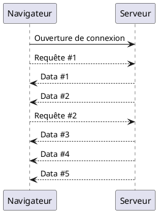
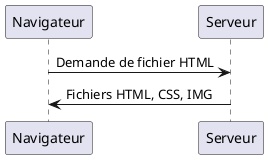

## Bonnes pratiques générales

---

### Gestion de projet

- Penser l'écoconception dès le début du projet
- À suivre et faire évoluer pendant tout le cycle de vie du projet et du produit
- Définir des objectifs et des indicateurs (KPI) clairs et mesurables
- À inclure dans la gestion de projet : suivi, rétroaction, ...

---

### Ne pas ajouter de fonctionnalités inutiles

- Éliminer les fonctionnalités non essentielles ;
- Quantifier précisément le besoin ;
- Favoriser un design simple.
  - Plus de code à développer, à maintenir, ...
  - Simplifie l'expérience utilisateur (`UX`)
  - Risque de sécurité
- Bonne pratique générale (même sans parler d'écoconception).
- exemple : <https://www.google.com/>

---

### Mettre en place un plan de “fin de vie”

- Prévoir la fin de vie :
  - du code
  - des déploiements
  - des souscriptions aux services externes
  - du stockage des données
  - ...

---

### Limiter la vidéo

- 2023 : streaming vidéo => 300Mt de CO2/an (1% des émissions mondiales)
- 1/2 de l'impact du trafic aérien civil
- en forte augmentation
- YouTube : 20% des émissions liés à la vidéo
- [source : streamlike.fr](https://www.streamlike.fr/sobriete-numerique/)
- [Voir aussi le rapport du Shift Project sur la vidéo (2019, corrigé en 2020)](https://theshiftproject.org/article/climat-insoutenable-usage-video/)
- [Voir l'étude de CarbonBrief sur le streaming](https://www.carbonbrief.org/factcheck-what-is-the-carbon-footprint-of-streaming-video-on-netflix/)

---

### Utiliser des patterns performants et efficients

- I/O non bloquants : `NodeJS`, `Vert.x`, ...
- Programmation réactive : `Spring Boot 2`, ...
- Protocole sans état (`statelesness`)

---

### Utiliser des "circuit breakers"

- Permet d'éviter d'appeler encore et encore des composants en erreur.
- À déployer dans le backend et le frontend, surtout pour les services non critiques.
- Voir [la règle dédiée (4032) des 115 bonnes pratiques](https://github.com/cnumr/best-practices/blob/main/src/content/fiches/fr/RWEB_4032-mettre-en-place-un-circuit-breaker.mdx)

---

## Frontend

---

### Frontend >> Backend

- Le frontend est utilisé par tous les clients :
  - impact sur le renouvellement des terminaux clients (smartphone, PC, ...)
  - chaque changement se répercute sur tous les chargements clients
- ex : -20kB dans le JS de `Mailchimp` pour `Wordpress` => -60t CO2 par mois [source : blog dannyvankooten](https://www.dannyvankooten.com/blog/2020/website-carbon-emissions/)

---

### Dépendances

- Attention à la gestion des dépendances :
  - Frontend : tous les clients doivent les télécharger
  - Backend : important aussi mais impact plus limité

---

### Site statique

- Utiliser un site statique pour les sites d'information sans input utilisateur
  - ex : <https://gohugo.io/>
  - `Wordpress` : ~60% du Web (2023). Très lourd, souvent contenu statique uniquement

---

### Lazy-loading

- Utiliser le chargement paresseux (lazy-loading)
- La ressource ne sera peut-être jamais téléchargée

---

### UX fluide

L'application capitaine train

---

### Alternative texte

- Fournir une alternative texte brut à la vidéo ou aux formats binaires
  - Accessibilité
  - Référencement
  - ...

---

### Autoplay, autoload

- Éviter de lancer automatiquement des contenus (vidéo, ...) sauf à la demande de l'utilisateur
- Ne pas charger tout le site / toute la page tant que l'utilisateur n'accède pas au contenu

---

### Limiter les clients lourds

- Utiliser du code `JavaScript` avec parcimonie
- Utiliser du code peu gourmand en ressources
- Limiter la taille du `Domain Object Model` (`DOM`) :
  - attention aux framework qui peuvent générer des DOM conséquents.
  - [source : Le DOM comme métrique de suivi de sobriété du web ? (greenspector.com)](https://greenspector.com/fr/le-dom-comme-metrique-de-suivi-de-sobriete-du-web/)

---

### Supporter d'anciens modèles clients

- Formats de fichiers non supportés
- Technologies récentes imposées
- Ressources nécessaires trop importantes : RAM, bande passante, ...
- _Qui peut le plus peut le moins_

---

### HTTP/2

- 1 connexion pour plusieurs requêtes
  - Plus économe en bande passante
- Possibilité de `push` de fichiers depuis le serveur en avance
- **Supporter aussi `HTTP/1` pour anciens modèles clients !**

---

---

---

### CDN

- Utiliser des _Content delivery network_
- Mets à disposition le contenu du frontend depuis un serveur proche du client

---

### Cache du navigateur

- headers `Expires` et `CacheControl`
- `ETags`
- fichier `manifest`
- `web workers`

---

### Polices

- Utiliser des polices standard installées par défaut sur tous les terminaux

---

### Images

- Voir le [cours sur l'accessibilité](/archi/accessibilite).
- [Préférer les CSS aux images (voir règle 23 du référentiel 115 bonnes pratiques](https://github.com/cnumr/best-practices/blob/main/src/content/fiches/fr/RWEB_0023-preferer-les-css-aux-images.mdx)

---

### Éviter les transferts inutiles

- La librairie [flamethrower](https://github.com/fireship-io/flamethrower) permet recharger uniquement les parties changeant d'une page à l'autre.
  - transforme un site statique en Single Page Application (SPA).

---

## Backend

---

### Choisir son langage

- Éviter `Python` : 76x plus d'énergie que le `C`…
- …mais au final peu impactant

---

### Gérer le cache des données côté Backend

- Données de session utilisateur
- Requêtes à la base de données
- …

---

### Mutualisation

- Machine virtuelle / Docker pour déploiements mutualisés
- Attention : cloud == green n'est pas automatique
- Mutualiser les appels aux dépendances (BDD, services externes...) pour récupérer toute la donnée en 1x

---

### Mise à jour

- Les langages et framework deviennent de plus en plus performants et frugaux en énergie
- Passer à la dernière version de `Node.js`, `Java`, ...

---

### Compression les données échangées

- Voir [la règle dédiée (78) des 115 bonnes pratiques](https://github.com/cnumr/best-practices/blob/main/src/content/fiches/fr/RWEB_0078-compresser-les-fichiers-css-javascript-html-et-svg.mdx)

---

### Désactiver les logs binaires en BDD

- Voir [la règle dédiée (106) des 115 bonnes pratiques](https://github.com/cnumr/best-practices/blob/main/src/content/fiches/fr/RWEB_0106-desactiver-les-logs-binaires.mdx)

---

### Proximité géographique

- `CDN` pour frontend
- Utiliser également un backend proche des clients :
  - évite d'engorger le réseau
  - meilleures performances

---

### Choisir son hébergeur

- `ISO 14001` : prise en compte des problématiques écologiques
- `ISO 50001` : Bonne gestion de l'énergie
- Utilise la chaleur générée pour autre chose
- Fait des achats durables
- Réutilise les anciens composants
- Évite le Greenwashing en se disant "neutre en carbone"
- Bonus : Sécurité des donnés : `ISO 27001`

---

## Gains transverses

---

### Accessibilité

- _Mobile-first_
- Limite la fracture numérique
- Design et implémentation pour états dégradés en priorité :
  - limite la consommation de ressources
- Voir le [cours sur l'accessibilité](/archi/accessibilite).

---

### Performance

- Application légère
- Consommation de ressources limitées

---

### Maintenance

- Limiter les fonctionnalités
- Code clean facile à maintenir

---

### Sécurité

- Pas de dépendances inutiles
- Limite la couverture d'attaques

---

## Points à surveiller

---

### Cryptomonnaies

- Gros impact : très énergivore et beaucoup de matériel performant.
- Grosses différences d'impact suivant : type de cryptomonnaies et pays d'émission de l'électricité.
- `Bitcoin` : 60.78 Mt CO2e (GES total /an si émissions continues de GES au rythme actuel). [Universite de Cambridge](https://ccaf.io/cbeci/ghg/index)
- Émissions `Bitcoin` x16 de 2017 à 2021. [Selectra](https://selectra.info/energie/actualites/insolite/bitcoin-consommation-electricite)
- Chine principal producteur de `Bitcoin` jusqu'en été 2021 (interdit depuis politique de neutralité carbone).
- `Proof of Stake` >> `Proof of Work` : réduction drastique des émissions (jusqu'à 99.9%), voir [PoS in Ethereum](https://ethereum.org/en/developers/docs/consensus-mechanisms/pos/) et [PoS vs PoW (Ethereum)](https://ethereum.org/en/developers/docs/consensus-mechanisms/pos/pos-vs-pow/).

---

### Intelligence Artificielle

- Entraînement d'IA : calculs x300 000 depuis 2012 [source : OpenAI](https://openai.com/index/ai-and-compute/)
- 1 version de `BERT` (modèle de langage de `Google`) : 652 kg CO2e. Modèle complet : 300t CO2. [source : Timnit Gebru (google)](https://www.technologyreview.com/2020/12/04/1013294/google-ai-ethics-research-paper-forced-out-timnit-gebru/)
- Solutions :
  - apprentissage par transfert (réutiliser modèle existant)
  - "edge computing" (exécution proche des données)

---

### Bloquer la publicité

- Génératrice de nombreux flux vidéo
- Exemple : utiliser des filtres `DNS` [comme dans ce wiki (sebsauvage.net)](https://sebsauvage.net/wiki/doku.php?id=dns-blocklist)

---

### E-Mails

- Limiter la taille des pièces jointes
  - sinon souvent téléchargé automatiquement
  - préférer un lien vers un dépôt cloud 
- Supprimer les mails inutiles et trop anciens (impact faible : 1Go => -26g CO2e vs garder un PC 3ans de + => -250kg CO2e)
- Ne pas surutiliser le mail (notifications, ...) : engorge le réseau
- Impact global du mail [généralement assez faible](https://company.ovo.com/think-before-you-thank-if-every-brit-sent-one-less-thank-you-email-a-day-we-would-save-16433-tonnes-of-carbon-a-year-the-same-as-81152-flights-to-madrid/)
- [Empreinte carbone d'un email (carbonleteracy.com)](https://carbonliteracy.com/the-carbon-cost-of-an-email/)

---

### Stockage de documents

- Privilégier des serveurs de stockage proches géographiquement
- Ne pas archiver ce qui est inutile
- Avoir une vraie politique de gestion documentaire et des données

---

### Exemples à ne pas reproduire

- Ancienne page d'accueil airbnb : 170 requêtes au backend
- Microsoft Word :
  - ~ mêmes fonctionnalités, passé d'une utilisation totale de ~1MB à ~2GB de Ram
  - pour une même fonctionnalité, 114x plus de RAM

---

### Exemples à reproduire

- Voyage sur la Lune : 72Ko RAM et Stockage
- `Bing` : -20% d'éléments affichés => -80% de charge serveur
- Le ticket de tram par `SMS` (`Tag Grenoble`) : utilisable avec tout téléphone
- [Site Web de Tim Berners-Lee (inventeur du Web)](https://www.w3.org/People/Berners-Lee/)
- Le [site](https://www.grenoblealpesmetropole.fr/) de la métropole Grenobloise [récompensé](https://www.greenit.fr/2023/04/07/ecoconception-grenoblealpesmetropole-fr-recompense/)
- <https://www.google.com/>
- <https://www.wikipedia.org/>
- <https://craigslist.org/> : 1er site de petites annonces aux USA
- <https://www.kairos-jourdain.com/>
- <https://www.ademe.fr/une-logique-d-ecoconception/>

---

## Ressources

---

### Éco-conception (général)

- <https://github.com/you-dont-need/You-Dont-Need>
- [Conférence GreenIT, Agile & Craftsmanship, M. GUILLIOT & R. LEMAIRE, Agile Tour Montpellier 2022 (vidéo youtube)](https://www.youtube.com/watch?v=FCLi5pJXiJA)
- [Romuald Priol. Conférence DevFest 2020 : Pourquoi l'avenir du numérique est responsable ? (vidéo youtube)](https://www.youtube.com/watch?v=M8Hi1jbr7Hw)

---

### Développement Web et mobile

- [W3 : Web Sustainability Guidelines](https://www.w3.org/community/sustyweb/2023/09/07/web-sustainability-guidelines/)
- <https://github.com/cnumr/best-practices-mobile>
- [Cours Numérique Responsable : Écoconception d'applications mobiles (enseignerleclimat.org)](https://enseignerleclimat.org/resource/82)
- [Empreinte carbone d'un site Web (blog dannybankooten)](https://dannyvankooten.com/website-carbon-emissions/)
- [Cas d'étude de youtube.com (blog temesis.com)](https://www.temesis.com/blog/youtube-com-un-modele-de-performance-web-environnementale/)
- [Impact écologique du numérique : que faire en tant que professionnel du web ?](https://www.24joursdeweb.fr/2018/impact-ecologique-du-numerique/)
- [Maciej Cegłowski, Talk material : "The Website Obesity Crisis"](https://idlewords.com/talks/website_obesity.htm) et <https://danluu.com/web-bloat/>
- https://speakerdeck.com/brad_frost/for-a-future-friendly-web
- https://blog.chriszacharias.com/page-weight-matters (ex YouTube developer)

---

### Outils

- <https://ecoresponsable.numerique.gouv.fr/publications/boite-outils/>
- [NumEcoDiag : Outil et extension navigateur d'évaluation d'écoconception (ecoresponsable.numerique.gouv.fr)](https://ecoresponsable.numerique.gouv.fr/publications/referentiel-general-ecoconception/numecodiag/)

---

#### Outils Backend

- Librairies Python `Carbontracker` et `Experiment impact tracker` (consommation serveurs)
- <https://www.green-algorithms.org/>
- Machine Learning : librairie Python `CodeCarbon` et <https://mlco2.github.io/impact/>
- Consommation énergétique backend :
  - <https://github.com/hubblo-org/scaphandre>
  - <https://powerapi.org/>
  - Interfaces des fournisseurs de Cloud IaaS

---

#### Outils Frontend

- `Lighthouse` (`Chrome dev tools`)
- `Android Studio` (compatibilité anciens terminaux)
- [Extension pour navigateur GreenIT-Analysis](https://www.greenit.fr/2019/07/02/web-evaluez-lempreinte-dune-page-en-un-clic/)
- Calcul de l'empreinte carbone d'un site Web :
  - <https://www.websitecarbon.com/>
  - <https://www.ecoindex.fr/>
  - <https://kastor.green/>
- Calculer le "bloat score" d'un site web : <https://www.webbloatscore.com/>
- Calcul de performance d'un site web : <https://gtmetrix.com/>

---

