## 📘 Rappel - Cycle de vie du projet
- Représente les différentes étapes par lesquelles passe un projet depuis sa conception jusqu'à sa clôture. 🔄
- Essentiel pour positionner le cahier des charges de manière appropriée. 🎯

---

### 1. Initiation

- Marque le début du projet. 🚀
- C'est le moment où le besoin ou l'opportunité est identifié. 💡
- Le cahier des charges n'est pas encore élaboré, mais cette phase est cruciale pour fixer les objectifs globaux du projet. 🌍

---

### 2. Planification

- Le projet est détaillé et structuré. 📝
- Le cahier des charges commence à prendre forme en identifiant les besoins et les exigences. 📋
- Précise les étapes, les ressources nécessaires et les délais à respecter. ⏰

---

### 3. Exécution

- Cœur du projet. ❤️
- Les activités décrites dans le cahier des charges sont mises en œuvre. 🛠️
- La collaboration entre les parties prenantes, la MOA et la MOE est essentielle pour assurer que le projet avance conformément aux spécifications. 🤝

---

### 4. Surveillance et contrôle

- Les performances du projet sont surveillées par rapport au cahier des charges. 🔍
- Les ajustements sont faits si nécessaire pour garantir que le projet reste sur la bonne voie. 🛤️

---

### 5. Clôture

- Marque la fin du projet. 🏁
- Le cahier des charges est revu pour s'assurer que tous les objectifs ont été atteints. ✅
- Le projet est livré aux parties prenantes et une évaluation est effectuée pour tirer des leçons pour les projets futurs. 📚

---

### Recette fonctionnelle

- Vérifie que les engagements du prestataire sont en adéquation avec les besoins spécifiés dans le cahier des charges. 🔎
- Conduit à l’acceptation ou au rejet de la solution. ✔️❌
- Divisée en deux étapes :
  - La vérification d’aptitude (VA) : vérifie les caractéristiques fonctionnelles du CDC (test grandeur nature). 🧪
  - La vérification de service régulier (VSR) : vérifie le bon fonctionnement du système en exploitation normale (utilisation réelle). 🔄

---

## 🎯 Enjeux du CDC

---

### Clarification des attentes

- Définit les besoins et les attentes du projet de manière détaillée. 📌
- Permet d'éviter les malentendus entre les parties prenantes et garantit une compréhension commune des objectifs. 🤝

---

### Communication transparente

- Permet la communication entre la MOA et la MOE. 🗣️
- Les rôles, les responsabilités et les attentes de chaque partie sont clairement définis, ce qui réduit les risques de conflits. 🛡️
- C'est *le lien factuel et concret* qui assure la compréhension entre toutes les parties prenantes du projet. 🔗
Les cahiers des charges sont des documents de référence :
- pour la **MOA** (cahier des charges fonctionnel) 📄
- pour la **MOE** (cahier des charges technique) 📑

---

### Évaluation des coûts et des délais

- Fournit les détails nécessaires pour estimer les ressources, les coûts et les délais du projet. 💰⏳
- Aide à planifier de manière réaliste et à éviter les dépassements budgétaires et les retards. 📉

---

### Gestion des risques

- Contribue à la gestion des risques en identifiant les besoins et les contraintes dès le départ. 🚨
- Les risques potentiels peuvent être anticipés et des stratégies d'atténuation appropriées mises en place. 🛡️

---

### Orientation de la conception

- Oriente la conception des solutions. 🎨
- Les spécifications fonctionnelles et techniques servent de base pour le développement, garantissant que les produits finaux répondent aux exigences. 🏗️

---

### Cadre pour l'évaluation

- Sert de base pour évaluer si le projet est achevé conformément aux spécifications. 📏
- Évite les litiges ultérieurs et garantit que le résultat final est conforme aux attentes initiales. ⚖️

---

### Support pour les Appels d'Offres

- Lorsque le projet implique une externalisation ou une soumission à des fournisseurs, un cahier des charges bien défini est essentiel. 📢
- Il fournit aux soumissionnaires les informations nécessaires pour proposer des solutions précises. 🎯

---

### Orientation stratégique

- Aligne le projet sur les objectifs globaux de l'organisation. 🎯
- Garantit que le projet contribue aux priorités et aux résultats souhaités. 🏆

---

## 📚 Différents types de cahier des charges

Le cahier des charges est un document qui décrit les fonctions que devra remplir la solution à l’issue du projet, ainsi que ses spécifications techniques et les besoins auxquels elle devra répondre. 📝
Il peut être utilisé dans différents contexte, en interne comme en externe (appels d’offre, marchés publics…) et a notamment pour but de faire gagner du temps aux différents intervenants dans la compréhension du projet. ⏳

---

On distingue le _cahier des charge technique_ du _cahier des charges fonctionnel_. 🔍
- Le premier s’intéresse particulièrement aux **exigences et contraintes techniques** du produit 🛠️
- Le second se focalise sur les besoins **fonctionnels et la manière** dont la solution y répond 🎯

---

Le cahier des charges techniques peut toutefois n’être que la partie technique d’un cahier des charges plus global, qui énumère les contraintes de différents types :
- Économiques 💰
- Industrielles 🏭
- Environnementales 🌱
- Matérielles… 🛠️

---

## 🏛️ Organisations Réglementaires ou Légales

- Les régulations et contraintes légales peuvent avoir un impact significatif sur le projet. ⚖️
- Le CDC doit prendre en compte ces contraintes pour garantir la conformité et minimiser les risques juridiques. 🛡️

---

## 🔄 Méthodes Agiles et CDC

---

### 📌 Rappel : Méthodes Agile
- Approches de gestion de projet flexibles qui mettent l'accent sur la collaboration, l'adaptabilité et la livraison itérative. 🤝

---

### Réponse au changement

Les méthodes agiles reconnaissent que les besoins évoluent pendant le projet et le cahier des charges est conçu pour être ajusté en conséquence :
- CDC initial détaillé pour les premières itérations 🔄
- Itérations ultérieures ajoutées au fur et à mesure. 🔄
- Révisé à chaque itération pour inclure de nouvelles exigences ou ajustements. 🔄

---

### User Stories

Les besoins sont exprimés sous forme de courtes "User Stories", ce qui permet une compréhension rapide et une implémentation itérative. 📖

---

## 📄 Cahier des charges fonctionnel

---

### Le CCF

:::strong
Rédiger un CCF c’est **exprimer et formaliser le besoin**. 📝
:::

C'est donc un document qui présente de manière détaillée et structurée les **attendus** d'un projet (services, produit) et ses **contraintes** (techniques, managériales, contextuelles).

En principe, c'est le livrable qui sanctionne la **fin de la phase de lancement** d'un projet. 🏁

C’est aussi un **outil d'évaluation** capital en **fin de projet** : il permet de mesurer les éventuels écarts entre les objectifs exprimés au cours de l’initiation du projet et les solutions proposées au final. 📏

---

### Contenu du CCF

- **Description générale** : Présentation du projet, de son contexte et de ses objectifs. 🌍
- **Fonctionnalités** : Détaillées de manière exhaustive, chaque fonctionnalité est décrite avec précision. 🛠️
- **Exigences** : Besoins spécifiques en termes de performances, de sécurité et d'intégration. 🔒
- **Contraintes** : Limitations techniques, budgétaires ou temporelles. ⏳
- **Interfaces** : Interactions avec d'autres systèmes ou composants. 🔄

---

### Contexte

Expliquez en quelques mots le fondement de la demande. Il ne suffit pas simplement d’exprimer l'aspect technique d’un projet, une vue générale aidera les prestataires à comprendre mieux et plus rapidement les tenants et aboutissants du projet. 🌍

> Exemple : Pour un site web, ne décrivez pas seulement vos attentes, parlez également des ressorts qui vous ont poussé à opérer un changement de site web ou encore la typologie de vos clients par exemple. 🌐

---

### Objectif

Expliquez de façon complète les différents objectifs du projet : quelle seront les finalités du projet pour votre entreprise? 🎯

> Exemple : Pour un site web, le objectifs commerciaux et/ou marketing du site doivent être clairement rédigés. Ces objectifs ont une influence majeure sur les différents travaux qui seront mis en place pour réaliser le projet. 📈

---

#### Objectifs quantitatifs vs qualitatifs

- **Objectif quantitatif** : mesurable en chiffres ou en données tangibles : ventes, temps de réponse, etc. 📊
- **Objectif qualitatif** : améliorer la qualité, l'expérience utilisateur ou la satisfaction client. 😊

---

### Périmètre

Expliquez de façon succincte les limites de votre projet. Vous répondrez ainsi aux questions : À qui s’adresse-t-il ? À quel moment ? 🔍

> Exemple : Le projet implique-t-il tous les partenaires ? Tous les clients sont-ils concernés ? Tous les pays ? 🌍

---

### Fonctionnement

Décrivez de manière exhaustive les différents leviers du projet à travers une description fonctionnelle qui consiste à expliquer les besoins en terme de fonctionnalités. 🛠️

> Exemple : Expliquez en quelques mots ce que doit faire votre site web : récupérer des contacts, vendre des produits, proposer une inscription à la newsletter 📧

---

### Ressources

Listez l’ensemble des ressources disponibles ainsi que les contraintes pour la réalisation du projet. 📋

> Exemple : Le nombre d’employés qui s’occupera de la gestion du site web ou encore leur faible connaissance des outils informatique. 👥

---

### Budget

Établir un budget est important pour aiguiller les prestataires et éviter une déconvenue lors de la réception des premiers devis. 💰

> Exemple : Donnez le budget total d’un projet de création de site avec la rédaction, l'hébergement, le webdesign et le développement. 💸

---

### Délais

Autre variable déterminante, le délai de réalisation et la date de livraison. Elle permet au prestataire d’évaluer la durée de travail et de s’organiser. Pour vous, le délai indiqué sur le cahier des charges sert de preuve. ⏳

> Exemple : la durée inscrite sur le cahier des charges peut être inscrite sur le devis et la facture du prestataire. 📅

---

## 📏 Cadrage du projet

---

### Délimitation du Périmètre

- Définir les limites et les frontières du projet, ainsi que les fonctionnalités et les exigences incluses dans le cahier des charges. 🔍
- Évite les déviations et garantit la focalisation sur les besoins essentiels. 🎯

---

### Identification des Parties Prenantes et des Responsabilités

- Clarifier les parties prenantes impliquées dans le projet et définir leurs rôles et responsabilités. 👥
- Favorise la communication et la collaboration en établissant des lignes directrices claires pour la participation de chacun. 🗣️

---

### Évaluation des Contraintes et des Limitations

- Toutes les contraintes et limitations liées au projet, telles que les contraintes budgétaires, les contraintes de temps et les contraintes techniques, doivent être évaluées lors du cadrage de la demande. ⚠️
- Cette évaluation préliminaire permet d'ajuster les attentes en conséquence. 📉
- Inclut les technologies à utiliser, les normes de sécurité à respecter et les exigences de performance à atteindre. 🛡️

---

### Création d'un Document de Référence

Le résultat du cadrage de la demande est généralement formalisé dans un document de référence, qui peut être appelé "_charte de projet_" ou "_note de cadrage_". 📄
Sert de base pour la rédaction ultérieure du cahier des charges fonctionnel. 📝

---

## 📝 Décision et engagement

La décision finale de valider le cahier des charges implique l'engagement formel des parties prenantes dans le projet. ✍️
Cette étape marque le début de la phase de réalisation, où la maîtrise d'œuvre commence à concevoir et développer la solution conformément aux spécifications du cahier des charges. 🏗️

---

## 🛠️ Outils pour l'analyse des besoins

---

### Fiches de Fonctionnalités

- Ces documents détaillent les fonctionnalités attendues du système ou de l'application. 📝
- Chaque fiche décrit en quoi consiste la fonction, son objectif et son importance. 🎯

---

### Questionnaires , Enquêtes et Ateliers

- Les questionnaires permettent de recueillir les informations auprès des parties prenantes de manière structurée. 📋
- Les enquêtes permettent d'obtenir des informations externes concernant tout ce qui a trait à l’expérience client (questions ouvertes). 📊
- Les ateliers, quant à eux, réunissent différentes parties prenantes pour discuter et définir collectivement les besoins. 🗣️

---

#### Exemples de questions pour l’analyse des besoins

---

##### Questions liées au taux de réussite

- Quelles sont les activités nécessaires à l’atteinte de nos objectifs ? 🎯
- Quelle est la probabilité pour que notre solution fonctionne ? 📊
- Quelles sont les tâches à accomplir pour répondre à nos besoins ? 📋

---

##### Questions liées aux performances

- Quels sont les KPI utilisés pour évaluer nos performances ? 📈
- Dans quels cas considère-t-on les performances comme excellentes ? 🏆
- À quel niveau se situent nos performances actuelles ? 📊

---

##### Questions d’ordre opérationnel

- Quelles sont les parties prenantes concernées ? 👥
- À quel moment du processus le besoin se fait-il sentir ? ⏳
- À quelle fréquence ce besoin fait-il son apparition ? 🔄

---

### Matrice de Traçabilité des Exigences (IEEE 380)

- Cette matrice lie chaque exigence ou fonctionnalité aux parties prenantes, aux objectifs du projet et aux tests de validation. 🔗
- Elle permet de suivre la couverture des besoins tout au long du projet. 📊

---

Exemple de matrice des exigences

---

### 📊 Diagrammes de Cas d'Utilisation

- Ces diagrammes décrivent comment les utilisateurs interagissent avec le système. 👥
- Ils permettent d'identifier les scénarios d'utilisation et les fonctionnalités nécessaires. 🔍
- Ils aident aussi à identifier les rôles et les responsabilités dans un système. 🛠️

---

#### Exemple de Diagramme de Cas d'Utilisation 📋

```mermaid
---
title: Système de gestion de bibliothèque
---
flowchart TD
    %% Acteurs
    user(["🧑 Utilisateur"])
    librarian(["👩‍🏫 Bibliothécaire"])

    %% Cas d'utilisation
    rechercher(["(Rechercher un livre)"])
    emprunter(["(Emprunter un livre)"])
    retourner(["(Retourner un livre)"])
    inscription(["(S'inscrire à la bibliothèque)"])
    gerer(["(Gérer les emprunts)"])
    ajouter(["(Ajouter un nouveau livre)"])
    supprimer(["(Supprimer un livre)"])

    %% Relations utilisateur
    user --> rechercher
    rechercher --> emprunter
    user --> retourner
    user --> inscription

    %% Relations bibliothécaire
    librarian --> gerer
    librarian --> ajouter
    librarian --> supprimer
```

Exemple de diagramme de cas d'utilisation pour un système de gestion d'une librairie.

---

### 📊 Analyse des Données Existantes

L'examen des données existantes, comme les rapports d'activité ou les retours des utilisateurs, peut fournir des informations précieuses sur les besoins à prendre en compte. 🔍

---

## 📈 Hiérarchisation des besoins

---

### Recensement et hiérarchisation

- Identifiez toutes les fonctionnalités nécessaires pour atteindre les objectifs du projet. 🎯
- Chaque fonctionnalité représente une action ou une caractéristique que le système doit fournir. 🛠️
- Classez les fonctionnalités en termes de priorité : essentielles, importantes, souhaitables. 🏷️

---

### Matrice de priorisation

- Utilisez une matrice de priorisation pour organiser les fonctionnalités en fonction de leur impact et de leur complexité. 📊
- Organisez des ateliers avec les parties prenantes pour discuter et définir la priorité des fonctionnalités. 🗣️

---

Exemple de matrice de priorisation

---

### 📊 Diagramme de Kano

Voir le [cours de gestion de projet sur le diagramme de Kano](/projet/kano). 📚

---

### 🔍 Analyse fonctionnelle

- Vise à décomposer le système ou le projet en sous-systèmes, composants et fonctionnalités pour en comprendre le fonctionnement global et les interactions entre les différentes parties. 🧩
- Permet d'assurer que toutes les exigences sont correctement prises en compte et de garantir la cohérence du cahier des charges. ✅

---

## 📝 Méthodologie d'écriture du CCF

---

### Contexte et présentation du projet

Décrire le contexte et la démarche, et dresser un éventuel historique des précédents projets similaires. 📜

---

#### Exemple :

« Développement d’une nouvelle application mobile » 📱
Contexte : application mobile liée au site [monsite.com](https://www.monsite.com) et reprenant ses fonctionnalités, en y ajoutant une messagerie instantanée. 💬
Objectif : offrir une expérience utilisateur supérieure sur mobile. 🌟
Historique : réalisation d’une première version de l’application (V1) il y a 1 an. 📅

---

### Besoins et contraintes liés au projet

Décrire la solution à travers :
- L’analyse et l’expression de ses besoins fonctionnels 📋
- Ses contraintes techniques et son architecture 🏗️
- Toutes les exigences particulières inhérentes au projet 🔍

---

#### Exemple :

Besoins fonctionnels : accéder aux fonctionnalités de [monsite.com](https://www.monsite.com) à partir de l’application mobile (consultation de profils, lecture d’articles), utiliser une messagerie instantanée pour fluidifier la communication entre les membres du site… 📲
Contraintes : développement en `Java` et en `Objective C`, application destinée à `Android` et à `iOS` (deux versions), soumission et déploiement sur les app stores à la charge du prestataire. 📦

---

### Diagramme bête à corne

On pourra modéliser le besoin à l'aide d'un diagramme _bête à corne_ :

Le diagramme bête à cornes

---

Exemple de diagramme bête à cornes

---

## 🎯 Résultats attendus

Prestations et/ou produits effectivement attendus à l’issue du projet et les exigences particulières conditionnant leur acceptation.

---

### Exemple :

Résultats attendus : création de maquettes, intégration, développement effectif de l'application mobile, mise en ligne sur les `App Stores`, … 📲
Exigences : livraison des fichiers `PSD` / `Sketch`, respect de la charte graphique… 🎨

---

## 📌 Recommandations sur la forme

Pour être opérationnel, le cahier des charges fonctionnel doit être :

- **Concis** : privilégiez les phrases courtes et les tournures simples. Fixer un nombre de caractères ou de mots peut être une méthode utile pour ce faire. ✂️
- **Simple** : n’employez des termes techniques que lorsque cela est indispensable, utilisez des mots dépourvus d’ambiguïté ou de jugement. L'intérêt du projet (technique, organisationnel, financier) doit être démontré de manière claire. 🔍
- **Organisé** : le document doit être structuré par un plan avec des parties équilibrées et avoir un sommaire. 📑
- **Joli** : travailler la forme pour rendre ce document agréable à lire et motiver les destinataires à sa lecture. 🌈

---

## 🔍 Recommandations sur le fond

Pour réaliser le cahier des charges fonctionnel, on pourra se poser les questions suivantes en lien avec chacune des parties :

- Quel est le périmètre du projet ? 🔄
- Quel est le cycle de vie et quels sont les cas d'utilisation ? 🔄
- Quelles sont les fonctions attendues et leurs caractéristiques ? 🔄

---

## 📄 Cahier des charges technique

---

### Le cahier des charges technique

:::strong
Le cahier des charges technique est LE document de référence pour la **MOE**. 📑
:::

Il est utile à l’ensemble des équipes qui seront en charge de développer, d’installer et de tester les composants de votre projet. 🛠️

C’est l'un (le ?) document le plus important de votre projet. 🏆

---

Contrairement au cahier des charges fonctionnel, le cahier des charges technique décrit les moyens à mettre en œuvre pour arriver à un but.
_En cas de sous-traitance, votre sous-traitant est donc tenu à une obligation de moyen et pas de résultat._ ⚠️

---

### Format du cahier des charges technique

Globalement, il y a deux approches :

- créer un seul document pour l’ensemble de votre projet 📄
- créer un cahier des charges technique pour chacune des briques de votre projet, le tout chapeauté par un document de synthèse montrant la vue globale du projet. 📂

---

### Méthodologie

Il est possible d'écrire le cahier des charges technique soit :

- à partir du cahier des charges fonctionnel et l’amender de vos considérations techniques 🔧
- à partir d’un document vierge et le structurer de façon logique 📝

---
### Contenu

#### Rappel du contexte et des objectifs

Basée sur le contexte général du projet, cette section est reformulée pour s’adapter à la partie traitée.
Les objectifs sont également repris de notre cahier des charges fonctionnel et sont amendés par le fruit de notre analyse. 🔍

---

#### Exemple :

Préciser la nécessité d’initier une connexion avec le serveur de base de données de l’application de suivi des flux afin d’alimenter la table “Transaction” que nous avons définie lors de la définition de la base de données de notre solution. 📊

---

### L’architecture technique

Ce chapitre s’appuie essentiellement sur le dossier d'architecture technique et sur les règles d’architecture de l’entreprise.

On y trouve a minima :

- les framework de développement à utiliser 🛠️
- les middleware entrant en jeu 🔄

---

Et, pour chaque environnement technique (développement, intégration, tests, production, etc.) :

- Le schéma d’architecture de la couche technique, par exemple sous forme de [diagramme d'architecture d'application](https://www.edrawsoft.com/fr/article/application-architecture-diagram.html) ou via le modèle C4 très utilisé en agilité : [C4 model](https://c4model.com/) 📊
- La liste des composants avec :
    - La localisation 📍
    - La zone réseau 🌐
    - Le système d’exploitation et sa version 🖥️
    - Les capacités de performances (UC, mémoire) 💪
    - Les capacités de stockage : disques, `NAS`, `SAN`, … 💾
    - Les paramètres système particuliers ⚙️
    - L'adressage `IP` et le nom `DNS` 🌐
    - Les éventuels certificats 📜
    - Les middleware installés, leur version, les paramètres particuliers ⚙️
    - Les ports d’écoute 🔌
    - Le statut : existant, à mettre à jour, à construire 🏗️

---

### Le modèle physique de données (MPD) et la couche de persistance

Le cahier des charges technique décrit le MPD et la persistance du produit.
Il décrit également toute modification courante ou future des MPD existants.
Par exemple, on décrira l'utilisation d'une base de données existante et les modifications à y apporter pour soutenir notre projet. 📊

---

### La description des flux réseau

L'ensemble des flux réseau définis dans l'architecture technique sont définis avec précision.

Cette description vous permettra de demander l'ouverture des ports nécessaires à votre application sur chacun des pare-feu traversés.

- Serveur source (initie une connexion réseau) 🖥️
- Serveur cible 🖥️
- Les protocoles utilisés 🔄
- Les ports d’écoute 🔌
- Le sens d’ouverture des ports nécessaires : simple ou bidirectionnel 🔄

---

### La décomposition technique des fonctionnalités

Cette partie décortique le logiciel à développer et fournit aux développeurs le plus de précisions techniques possibles.

**Vous n’êtes pas développeur !**

Le but ici n’est pas d’écrire du code, mais d’expliquer clairement les attentes du projet.
N’hésitez pas à vous entourer d’experts sur le sujet afin de vous aider à apporter toutes les précisions nécessaires. 🛠️

---

### Format standard :

- Une introduction :
    - Le nom technique du programme : `dvf.exe` 📁
    - Les modes d’exécution : `batch`, interactif ainsi que la méthode de lancement 🚀
    - Les paramètres en entrée et en sortie 🔄
    - Les fichiers en entrée et en sortie, leur format et leur chemin 📂
- Description des fichiers en entrée et en sortie 📄
- Un organigramme général, éventuellement des organigrammes détaillés 📊
- Les algorithmes de chaque traitement 🧠

---

### Recommandations sur la forme

Encore plus que le cahier des charges fonctionnel, le cahier des charges technique est un document amené à évoluer régulièrement au cours de l'avancée du projet.

Il est donc important de pouvoir l’identifier clairement par un en-tête, de tracer son évolution dans un cartouche de versioning et d’identifier les acteurs intervenant sur ce document. 📝

---

#### Exemple d’en-tête :

La page de garde contient a minima :

- Le nom du projet 📛
- Le type de document et sa version 📄
- La date de la version 📅
- Le nom du rédacteur responsable 👤
- Sa société 🏢

---

#### Exemple de cartouche de versioning :

Ce cartouche contient a minima :

- Le numéro de version 🔢
- La date de version 📅
- Un résumé des évolutions apportées 📝
- Le nom du rédacteur 👤
- Le nom du correcteur ✍️
- Le statut de la version 📋

---

#### Exemple de liste de diffusion

Cette liste contient a minima :

- Les nom et prénom de chaque acteur 👥
- Leur rôle dans l’entreprise 🏢
- Leur rôle relatif au document 📄

---

## 📌 Qu'est-ce qu'un bon cahier des charges ?

---

- **Précis** : Notamment pour les fonctionnalités émergentes, le flou peut conduire à des déconvenues. 🎯
- **Prospectif** : Il ne s’agit pas de s’aligner sur les systèmes obsolètes mais de prendre en compte les évolutions en cours. 🔮
- **Concis** : Éviter un document démesurément épais et détaillé. ✂️
- **Réaliste** : Ne pas imaginer un système "qui fait tout" mais rester réaliste par rapport aux besoins réels et à la faisabilité technique et financière. 💸

---

# Ressources

- Exemples simples de projets avec mini cahiers des charges structurés sur [https://management-datascience.org](https://management-datascience.org/projects/).
- Les [marchés publics](https://www.marches-publics.gouv.fr/entreprise) possèdent des cahiers des charges très formels.
- [Granger, Laurent. Cahier des charges, exemple simple à utiliser [en ligne], Manager Go !. 13/01/2021](https://www.manager-go.com/gestion-de-projet/dossiers-methodes/elaborer-un-cdc)
- [Quelle est la différence entre un cahier des charges technique et fonctionnel ? [en ligne]. USSC plus. 15/11/2019.](https://www.usscplus.com/quelle-est-la-difference-entre-un-cahier-des-charges-technique-et-un-cahier-des-charges-fonctionnel/)
- [Vrossault, Bénédicte. Comment faire un cahiers des charges fonctionnel ?. Hubspot.](https://blog.hubspot.fr/marketing/cahier-des-charges-fonctionnels)

---

