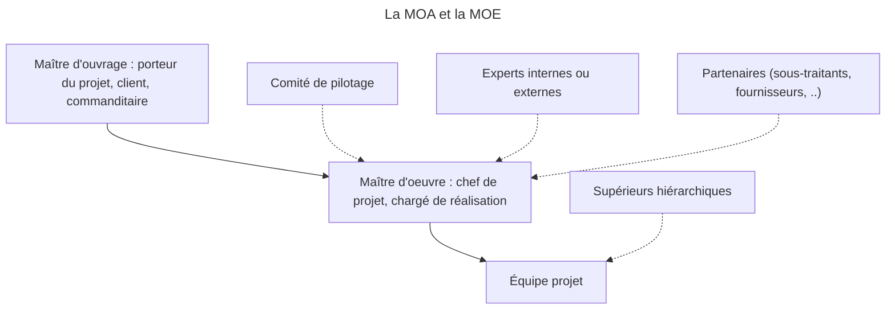

## Pourquoi le Génie Logiciel ?

---

### Grosses erreurs :

- Les sondes perdues (Mars Climate Orbiter, Mars Pathfinder)
- Les missiles Patriotes
- 1er vol d'Ariane 5
- L'an 2000
- Therac-25
- Le null pointer (_billion-dollar mistake_)
- Steam sur Linux
- OpenSSL sur Debian (génération aléatoire suite warning Valgrind)

---

### Les projets logiciels :

- ne livrent pas le produit dans les temps
- coûtent beaucoup plus chers que prévu.
- délivrent un produit de qualité très faible
- échouent dans la majorité des cas !!!
- Étude américaine de 1995 : 81 milliard $ / an en échec

---

### Pourquoi ne pas construire un logiciel comme un pont ?

- Échecs très nombreux
- Crash système considéré comme habituel
- Cause du bug pas directement identifiable
- Dommages (souvent) mineurs
- A part dans les systèmes critiques, on considère que le logiciel ne peut anticiper toutes les situations
- Les systèmes informatiques se complexifient trop vite
- Les logiciels passent par des états discrets, dont certains ne sont pas prévus
- Ajouts, changements de fonctionnalités, de plate- formes...

---

### Les mythes de la gestion de projet

_Les outils sont la solution..._

=> Un outil est inutile sans méthodologie !

---

_En cas de retard, on ajoutera des ressources humaines_

=> Personnes non formées, sans expérience sur le produit
=> _Ajouter du personnel à un projet en retard ne fait que le retarder plus_ (Loi de Brooks)

---

_Le logiciel est flexible, il est facile d'ajouter des changements_

=> Les besoins de changement sont inévitables dans la "vraie vie"
=> Plus un changement est tardif, plus il coûte cher

---

_Une fois que le programme est écrit et qu'il tourne, le travail est terminé_

=> 50-70% de l'effort est réalisé après la livraison

---

_Jusqu'à ce que le programme tourne, il n'y a aucun moyen d'évaluer sa qualité_

=> Inspections & revues

---

_La seule chose à livrer pour un projet réussi est un programme qui marche_

=> Documentation (utilisateur, maintenance), tests, maintenance, intégration

---

En management de projet, il n'y a pas une méthodologie de conduite de projet mais plusieurs combinaisons de méthodes et d'outils de gestion possibles, adaptables selon :

- le type de projet (web, technique, associatif, etc.)
- ses caractéristiques
- ses contraintes (budget, délai, ...)
- le contexte
- l'expérience de l'équipe 
- la culture d'entreprise 

---

### Quels sont les enjeux d'une méthodologie de projet ?

Elle permet :

- de trouver la meilleure façon de planifier et d'exécuter vos projets
- d'améliorer la prise de décision grâce à des rôles clairement définis
- d'économiser du temps et de l'argent en réutilisant une méthode de gestion pour d'autres projets
- de gérer l'étendue du projet

---

- de ne pas oublier d'étapes d'un projet comme celle de la gestion des risques
- de contrôler les dépenses du projet
- d'identifier rapidement les projets qui posent problème
- de mobiliser une équipe performante et autonome

---

## Les différents paramètres du projet

---

### Pourquoi réaliser un projet ? Les attentes et besoins

Définition des besoins à différents niveaux d'abstraction :

- Besoins de l'utilisateur
- Besoins des composants

Définition du système à réaliser avec le point de vue de l'utilisateur et/ou du client

- Les utilisateurs doivent être capables de comprendre ce document

---

- Analyse des besoins : **LE QUOI**
- Conception : **LE COMMENT**

---

### Les intervenants

---

#### Parties prenantes

On appelle **parties prenantes** toutes les personnes qui ont un intérêt dans le projet : les clients, les utilisateurs, les membres de l'équipe de projet, la direction, etc.

L'ensemble des personnes intervenant sur le projet est séparée en 2 groupes : **maîtrise d'ouvrage** et **maîtrise d'oeuvre**.

---

#### La maîtrise d'ouvrage

- Entité responsable de l'expression du besoin
- Souvent non informaticien
- Besoin réel / budget
- Possibilité de maîtrise d'ouvrage déléguée

---

#### La maîtrise d'œuvre

- Entité responsable de la concrétisation de l'idée en outil informatique
- Pas de connaissance fonctionnelle
- Bons choix techniques, adéquation avec les besoins, performances...

---

---

- Maître d'Ouvrage (MOA) : "_Il faut que ça serve_"
- Chef de projet : "_Il faut que ça avance_"
- Équipe projet : "_Il faut que ça marche_"
- Comité de pilotage : "_Il faut que ça rapporte_"

---

Ce que voulait le client

---

## Qu'est-ce qu'un projet ?

---

Un projet, c'est :

- Une durée limitée = délai
- Des objectifs clairement définis
- Des contraintes

---

## Coûts et recettes

### Pourquoi suivre les coûts du projet ?

- Pour suivre de façon régulière l'avancement physique du projet
    + Contrôler l'avancement et mettre à jour le tableau de suivi des coûts
- Pour ajuster les prévisions budgétaires
    + Anticiper les tendances en coûts
- Pour décider d'actions correctives éventuelles, afin de respecter les contraintes de coûts.
    + Décider, arbitrer et négocier
- Afin de respecter les contraintes de coûts

---

## Délais et planifications

### Pourquoi suivre les délais du projet ?

- Pour suivre de façon régulière l'avancement physique du projet
    + Contrôler l'avancement et mettre à jour le planning
- Pour ajuster les prévisions de planning
    + Analyser l'avancement et prévoir le reste à faire
- Pour anticiper et décider d'actions correctives éventuelles.
    + Décider des actions à entreprendre
- Afin de respecter les contraintes de délais.

---

## Diagramme de GANTT

Diagramme de Gantt : graphe d'ordonnancement représentant les différentes tâches à réaliser, leur durée et leurs dépendances.

- abscisse : unité de temps (jours, semaines, mois)
- tâche : barre horizontale du début à la fin de la réalisation
- dépendance : flèche vers tâche(s) suivante(s) en attente

---

Exemple de diagramme de Gantt

---

### Chemin critique

Le diagramme de Gantt est une des méthodes permettant de calculer le **chemin critique** d'un projet, ie la séquence de tâches qui détermine la durée totale d'un projet.

Si une tâche sur ce chemin est retardée, cela retarde l'ensemble du projet.

---

## Des objectifs spécifiques

---

### Objectifs SMART

Les objectifs SMART sont issus d'un acronyme pour définir des indicateurs efficaces :

- Specific : objectif personnalisé, clair, précis et compréhensible par tous
- Mesurable : quantifier clairement l'objectif à atteindre
- Ambitious : objectif suffisamment élevé pour être motivant
- Realistic : éviter l'abandon
- Time-bound : objectif délimité précisément dans le temps (date butoir, dates intermédiaires)

---

## Exemples d'indicateurs

### Indicateurs de coûts

- Coût réel
- Coûts non planifiés
- Coût des retards
- Écart de coût du projet : (réel - prévisionnel) / prévisionnel

---

### Indicateurs de délais

- Taux de retard : (tâches non réalisées / prévues) X 100 (%) 
- Durée d'une tâche
- Écart de durée : (durée réelle – initiale) / initiale
- Écart de délai : temps initialement prévu – actuellement utilisé

---

### Indicateurs de qualité

- Satisfaction client
- Nombre d'erreurs
- Nombre de plaintes client

---

### Indicateurs d'efficacité et d'avancement du projet

- Taux d'avancement : (tâches accomplies / tâches prévues) X 100 (%)
- Nombre de tâches / jalons réalisés
- Temps passé sur le projet

---

