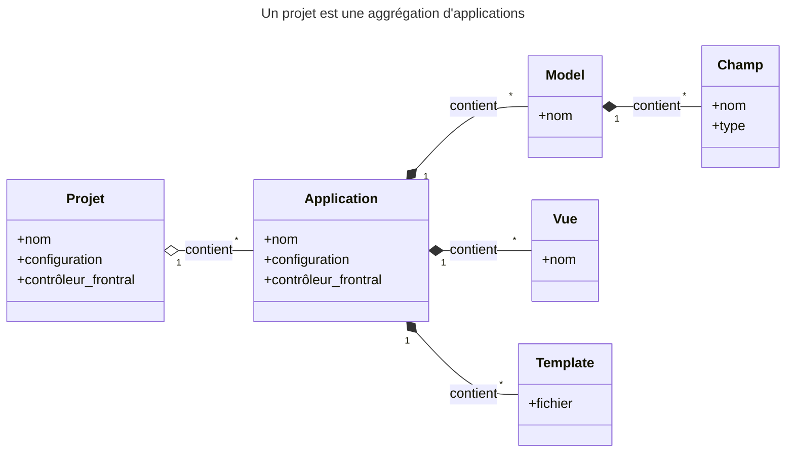

## Présentation

Framework Python gratuit et open-source de haut niveau pour développer une application Web

---

### Complet

- Framework pour application Web complète : backend, frontend, persistance, sécurité, administration, ...
- écosystème complet : documentation, tests, ...

---

### Polyvalent

- Développement possible de tout type de site Web ;
- Nombreuses infrastructures client ;
- Quasiment tout type de format d'échange de données : `Json`, `XML`, ... ;
- Extensible.

---

### ORM puissant

- Abstraction de la couche de persistance ;
- Nombreuses bases de données : nativement `PostgreSQL`, `MySQL`, `Oracle`, `SQLite` ;
- Librairies externes pour la plupart des BD `SQL` et `NoSQL`.

---

### Sécurisé

- "Security by design" ;
- Gestion sécurisée des utilisateurs ;
- Protection par défaut contre de nombreuses vulnérabilités : injections `SQL`, `XSS`, ...

---

### Scalable

- Architecture composite "shared-nothing" : composants indépendants et remplaçables
- Scalabilité à tous les niveaux : serveurs cache, bases de données, serveurs d'application
- Utilisé par des sites à très forte fréquentation : `Instagram`, ...

---

### Maintenable

- Design favorisant un code simple et réutilisable : template, … 
- DRY : interfaces d'administration, …
- Développement en _applications_ réutilisables
- MVC

---

### Portable

- Python : presque toutes plateformes
- Disponible sur beaucoup d'hébergeurs PaaS

---

## Installation

- Nombreuses distributions : package de distribution, `virtualenv`, ...
- Le plus simple (dernière version officielle) :
  ```sh
  python -m pip install django
  ```
- Framework Python => attention à avoir une version récente et correctement installée de Python sur votre système !
- Vérifier l'installation : `python -m django --version`

---

## Environnement de développement

- Scripts Python pour créer et travailler avec des projets `Django` :
  + `django-admin` pour créer un nouveau projet
  + fichier `./manage.py` pour gérer le projet courant
  + Inclut un serveur web de développement
- Plugin IDE

---

## Projet vs applications

- **Projet** : capsule vide gérant le site en entier
- **Application** : élément réutilisable du site (login, recherche, ...)

---



---

## Cheatsheet

- Créer un nouveau projet : `django-admin startproject <mon_projet>`
- Démarrer le serveur Web : `python manage.py runserver`
- Réaliser une migration : `python manage.py makemigrations && python manage.py migrate`

---

## Ressources

- [Tutoriel première application Django][tuto-django]
- [Génération de diagrammes de classe UML depuis un projet Django][uml]

[tuto-django]: https://docs.djangoproject.com/en/4.2/intro/tutorial01/
[uml]: https://gist.github.com/perrygeo/5380196

---

## Legal

- Django and the Django logo are registered trademarks of the Django Software Foundation.
- Other names may be trademarks of their respective owners

---

