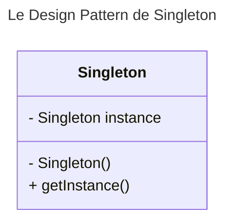
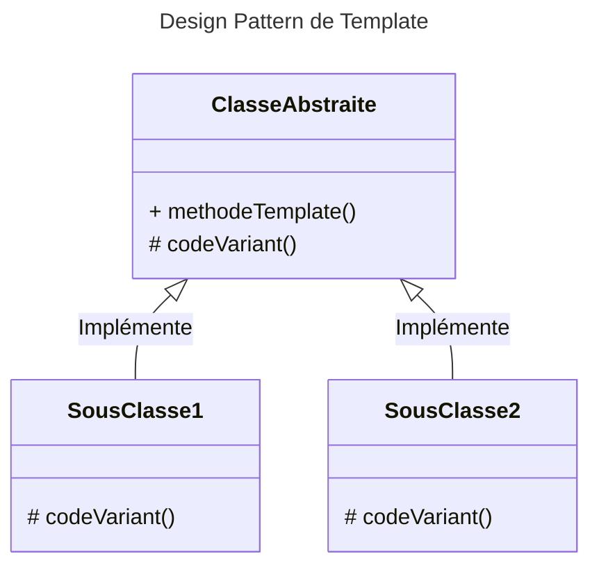

## Présentation

> Fundamentally, what is Spring? We think of it as a Platform for your Java code _(docs.spring.io)_

---

- `Spring®` est un framework `Java` open-source composé de nombreux modules offrant des fonctionnalités haut niveau pour une application classique.
- Le design pattern d'injection de dépendances utilisé dans toutes les couches du framework permet d'ajouter des services à des POJOs de manière non invasive

---

## Modules

---

Les modules de Spring® :

- `Spring core`
- `Spring context`
- `Spring dao`
- `Spring orm`
- `Spring web`
- `Spring web mvc`

---

### Spring core

Le noyau, qui contient à la fois :

- un ensemble de classes utilisées par toutes les briques du framework
- le conteneur léger `org.springframework.context.ApplicationContext`

---

### Spring Context

Ce module supporte :

- l'internationalisation (`I18N`)
- Enterprise Java Beans (`EJB`)
- Java Message Service (`JMS`)
- Basic Remoting

---

### Spring DAO

Constitue le socle de l'accès aux dépôts de données :

- Fournit une implémentation pour `JDBC`
- D'autres modules fournissent des abstractions pour l'accès aux données (solutions de mapping objet-relationnel, `LDAP`) qui suivent les mêmes principes que le support JDBC
- La solution de gestion des transactions de Spring® fait aussi partie de ce module

---

### Spring ORM

Propose une intégration avec des outils populaires de mapping objet-relationnel :

- Hibernate
- JPA
- EclipseLink
- iBatis 
- ...

---

### Spring WEB

Le module comprenant le support de Spring® pour les applications Web :

- contient notamment `Spring Web MVC`, la solution de Spring® pour les applications Web
- propose une intégration avec de nombreux frameworks Web
- propose une intégration avec des technologies de vue

---

### Spring Web MVC

Implémentation Model-Vue-Controller (`MVC`) pour applications Spring Web


---

## Design patterns

---

### SOLID

Rappel : la programmation orientée objet est basée sur les principes _SOLID_

- Single Responsibility
- Open / Closed
- Liskov Substitution
- Interface segregation
- Dependency injection

Spring® utilise massivement les principes de _Single Responsibility_ et _Dependency Injection_.

---

#### Open / Closed

Ouvert à l'extension, fermé à la modification

#### Liskov Substitution

L'héritage ne doit pas changer le comportement

#### Interface Segregation

Interfaces minimalistes

---

#### Single Responsibility

- 1 classe ou 1 méthode => 1 responsabilité
- Spring® utilise des interfaces simples ayant peu de fonctionnalités
- Le framework permet de séparer facilement les responsabilités au sein de différents classes

---

#### Dependency injection

- Les liens de dépendances sont résolus dynamiquement en injectant les dépendances dans les classes à l'exécution (et non pas statiquement à la compilation)
- Spring® utilise massivement l'injection pour fournir une implémentation des interfaces lorsque nécessaire

---

Le framework Spring® utilise principalement les design pattern suivants :

- Inverse de contrôle
- Singleton
- Programmation par template
- Modèle MVC

---

#### Inversion de contrôle

> Le flot d'exécution d'un logiciel n'est plus sous le contrôle direct de l'application elle-même mais du framework ou de la couche logicielle sous-jacente. (Wikipédia)

Spring® implémente une inversion de contrôle par le principe d'injection de dépendances.

---

##### Exemple

Exemple d'injection de dépendance : `maDependance` est instanciée par Spring®

```java
@Component
public class MaDependance {
  [...]
}
@Component
public class MaClasseAvecDependance {

    @Autowired
    private MaDependance maDependance;

}
```

---

### Singleton

> Design pattern dont l'objectif est de restreindre l'instanciation d'une classe à un seul objet (Wikipédia)

- Exemple : Les `enum` en Java sont des singletons.
- En Spring®, par défaut chaque interface est implémentée par un singleton.

---



<div class="caption">Le Design Pattern Singleton</div>

---

### Programmation par template

En Programmation orientée objet, design pattern qui laisse libre l'implémentation d'une partie de l'algorithme à l'héritage, sans changer la structure de cet algorithme.

- Exemple : Les classes abstraites en Java 
- Attention : la programmation par template ne doit pas pour autant invalider le principe de Liskov !
- L'implémentation ne doit pas changer le comportement de la classe parente !

---



<div class="caption">Le design pattern de template.</div>

---

## Pattern MVC : Modèle / Vue / Contrôleur

Voir le [cours sur le pattern MVC](/archi/mvc)

---

## Legal

- Spring® is a trademark of Pivotal Software, Inc. in the U.S. and other countries.
- Other names may be trademarks of their respective owners

---

