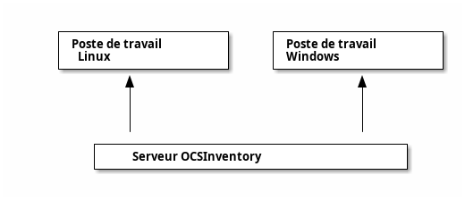

# Gestion de parc informatique : OCSInventory

OCSInventory est un outil de collecte automatisée d'éléments d'un parc informatique.

Pour plus d’information sur cet outil, voir le document fourni en annexe : *L’outil de gestion OCSInventory*

On appuiera cette partie pratique par les informations fournies dans le document en annexe et par l'environnement de test installé en première partie.

## Description du projet

Dans cette partie pratique, nous utiliserons un projet permettant de simuler un petit parc informatique. Dans ce parc informatique, le logiciel OCSInventory est utilisé pour réaliser l’inventaire et l’administration des machines qui composent ce parc, c'est-à-dire :

- La collecte sécurisée d’informations sur les postes de travail du parc
- La gestion centralisée de ces informations
- Le déploiement automatisé et sécurisé d’applications sur les postes de travail du parc

Le parc informatique se compose des machines suivantes :

- Un serveur Linux hébergeant le serveur OCSInventory
- Un poste de travail Windows
- Un serveur Linux hébergeant une stack `LAMP` (`Linux Apache MySQL PHP`)

# Installation d’un environnement de test

Nous allons commencer par installer OCSInventory (au minimum : 1 serveur et 2 agents). Cette installation nous permettra de tester l’usage du produit, on n’hésitera donc pas à utiliser les différentes fonctionnalités offertes (y compris : déploiement de nouveaux agents, leur administration, …). On pourra aussi réinstaller cet environnement si nécessaire.

Il ne sera pas demandé de rendu concernant cet environnement : celui-ci est donc là uniquement pour aider l’apprenant dans la suite du projet.

OCSInventory fonctionne sur un mode client/serveur :

- Le(s) serveur(s) collecte(nt) et/ou reporte(nt) les données (système Linux). Dans notre cas, nous utiliserons un unique serveur faisant office d’inventaire et de reporting.
- L’agent surveille et administre le poste du parc informatique sur lequel il est installé (systèmes Windows, Linux et Mac OS), en communiquant avec le serveur
- Il est aussi possible de découvrir directement des machines sur le réseau, sans passer par un agent

Pour faciliter le déploiement du parc informatique du projet, on pourra utiliser :

- Le système Windows installé sur votre machine pour le poste de travail Windows
- Des machines virtuelles VirtualBox pour le serveur OCSInventory et le poste de travail Linux

En vous aidant de la section Installation du document fourni en annexe :

- Créez et installez les différents systèmes :
  + Un système Windows (on pourra utiliser le système de l’apprenant) ;
  + Un système Linux (de préférence Ubuntu Server) pour le serveur OCSInventory, dans une machine virtuelle VirtualBox par exemple ;
  + Une autre machine virtuelle Linux (de préférence Ubuntu Server ou Fedora Server), hébergeant une stack LAMP complète.
- Installez sur le premier système Linux, le serveur d'inventaire et de reporting d’OCSInventory.
- Installez un agent OCSInventory sur le système Windows et un agent sur le second système Linux et les configurer pour faire remonter les données au serveur.
- Connectez-vous sur l’interface du serveur pour vérifier son bon fonctionnement et le référencement des agents.

# Migration des données de GLPI vers OCSInventory

Le datacenter de l'entreprise utilise aujourd'hui un déploiement [GLPI](https://glpi-project.org/) pour faire l'inventaire de son par de machines. Cet outil est limité sur cet aspect mais permet une intégration poussée dans l'ensemble du processus de l'entreprise.

Il est donc décidé de continuer d'utiliser GLPI, mais d'essayer de dédier l'inventaire du parc de machine à OCSInventory tout en synchronisant cet inventaire avec celui de GLPI.

En utilisant un serveur GLPI existant, réaliser la migration de l'inventaire des machines du module natif de GLPI vers OCSInventory.

On pourra par exemple utiliser le plugin : <https://github.com/pluginsGLPI/ocsinventoryng>.

# Plans de tests

## Tests d'intégration de composants

Décrire, réaliser et reporter l’ensemble des tests d’intégration de composants permettant d'accélérer le déploiement et de vérifier la compatibilité des composants d'**OCSInventory** et de **GLPI** dans ce déploiement.

## Tests de migration de données

Décrire, réaliser et reporter l’ensemble des tests d'intégration, de migration et/ou de reprise de données permettant de passer du module natif de GLPI à OCSInventory et de synchroniser les deux outils.
