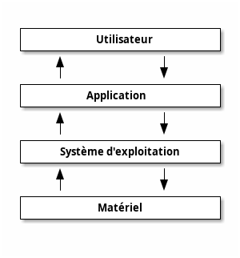
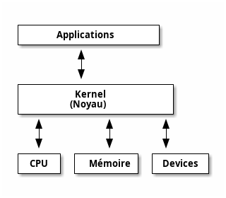

# Partie I : Aperçu d'un système Linux

- _Qu'est-ce qu'un système d'exploitation ?_
- _Qu'est-ce que Linux ?_
- _Quelles sont ses caractéristiques principales ?_

---

# Le système d'exploitation Linux

---

## Le système d'exploitation



Un système d'exploitation (Operating System - OS) est un logiciel gérant l'exécution des applications et leurs interactions avec le matériel .

Les principaux systèmes d'exploitation sur PC sont Windows , Linux et MacOS : ce sont eux qui sont lancés au démarrage d'un ordinateur personnel ou d'un serveur avant toute autre application.

Il existe de nombreux autres OS : Android, iOS, …

---

## Pourquoi linux ?


A la fin des années 1960, AT&T Bell Labs développe Unix : un système d'exploitation accessible et sécurisé pour utilisateurs multiples .

Dans les années 1980, certaines entreprises commencent à vendre leurs propres OS de type "Unix” : BSD, Solaris, Mac OS X, …

Ces systèmes connaissent un certain succès mais sont coûteux et peu évolutifs : il manque dans cet écosystème un OS gratuit et libre (open-source).


En 1991, Linux Torvalds libère la première version du noyau Linux écrit en langage C et copiant les APIs Unix.

---

## Qu'est-ce que linux ?



Linux est un noyau de système d'exploitation :

  - Gratuit tant pour une utilisation personnelle que commerciale
  - Libre : le code source est disponible
  - Comme tout noyau, il ne gère que les entrées/sorties matérielles (clavier, souris, écran, …) et l'orchestration des applications (exécution du programme sur des cycles CPU, gestion de la RAM, …)
  - oyau n'est pas suffisant pour tourner des applications : il faut un système d'exploitation complet avec des librairies, des logiciels, …
  - Au-dessus du noyau Linux, les distributions ajoutent des outils, logiciels et librairies open-source (partagés sous le terme GNU/Linux ) et des outils dédiés (libres ou non-libres)
  - Ces distributions patchent souvent le noyau Linux standard pour fournir leur propre version légèrement modifiée


---


Il existe beaucoup de distributions GNU/Linux : généralistes ou dédiées à un usage particulier (montage vidéo, bureautique, …), multiplateforme ou dédiées à un environnement particulier, généralement embarqué (dongle TV, raspberry pi, …), gratuites ou payantes.

Certaines distributions on tellement dévié du noyau standard qu'on ne les considère plus vraiment comme des distributions Linux mais elles en gardent les concepts principaux (_Android_, …)


Ces distributions partagent des standards communs les rendant grandement interconnectables et interchangeables : _POSIX_, _System-V_ , … mais ne les respectent que partiellement, chacune ayant ses spécificités. Par exemple, la commande `grep` possède des options particulières sur presque chaque distribution.

Il existe de nombreux autres OS : _Android_, _iOS_, …

---

## Système GNU/Linux

Un système GNU/Linux est donc un ensemble de plusieurs composants :

- Le noyau Linux :
  - Responsable des activités principales de l'OS
  - Composé de plusieurs modules qui interagissent avec le matériel
  - Gère la sécurité (droits d'accès, …)
- Les librairies système :
  - Elles fournissent aux applications les APIs des opérations courantes de l'OS : opérations d'entrée/sortie (I/O), droits d'accès, création de processus, …
- Les outils système :
  - Ce sont des applications dédiées qui fournissent une gestion de haut-niveau de l'OS en créant une abstraction sur des tâches complexes : gestion du réseau, …

---

Quelques fonctions principales d'un système Linux :

- Portable
- Open-source
- Multi-utilisateur
- Multi-programmes
- Système de fichiers hiérarchique
- Invité de commandes (shell)
- Sécurité

---

## Architecture d'un système Linux


---

Quelques caractéristiques principales du noyau Linux :

  - C'est un noyau monolithique (avec des modules chargeables dynamiquement : LKM)
  - Supporte le "live patching”
  - Le noyau Linux sépare l'environnement d'exécution en deux espaces : l'espace noyau et l'espace utilisateur
  - Focus important sur la sécurité : droits d'accès des utilisateurs, module noyau SELinux pour une gestion très poussée des autorisations

---
layout: section
---

# Gestion des processus

---

A chaque fois qu'une commande est exécutée ou qu'un programme est lancé, ceux-ci créent un nouveau processus comprenant :

- Un identifiant unique à 5 chiffres : `PID`
- Tous les services et/ou ressources nécessaires au processus pendant son exécution (mémoire, accès disque, …)
- Un répertoire de travail

Un processus peut créer des sous-processus (processus fils) :

- L'identifiant de processus parent ( `ppid` ) identifie le processus ayant créé ce nouveau sous-processus
- Tous les processus ont un parent, à l'exception du processus racine (`init`, `pid=1`) qui initialise l'espace utilisateur.

---

Les processus sont donc hiérarchisés et peuvent être représentés par un arbre dont la racine est le processus `init`


Dans Linux, (sauf spécificité) un processus est mono-threadé : il n'existe pas de threads parallèles d'exécution. Un "programme" (_processus_) possède donc un seul fil d'exécution.

Le noyau offre des APIs pour créer des sous-process depuis le process courant : `fork()`, `vfork()`, `exec()`, `execve()`, …

Il n'existe pas d'autre moyen de créer un processus !

**Un processus appartient à l'utilisateur qui l'a créé**

---

## Les types de processus

Il existe 2 types de processus :

- Les processus de **premier plan** (_foreground_) :
	- Ils sont initialisés et contrôlés à travers une session de terminal (_shell_)
	- Ils nécessitent un utilisateur "véritable" pour les démarrer et interagir avec
- Les processus d' **arrière-plan** (_background_) :
	- Ces processus ne sont pas liés à un terminal
	- Ils n'attendent aucune interaction utilisateur

---

## Les _daemon_

Le cas particulier des processus _daemon_


- Un processus _daemon_ est un sous-type de processus d'arrière-plan qui fournit des services système
- En général, ils sont lancés au démarrage du système et ne sont jamais arrêtés.

Exemples de daemons : serveur Web, service réseau, …

La gestion des daemons est une des principales incohérences entre les différentes distributions GNU/Linux mais `systemd` est aujourd'hui la référence pour l'administration de serveurs.

---

## États des processus

L'état d'un processus est défini par l'une des quatre valeurs suivantes :

- `Running` :
	- Le processus est en cours d'exécution sur le CPU…
	- …ou en attente d'un cycle CPU libre pour s'exécuter
- `Waiting` :
	- Le processus est en attente d'un événement : signal du noyau, condition matérielle (appui sur une touche du clavier, …)
- `Stopped` :
	- Le processus est en pause, généralement pour une opération de maintenance
- `Zombie` :
	- Le processus est mort mais toujours enregistré dans la table des processus (bug)

---
layout: section
---

# Utilisateurs et accès système

---

## Administration des utilisateurs

- Linux identifie les utilisateurs par un identifiant unique : _User ID_ ( `UID` )
	- L' `UID=0` est un utilisateur spécial appelé "_super-utilisateur" (ou `root` ). Cet utilisateur peut outrepasser toutes les vérifications de droits d'accès (dans l'espace utilisateur).
	- Le processus `init`, les threads du noyau et la plupart des processus système appartiennent à l'utilisateur `root`

Pour faciliter les vérifications de sécurité, les rôles des utilisateurs sont réunis en groupes identifiés par un _ID_ de groupe ( `GID` ). Un utilisateur peut faire partie de plusieurs groupes.

Linux est un système multi-utilisateur : plusieurs utilisateurs peuvent utiliser le système en parallèle.

---
layout: section
---

# Gestion des fichiers

---

En Linux, **TOUT EST FICHIER** !

---

## Gestion des fichiers

Linux utilise des fichiers pour décrire chaque partie du système : matériel, processus, documents, programmes, …

Caractéristiques des noms de fichiers :

- Les fichiers portent souvent une extension en suffixe pour faciliter leur identification (_mon_document.pdf_, …). Cette extension est purement descriptive (aucun impact sur le fichier lui-même).
- Linux supporte mal les espaces et accents dans les noms de fichiers
- En Linux, tous les noms de fichier et tous les chemins sont sensibles à la casse ! (majuscule / minuscule)
- Par convention, un nom de fichier commençant par un point est un fichier caché
    ```sh
    mon_programme_visible.bin # fichier visible
    .ma_config_cachee.bin # fichier caché
		```

---

## Les types de fichiers

Linux utilise plusieurs types de fichiers différents :

- **Fichier ordinaire** :
  - C'est le type de fichier le plus courant : fichier texte, image, binaire, …
- **Répertoire** :
  - Un répertoire est aussi un fichier !
- **Lien symbolique** :
  - Un simple alias vers un autre fichier
- Fichier de **socket locale** / **pipe nommé** :
  - Ces fichiers permettent la communication entre processus
- Fichier de **périphérique en mode caractère** / fichier de **périphérique en mode bloc** :
  - Ces fichiers permettent la communication avec les différents périphériques :
  - En mode **caractère**, ils permettent un **accès matériel direct**, caractère par caractère
  - En mode **bloc** : sont les disques durs, la mémoire, … qui utilisent des accès par **tampons**
  - Un périphérique peut être _virtuel_ : `/dev/random`, `/dev/null`, …

---

## Hiérarchie et chemins d'accès

Les fichiers sont stockés dans des répertoires , organisés selon un système de fichiers hiérarchique et accessibles en utilisant un chemin ( _path_ ).

Le _path_ décrit la progression dans des répertoires séparés par un `/` jusqu'au fichier final, de façon similaire à une _URL_ dans un navigateur.

Un _path_ peut décrire un chemin de deux façons, suivant qu'il commence ou non par un `/` :

- Soit relatif au répertoire courant :
    ```
    mon_sous_repertoire_dans_le_repertoire_courant/mon_fichier.txt
		```
- Soit absolu en partant du répertoire à la racine, noté `/` :
    ```sh
    /mon_repertoire_sous_la_racine/mon_fichier.txt
		```

---

## Chemins particuliers

Il existe des chemins particuliers :

- Le _path_ nommé d'un simple slash `/` fait référence au **répertoire à la racine** du système de fichiers. C'est ce répertoire qui contient les répertoires de 1er niveaux, contenant eux-mêmes d'autres répertoires, et ainsi de suite
- Le _path_ nommé d'un simple point `.` fait référence au **répertoire courant**. Les deux chemins ci-dessous sont donc identiques :
		```sh
		mon_sous_repertoire/mon_fichier.txt
		./mon_sous_repertoire/mon_fichier.txt
		```
- Le _path_ nommé de deux simple points `..` fait référence au répertoire parent. Les deux chemins ci-dessous sont donc identiques :
		```sh
		/mon_premier_repertoire/mon_sous_repertoire/mon_fichier.txt
		/mon_premier_repertoire/mon_sous_repertoire/../mon_sous_repertoire/mon_fichier.txt
		```
- Le path nommé _tilda_ `~` fait référence au **répertoire de travail** de l'utilisateur courant.

---

## Répertoire utilisateur

- Comme dans la majorité des systèmes d'exploitation, chaque utilisateur possède son propre répertoire de travail, appelé _home directory_ . C'est dans ce répertoire que sont stockés ses documents personnels, ses configurations propres, et c'est dans ce répertoire que l'utilisateur attérit après s'être connecté au système.
- Le répertoire de travail du super-utilisateur (`root`) est `/root`
Les répertoires de travail (_home_) des utilisateurs standards sont en général situés dans `/home/NOM_DE_L'UTILISATEUR`
	Le path nommé _tilda_ `~` fait référence au répertoire de travail de l'utilisateur courant. Si l'utilisateur `utilisateur1` est connecté au système, ces chemins sont donc identiques :
    ```sh
		/home/utilisateur1/mon_dossier_utilisateur
		~/mon_dossier_utilisateur
		```

Les répertoires de travail des utilisateurs (_home_) sont accessibles uniquement à leurs utilisateurs respectifs (à l'exception du super-utilisateur `root` ayant les pleins pouvoirs sur le système).

---
layout: section
---

# Les outils Linux

---

## Le shell

Les systèmes GNU/Linux sont des systèmes fortement orientés à l'utilisation principale d'interfaces texte.

Le _shell_ (ou _interpréteur de commandes_) est le point d'entrée principal pour gérer un système Linux. Son utilisation se fait en utilisant des entrées (_commandes_) et des sorties de type texte.

Il existe de nombreux interpréteurs de commandes différents et partiellement compatibles. La plupart d'entre eux suit cependant les standards _POSIX_ partagés par tous les systèmes _*NIX_ (_BSD_, _Linux_, _Mac OS_, _Android_, …)

`Bash` est de très loin l'interpréteur les plus utilisé et ce cours se concentrera sur son usage.

Même si un shell utilise en général un langage de script complet (utilisatoin de fonctions, de variables, …) son utilisation est aussi interactive. Les commandes sont entrées l'une après l'autre : l'utilisateur entre une commande complète (avec ses arguments) sur l'invité de commande (_prompt_), puis démarre l'exécution de cette commande en appuyant sur la touche **entrée**.

---

## L'invité de commandes (_prompt_)

[TODO: IMG] **=> La commande avec ses arguments entrés par l'utilisateur // Les informations renvoyées par la commande**


Linux étant un système fortement orienté fichiers, il est possible d'utiliser un fichier pour enregistrer la liste des commandes à lancer. Un tel fichier, contenant la liste des commandes qui seront exécutées dans le _shell_, est appelé un **script** .

Les bonnes pratiques recommandent d'ajouter un "_shebang_" au début de chaque script pour forcer l'utilisation du bon interpréteur de commandes (`bash` dans ce cours) plutôt que celui par défaut défini dans le système.

On ajoutera donc la ligne :

```sh
#!/usr/bin/env bash
```

Les postes de travail récents possèdent un véritable écran plutôt qu'un terminal : l'exécution du _shell_ est effectuée à travers des interfaces virtuelles (appelées `TTY`) ou grâce à une application appelée _émulateur de terminal_.

---

## Les arguments des commandes

Les commandes à exécuter nécessitent souvent des arguments à utiliser comme paramètres lors de leur exécution (nom de l'utilisateur, chemin vers le fichier, adresse IP, …).

Les arguments sont fournis à la suite du nom de la commande, et séparés par un espace.

Par exemple :

```console
$ nomDeMaCommande argument1 argument2 argument3
```

Pour simplifier l'utilisation des nombreuses commandes, le shell `bash` fournit une grammaire stricte et commune pour la documentation des arguments des commandes décrivant :

- Un argument obligatoire : `$ nomDeMaCommande argumentObligatoire`
- Un argument optionnel : `$ nomDeMaCommande [argumentOptionnel]`
- Un choix entre 2 arguments incompatibles : `$ nomDeMaCommande argumentA | argumentB`
- Un argument pouvant être répété plusieurs fois : `$ nomDeMaCommande argumentMultiple…`

En shell _bash_, le caractère `#` indique d'ignorer le reste de la ligne.

Ce caractère est utile pour ajouter des commentaires dans un script, par exemple :

```sh
maCommande monArgument # Ceci est un commentaire
```

---

## Le prompt du shell

Par convention, la documentation d'une commande à exécuter dans le shell est précédée du caractère `$` afin de la mettre en évidence. Ce caractère représente le _prompt_ par défaut, c'est-à-dire l'endroit où l'utilisateur entre sa commande.

Par exemple, si un document indique d'entrer la commande `$ maCommande argument1`, on tapera sur le clavier seulement la partie `maCommande argument1` (sans le signe `$`).

En Linux, il est courant d'exécuter des processus en tant que _super-utilisateur_ (`root`) pour effectuer des opérations de maintenance sur le système (installation d'application, …)

Par convention, les commandes à exécuter par un **utilisateur standard** sont préfixées par le symbole `$` alors que celles à exécuter par le **super-utilisateur** `root` sont préfixées par un `#`.

Par exemple, la commande suivante, exécutée par un utilisateur standard, liste les processus lui appartenant :

```console
$ ps -ef
```

La même commande, exécutée par le super-utilisateur (avec plus de droits) liste l'ensemble des processus lancés par tous les utilisateurs sur le système :

```console
# ps -ef
```

---

## L'environnement graphique

- Si ils sont orientés interface texte en priorité, les systèmes Unix supportent aussi les interfaces graphiques :
- Le système **X** (ou **X11**) est le système de gestion de fenêtres historique, encore très présent
- **Wayland** est le nouveau standard d'environnement graphique sur Linux. Il devient majoritaire sur les distributions standard : _Ubuntu_, _Fedora_, _RedHat Linux_, _CentOS_, …
- **Quartz** sur _Mac OS_, **SurfaceFlinger** sur _Android_, …
- Un **gestionnaire de bureau** (séparé) est généralement exécuté en plus, au-dessus du simple système d'affichage des fenêtres lorsque le système _GNU/Linux_ est utilisé comme un ordinateur personnel (**Gnome**, **KDE**, …)

---

## Les éditeurs de texte

La plupart des distributions GNU/Linux sont également livrées avec un ou plusieurs éditeurs de texte en mode console (pouvant être exécutés dans un terminal) :

- `vi` (ou sa version améliorée `vim`) est un éditeur extrêmement puissant mais plutôt complexe à prendre en main, disponible dans presque toutes les distributions car compatible avec la norme _POSIX_.
- `emacs`, `nano`, … sont d'autres exemples souvent disponibles

---
layout: section
---

# Partie II : Commandes principales

---

# Les commandes de gestion de fichiers

- _Qu'est-ce qu'un fichier sous Linux ?_
- _Quelle est leur utilité ?_
- _Comment les administrer ?_

---

## ls : lister les fichiers

La commande `ls` (_list_) affiche tous les répertoires et fichiers principaux dans le chemin fourni en paramètre (ou dans le répertoire courant sans paramètre).

Par exemple, la commande suivante affiche tous les fichiers et dossiers stockés dans le répertoire applications à la racine :

```sh
$ ls /etc
```

---

## cd : changer de répertoire

La commande `cd` (_change directory_) permet de changer le répertoire courant vers un nouveau répertoire.

Par exemple, la commande suivante permet de se déplacer dans le dossier `monDossierPerso` stocké dans le répertoire utilisateur. Les commandes commandes seront maintenant exécutées dans ce nouveau répertoire.

```sh
$ cd ~/monDossierPerso
```

---

## mv : déplacer un fichier

La commande `mv` (_move_) permet de déplacer un fichier de son emplacement courant vers un nouveau chemin.

Si le nouveau chemin est celui d'un répertoire existant, le fichier sera déplacé dans celui-ci.

Sinon, le fichier sera déplacé et/ou renommé pour que son nouveau chemin soit celui fourni.

Par exemple, la commande suivante permet de déplacer le fichier monFichier depuis le répertoire courant vers un répertoire voisin et de renommer le fichier en `monNouveauFichier` :

```sh
$ mv ./monFichier ../monRepertoireVoisin/monNouveauFichier
```

---

## rm : supprimer des fichiers

La commande `rm` (_remove_) permet de supprimer les fichiers dont le chemin est donné en paramètre.

Par exemple, la commande suivante supprime un fichier monFichier dans le répertoire courant :

```sh
$ rm monFichier
```

---

## touch : créer / atteindre un fichier

La commande `touch` permet d'atteindre le fichier fournit en paramètre. Cela met à jour sa date d'accès, et c'est également un moyen de créer un nouveau fichier vide.

Par exemple, la commande suivante crée un nouveau fichier dans le répertoire utilisateur :

```sh
$ touch ~/monNouveauFichier
```

---

## mkdir / rmdir : créer / supprimer un répertoire

Les commandes `mkdir` (_make directory_) et `rmdir` (_remove directory_) permettent créer un dossier vide et de supprimer un dossier vide .

Par exemple, la commande suivante crée un nouveau dossier vide `monDossier` à la racine. Comme ce dossier est vide, on peut ensuite le supprimer :

```sh
$ mkdir /monDossier

$ rmdir /monDossier
```

Un dossier est un fichier - il est donc possible d'utiliser la commande `rm` (avec l'option `-r`) à la place de `rmdir`. On préfèrera cependant la commande `rmdir` qui vérifie que le dossier est vide avant sa suppression.

---

## find : chercher des fichiers

La commande `find` permet de chercher le chemin vers des fichiers dont le nom suit un pattern donné dans un chemin donné (récursivement).

Par exemple, la commande suivante cherche le chemin du fichier `monFicher`, situé quelque part dans l'arborescence commençant au répertoire `monRepertoire` :

```sh
$ find /home/monUtilisateur/monRepertoire -name monFichier
```

La commande `find` est très puissante et possède de nombreux paramètres, il est intéressant de pratiquer son utilisation qui s'avère vite très pratique.

---

## cat : afficher le contenu d'un fichier

La commande `cat` (_concatenate_) permet de concaténer des fichiers vers la sortie standard.

Dans la pratique, cette commande est souvent utilisée pour afficher à l'écran le contenu d'un fichier.

Par exemple, la commande suivante affiche à l'écran le contenu du fichier `monFichier` stocké dans le répertoire courant :

```sh
$ cat ./monFichier
```

---

## more, less, head, tail : affichages partiels

Les commandes `more`, `less`, `head` et `tail` permettent de couper ou de paginer un contenu qui leur est fourni en entrée avant d'afficher ce contenu à l'écran.

Dans la pratique, ces commandes sont très utiles lorsque l'on enchaîne des commandes en utilisant des _pipes_ (nous verrons cette notion plus tard dans le cours).

Par exemple, les commandes suivantes affichent à l'écran le début et la fin du contenu du fichier `monFichier` stocké dans le répertoire courant :

```sh
$ head ./monFichier

$ tail ./monFichier
```

---
layout: section
---

# Autres commandes utiles

---

## man : la page de manuel

La commande `man` (_manual_) permet d'afficher la documentation d'une commande ou d'un service fourni en paramètre.

C'est une commande fondamentale d'un système Linux : toutes les commandes du système sont rigoureusement documentées.

Les **pages de manuel** sont vérifiées en profondeur, elles sont à jour avec la version du programme installé sur la machine et suivent une grammaire de documentation commune stricte. Elles peuvent être délicates à appréhender au début mais il est important de comprendre comment les utiliser et de s'entraîner à les lire.

Par exemple, la commande suivante affiche la page de manuel de la commande `find` :

```sh
$ man find
```

---

## echo : afficher du texte

`echo` : affiche un message sur la sortie standard (par défaut la _console_).

```sh
$ echo "Hello, World”
```

---

## clear : effacer la sortie du terminal.

```sh
$ clear
```

---

## alias

`alias` : crée une nouvelle commande qui, lorsqu'elle est appelée, exécutera l'instruction enregistrée.

```sh
$ alias maCommandeLs=‘ls -a'

$ maCommandeLs
```

---

## history

`history` : affiche l'historique des commandes entrées par l'utilisateur.

```sh
$ history
```

---

## grep : recherche de texte

`grep` : cherche une ligne suivant un pattern donné dans l'entrée de la commande.

```sh
$ grep monPattern monDossier/monFichier
```

---

## sudo : élévation de privilèges

`sudo` : exécute une commande en utilisant le rôle de super-utilisateur (_root_).

```sh
$ sudo rm /monDossierProtege

# rm /monDossierProtege
```

Les deux commandes précédentes font la même chose mais on utilisera toujours `sudo` lorsque c'est possible, car cette commande enregistre le changement de contexte (le passage en super-utilisateur), et limite ce contexte à une commande. La 2e commande nécessite de se logger en utilisateur _root_ sur le système pour une session entière.

---

## arrêt et redémarrage

`shutdown`, `halt`, `reboot` : gèrent le cycle de vie du système.

```sh
$ halt

$ reboot

$ shutdown -h now
```

---

## Commandes réseau

`ping` : appelle (_ping_) un système pour vérifier si cet hôte peut être joint.

```sh
$ ping www.google.fr
```

`traceroute` : affiche la route (avec la liste des points d'accès) à traverser avant d'atteindre une destination.

```sh
$ traceroute www.google.fr
```

`netstat` : affiche différentes informations réseau, comme les ports ouverts et les tables de routage :

```sh
$ netstat -rn
```

---
layout: section
---

# Enchaîner les commandes

- Rediriger les entrées/sorties
- Filtres shell
- Variables

---

## Les filtres du shell

Le _shell_ fournit des filtres permettant de réaliser des opérations avancées sur les commandes. Ces filtres s'utilisent principalement pour omettre de préciser un ou plusieurs caractères dans un nom de fichier.

Le caractère `?` représente n'importe quel caractère 1 fois :

```console
$ ls monFichier?.txt

monFichier1.txt monFichier2.txt
```

Le caractère `*` représente n'importe quel caractère 0 ou plusieurs fois :

```console
$ ls *.txt

monFichier1.txt monFichier2.txt
```

---

## Les variables du shell

Il est possible de définir ou modifier une variable dans le _shell_ courant (**et uniquement dans celui-ci**) en utilisant la syntaxe :

```sh
variable=valeur
```

La nouvelle variable sera accessible en utilisant l'expression : `$variable` (en ajoutant bien le signe `$` avant la variable cette fois).

```console
$ maVariable=2

$ echo "Ma variable est : $maVariable”

Ma variable est : 2
```

Il est possible d'_exporter_ une variable en dehors du shell courant pour l'utiliser dans l'environnement **global** en utilisant la commande `export` et le nom de la variable (sans signe `$` devant)

```sh
$ export maVariable
```

---

Certaines variables spéciales prédéfinies gèrent l'exécution des commandes :

- `$#` indique le nombre d'arguments fournis à une commande
`$1`, `$2`, … sont chacun des arguments pris séparément
`$*` ou `$@` est la liste des arguments d'une commande
`$?` est le code de sortie d'une commande (0 en absence d'échec)

---

## Caractères d'échappement

Pour éviter d'évaluer un filtre, il est possible de l'entourer de caractères d'échappement. Cela permet d'utiliser un caractère spécial (`*`, `?`, `$`) comme un caractère standard dans un nom.

### Guillement simple

Le guillemet simple `'` permet une _protection forte_ d'une chaîne de caractères : aucun caractère à l'intérieur ne sera évalué : la chaîne de caractères est utilisée telle qu'elle :

```console
$ ls '*'

* : no such file or directory
```

Cet échappement est très utile par exemple avec la commande `find` : cela permet de passer des patterns de noms de fichiers avec des caractères spéciaux sans les évaluer.

#### Sans échappement

```sh
find ~ -name *.txt
```

Cette commande va remplacer `*.txt` par les noms de tous les fichiers `.txt` dans le répertoire courant (par exemple `fichier1.txt` et `fichier2.txt`), avant d'appeler la commande `find`. La commande réellement exécutée sera :

```sh
find . -name fichier1.txt fichier2.txt
```

#### Avec échappement

```sh
find ~ -name '*.txt'
```

Cette commande ne va pas remplacer `*.txt`. La commande réellement exécutée sera :

```sh
find . -name *.txt
```

Les échappements sont souvent utilisés dans les _scripts_, par exemple pour stocker des commandes avec des caractères spéciaux dans des variables et les évaluer plus tard.

### Guillemets doubles

Le guillemet double `"` permet une _protection faible_ d'une chaîne de caractères. Son intérêt principal est d'utiliser plusieurs mots (avec des espaces) comme un seul argument. Les caractères spéciaux sont cependant évalués.

```sh
echo Le contenu de argument1 est $1
# 6 arguments => [Le, contenu, de, argument1, est, maValeur]

echo "Le contenu de argument1 est $1"
# 1 arguments => Le contenu de argument1 est maValeur

echo 'Le contenu de argument1 est $1'
# 1 argument => Le contenu de argument1 est $1
```

---

## Enchaînement de commandes

Il est possible d'enchaîner 2 commandes à la suite sur une même ligne en utilisant un `;`

```sh
commande1 ; commande2
```

Il est possible d'exécuter une commande, puis d'enchaîner avec la seconde seulement si la première n'a pas échoué (utile si la 2e commande nécessite un état particulier après la 1ère) :

```sh
commande1 && commande2
```

Il est aussi possible d'exécuter une commande, puis d'enchaîner avec la seconde seulement en cas d'échec dans la première (utile pour faire de la gestion d'erreur après la 1ère commande) :

```sh
commande1 || commande2
```

---

## Streams

Tout processus Linux possède des _streams_ qu'il utilise pour dialoguer avec le reste du système. Ces streams possèdent tous une implémentation par défaut :

- L'_entrée standard_ (`STDIN`)
  - C'est la stream fournissant les **données à traîter** à la commande
  - Par défaut, il s'agit des **entrées de l'utilisateur** (le clavier)
- La _sortie standard_ (`STDOUT`)
  - C'est la stream sur laquelle la commande va **renvoyer les données après traitement**.
  - Par défaut, il s'agit de la _console_, permettant d'**afficher ces données à l'utilisateur dans le terminal**
- La _sortie d'erreur_ (`STDERR`)
  - C'est une stream utilisée pour afficher les éventuelles **erreurs rencontrées à l'exécution**
  - Par défaut, cette sortie est **fusionnée avec la sortie standard sur la console**

Ces streams peuvent être **redirigées** : c'est l'une des fonctionnalités les plus puissantes du shell !

Il est possible de rediriger :

- La _sortie standard_ vers un nouveau fichier grâce à l'expression `1>` ou directement `>`
  - `maCommande > monFichierDesResultats`
  - Attention : le contenu du fichier est **écrasé** si ce fichier existait déjà !
- La _sortie d'erreur_ vers un nouveau fichier grâce à l'expression `2>`
  - `maCommande 2> monFichierDesErreurs`
- Il est possible de **fusionner** deux streams grâce à l'expression `&`
  - `maCommande 2>&1 monFichierDesResultatsEtErreurs`
- Il est possible de remplacer le caractère `>` par un caractère `>>` pour **ne pas écraser** le fichier
  - `maCommande 2>> monFichierDesErreursCombineesSurPlusieursExecutions`

---

## Pipe

Une autre fonction de redirection très utile est le _pipe_, noté `|` : il permet de **rediriger** directement la **sortie standard** d'une première commande **dans l'entrée** de la seconde. C'est une fonctionnalité très utile pour enchaîner des commandes… comme si l'on utilisait réellement un pipe !

```sh
maPremiereCommande | maDeuxiemeCommandeUtilisantLesResultats
```

Par exemple, la commande `find` permet de chercher des chemins de fichiers, et la commande `grep` permet de chercher du texte dans un seul fichier. On peut combiner ces commandes : chercher tous les noms de fichiers `.txt` dans le répertoire utilisateur, puis chercher une chaîne de caractères dans ces fichiers. On utilise ici la commande `xargs` qui permet de réexécuter la commande suivante (ici `grep`) pour chacune des lignes précédentes.

```sh
find ~ -name '*.txt' | xargs grep -i "ma recherche"
```


---
layout: section
---

# Partie III : Gestion des processus

---

## ps : lister les processus

La commande `ps` (_process status_) permet d'afficher la table des processus.

Dans la pratique, cette commande est utile pour récupérer un _ID_ de processus, afin de le fournir à des commandes de gestion de ce processus.

Par exemple, la commande suivante affiche toute l'information disponible sur tous les processus du système :

```console
# ps -ef
```

La liste des processus affichés dépend des droits de l'utilisateur : pour avoir accès à tous les processus du système, on devra parfois utiliser le compte `root`.

---

## pstree : afficher la hiérarchie des processus

La commande `pstree` (_arbre des processus_) permet d'afficher la hiérarchie de la table des processus sous la forme d'un arbre.

Dans la pratique, cette commande est utile pour récupérer les processus ayant été créés par une commande ou un programme.

Cette commande permet d'afficher la relation parent à enfant des processus :

```ps
$ pstree
```

---

## kill : changer l'état d'un processus

La commande `kill` permet d'envoyer un signal à un processus.

Sous Linux, un processus a la capacité de recevoir un signal du système ou d'un utilisateur.

Dans la pratique, comme son nom l'indique cette commande est souvent utilisée pour **mettre fin à un processus**, de manière conventionnelle ou non.

Il est possible de demander au processus de terminer son action (action conventionnelle, similaire à un boutton Quitter, …) :

```sh
kill -TERM MonIDdeProcessus
```

Il est aussi possible, par exemple lorsque le processus ne répond plus, de le tuer. Attention, cette action est instantanée et le processus n'effectuera aucune opération de fin d'exécution (sauvegarde, fermeture de connexion, …) !

```sh
kill -9 MonIDdeProcessus
```

La commande `kill` est à utiliser avec prudence : Linux est un système qui suit une philosophie de simplicité et d'efficacité et demande rarement confirmation des actions.

Par exemple, la commande suivant va **tuer tous les processus** dont l'utilisateur a le contrôle, **sans limitation et sans confirmation**, ce qui peut laisser le système dans un état inutilisable :

```sh
kill -9 -1
```

Il n'est bien sûr pas possible de terminer des processus sur lesquels l'utilisateur n'a pas les droits de gestion.

La plupart des distributions Linux fournissent une commande `xkill` qui permet de tuer une application simplement à travers l'interface graphique. On pourra aussi utiliser la commande `pkill` qui permet de tuer un processus en cherchant le nom de la commande.

---

## top : informations système

La commande `top` permet de surveiller des informations sur le système.

Cette commande fournit des informations mises à jour automatiquement sur :

- La plupart des ressources système (CPU, mémoire, charge, …)
- Tous les processus avec des informations sur leur consommation mémoire et CPU
- C'est une commande utile pour analyser des problèmes de performances

Cette commande ne prend pas d'argument :

```sh
top
```

---

## w : activité utilisateur

La commande `w` permet de surveiller l'activité des utilisateurs.

Dans la pratique, cette commande est surtout utilisée pour vérifier qui est connecté sur le système.

Sans argument, cette commande affiche la liste des utilisateurs connectés :

```sh
w
```

---

## (re)nice : prioritiser les activités

Les commandes `nice` et `renice` permettent d'appliquer et de changer une priorité à une commande.

La commande `nice` exécute une commande avec une priorité :

```sh
nice -n MaPriorite MaCommande
```

La commande `renice` modifie la priorité d'un processus :

```sh
renice MaPriorite MonIDdeProcessus
```

---
layout: section
---

# Partie IV - Système de fichiers

- Qu'est-ce qu'un fichier sous Linux ?
- Quelle est leur utilité ?
- Comment les administrer ?

---

## Hiérarchie de fichiers

Les fichiers et dossiers d'un système Linux sont ordonnés dans un unique système de fichiers hiérarchisé :

- La partition principale est montée en premier pour créer la racine de ce système de fichiers. Cette racine est notée `/`
- Le système et les utilisateurs peuvent monter d'autres partitions (par exemple : partition d'une clé USB) dans n'importe quel répertoire vide, n'importe où dans le système
- La liste des partitions connues du système est stockée dans une table des partitions.

Cette gestion des fichiers est très différente des systèmes _DOS/Windows_ où chaque partition crée un disque associé à une lettre de montage (`C:`, `D:`, …).

Dans un système _GNU/Linux_, on utilisera des répertoires, généralement `/mnt/maPartition` ou `/media/cdrom`, …

---

## mount : monter une partition

La commande `mount` permet de monter une partition, c'est-à-dire de lui assigner un point de montage (répertoire où le système de fichiers de la partition sera accessible), ainsi qu'un type et/ou une technologie pour accéder à ces fichiers.

Utilisée sans argument, cette commande affiche la liste des partitions actuellement montées sur le système :

```sh
mount
```

Le fichier de configuration `/etc/fstab` contient la liste des partitions à monter au démarrage du système.

---

## pwd : répertoire courant

La commande `pwd` (_print working directory_) permet d'afficher le répertoire de travail courant, c'est-à-dire le dossier dans lequel est actuellement le shell.

Utilisée sans argument, cette commande affiche le répertoire courant :

```sh
pwd
```

---

## La variable `$PATH`

Jusqu'ici, nous avons toujours fait référence à des commandes en utilisant uniquement leur nom : `ls`, `top`, …

En réalité, absolument tout en Linux est fichier… y compris une commande système !

Ces noms de commandes renvoient en fait à des fichiers du même nom dans des dossiers bien connus du système : `/bin/ls`, `/usr/bin/top`, …

La variable `PATH` est une variable réservée du _SHELL_ qui fournit une liste de chemins à scanner pour y trouver des fichiers exécutables. Chaque fichier dans ces dossiers pourra être utilisé en utilisant directement son nom de fichier plutôt que le chemin d'accès complet.

Il est possible de modifier le `PATH` pour ajouter son propre dossier de commandes :

```sh
$ export PATH=$PATH
```

---

## which : localisation de commande

La commande `which` permet de remonter le _PATH_, pour retrouver le chemin d'accès complet d'une commande depuis son nom.

Dans la pratique, cette commande est utile lorsqu'il y a **plusieurs versions** d'une commande installée sur le système : par exemple, on pourra chercher le chemin utilisé pour la commande `java`.

```sh
which java
```

---

## du : utilisation disque

La commande `du` (_disk usage_) permet de calculer l'utilisation disque.

Par exemple, la commande suivante affiche l'utilisation disque d'un répertoire, dans un format compréhensible par un humain :

```sh
du -sh MonRepertoire
```

---


---

## Gestion des droits d'accès

Linux sécurise tous les fichiers avec 3 permissions : **lecture** (read), **écriture** (write), **exécution**.

Ces permissions sont distinguées pour : le **propriétaire**, le **groupe** du propriétaire, les **autres utilisateurs** .

```console
$ ls -l test.txt

-rw-rx-r—. 1 tavenel vboxusers 0 Nov 16 14:39 test.txt
```


Dans cet exemple, le propriétaire (`tavenel`) peut lire et écrire dans ce fichier, les utilisateurs du groupe propriétaire (`vboxusers`) peuvent lire et exécuter ce fichier, et tous les autres utilisateurs peuvent lire ce fichier.

---

## chmod : changer les permissions

La commande `chmod` permet de changer les permissions d'un fichier.

Cette commande applique un _bitmask_ de permissions sur le fichier. Un _bitmask_ est un masque bit à bit : chaque fois que la permission est présente, le bit vaut 1, sinon le bit vaut 0.

Par exemple, pour donner les droits Lire/Ecrire/Exécuter à l'utilisateur et Lire/Ecrire à son groupe :

- on applique le masque `rwx rw- ---`
- on applique le bitmask correspondant : `111 110 000`
- on convertit le format binaire en décimal : `7 6 0`


```console
$ chmod 760 test.txt
$ ls -l test.txt
-rwxrw----. 1 tavenel vboxusers 0 Nov 16 14:39 test.txt
```

---

## Permissions des répertoires

Les permissions sur un répertoire ont un sens légèrement différent :

- `r` : Autorise à **lister le contenu** du répertoire (si le droit `x` est également présent)
- `w` : Autorise à **ajouter, supprimer ou renomer des fichiers** dans le dossier (si le droit `x` est également présent)
- `x` : Autorise à **se déplacer** dans un répertoire (commande `cd`)

---

## chown / chgrp : changer le propriétaire

Les commandes `chown` (_change owner_) et `chgrp` (_change group_) permettent de changer le propriétaire d'un fichier et le groupe auquel il appartient.

Exemple pour changer l'utilisateur et/ou le groupe d'un fichier :

```sh
chown NouvelUtilisateur MonFichier1

chgrp NouveauGroupe MonFichier2
```

---

# Gestion des utilisateurs

Les systèmes _GNU/Linux_ sont des systèmes multi-utilisateurs : plusieurs utilisateurs peuvent se connecter sur le système en même temps.

On peut s'attendre à ce que plusieurs utilisateurs aient besoin d'accéder au même fichier ou dossier au même moment.

Partager des mots de passe pour permettre ces accès serait une mauvaise pratique de sécurité : comment faire alors pour partager des droits sans partager de secret ?

Linux utilise la notion d'utilisateur et de groupe pour partager les mêmes droits d'accès à différents utilisateurs ayant des comptes et mots de passe différents.

Certains patchs du noyau et certains modules ajoutent un gestion beaucoup plus fine de la sécurité, en utilisant par exemple un vrai système de rôles et de règles. Le plus connu et utilisé d'entre eux est _SELinux_.

---

## adduser / useradd : ajouter un utilisateur

Les commandes `adduser` et `useradd` permettent d'ajouter un nouvel utilisateur sur le système.

`adduser` est interactif alors que `useradd` est prévu pour être utilisé dans des scripts.

```sh
adduser NouvelUtilisateur
```

La commandea `userdel` permet de supprimer un utilisateur et ses fichiers.

```sh
userdel UtilisateurExistant
```

Les commandes `addgroup` et `delgroup` permettent d'ajouter / supprimer un groupe dans le système.

```sh
addgroup NouveauGroupe
```

---

## id, usermod, passwd : gestion utilisateur

La commande `id` permet d'obtenir des informations sur un utilisateur et son groupe

```sh
id UtilisateurExistant
```

La commande `usermod` permet de modifier un compte utilisateur.

Par exemple, on peut ajouter un utilisateur à un groupe existant :

```sh
usermod -aG GroupeID1,GroupeID2 MonUtilisateur
```

La commande `passwd` permet de modifier le mot de passe d'un utilisateur

```sh
passwd UtilisateurExistant
```

---

## su : connexion en tant qu'autre utilisateur

La commande `su` (_switch user_) permet de lancer une nouvelle session de shell en se connectant avec un autre compte utilisateur (par défaut le super-utilisateur _root_).

Attention, il s'agit d'une **véritable session** du nouvel utilisateur : les commandes sont utilisées et loggées chez le nouvel utilisateur !

Par défaut cependant, `su` conserve les variables de l'environnement courant avant de changer de contexte (sauf si l'option `-` ou `-l` est passée en paramètre)

```sh
# Root login (garder l'environnement courant) :
$ su

# Root login (nettoyer l'environnement) :
$ su -

# Connexion comme AutreUtilisateur (nettoyer l'environnement) :
$ su - AutreUtilisateur
```

---

## sudo : délégation à un autre utilisateur

La commande `sudo` (_switch user and do_) permet de lancer une nouvelle commande (et **uniquement une commande**) en délégant son exécution à un autre utilisateur (par défaut le super-utilisateur _root_).

```sh
sudo -u AutreUtilisateur ls /UnRepertoirePrive

sudo ls /root
```

La connexion dans un shell complet en tant qu'utilisateur _root_ posant de nombreux problèmes de sécurité, certaines distributions récentes (Ubuntu, …) ont choisi de la **désactiver par défaut**. Si besoin, il est toujours possible de se connecter en tant que _root_, il suffit pour cela… d'avoir les droits _root_ !

```sh
sudo su
```

Cette méthode est bien meilleure car l'utilisateur ayant augmenté ses droits au moment du `login root` est enregistré.

---

# Fichiers de configuration

Rappel : en Linux, **tout est fichier**… y compris les configurations !

Les utilisateurs et leur configuration (_groupes_, répertoire _home_, _shell_ par défaut, …) sont stockés dans le fichier `/etc/passwd`

Les informations sur les groupes sont stockées dans le fichier `/etc/groups`

La configuration des utilisateurs pouvant passer _root_ en exécutant la commande `sudo` est stockée dans le fichier `/etc/sudoers`
